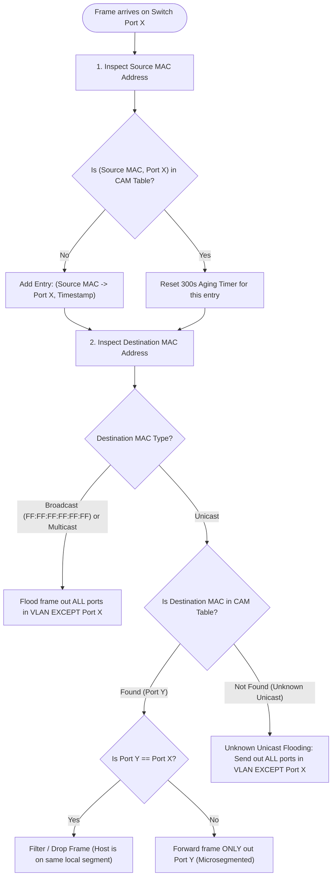
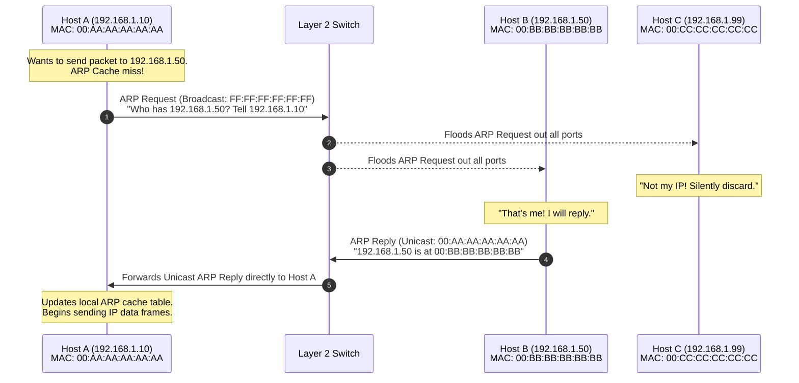
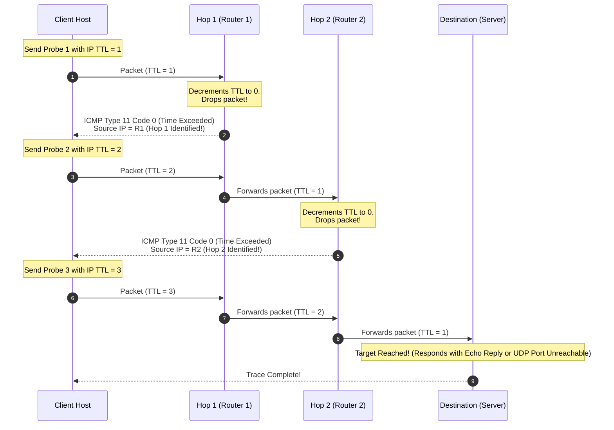

# Switching, MAC Addressing, ARP & ICMP Diagnostics

While Layer 1 moves raw physical bits across cables, **Layer 2 (The Data Link Layer)** organizes those bits into structured **frames** and delivers them between directly connected devices within a local network.

At the core of Layer 2 are three foundational concepts:
1. **Ethernet Framing:** The universal packaging format for local data.
2. **Media Access Control (MAC) Addresses:** The physical hardware identifiers of every network interface.
3. **Network Switches:** Intelligent multiport bridges that dynamically map network topology into high-speed **CAM (Content Addressable Memory)** tables.

Bridging Layer 2 and Layer 3 are **ARP (Address Resolution Protocol)**, which translates logical IP addresses to physical MAC addresses, and **ICMP (Internet Control Message Protocol)**, the diagnostic nervous system of the Internet.

---

## 1. IEEE 802.3 Ethernet Frame Anatomy

Every piece of data transmitted over an Ethernet network is encapsulated within an **IEEE 802.3 Ethernet frame**.

```
                     Standard IEEE 802.3 Ethernet Frame
 ┌──────────┬─────┬─────────────┬─────────────┬──────────┬──────────────┬─────────┐
 │ Preamble │ SFD │ Dest MAC    │ Source MAC  │ EtherType│ Payload/Data │   FCS   │
 │ 7 Bytes  │ 1 B │   6 Bytes   │   6 Bytes   │ 2 Bytes  │ 46-1500 Bytes│ 4 Bytes │
 └──────────┴─────┴─────────────┴─────────────┴──────────┴──────────────┴─────────┘
  ◄── 8B Sync ──►◄────────────── 14B Header ────────────►               ◄─ 4B CRC─►
                 ◄────────── Frame Size: 64 to 1518 Bytes ──────────────►
```

### Complete 18-Byte Overhead Specification Table

| Field Name | Size (Bytes) | Field Type | Bit Pattern / Description |
| :--- | :---: | :--- | :--- |
| **Preamble** | 7 | Physical Sync | Alternating pattern of `10101010` (7 octets). Allows the receiver's physical transceiver clock to lock phase and synchronize bit timing with the incoming signal. |
| **Start Frame Delimiter (SFD)** | 1 | Boundary Marker | Exactly `10101011` (`0xD5`). The final two consecutive `11` bits signal to the MAC receiver that synchronization is complete and the frame header begins on the very next bit. |
| **Destination MAC** | 6 | Layer 2 Address | The 48-bit physical hardware address of the receiving device, broadcast address (`FF:FF:FF:FF:FF:FF`), or multicast address. |
| **Source MAC** | 6 | Layer 2 Address | The 48-bit physical hardware address of the transmitting network interface card (NIC). Always a unicast address. |
| **EtherType / Length** | 2 | Protocol Multiplex | Values $\ge \text{0x0600}$ ($1536_{10}$) designate **EtherType**, identifying the encapsulated Layer 3 protocol (e.g., `0x0800` = IPv4, `0x0806` = ARP, `0x86DD` = IPv6). Values $\le 1500$ designate the 802.3 payload length. |
| **Payload (Data + Padding)** | 46 to 1500 | Encapsulated Data | Layer 3 packet (e.g., IPv4 packet). The standard **Maximum Transmission Unit (MTU)** is 1500 bytes. If payload is $< 46$ bytes, padding bytes (`0x00`) are appended to ensure the frame reaches the **64-byte minimum**. |
| **Frame Check Sequence (FCS)** | 4 | Error Detection | 32-bit Cyclic Redundancy Check (**CRC-32**). The sender computes a mathematical polynomial over Destination MAC, Source MAC, EtherType, and Payload. The receiver recomputes it; if a single bit flipped in transit, the frame is silently dropped. |
| **Interpacket Gap (IPG)** | 12 | Idle Wire | 96 bit times of idle line state ($9.6\ \mu\text{s}$ at 10 Mbps, $96\ \text{ns}$ at 1 Gbps) required between consecutive frames to allow transceivers to reset. |

> [!NOTE]
> The **Preamble** and **SFD** (8 bytes) are stripped by the physical layer transceiver upon reception and are not included in the standard 64-to-1518 byte Ethernet frame size calculation.

---

## 2. 48-Bit MAC Address Anatomy

A **MAC (Media Access Control)** address, also termed a **Burned-In Address (BIA)** or **hardware address**, is a 48-bit (6-octet) binary identifier permanently engraved into the silicon of a Network Interface Card (NIC) during manufacturing.

Standard representation displays 12 hexadecimal characters, formatted as:
- `00:1A:2B:3C:4D:5E` (Linux, macOS, Unix standard)
- `00-1A-2B-3C-4D-5E` (Windows standard)
- `001a.2b3c.4d5e` (Cisco IOS standard)

```
                            48-Bit MAC Address Structure
                            
    ┌───────────────────────────────┬───────────────────────────────┐
    │  OUI: 24 Bits (3 Octets)      │  Vendor Assigned: 24 Bits     │
    │  Organizationally Unique ID   │  NIC Specific Identifier      │
    └───────────────────────────────┴───────────────────────────────┘
     Octet 1   Octet 2   Octet 3     Octet 4   Octet 5   Octet 6
    ┌────────┬────────┬────────┐    ┌────────┬────────┬────────┐
    │ b7..b0 │        │        │    │        │        │        │
    └───┬────┴────────┴────────┘    └────────┴────────┴────────┘
        │
        ├── Bit 0 (b0, LSB): I/G Bit (Individual / Group)
        │   └── 0 = Unicast (Host)
        │   └── 1 = Multicast or Broadcast
        │
        └── Bit 1 (b1): U/L Bit (Universal / Local)
            └── 0 = Globally Unique (Burned-in OUI from IEEE)
            └── 1 = Locally Administered (VMs, Docker, Randomized MACs)
```

### 1. OUI (Organizationally Unique Identifier - First 24 Bits)
The first 3 octets identify the hardware manufacturer. The IEEE Registration Authority licenses OUI blocks to vendors:
- `00:00:0C:xx:xx:xx` $\rightarrow$ Cisco Systems
- `00:50:56:xx:xx:xx` $\rightarrow$ VMware
- `3C:D9:2B:xx:xx:xx` $\rightarrow$ Hewlett Packard Enterprise
- `B8:27:EB:xx:xx:xx` $\rightarrow$ Raspberry Pi Foundation

### 2. Vendor Specific NIC Extension (Last 24 Bits)
The manufacturer assigns the remaining 24 bits sequentially to ensure every physical interface produced worldwide possesses a globally unique identifier.

### 3. The Two Special Control Bits in Octet 1
The two least significant bits of the first byte carry critical architectural significance:
- **I/G (Individual / Group) Bit:**
  - `0`: **Individual (Unicast)** address. Target is a single host interface.
  - `1`: **Group (Multicast/Broadcast)** address. Target is a multicast group or all hosts (`FF:FF:FF:FF:FF:FF`).
- **U/L (Universal / Local) Bit:**
  - `0`: **Universal**. Factory burned-in address conforming to IEEE OUI guidelines.
  - `1`: **Locally Administered**. Overridden by network software, virtual machines (KVM, Hyper-V), Docker bridge containers, or mobile OS privacy features (iOS/Android MAC randomization).

```
Common Special MAC Addresses:
- Broadcast MAC:     FF:FF:FF:FF:FF:FF (All 48 bits are 1s)
- IPv4 Multicast:    01:00:5E:00:00:00 to 01:00:5E:7F:FF:FF
- IPv6 Multicast:    33:33:xx:xx:xx:xx
- Cisco VRRP / HSRP: 00:00:5E:00:01:XX / 00:00:0C:07:AC:XX
```

---

## 3. How Switches Work: The CAM Table & Forwarding Logic


Unlike legacy **Ethernet Hubs** (which are mindless Layer 1 electrical repeaters that rebroadcast every incoming signal out every other port), an **Ethernet Switch** is an intelligent Layer 2 multiport bridge.

Switches maintain an internal database known as the **MAC Address Table** or **CAM (Content Addressable Memory) Table**. Unlike conventional RAM (which takes a memory address and returns data), CAM hardware takes a **MAC address as input and returns the associated switch port in a single clock cycle ($O(1)$ hardware speed)**.



---

### The Three Operational Pillars of Switching

#### 1. Learning (Source MAC Inspection)
When an electrical frame arrives at Switch Port 1:
- The switch inspects the **Source MAC Address** (`00:11:22:33:44:AA`).
- It records in its CAM table: `"Device 00:11:22:33:44:AA is physically reachable via Port 1."`
- It starts an **Aging Timer** (typically 300 seconds / 5 minutes). If no new frames arrive from this source within 300 seconds, the entry is flushed to keep the table lean.

#### 2. Forwarding & Filtering (Destination MAC Inspection)
The switch inspects the **Destination MAC Address**:
- **Known Unicast:** If the destination MAC is already cataloged in the CAM table pointing to Port 4, the switch transmits the frame **exclusively out Port 4**. Communication between Port 1 and Port 4 occurs in complete electrical isolation; ports 2, 3, and 5-24 hear nothing. This is **microsegmentation**.
- **Filtering (Same Port):** If the destination MAC is cataloged on the *same* port the frame arrived on (e.g. from an downstream hub), the switch drops the frame.
- **Unknown Unicast Flooding:** If the destination MAC has never been seen before, the switch plays it safe and **floods** a copy of the frame out every port belonging to that VLAN, except the arrival port. As soon as the target host responds, the switch learns its location.
- **Broadcast / Multicast:** Frames addressed to `FF:FF:FF:FF:FF:FF` are flooded out all ports in the broadcast domain.

#### 3. Collision Domains vs. Broadcast Domains

```
        ┌────────────────────────────────────────────────────────┐
        │            ONE COMMON BROADCAST DOMAIN                 │
        │                                                        │
        │      ┌────────────────── Switch ──────────────────┐    │
        │      │ Port 1        Port 2        Port 3  Port 4 │    │
        └──────┴───┬──────────────┬─────────────┬───────┬───┴────┘
                   │              │             │       │
       Collision   │  Collision   │  Collision  │  Collision
       Domain 1    │  Domain 2    │  Domain 3   │  Domain 4
                   ▼              ▼             ▼       ▼
                [Host A]       [Host B]      [Host C] [Host D]
```

- **Collision Domain:** A physical network segment where data packets can collide with one another. A switch breaks up collision domains: **every individual switch port is its own private, isolated collision domain**. When operating in full-duplex, collisions are completely eliminated.
- **Broadcast Domain:** The scope of a network across which any computer can directly transmit a broadcast frame and have all other hosts receive it. An unmanaged switch maintains **one single broadcast domain** across all its ports. Only routers or VLANs break up broadcast domains.

---

## 4. Address Resolution Protocol (ARP)

When an application wants to send data to an IP address (e.g., `192.168.1.50`), the operating system's network stack knows the destination Layer 3 IP, but the physical Ethernet network card only understands Layer 2 MAC addresses.

**ARP (Address Resolution Protocol - RFC 826)** bridges this gap.



### Detailed ARP Step-by-Step Flow

1. **ARP Cache Lookup:** Host A checks its local memory cache (**ARP table**). If the IP-to-MAC mapping is present, it immediately formats the Ethernet frame.
2. **ARP Request (Broadcast):** If missing, Host A queues the packet and broadcasts an ARP Request:
   - **Target IP:** `192.168.1.50`
   - **Target MAC:** `00:00:00:00:00:00` (Unknown)
   - **Sender IP:** `192.168.1.10`
   - **Sender MAC:** `00:AA:AA:AA:AA:AA`
   - **Frame Destination MAC:** `FF:FF:FF:FF:FF:FF` (Broadcast)
3. **Switch Flooding:** The switch floods this broadcast out every port. Every station on the subnet receives and parses the payload.
4. **Target Response:**
   - Host C (`192.168.1.99`) sees the target IP does not match its own; it drops the frame.
   - Host B (`192.168.1.50`) recognizes its IP. It updates its own ARP table with Host A's mapping (learning Host A for free).
5. **ARP Reply (Unicast):** Host B transmits an ARP Reply targeted directly to Host A:
   - **Frame Destination MAC:** `00:AA:AA:AA:AA:AA` (Host A's MAC)
   - **Sender IP:** `192.168.1.50`
   - **Sender MAC:** `00:BB:BB:BB:BB:BB`
6. **Transmission:** Host A updates its ARP cache and transmits the pending IP packet encapsulated inside a unicast Ethernet frame addressed to `00:BB:BB:BB:BB:BB`.

---

### Special ARP Types & Security Vulnerabilities

#### Gratuitous ARP (GARP)
A host transmits an ARP request where both the Sender IP and Target IP are its own address:
- **Duplicate IP Detection:** On booting or connecting to a network, a host sends a GARP. If any device replies, another machine is already using that IP (prompting the OS to display an `"IP Address Conflict"` error).
- **Default Gateway Failover:** High-availability clustering protocols (HSRP, VRRP, CARP) broadcast a GARP when a backup router takes over the virtual IP. This instantly forces all switches on the LAN to update their CAM tables to point to the new router's physical port.

#### ARP Poisoning (ARP Spoofing)
ARP was designed in 1982 with zero authentication. Any machine on the LAN can send an unsolicited ARP reply claiming:
`"192.168.1.1 (the Default Gateway) is at my MAC address 00:DE:AD:BE:EF:00"`
- All hosts update their caches and reroute all Internet traffic through the attacker's machine (**Man-in-the-Middle / MITM**).
- **Enterprise Mitigation:** Modern enterprise switches enable **DAI (Dynamic ARP Inspection)** alongside **DHCP Snooping**, cross-referencing all ARP replies against the switch's trusted DHCP lease database and dropping fraudulent ARP packets at the port level.

---

## 5. ICMP & Ping Diagnostics

The **Internet Control Message Protocol (ICMP - RFC 792)** is the diagnostic protocol of the IP suite. While IP is designed strictly for best-effort packet delivery, ICMP provides error reporting, path validation, and reachability testing.

ICMP packets are encapsulated directly inside IPv4 packets (**IP Protocol Number 1**; for IPv6, ICMPv6 is **Protocol 58**).

```
                      IPv4 / ICMP Packet Encapsulation
   ┌────────────────────┬──────────────────────────────────────────┐
   │ IPv4 Header (20 B) │ ICMP Message                             │
   │ Protocol = 1       │ ┌──────────┬──────────┬────────────────┐ │
   │                    │ │ Type (1B)│ Code (1B)│ Checksum (2B)  │ │
   │                    │ ├──────────┴──────────┴────────────────┤ │
   │                    │ │ Type-Specific Header Data (4 Bytes)  │ │
   │                    │ ├──────────────────────────────────────┤ │
   │                    │ │ Optional Data Payload (e.g. Timestamp│ │
   │                    │ └──────────────────────────────────────┘ │
   └────────────────────┴──────────────────────────────────────────┘
```

### Essential ICMP Message Types

| Type | Code | Name | Meaning & Real-World Context |
| :---: | :---: | :--- | :--- |
| **0** | 0 | **Echo Reply** | Response generated when a target host receives an Echo Request (successful ping). |
| **8** | 0 | **Echo Request** | Probe packet generated by the `ping` utility. |
| **3** | * | **Destination Unreachable** | Generated by routers or firewalls when a packet cannot be delivered. |
| 3 | 0 | *Net Unreachable* | Routing table has no route to the destination network. |
| 3 | 1 | *Host Unreachable* | Router reached the destination subnet, but the host failed to answer ARP requests. |
| 3 | 3 | *Port Unreachable* | Packet reached the host, but no application was listening on that UDP port. |
| 3 | 4 | *Frag Needed, DF Set* | Packet exceeds outgoing interface MTU, but the Don't Fragment (DF) bit was set. **Crucial for Path MTU Discovery (PMTUD).** |
| **11** | 0 | **Time Exceeded (TTL=0)** | Router dropped packet because its Time-to-Live (TTL) field reached 0 in transit. Foundation of `traceroute`. |

---

### How `ping` Works

When you run `ping 8.8.8.8`:
1. The host constructs an **ICMP Type 8 (Echo Request)** with an identifier, sequence number, and timestamp payload.
2. The packet traverses the network, decrementing IP TTL by 1 at each router.
3. The destination processes the request and responds with an **ICMP Type 0 (Echo Reply)** containing the identical identifier and sequence number.
4. The sender computes the **Round-Trip Time (RTT)**:
   $$\text{RTT} = \text{Time}_{\text{Reply Received}} - \text{Time}_{\text{Request Sent}}$$

```bash
# Ping test output breakdown
$ ping -c 3 8.8.8.8
PING 8.8.8.8 (8.8.8.8) 56(84) bytes of data.
64 bytes from 8.8.8.8: icmp_seq=1 ttl=118 time=12.4 ms
64 bytes from 8.8.8.8: icmp_seq=2 ttl=118 time=11.9 ms
64 bytes from 8.8.8.8: icmp_seq=3 ttl=118 time=12.1 ms

--- 8.8.8.8 ping statistics ---
3 packets transmitted, 3 received, 0% packet loss, time 2003ms
rtt min/avg/max/mdev = 11.912/12.138/12.418/0.207 ms
```

> [!TIP]
> The `ttl=118` in the ping response indicates how many router hops the response traversed. Operating systems initialize TTL to standard defaults (Linux: 64, Windows: 128, Cisco IOS: 255). Since $128 - 118 = 10$, the reply traversed 10 intermediate router hops from Google's server!

---

### How `traceroute` / `tracert` Works

`traceroute` maps every intermediate Layer 3 router hop between source and destination by deliberately exploiting **ICMP Type 11 (Time Exceeded)**.



- Windows `tracert` uses ICMP Echo Requests with incrementing TTLs.
- Linux/Unix `traceroute` traditionally uses UDP packets destined to high, random ports (e.g. 33434+) with incrementing TTLs, identifying completion when the target host responds with **ICMP Type 3 Code 3 (Port Unreachable)**.

---

## 6. Practical CLI Diagnostics

### Inspecting Switch CAM Tables (Cisco IOS)
```cisco
Switch# show mac address-table
          Mac Address Table
-------------------------------------------
Vlan    Mac Address       Type        Ports
----    -----------       --------    -----
   1    001a.a12b.3c4d    DYNAMIC     Gi0/1
   1    0050.56a2.11bf    DYNAMIC     Gi0/2
   1    000c.29fb.e012    DYNAMIC     Gi0/3
Total Mac Addresses for this criterion: 3

# Clear dynamic entries to force relearning
Switch# clear mac address-table dynamic
```

### Viewing and Managing Local ARP Caches
```bash
# Linux / macOS: Show neighbor table
ip neigh show
# or legacy:
arp -a

# Delete a specific ARP entry (force re-resolution)
sudo ip neigh del 192.168.1.50 dev eth0

# Windows: Show ARP table
arp -a

# Flush entire ARP table (must run as Administrator)
arp -d *
```

### Inspecting Path MTU via Ping
```bash
# Send 1500-byte ping with Don't Fragment (DF) bit set (Linux)
ping -M do -s 1472 8.8.8.8
# (1472 payload + 8 byte ICMP header + 20 byte IP header = 1500 byte MTU)

# Windows DF ping test
ping -f -l 1472 8.8.8.8
```
If this succeeds, your physical path supports standard 1500-byte MTU without fragmentation. If it fails with `"Packet needs to be fragmented but DF set"`, a tunnel or VPN overhead along the path is shrinking the effective MTU!
