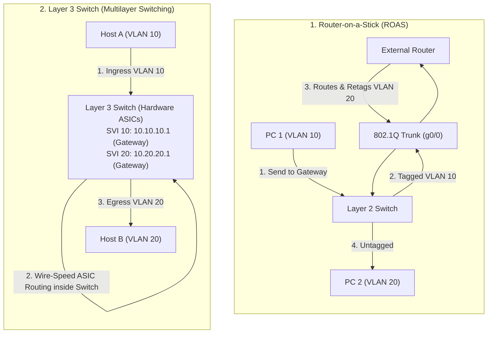
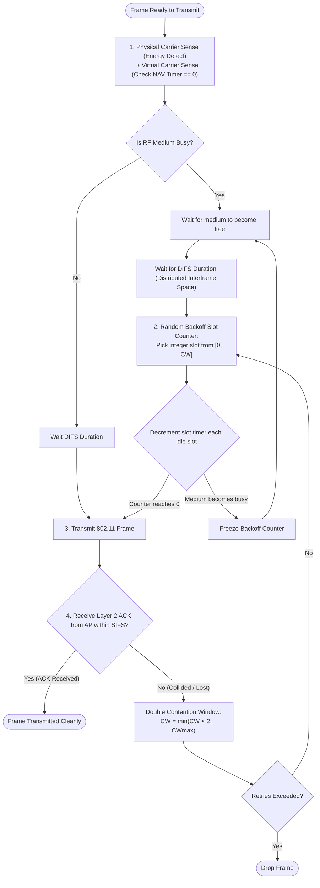

# VLANs, Trunking & Wi-Fi Standards (802.11)

In small home networks, every device connects to a single unmanaged switch or wireless access point. Everyone shares the same local IP subnet, and every broadcast packet (such as an ARP request or DHCP discovery) reaches every single connected device.

In enterprise and datacenter environments, this flat design collapses:
1. **Broadcast Radiation:** As thousands of endpoints connect, collective broadcast chatter consumes significant link bandwidth and forces every host's CPU to process irrelevant interrupts.
2. **Security Vulnerabilities:** An infected laptop in the marketing department can eavesdrop on payroll servers, port-scan database clusters, or execute ARP poisoning attacks across the entire company.
3. **Failure Domain Proliferation:** A malfunctioning network card generating a broadcast storm can knock the entire enterprise offline.

The solution is **network segmentation**. In the wired world, we partition physical switches using **IEEE 802.1Q Virtual LANs (VLANs)**. In the wireless world, we manage shared electromagnetic airwaves using **IEEE 802.11 Wi-Fi standards** governed by **CSMA/CA (Collision Avoidance)**.

---

## 1. Virtual LANs (VLANs) & Microsegmentation

A **Virtual Local Area Network (VLAN)** is a logical grouping of network ports or hosts that belong to the same broadcast domain, regardless of their physical location across switches.

```
       Physical Reality (One 24-Port Switch)
       ┌──────────────────────────────────────────────────────────┐
       │ [1] [2] [3] [4] [5] [6]  ...  [19] [20] [21] [22] [23] [24]│
       └──────────────────────────────────────────────────────────┘
                                   │
                                   ▼
       Logical Architecture (Microsegmented into 3 Isolated VLANs)
       ┌─────────────────────┐  ┌────────────────────┐  ┌────────────────────┐
       │ VLAN 10: Finance    │  │ VLAN 20: Eng       │  │ VLAN 30: Guest Wi-Fi│
       │ Ports: 1, 2, 3      │  │ Ports: 4, 5, 6     │  │ Ports: 7, 8, 9     │
       │ Subnet: 10.10.10/24 │  │ Subnet: 10.20.20/24│  │ Subnet: 192.168.1/24│
       └─────────────────────┘  └────────────────────┘  └────────────────────┘
```

### Core Properties of VLANs

- **Broadcast Isolation:** When a host on Port 1 (VLAN 10) transmits a broadcast frame (`FF:FF:FF:FF:FF:FF`), the switch hardware forwards that frame **strictly to Ports 2 and 3**. Ports assigned to VLAN 20 and VLAN 30 never receive it.
- **Layer 2 Security Barrier:** By default, hosts in different VLANs cannot communicate at Layer 2, even if they sit plugged into adjacent ports on the same physical silicon. Communication between VLANs requires an explicit **Layer 3 routing device** with security firewall rules.
- **Subnet Mapping:** By convention, **one VLAN maps to exactly one IP subnet** (e.g., VLAN 10 = `10.10.10.0/24`, VLAN 20 = `10.20.20.0/24`).

---

## 2. Switch Ports: Access vs. Trunk Ports

To build multi-switch enterprise topologies without running a dedicated physical cable for every VLAN between every switch, Ethernet ports operate in two distinct modes:


### 1. Access Ports (Untagged)
- Connect to end-user devices: workstations, printers, VoIP phones, or standard server NICs.
- Belongs to **one single VLAN**.
- **The end device has zero knowledge of VLANs.** The PC transmits a completely standard, untagged IEEE 802.3 Ethernet frame.
- When the frame enters the access port, the switch internally assigns the packet to that port's configured VLAN.
- When an egress frame leaves an access port toward the PC, the switch strips any internal VLAN tags, presenting a standard Ethernet frame.

### 2. Trunk Ports (Tagged)
- Interconnect switches, or connect a switch to a router or hypervisor host (such as VMware ESXi or Proxmox).
- Carries traffic for **multiple VLANs simultaneously** across a single physical wire.
- To distinguish which frame belongs to which VLAN, the switch injects a specialized **4-byte header tag** into the frame before transmitting it across the trunk. This is governed by **IEEE 802.1Q**.

---

## 3. IEEE 802.1Q Frame Tagging

Standardized in 1998, **IEEE 802.1Q** (often called **Dot1q**) defines how an Ethernet frame is tagged to indicate its VLAN membership.

The 4-byte 802.1Q tag is inserted directly between the **Source MAC Address** and the **EtherType / Length** field of the original Ethernet frame:

```
                  Standard Ethernet Frame vs. 802.1Q Tagged Frame
                  
 Standard Frame:
 ┌──────────────┬──────────────┬──────────┬─────────────────────────┬─────────┐
 │ Dest MAC (6B)│ Source MAC(6B)│ EtherType│ Payload (46-1500 Bytes) │ FCS (4B)│
 └──────────────┴──────────────┴──────────┴─────────────────────────┴─────────┘
                                     │
                    [ Insert 4-Byte 802.1Q Tag ]
                                     ▼
 802.1Q Tagged Frame:
 ┌──────────────┬──────────────┬───────────────┬──────────┬─────────┬─────────┐
 │ Dest MAC (6B)│ Source MAC(6B)│ 802.1Q Tag(4B)│ EtherType│ Payload │ FCS (4B)│
 └──────────────┴──────────────┴───────────────┴──────────┴─────────┴─────────┘
                                ◄── 32 Bits ───►
```

### The 4-Byte (32-Bit) 802.1Q Tag Field Breakdown

```
 ┌───────────────────────────────┬───────────────────────────────────────────┐
 │          TPID (16 Bits)       │                TCI (16 Bits)              │
 ├───────────────────────────────┼───────────────┬─────────────┬─────────────┤
 │        0x8100 (Constant)      │  PCP (3 Bits) │ DEI (1 Bit) │ VID (12 B)  │
 └───────────────────────────────┴───────────────┴─────────────┴─────────────┘
```

| Field | Size | Name | Purpose |
| :--- | :---: | :--- | :--- |
| **TPID** | 16 bits | **Tag Protocol Identifier** | Set to the constant value `0x8100`. Tells any receiving network device that an 802.1Q tag follows and that the true EtherType has been shifted forward by 4 bytes. |
| **PCP** | 3 bits | **Priority Code Point** | Implements **IEEE 802.1p Quality of Service (QoS)** at Layer 2. Allows frames to be marked with 8 priority levels ($0-7$): Level 5 for Voice (VoIP), Level 4 for Video conferencing, Level 0 for Best Effort bulk data. High-priority frames jump to the head of egress switch queues. |
| **DEI** | 1 bit | **Drop Eligible Indicator** | Formerly CFI (Canonical Format Indicator). In congested links, switches drop frames with $\text{DEI} = 1$ before dropping frames with $\text{DEI} = 0$. |
| **VID** | 12 bits | **VLAN Identifier** | Identifies the specific VLAN the frame belongs to. A 12-bit number supports $2^{12} = 4096$ possible IDs. |

### VLAN ID Allocation Ranges

- **VID 0:** Priority Tagged Frame. The frame contains Layer 2 QoS priority information (PCP), but no VLAN ID.
- **VID 1:** Default Normal VLAN. Factory default on all switch ports. Cannot be deleted.
- **VID 2 to 1001:** Standard Normal Range VLANs. Used for campus LAN and enterprise networks.
- **VID 1002 to 1005:** Reserved for legacy Cisco Token Ring and FDDI VLANs.
- **VID 1006 to 4094:** Extended Range VLANs. Used by service providers and large cloud datacenters.
- **VID 4095:** Reserved for internal switch hardware use.

> [!NOTE]
> Inserting the 4-byte 802.1Q tag increases the maximum untagged Ethernet frame size from **1518 bytes to 1522 bytes**. Switches support these so-called **"Baby Giant" frames** automatically. Switches recalculate the 4-byte CRC/FCS checksum after inserting or stripping the tag.

---

### The Native VLAN Concept & Security

On an 802.1Q trunk, one VLAN is designated as the **Native VLAN** (by default, VLAN 1):
- Any frame belonging to the Native VLAN is transmitted across the trunk link **without an 802.1Q tag** (untagged).
- If an untagged frame arrives at a trunk port, the switch assumes it belongs to the Native VLAN.
- This maintains backward compatibility with legacy hubs or unmanaged switches that do not understand 802.1Q tags.

> [!CAUTION]
> **VLAN Hopping Attack (Double Tagging):**
> If an attacker on an access port in Native VLAN 1 crafts a packet with two tags (Outer Tag = VLAN 1, Inner Tag = VLAN 20 Finance), the first switch strips the outer VLAN 1 tag (because it's native) and forwards the frame across the trunk. The second switch inspects the remaining inner tag (VLAN 20) and forwards the attacker's frame directly into the protected Finance VLAN!
> 
> **Enterprise Defense:**
> 1. Never leave user access ports in Native VLAN 1.
> 2. Change the trunk Native VLAN to an unused, dummy VLAN ID (e.g., VLAN 999).
> 3. Enforce native tagging on trunks using `vlan dot1q tag native`.

---

## 4. Inter-VLAN Routing

Because each VLAN is an isolated Layer 2 broadcast domain, **hosts in different VLANs cannot communicate without a Layer 3 routing mechanism**, even if they connect to the exact same switch.

There are two primary architectural solutions:



### Architecture Comparison: ROAS vs. Layer 3 Switch

| Feature | Router-on-a-Stick (ROAS) | Layer 3 Switch (Multilayer Switch) |
| :--- | :--- | :--- |
| **Hardware Required** | One Layer 2 Switch + One External Router | One Layer 3 Switch (e.g., Cisco Catalyst 3850/9300) |
| **Physical Link** | Single trunk cable carrying traffic up and down | Internal high-speed switch backplane |
| **Throughput Bottleneck** | Bandwidth limited to the single physical router link (traffic traverses the wire twice) | **Wire-speed switching:** Terabit/s hardware ASIC forwarding via Cisco Express Forwarding (CEF) |
| **Logical Interface** | Router sub-interfaces (`g0/0.10`, `g0/0.20`) | Switch Virtual Interfaces (`interface Vlan 10`) |
| **Deployment Fit** | Small branch offices, lab topologies | Corporate campuses, datacenters, high-density networks |

---

## 5. Wi-Fi: IEEE 802.11 Standards & RF Fundamentals

While Ethernet moves bits down guided copper and glass lines, **Wi-Fi (IEEE 802.11)** modulates data onto unguided high-frequency electromagnetic radio waves.

Wi-Fi operates within unlicensed **ISM (Industrial, Scientific, and Medical)** and **UNII (Unlicensed National Information Infrastructure)** radio frequency bands:

```
               Wi-Fi Radio Frequency Spectrum Characteristics
               
 2.4 GHz Band:
 ├── Longer Wavelength (~12.5 cm)  ──► Superior wall penetration & range
 └── Narrow Spectrum (83.5 MHz)    ──► ONLY 3 non-overlapping channels (1, 6, 11)
                                   ──► Severe congestion (Microwaves, Bluetooth, Zigbee)

 5 GHz Band:
 ├── Shorter Wavelength (~6 cm)    ──► Higher attenuation through concrete/brick
 └── Massive Bandwidth (~500 MHz)  ──► 24+ non-overlapping 20 MHz channels
                                   ──► Channel bonding: 40 MHz, 80 MHz, 160 MHz

 6 GHz Band (Wi-Fi 6E / Wi-Fi 7):
 ├── Pristine, Uncrowded Spectrum  ──► 1200 MHz contiguous bandwidth (5.925 - 7.125 GHz)
 └── Ultrawide Channels (320 MHz)  ──► Ultra-low latency, zero legacy device backwards-drag
```

---

### The Evolution of IEEE 802.11 Standards

From its humble beginnings at 1 Mbps in 1997 to Wi-Fi 7's multi-gigabit wireless backbones:

| Generation | IEEE Standard | Year | Frequency | Max Theoretical Speed | Modulation | Key Technological Innovations |
| :--- | :---: | :---: | :---: | :---: | :---: | :--- |
| — | **802.11b** | 1999 | 2.4 GHz | 11 Mbps | DSSS / CCK | First widely commercialized wireless standard |
| — | **802.11a** | 1999 | 5 GHz | 54 Mbps | OFDM | First 5 GHz standard; free from 2.4 GHz interference |
| — | **802.11g** | 2003 | 2.4 GHz | 54 Mbps | OFDM | Brought 54 Mbps OFDM modulation to 2.4 GHz band |
| **Wi-Fi 4** | **802.11n** | 2009 | 2.4 / 5 GHz | 600 Mbps | 64-QAM | **MIMO** (Multiple-Input Multiple-Output), 40 MHz channel bonding |
| **Wi-Fi 5** | **802.11ac** | 2013 | 5 GHz | 6.9 Gbps | 256-QAM | **MU-MIMO** (Multi-User MIMO), 80/160 MHz channels, Beamforming |
| **Wi-Fi 6 / 6E**| **802.11ax**| 2019 / 2021 | 2.4, 5, 6 GHz | 9.6 Gbps | 1024-QAM | **OFDMA** (subdivides channels for high density), BSS Coloring, TWT |
| **Wi-Fi 7** | **802.11be**| 2024 | 2.4, 5, 6 GHz | 46 Gbps | 4096-QAM | **320 MHz channels**, **MLO** (Multi-Link Operation across multiple bands simultaneously) |

---

## 6. CSMA/CA: Collision Avoidance in Wireless Media

In wired Ethernet, transceivers use **CSMA/CD** (Collision Detection) by measuring electrical line voltage while transmitting.

In wireless Wi-Fi, **Collision Detection is physically impossible**:
1. **Transmit vs. Receive Power Imbalance:** When a Wi-Fi card transmits, its own radio transmitter blasts out at roughly $+20\ \text{dBm}$ ($100\ \text{mW}$). Meanwhile, an incoming signal from a distant client arrives at $-80\ \text{dBm}$ ($0.00000001\ \text{mW}$). The local transmission drowns out the incoming signal by a ratio of $10{,}000{,}000\text{ to }1$! A radio cannot listen while talking.
2. **The Hidden Terminal Problem:**

```
               The Hidden Terminal (Hidden Node) Problem
               
       [ Client A ] ◄────── 100m ──────► [ Access Point ] ◄────── 100m ──────► [ Client B ]
       Range of A: ( ( ( ( ( ( ( ( ) ) ) ) ) ) ) )
                                 Range of B: ( ( ( ( ( ( ( ( ) ) ) ) ) ) ) )
                                 
 - Client A can hear the AP. Client B can hear the AP.
 - Client A CANNOT hear Client B (they are out of range of each other).
 - Client A senses air: "Channel is idle!" -> Starts transmitting frame to AP.
 - Client B senses air: "Channel is idle!" -> Starts transmitting frame to AP.
 - RESULT: Both signals collide at the Access Point, destroying both transmissions!
```

### The CSMA/CA Protocol Algorithm

Because stations cannot detect collisions while transmitting, Wi-Fi standardizes **CSMA/CA (Carrier Sense Multiple Access with Collision Avoidance)**.



---

### Step-by-Step Breakdown of CSMA/CA

#### 1. Dual Carrier Sensing (Physical & Virtual)
- **Physical Carrier Sense (CCA - Clear Channel Assessment):** The receiver measures raw RF energy and decodes preambles from other 802.11 transmitters.
- **Virtual Carrier Sense (NAV - Network Allocation Vector):** Every 802.11 frame header contains a **Duration Field** specifying how many microseconds the medium will be occupied for this transmission and the resulting ACK. Any station hearing this frame sets an internal countdown timer called the **NAV**. As long as $\text{NAV} > 0$, the station considers the channel busy without even powering on its RF receiver.

#### 2. Interframe Spaces (IFS)
Stations must wait a prescribed silence duration before transmitting:
- **SIFS (Short Interframe Space):** The shortest delay ($\approx 10-16\ \mu\text{s}$). Used for immediate, highest-priority control frames: Layer 2 **ACKs** and **CTS** (Clear to Send). No other station can jump in during SIFS.
- **DIFS (Distributed Interframe Space):** The standard quiet time required before transmitting normal data frames.

#### 3. Random Exponential Backoff
When the medium becomes free after a transmission, every waiting station picks a random number of time slots within a **Contention Window (CW)**:
$$\text{Backoff Slots} \in [0, \text{CW}]$$
- Stations count down their slot timers only while the medium remains idle.
- If another station's counter expires first and begins transmitting, all other stations **freeze their timers** and resume counting down when the channel goes quiet again. This ensures fair access without starvation.

#### 4. The RTS/CTS Solution for Hidden Nodes
For large frames or environments with severe hidden terminals, stations use an explicit four-way handshake:
1. Station A transmits a tiny **RTS (Request to Send)** frame to the AP.
2. The AP replies with a **CTS (Clear to Send)** broadcast.
3. Because all stations can hear the AP, Station B hears the CTS and sets its NAV timer, remaining quiet while Station A sends its data undisturbed!

#### 5. Mandatory Layer 2 Acknowledgments (ACK)
Because the transmitter cannot detect collisions on the fly, **every unicast 802.11 frame requires an explicit positive ACK frame** from the receiver within a SIFS duration. If no ACK arrives, the sender assumes the frame collided, doubles its Contention Window ($CW = 2 \times CW$), and retries.

---

## 7. Practical CLI Configuration & Verification

### Cisco IOS: VLAN & 802.1Q Trunk Configuration

```cisco
! 1. Create VLANs in the database
Switch# configure terminal
Switch(config)# vlan 10
Switch(config-vlan)# name Engineering
Switch(config-vlan)# vlan 20
Switch(config-vlan)# name Finance
Switch(config-vlan)# exit

! 2. Assign Port to Access Mode (VLAN 10)
Switch(config)# interface GigabitEthernet 0/1
Switch(config-if)# description Workstation-PC1
Switch(config-if)# switchport mode access
Switch(config-if)# switchport access vlan 10
Switch(config-if)# exit

! 3. Configure Inter-Switch Trunk Link
Switch(config)# interface GigabitEthernet 0/24
Switch(config-if)# description Uplink-to-Core-Switch
Switch(config-if)# switchport trunk encapsulation dot1q
Switch(config-if)# switchport mode trunk
Switch(config-if)# switchport trunk allowed vlan 10,20
Switch(config-if)# switchport trunk native vlan 999
Switch(config-if)# exit

! 4. Configure Layer 3 SVI Routing
Switch(config)# ip routing
Switch(config)# interface Vlan 10
Switch(config-if)# ip address 10.10.10.1 255.255.255.0
Switch(config-if)# no shutdown
Switch(config)# interface Vlan 20
Switch(config-if)# ip address 10.20.20.1 255.255.255.0
Switch(config-if)# no shutdown
```

### Linux: Inspecting Wireless Interface Details
```bash
# Display wireless link properties, channel, frequency, and signal strength
iw dev wlan0 link

# Example Output:
#   Connected to 00:25:9c:cf:21:4a (on wlan0)
#   SSID: Enterprise-Corp-5G
#   freq: 5180 (Channel 36, 5 GHz)
#   RX: 3942084 bytes (4129 packets)
#   TX: 819204 bytes (1204 packets)
#   signal: -54 dBm
#   txpower: 20.00 dBm
#   tx bitrate: 866.7 MBit/s VHT-MCS 9 80MHz short GI VHT-NSS 2

# Inspect 802.11 station statistics (retries and failed frames)
iw dev wlan0 station dump
```

### Windows: Wireless Diagnostics via Netsh
```powershell
# Display active Wi-Fi radio type, channel, receive/transmit rates
netsh wlan show interfaces

# Output shows:
#   Radio type             : 802.11ax (Wi-Fi 6)
#   Authentication         : WPA3-Personal
#   Cipher                 : CCMP
#   Channel                : 44
#   Receive rate (Mbps)    : 1201
#   Transmit rate (Mbps)   : 1201
#   Signal                 : 98%
```
