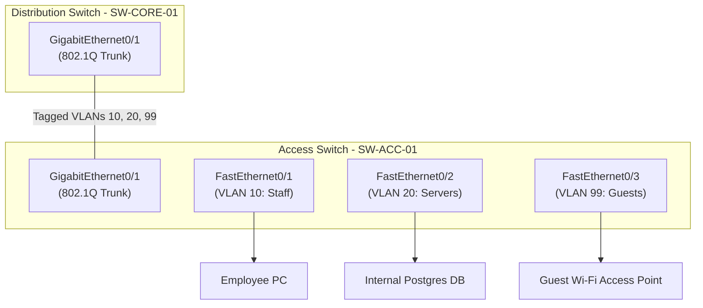

import { Callout } from 'fumadocs-ui/components/callout';
import { Steps, Step } from 'fumadocs-ui/components/steps';

Welcome to the Stage 2 Capstone: **Enterprise Layer 2 Switched Network**.

As **TravelBuddy** expands, marketing, engineering, and guest visitors cannot safely coexist on a single flat broadcast domain. Broadcast storms from printer discovery protocols and unsegmented Wi-Fi traffic threaten company database security.

In this hands-on lab, you will configure an enterprise 24-port switch fabric with segmented VLANs, 802.1Q trunking, and native VLAN security hardening.

---

## Lab Topology Diagram



---

## Configuration Steps

<Steps>
<Step>
### Step 1: Create the VLAN Database
On access switch `SW-ACC-01`, create the segregated broadcast domains:

```cisco
SW-ACC-01# configure terminal
SW-ACC-01(config)# vlan 10
SW-ACC-01(config-vlan)# name STAFF_DEVICES
SW-ACC-01(config-vlan)# vlan 20
SW-ACC-01(config-vlan)# name SECURE_SERVERS
SW-ACC-01(config-vlan)# vlan 99
SW-ACC-01(config-vlan)# name GUEST_WIFI
SW-ACC-01(config-vlan)# vlan 666
SW-ACC-01(config-vlan)# name BLACKHOLE_NATIVE
SW-ACC-01(config-vlan)# exit
```
</Step>

<Step>
### Step 2: Configure Access Ports
Assign physical ports to their respective VLANs and enable PortFast to bypass 30-second STP listening/learning delays:

```cisco
SW-ACC-01(config)# interface FastEthernet0/1
SW-ACC-01(config-if)# switchport mode access
SW-ACC-01(config-if)# switchport access vlan 10
SW-ACC-01(config-if)# spanning-tree portfast
SW-ACC-01(config-if)# exit

SW-ACC-01(config)# interface FastEthernet0/2
SW-ACC-01(config-if)# switchport mode access
SW-ACC-01(config-if)# switchport access vlan 20
SW-ACC-01(config-if)# exit

SW-ACC-01(config)# interface FastEthernet0/3
SW-ACC-01(config-if)# switchport mode access
SW-ACC-01(config-if)# switchport access vlan 99
SW-ACC-01(config-if)# exit
```
</Step>

<Step>
### Step 3: Configure 802.1Q Trunk Link & Security Hardening
Prevent VLAN hopping attacks by setting the native VLAN to an unused non-default ID and explicitly pruning allowed VLANs:

```cisco
SW-ACC-01(config)# interface GigabitEthernet0/1
SW-ACC-01(config-if)# switchport trunk encapsulation dot1q
SW-ACC-01(config-if)# switchport mode trunk
SW-ACC-01(config-if)# switchport trunk native vlan 666
SW-ACC-01(config-if)# switchport trunk allowed vlan 10,20,99
SW-ACC-01(config-if)# switchport nonegotiate
SW-ACC-01(config-if)# no shutdown
SW-ACC-01(config-if)# exit
```
</Step>
</Steps>

---

## Verification & Diagnostic Commands

Verify that the MAC forwarding table correctly separates hosts by VLAN ID:

```cisco
SW-ACC-01# show mac address-table
          Mac Address Table
-------------------------------------------
Vlan    Mac Address       Type        Ports
----    -----------       --------    -----
  10    0014.2201.23a1    DYNAMIC     Fa0/1
  20    0050.56a2.bf89    DYNAMIC     Fa0/2
  99    b42e.9912.01cc    DYNAMIC     Fa0/3
```

Notice that a broadcast frame emitted on port `Fa0/1` (VLAN 10) can never leak into `Fa0/2` or `Fa0/3` at the hardware ASIC level.
