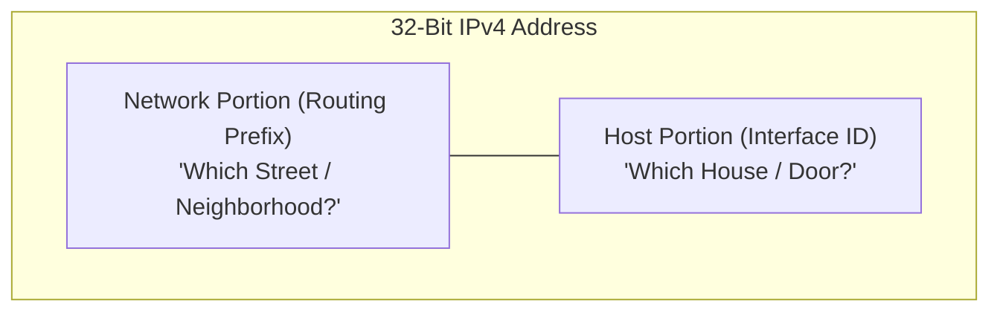
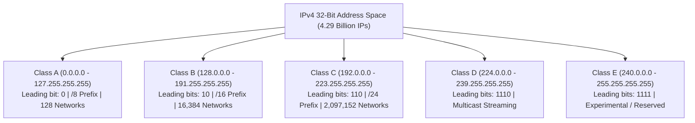
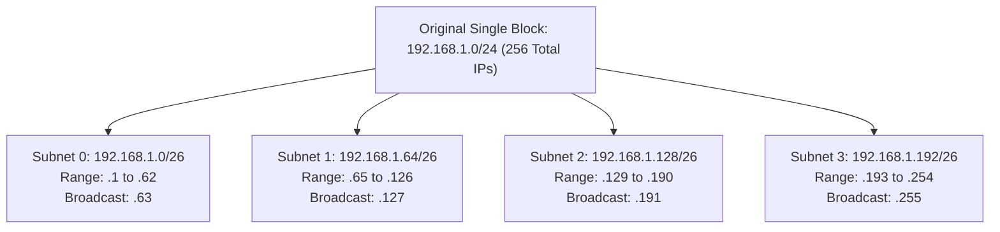

import { Callout } from 'fumadocs-ui/components/callout';
import { CidrCalculator } from '@/components/computer-networking/networking-simulators';

# IPv4 Addressing, Subnetting & Packet Anatomy

At Layer 3 of the OSI model, every communication between two machines across the internet relies on a logical identifier: the **IP Address**. Without IP addressing, routers would have no mechanism to locate destinations beyond their physical local area network.

In this deep dive, we break down the architecture of **Internet Protocol Version 4 (IPv4)** from first principles. We explore why IP addresses are structured the way they are, the mathematical foundation of subnetting, and the exact byte-level layout of the IPv4 packet header that routes billions of packets across the globe every second.

---

## 1. The Street Address Analogy & 32-Bit Structure

To understand IP addressing intuitively, think of the global postal system. 

When you send a physical letter to a friend across the country, you write an address like:
> **742 Evergreen Terrace, Apt 4B, Springfield, OR 97477**

A postal courier does not read your letter's apartment number first. The national routing sorting facility looks only at the **ZIP code and State** (the high-level network). Next, regional trucks transport the letter to the **Springfield city post office** (the sub-network). The local mail carrier drives down **Evergreen Terrace** (the local subnet), and finally drops the envelope into the specific mailbox for **Apt 4B** (the individual host).

An IPv4 address works identically:
- **Network ID:** Identifies the specific network or autonomous system where the host resides. Routers only inspect this portion to make long-distance transit decisions.
- **Host ID:** Identifies the specific network interface card (NIC) on that local segment. Local switches deliver frames directly to this host using ARP and MAC addresses.



### The Binary Reality: 4 Octets, 32 Bits

Computers do not think in decimal numbers; they process electrical high/low voltages represented as binary bits (`1` and `0`).

An IPv4 address consists of **exactly 32 binary bits**, grouped into **four 8-bit bytes**, called **octets**:

$$\text{Total Address Space} = 2^{32} = 4,294,967,296 \text{ unique addresses}$$

Because reading 32 ones and zeros like `11000000101010000000000100000001` is painful for human network engineers, we format IPv4 addresses in **Dotted-Decimal Notation**:

| Representation | Format | Example |
| :--- | :--- | :--- |
| **Dotted Decimal** | Octet 1 . Octet 2 . Octet 3 . Octet 4 | `192.168.1.1` |
| **Binary Octets** | 8 bits . 8 bits . 8 bits . 8 bits | `11000000.10101000.00000001.00000001` |
| **Hexadecimal** | 0x [Byte 1][Byte 2][Byte 3][Byte 4] | `0xC0A80101` |
| **32-Bit Integer** | Single unsigned 32-bit number | `3,232,235,777` |

### Octet Positional Value Breakdown

Each 8-bit octet has a decimal value ranging from **0** (`00000000`) to **255** (`11111111`). Each bit position represents a power of 2 ($2^7$ through $2^0$):

| Bit Position | Bit 7 | Bit 6 | Bit 5 | Bit 4 | Bit 3 | Bit 2 | Bit 1 | Bit 0 |
| :--- | :---: | :---: | :---: | :---: | :---: | :---: | :---: | :---: |
| **Binary Power** | $2^7$ | $2^6$ | $2^5$ | $2^4$ | $2^3$ | $2^2$ | $2^1$ | $2^0$ |
| **Positional Value** | **128** | **64** | **32** | **16** | **8** | **4** | **2** | **1** |

To convert `192` to binary:
$$192 = 128 + 64 + 0 + 0 + 0 + 0 + 0 + 0 \implies \mathbf{11000000_2}$$

To convert `168` to binary:
$$168 = 128 + 0 + 32 + 0 + 8 + 0 + 0 + 0 \implies \mathbf{10101000_2}$$

---

## 2. The Classful Era (Classes A through E) & Why It Failed

When the Internet Engineering Task Force (IETF) and DARPA designed IPv4 in the late 1970s (formalized in RFC 791 in 1981), they did not anticipate smartphones, cloud VMs, smart refrigerators, and billions of connected laptops.

To organize address assignments, they divided the 32-bit address space into **five fixed classes (A, B, C, D, and E)** based on the highest-order leading bits of the first octet.



### Class Properties Comparison

| Class | Leading Bits | 1st Octet Range | Default Mask | Network Bits : Host Bits | Usable Hosts per Network | Intended Purpose |
| :---: | :---: | :---: | :---: | :---: | :---: | :--- |
| **A** | `0` | `1 – 126` | `255.0.0.0` (/8) | 8 : 24 | $2^{24} - 2 = \mathbf{16,777,214}$ | Huge multinational corporations, governments, militaries |
| **B** | `10` | `128 – 191` | `255.255.0.0` (/16) | 16 : 16 | $2^{16} - 2 = \mathbf{65,534}$ | Large universities, regional telecom providers |
| **C** | `110` | `192 – 223` | `255.255.255.0` (/24) | 24 : 8 | $2^{8} - 2 = \mathbf{254}$ | Small businesses, individual office branches |
| **D** | `1110` | `224 – 239` | N/A | N/A | None (No hosts) | Multicast groups (OSPF routers, IPTV video feeds) |
| **E** | `1111` | `240 – 255` | N/A | N/A | None | Reserved for research and experimental testing |

<Callout type="warn">
**What happened to 127.0.0.0?**
The entire `127.0.0.0/8` block (16.7 million IP addresses!) was permanently reserved for **internal host loopback**. When your application accesses `127.0.0.1` (or `localhost`), the TCP/IP stack redirects the packets straight back to itself through memory without ever sending electrical signals across the physical network card.
</Callout>

### Reserved & Private Address Spaces (RFC 1918)

Public IP addresses must be globally unique across the worldwide web. However, internal home and enterprise devices do not require publicly routable addresses if they reside behind a network boundary. RFC 1918 defined **Private IP Spaces** that any organization can reuse internally without registration:

- **Class A Private:** `10.0.0.0` to `10.255.255.255` (`10.0.0.0/8` — 16,777,216 addresses)
- **Class B Private:** `172.16.0.0` to `172.31.255.255` (`172.16.0.0/12` — 1,048,576 addresses across 16 contiguous /16 blocks)
- **Class C Private:** `192.168.0.0` to `192.168.255.255` (`192.168.0.0/16` — 65,536 addresses across 256 contiguous /24 blocks)

Additionally, RFC 3927 reserved `169.254.0.0/16` for **APIPA (Automatic Private IP Addressing)**. If your computer is configured for DHCP but fails to contact a DHCP server, Windows and macOS automatically assign an address from this range so machines on the same switch can still communicate locally without internet access.

### Why Classful Addressing Collapsed

Classful routing suffered from the **Goldilocks Problem**:
- If a growing company needed **500 IP addresses**, a Class C allocation (254 hosts) was too small.
- The registry had to hand them a Class B allocation with **65,534 addresses**.
- The company used 500 IPs, leaving **65,034 public IP addresses wasted and locked away forever**.

By 1992, Class B addresses were running out at an alarming rate, and global router routing tables were bloating out of control. The solution was **CIDR (Classless Inter-Domain Routing)**.

---

## 3. CIDR & Subnet Masks

In 1993, RFC 1518 and RFC 1519 abolished fixed classes in favor of **CIDR (Classless Inter-Domain Routing)**. Under CIDR, network boundaries are no longer locked to 8, 16, or 24 bits. An engineer can draw the line between network and host bits at **any bit position** from `/1` to `/32`.

### What is a Subnet Mask?

A **Subnet Mask** is a 32-bit binary filter composed of a string of consecutive `1`s followed by a string of consecutive `0`s. It informs network interfaces and routers exactly where the network prefix ends and where the host identifier begins:

$$\begin{aligned}
\text{Continuous 1s} &\implies \mathbf{Network\ Bits} \\
\text{Continuous 0s} &\implies \mathbf{Host\ Bits}
\end{aligned}$$

For example, a `/24` prefix (Class C default) means the first 24 bits are network bits:
```
11111111 . 11111111 . 11111111 . 00000000  (Binary Mask)
   255   .    255   .    255   .     0      (Dotted Decimal)
```

A `/27` prefix means the first 27 bits are network bits:
```
11111111 . 11111111 . 11111111 . 11100000  (Binary Mask)
   255   .    255   .    255   .    224     (Dotted Decimal)
```

### The Bitwise AND Operation

When a computer wants to send an IP packet, it must determine: **Is the destination on my local LAN, or do I need to send this to my Default Gateway router?**

To find its own Network ID, the computer performs a hardware-level **Bitwise AND** between its own IP address and its subnet mask. 

In binary boolean logic:
- $1 \text{ AND } 1 = 1$
- $1 \text{ AND } 0 = 0$
- $0 \text{ AND } 1 = 0$
- $0 \text{ AND } 0 = 0$

#### Real-World Example:
Host IP: `192.168.10.77`, Subnet Mask: `255.255.255.224` (`/27`):

```
Host IP:       192.168.10.77   ->  11000000 . 10101000 . 00001010 . 01001101
Subnet Mask:   255.255.255.224 ->  11111111 . 11111111 . 11111111 . 11100000
-------------------------------------------------------------------------------
Bitwise AND:   192.168.10.64   ->  11000000 . 10101000 . 00001010 . 01000000
```

The router or host instantly determines:
- **Network ID:** `192.168.10.64/27`
- Any packet destined for an address between `192.168.10.65` and `192.168.10.94` is local. Anything outside that range must be forwarded to the gateway router.

---

## 4. The Mathematics of Subnetting

Subnetting is the art of borrowing host bits and converting them into network bits to slice a large block of IP addresses into smaller, isolated broadcast domains.



### The Three Golden Formulas

Whenever you calculate subnets, three simple exponential equations govern every result:

$$1.\quad \text{Number of Created Subnets} = 2^S$$
*(where $S$ is the number of bits borrowed from the host portion)*

$$2.\quad \text{Total Addresses per Subnet} = 2^H$$
*(where $H$ is the number of remaining host bits, $H = 32 - \text{Prefix}$)*

$$3.\quad \text{Usable Host Addresses} = 2^H - 2$$

<Callout type="info">
**Why do we subtract 2?**
Every subnet reserves two dedicated boundary addresses:
1. **Network Address (All host bits are 0):** Used by routing protocols and tables to identify the entire subnet wire (e.g. `192.168.1.0`).
2. **Directed Broadcast Address (All host bits are 1):** A special packet sent to this destination address triggers the switch to flood the frame to every single device inside that specific subnet (e.g. `192.168.1.255`).

Neither of these two addresses can ever be assigned to an individual computer, server, or router interface!
</Callout>

### The Magic Number Method (Mental Subnetting)

You don't need a calculator during a technical interview or on the data center floor. Use the **Magic Number**:

$$\text{Magic Number (Block Size)} = 256 - \text{Interesting Octet of Subnet Mask}$$

The **"interesting octet"** is the octet where the subnet mask is neither `255` nor `0`.

#### Step-by-Step Walkthrough:
Suppose you are given `172.16.0.0/19`:
1. **Identify the mask:** A `/19` has 19 continuous ones:
   - Octet 1: 8 ones $\implies 255$
   - Octet 2: 8 ones $\implies 255$
   - Octet 3: 3 ones $\implies 128 + 64 + 32 = 224$
   - Octet 4: 0 ones $\implies 0$
   - Mask = `255.255.224.0`.
2. **Find the interesting octet:** The 3rd octet (`224`).
3. **Calculate the Magic Number:**
   $$\text{Magic Number} = 256 - 224 = \mathbf{32}$$
4. **List the Subnet Increments in the 3rd octet:**
   - Subnet 0: `172.16.0.0/19`
   - Subnet 1: `172.16.32.0/19`
   - Subnet 2: `172.16.64.0/19`
   - Subnet 3: `172.16.96.0/19` ... and so forth.
5. **Determine Subnet 0 Boundaries:**
   - **Network ID:** `172.16.0.0`
   - **First Usable Host:** `172.16.0.1` (Network ID + 1)
   - **Broadcast Address:** `172.16.31.255` (Next Subnet ID minus 1)
   - **Last Usable Host:** `172.16.31.254` (Broadcast minus 1)
   - **Usable Hosts:** $2^{13} - 2 = 8,192 - 2 = \mathbf{8,190}$.

---

### Special Exceptions: /31 and /32 Subnets

- **/31 Subnet (RFC 3021):** On point-to-point serial or router-to-router optical links, there are only two endpoints. In classic subnetting, a `/30` yields 4 total addresses with only 2 usable ($2^2 - 2 = 2$), wasting 50% of public IPv4 space. RFC 3021 permits `/31` masks (`255.255.255.254`) on point-to-point links with **no broadcast and no network address**, allowing both IPs (`.0` and `.1`) to be assigned directly to the two router interfaces!
- **/32 Subnet:** A `/32` mask (`255.255.255.255`) has **0 host bits**. It defines a single, specific host address. It is universally used for **Router Loopback Interfaces** (for BGP router-IDs) and VPN host routes.

---

## 5. Comprehensive CIDR Subnet Reference Table

Below is the complete reference table used by network architects to design cloud VPCs and on-premise enterprise topologies:

| CIDR Prefix | Subnet Mask | Total Addresses ($2^H$) | Usable Hosts ($2^H - 2$) | Typical Use Case |
| :---: | :--- | :---: | :---: | :--- |
| **/8** | `255.0.0.0` | 16,777,216 | 16,777,214 | Class A Enterprise Backbone, Telecom Carrier |
| **/16** | `255.255.0.0` | 65,536 | 65,534 | AWS/Azure VPC Core Block, University Campus |
| **/20** | `255.255.240.0` | 4,096 | 4,094 | Large Cloud Subnet, Multi-Tier Kubernetes Cluster |
| **/22** | `255.255.252.0` | 1,024 | 1,022 | Corporate Headquarters Building |
| **/24** | `255.255.255.0` | 256 | 254 | Standard Department LAN, Home Wi-Fi Network |
| **/25** | `255.255.255.128` | 128 | 126 | Mid-size server farm tier |
| **/26** | `255.255.255.192` | 64 | 62 | Database production cluster |
| **/27** | `255.255.255.224` | 32 | 30 | Engineering lab or staging environment |
| **/28** | `255.255.255.240` | 16 | 14 | Small DMZ perimeter zone |
| **/29** | `255.255.255.248` | 8 | 6 | ISP Public IP block for business customer gateways |
| **/30** | `255.255.255.252` | 4 | 2 | Legacy point-to-point WAN link |
| **/31** | `255.255.255.254` | 2 | 2 (RFC 3021) | Modern point-to-point router links |
| **/32** | `255.255.255.255` | 1 | 1 | Loopback interface, single host firewall rule |

---

## 6. Interactive Subnet Lab: CIDR Calculator

Use the interactive widget below to drag the prefix slider, inspect the calculated host bits, watch the binary mask adjust in real time, and see how many usable devices fit into your network design.

<CidrCalculator />

Below is the visual overview of subnet slicing and power-of-two boundaries:


---

## 7. The 14-Field IPv4 Packet Header Breakdown

Now let's examine what happens when data leaves Layer 4 (TCP or UDP) and is handed down to Layer 3. The IP layer prepends a **20-byte minimum header** (up to 60 bytes with optional fields).

Every single packet traversing the internet is organized into 32-bit (4-byte) horizontal words:

```
 0                   1                   2                   3
 0 1 2 3 4 5 6 7 8 9 0 1 2 3 4 5 6 7 8 9 0 1 2 3 4 5 6 7 8 9 0 1
+-+-+-+-+-+-+-+-+-+-+-+-+-+-+-+-+-+-+-+-+-+-+-+-+-+-+-+-+-+-+-+-+
|Version|  IHL  |Type of Service|          Total Length         |
+-+-+-+-+-+-+-+-+-+-+-+-+-+-+-+-+-+-+-+-+-+-+-+-+-+-+-+-+-+-+-+-+
|         Identification        |Flags|     Fragment Offset     |
+-+-+-+-+-+-+-+-+-+-+-+-+-+-+-+-+-+-+-+-+-+-+-+-+-+-+-+-+-+-+-+-+
|  Time to Live |    Protocol   |        Header Checksum        |
+-+-+-+-+-+-+-+-+-+-+-+-+-+-+-+-+-+-+-+-+-+-+-+-+-+-+-+-+-+-+-+-+
|                       Source IP Address                       |
+-+-+-+-+-+-+-+-+-+-+-+-+-+-+-+-+-+-+-+-+-+-+-+-+-+-+-+-+-+-+-+-+
|                    Destination IP Address                     |
+-+-+-+-+-+-+-+-+-+-+-+-+-+-+-+-+-+-+-+-+-+-+-+-+-+-+-+-+-+-+-+-+
|                    Options                    |    Padding    |
+-+-+-+-+-+-+-+-+-+-+-+-+-+-+-+-+-+-+-+-+-+-+-+-+-+-+-+-+-+-+-+-+
```

Here is the exact technical breakdown of all **14 fields**:

### 1. Version (4 bits)
Specifies the IP format version. For IPv4, this binary nibble is always `0100` (decimal `4`). If a modern router receives a packet where this field is `0110` (`6`), it passes the packet to the IPv6 engine instead.

### 2. Internet Header Length — IHL (4 bits)
Because the Options field can vary in length, routers need to know where the header ends and where the user payload begins. The IHL measures header length in **32-bit (4-byte) words**.
- Minimum IHL = 5 ($5 \times 4\text{ bytes} = \mathbf{20\text{ bytes}}$).
- Maximum IHL = 15 ($15 \times 4\text{ bytes} = \mathbf{60\text{ bytes}}$).

### 3. Type of Service / DSCP & ECN (8 bits)
Originally defined as Type of Service (ToS), modern routers split this byte into two quality-of-service tools:
- **DSCP (Differentiated Services Code Point, 6 bits):** Classifies traffic priority (e.g. VoIP audio packets get tagged with expedited forwarding `EF` to jump ahead of bulk web traffic queues).
- **ECN (Explicit Congestion Notification, 2 bits):** Enables intermediate bottleneck routers to inform sender endpoints that buffer queues are filling up *before* packets start dropping, triggering early TCP window backoff.

### 4. Total Length (16 bits)
The total size of the entire packet (IPv4 header + Layer 4 payload + data) in bytes. With 16 bits, the theoretical maximum size of an IPv4 packet is:
$$2^{16} - 1 = \mathbf{65,535\text{ bytes}}$$
However, physical Ethernet limits the Maximum Transmission Unit (MTU) to **1,500 bytes**.

### 5. Identification (16 bits)
When a large packet exceeds the MTU of an intermediate router link (for example, a 1500-byte packet passing onto a legacy 576-byte dialup link), the router must slice the packet into multiple smaller fragments. Every fragment originating from the same parent packet receives the **same 16-bit Identification number** so the receiver can reassemble them.

### 6. Flags (3 bits)
Three control bits governing fragmentation:
- **Bit 0:** Reserved (must be `0`).
- **Bit 1 — DF (Don't Fragment):** If set to `1`, routers are strictly forbidden from fragmenting this packet. If the packet is larger than the outgoing interface MTU, the router drops the packet and responds with an **ICMP Type 3 Code 4 (Fragmentation Needed and DF set)** error message. Modern TCP Path MTU Discovery (PMTUD) relies on this flag!
- **Bit 2 — MF (More Fragments):** Set to `1` on all fragmented chunks except the very last fragment (which is set to `0`), signaling to the destination host that more pieces are still arriving.

### 7. Fragment Offset (13 bits)
Measures the position of the fragment's payload relative to the original unfragmented packet in **8-byte (64-bit) units**. The receiving operating system uses this offset to arrange incoming out-of-order fragments back into memory in the exact original sequence.

### 8. Time to Live — TTL (8 bits)
Prevents rogue packets from circling indefinitely across routing loops and congesting the internet.
- The originating host sets an initial TTL (typically `64` on Linux, `128` on Windows, or `255` on Cisco IOS).
- **Every router that forwards the packet decrements the TTL by 1.**
- When the TTL hits `0`, the router drops the packet and replies to the sender with an **ICMP Type 11 (Time-to-Live Exceeded)** message.

<Callout type="info">
**How `traceroute` works:**
The famous `traceroute` command is simply an ingenious hack of the TTL field! It sends a packet with $\text{TTL} = 1$, which the first-hop router drops and returns an ICMP error, revealing its IP address. It then sends a packet with $\text{TTL} = 2$ to discover the second hop, and continues incrementing until it reaches the final destination!
</Callout>

### 9. Protocol (8 bits)
Identifies which Layer 4 transport protocol is encapsulated inside the IP payload. When the destination host receives the packet, this byte tells the kernel which protocol handler should process the data:
- `1` $\implies$ **ICMP** (Ping / Traceroute)
- `6` $\implies$ **TCP** (Web, SSH, TLS)
- `17` $\implies$ **UDP** (DNS, Streaming, DHCP)
- `47` $\implies$ **GRE** (Generic Routing Encapsulation)
- `89` $\implies$ **OSPF** (Open Shortest Path First routing)

### 10. Header Checksum (16 bits)
An error-detection check computed over the **header fields only** (the payload is checked by TCP/UDP checksums). Because every router decrements the TTL field and modifies flags, **the IPv4 Header Checksum must be recalculated by every single router along the entire end-to-end path**.

### 11. Source IP Address (32 bits)
The 32-bit IPv4 address of the sender interface.

### 12. Destination IP Address (32 bits)
The 32-bit IPv4 address of the intended receiving interface.

### 13. Options (0 to 320 bits, optional)
Used for specialized network diagnostic features (such as Source Routing, Record Route, and Timestamping). In modern production networks, options are rarely used and are frequently stripped by firewalls for security reasons.

### 14. Padding (Variable)
If optional headers do not end exactly on a 32-bit boundary, zeros are padded to ensure the header size is an exact multiple of 4 bytes.

---

## 8. Summary & Mental Checklist

When engineering or troubleshooting IPv4 networks, keep these fundamentals anchored in your mind:

1. **IPv4 is 32 bits divided into 4 octets.** Each octet represents numbers between 0 and 255.
2. **Subnet masks use continuous 1s to define the Network ID.** The host bits define individual machines.
3. **The usable host formula is always $2^H - 2$** because the first address is the Network wire ID and the last address is the Directed Broadcast.
4. **Use the Magic Number ($256 - \text{mask octet}$)** to instantly calculate subnets, ranges, and broadcast boundaries in your head without binary conversion.
5. **The IPv4 header is at least 20 bytes long.** Key fields like TTL, Protocol, and Flags drive essential internet functions like traceroute, path MTU discovery, and multi-protocol multiplexing.
