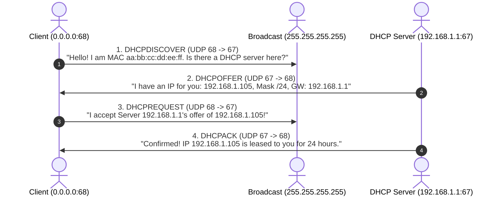
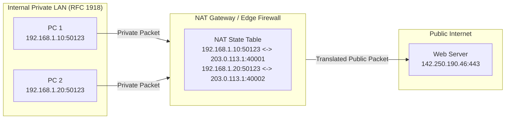
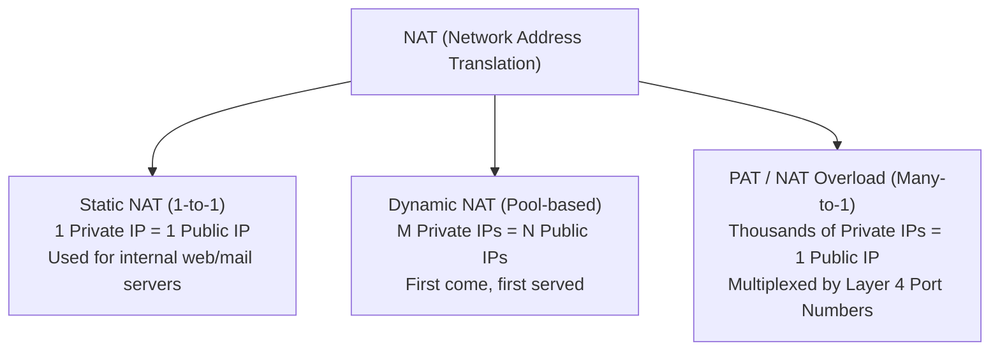
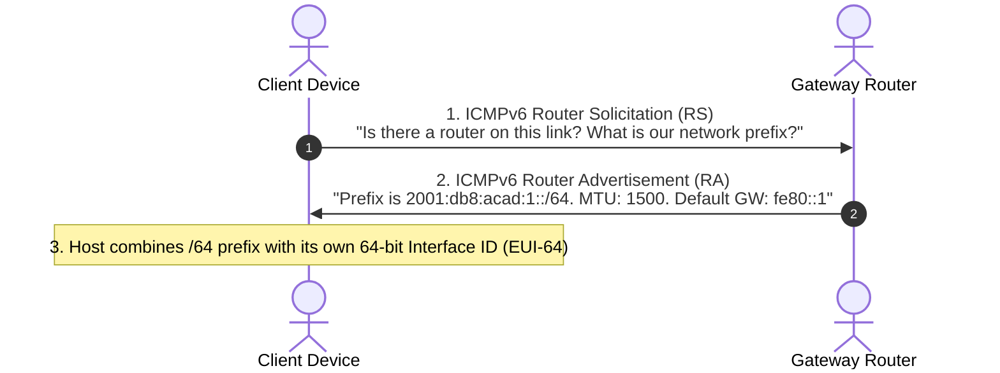

import { Callout } from 'fumadocs-ui/components/callout';
import { NatTranslator } from '@/components/computer-networking/networking-simulators';

# DHCP, NAT/PAT, IPv6 & Cisco Interface Configuration

In an ideal network, every device would have a permanent, globally unique IP address configured by hand. In reality, modern networks are dynamic: thousands of laptops, phones, and IoT sensors join and leave Wi-Fi networks constantly. Furthermore, IPv4 addresses ran out globally in 2011.

To keep networks running at scale, engineers rely on three fundamental Layer 3 systems:
1. **DHCP (Dynamic Host Configuration Protocol):** Automatically leases IP parameters to client machines without manual configuration.
2. **NAT / PAT (Network Address Translation):** Allows entire office buildings or homes to share a single public IPv4 address.
3. **IPv6 (Internet Protocol Version 6):** The next-generation 128-bit addressing standard that solves address exhaustion permanently.

In this chapter, we explore how these mechanisms work from first principles and implement them with production Cisco IOS CLI commands.

---

## 1. Dynamic Host Configuration Protocol (DHCP)

When a brand new laptop joins an office network or your smartphone connects to home Wi-Fi, it has no IP address, no subnet mask, no default gateway, and no DNS server. 

Instead of forcing users to manually type IP addresses, **DHCP (RFC 2131)** automates host configuration using a four-step handshake known by the acronym **DORA**.



### The 4-Step DORA Process

#### 1. Discover (`DHCPDISCOVER`)
The client has no IP address yet, so it sets its **Source IP to `0.0.0.0`** and its **Destination IP to the local broadcast address `255.255.255.255`**. 
- Protocol: UDP (Source Port **68**, Destination Port **67**).
- Inside the DHCP payload, the client embeds its Layer 2 hardware **MAC address** and a unique transaction ID.
- Every device on the local switch hears this broadcast, but only DHCP servers process it.

#### 2. Offer (`DHCPOFFER`)
When a DHCP server receives the discover packet, it reserves an unallocated IP from its configured address pool (e.g. `192.168.1.105`) and responds with a `DHCPOFFER`.
- The offer contains:
  - Offered IP address (`yiaddr`: "your IP address")
  - Subnet Mask (e.g. `255.255.255.0`)
  - Lease duration (e.g. 86,400 seconds / 24 hours)
  - Default Gateway router IP (`192.168.1.1`)
  - Primary & Secondary DNS servers (`8.8.8.8`, `1.1.1.1`)

#### 3. Request (`DHCPREQUEST`)
Why does the client send another broadcast if it already received an offer?
In large enterprise networks, multiple DHCP servers may respond with offers. The client chooses one offer (typically the first one that arrived) and broadcasts a `DHCPREQUEST`.
- By broadcasting this request, the client **notifies all other DHCP servers that their offers were declined**, allowing them to return those reserved addresses back to their available pools.

#### 4. Acknowledge (`DHCPACK`)
The winning DHCP server commits the lease to its internal binding database and replies with a `DHCPACK` (Acknowledge). Once the client receives the ACK, its operating system assigns the IP address to the network interface, installs the default route into its routing table, and sets DNS resolvers.

---

### DHCP Lease Timers & Renewal

DHCP addresses are not given away permanently; they are **leased** for a specific duration. Two critical timers govern lease renewal:

| Timer | Percentage of Lease | What Happens |
| :--- | :---: | :--- |
| **T1 (Renewal Timer)** | **50% of Lease** | The client sends a unicast `DHCPREQUEST` directly to the original DHCP server asking: *"May I extend my lease?"* If the server replies with a `DHCPACK`, the timer resets back to 100%. |
| **T2 (Rebinding Timer)** | **87.5% of Lease** | If the original DHCP server went down or failed to reply at T1, the client broadcasts a `DHCPREQUEST` to **any** available DHCP server on the network asking for help renewing the lease. |
| **Lease Expiration** | **100% of Lease** | If no server answers by the time the lease reaches zero, the client immediately drops the IP address, stops network transmission, and restarts the entire DORA process from scratch. |

### DHCP Relay Agent (`ip helper-address`)

Routers naturally block broadcast traffic; they do not forward `255.255.255.255` packets across interfaces. If an enterprise centralizes its DHCP servers in a core data center on Subnet `10.0.50.0/24`, how can branch clients on Subnet `192.168.10.0/24` obtain an IP?

The router acting as the local default gateway is configured as a **DHCP Relay Agent**. When it receives a client's UDP broadcast on port 67, it converts the broadcast into a **unicast packet**, injects its own interface IP in the `giaddr` (gateway IP address) field, and forwards it across WAN links directly to the central DHCP server.

---

## 2. NAT & PAT (Network Address Translation)

In 1994, engineers realized that the 4.3 billion address limit of IPv4 would soon be exhausted. RFC 1631 introduced **NAT (Network Address Translation)** as a temporary stopgap. NAT proved so effective that it became the backbone of the modern consumer and corporate internet.

### The Apartment Building Analogy

Imagine a high-rise apartment building with 500 tenants:
- The building has **one single physical street address** registered with the post office: `100 Main Street`.
- Inside the building, each tenant has a private unit number (`Apt 101`, `Apt 405`).
- When a tenant sends a letter, the front desk receptionist rewrites the return address as `100 Main Street`, but appends a unique mailbox code.
- When Amazon delivers a return package to `100 Main Street, Box #405`, the receptionist checks the ledger, sees Box #405 belongs to Alice in Apt 101, and delivers it to her door.

In this analogy:
- **Private IP (RFC 1918):** Alice's internal apartment number (`192.168.1.50`).
- **NAT Gateway (Router):** The front desk receptionist.
- **Public IP:** The building's official street address (`203.0.113.10`).
- **Port Number:** The mailbox code tracking who sent what.



---

### The Three Flavors of NAT



1. **Static NAT (One-to-One):** Maps a single unroutable private IP permanently to a single public IP. Typically used when an organization hosts a public web or email server inside a private DMZ.
2. **Dynamic NAT (Many-to-Many):** Maps private IPs to a pool of registered public IPs on a first-come, first-served basis. If the pool has 10 public IPs, only 10 private hosts can access the internet simultaneously.
3. **PAT (Port Address Translation / NAT Overload):** Maps thousands of internal private IP addresses to **one single public IPv4 address** by tracking unique Layer 4 source port numbers. This is what your home Wi-Fi router and cloud NAT Gateways run.

### Cisco NAT Terminology

Cisco defines four distinct terms to classify IP addresses during NAT operations:

| Term | Location | Meaning |
| :--- | :---: | :--- |
| **Inside Local** | LAN (Internal) | The real, private IP address assigned to an internal host (e.g. `192.168.1.50`). |
| **Inside Global** | WAN (External) | The legitimate public IP address representing the internal host to the outside world (e.g. `203.0.113.10`). |
| **Outside Local** | LAN (Internal) | The IP address of an external host as it appears to internal network devices. Usually identical to Outside Global. |
| **Outside Global** | WAN (External) | The real, public IP address assigned to a server on the internet (e.g. Google's `142.250.190.46`). |

---

### Interactive NAT / PAT Translation Stepper

Step through the packet flow below to watch a router rewrite IP and port headers in real time:

<NatTranslator />

---

## 3. IPv6: 128-Bit Next-Generation Addressing

While NAT extended the lifespan of IPv4 by three decades, it introduced complexity: it breaks end-to-end peer-to-peer connectivity, requires stateful translation tables, and complicates protocols like SIP and IPsec.

**IPv6 (RFC 8200)** is the permanent architectural replacement for IPv4.

### The Scale of IPv6

Instead of 32 bits, IPv6 uses **128 binary bits**:

$$\text{Total IPv6 Addresses} = 2^{128} \approx 3.4 \times 10^{38} \text{ (340 undecillion addresses)}$$

To put this in perspective: there are enough IPv6 addresses to assign an IP to every atom on the surface of the earth, with enough left over for 100 more earths!

### Colon-Hexadecimal Notation & Compression Rules

An IPv6 address is written as **eight 16-bit blocks (called hextets or quads)**, separated by colons. Each hextet is represented by 4 hexadecimal digits:

```
2001 : 0db8 : 0000 : 0000 : 0000 : 0000 : 1428 : 57ab
```

Because writing 32 hex characters is unwieldy, RFC 5952 establishes two strict compression rules:

#### Rule 1: Omit Leading Zeros
Any leading zeros in any 16-bit hextet can be dropped. (Trailing zeros cannot be omitted, as `0500` is different from `0005`):
```
2001 : db8 : 0 : 0 : 0 : 0 : 1428 : 57ab
```

#### Rule 2: Double Colon (`::`) Compression
A single contiguous string of one or more consecutive hextets containing all zeros can be compressed into a double colon (`::`).
```
2001:db8::1428:57ab
```

<Callout type="warn">
**The Double-Colon Can Only Be Used Once!**
You may only use `::` **once per address**. If you used it twice (e.g. `2001::5::1`), a computer could not mathematically deduce how many zero-hextets belong to the first versus second double colon.
</Callout>

### Major IPv6 Address Scopes

| Type | Prefix / Range | Description |
| :--- | :--- | :--- |
| **Global Unicast (GUA)** | `2000::/3` (Binary `001...`) | Publicly routable internet addresses (equivalent to public IPv4). |
| **Unique Local (ULA)** | `fc00::/7` | Private addresses for internal corporate networks (equivalent to RFC 1918). |
| **Link-Local (LLA)** | `fe80::/10` | Mandatory on every IPv6 interface. Used for local subnet communication, routing neighbor discovery, and next-hop hops. Never routed past a local link! |
| **Multicast** | `ff00::/8` | Replaces IPv4 broadcast entirely (IPv6 has NO broadcast addresses). |
| **Loopback** | `::1/128` | Host internal loopback (equivalent to `127.0.0.1`). |
| **Unspecified** | `::/128` | Host without an address during initialization (equivalent to `0.0.0.0`). |

---

### SLAAC & Modified EUI-64

One of IPv6's greatest innovations is **SLAAC (Stateless Address Autoconfiguration)**. A host can configure its own IP address without any DHCP server!



#### How Modified EUI-64 Converts a 48-Bit MAC into a 64-Bit Host ID:
1. Take the physical 48-bit MAC address: `00:60:2F:3A:07:BC`.
2. Split the MAC address directly down the middle into two 24-bit halves: `00:60:2F` and `3A:07:BC`.
3. Insert the fixed 16-bit hex value `FF:FE` in between:
   $$0060:2F\mathbf{FF:FE}3A:07BC$$
4. Invert the **7th bit** (the Universal/Local bit) of the first byte:
   - First byte = `00` hex $\implies `00000000` binary.
   - Flipping the 7th bit yields $`00000010` \implies `02` hex.
5. Final 64-bit Interface ID: `0260:2fff:fe3a:07bc`.
6. Combine with `/64` prefix to form the full address: `2001:db8:acad:1:0260:2fff:fe3a:07bc`.

---

## 4. Cisco IOS Interface Configuration & Administration

Let's now apply these concepts to configure enterprise routers.


### 1. Configuring IPv4 & IPv6 on an Interface

By default, Cisco router interfaces are in an administratively `shutdown` state (turned off). You must enter interface configuration mode, assign IP parameters, and explicitly bring the link up using `no shutdown`:

```cisco
Router# configure terminal
Enter configuration commands, one per line. End with CNTL/Z.

! Enter the GigabitEthernet interface
Router(config)# interface GigabitEthernet0/0/0
Router(config-if)# description Connection to Corporate LAN
Router(config-if)# ip address 192.168.1.1 255.255.255.0

! Enable IPv6 routing globally first (critical!)
Router(config-if)# exit
Router(config)# ipv6 unicast-routing

! Configure IPv6 Global Unicast and Link-Local addresses
Router(config)# interface GigabitEthernet0/0/0
Router(config-if)# ipv6 address 2001:db8:acad:1::1/64
Router(config-if)# ipv6 address fe80::1 link-local

! Electrically activate the physical port
Router(config-if)# no shutdown
Router(config-if)# end
Router#
```

---

### 2. Configuring a Full DHCP Server on Cisco IOS

You can configure a Cisco router to serve as the authoritative DHCP server for connected LAN subnets:

```cisco
Router# configure terminal

! Step 1: Exclude static infrastructure addresses (gateways, printers, servers)
Router(config)# ip dhcp excluded-address 192.168.1.1 192.168.1.10
Router(config)# ip dhcp excluded-address 192.168.1.250 192.168.1.254

! Step 2: Create the DHCP Pool
Router(config)# ip dhcp pool OFFICE_LAN
Router(config-dhcp)# network 192.168.1.0 255.255.255.0
Router(config-dhcp)# default-router 192.168.1.1
Router(config-dhcp)# dns-server 8.8.8.8 1.1.1.1
Router(config-dhcp)# domain-name corp.internal
Router(config-dhcp)# lease 1 0 0   ! (1 day, 0 hours, 0 minutes)
Router(config-dhcp)# end
```

---

### 3. Configuring PAT (NAT Overload) on Cisco IOS

To connect the internal LAN (`192.168.1.0/24`) to the public internet through ISP uplink `GigabitEthernet0/0/1`:

```cisco
Router# configure terminal

! Step 1: Define an Access Control List (ACL) matching internal private traffic
Router(config)# access-list 1 permit 192.168.1.0 0.0.0.255

! Step 2: Enable NAT Overload (PAT) bound to the outside public interface
Router(config)# ip nat inside source list 1 interface GigabitEthernet0/0/1 overload

! Step 3: Designate the Inside interface (LAN facing)
Router(config)# interface GigabitEthernet0/0/0
Router(config-if)# ip nat inside

! Step 4: Designate the Outside interface (ISP facing)
Router(config)# interface GigabitEthernet0/0/1
Router(config-if)# ip address 203.0.113.10 255.255.255.248
Router(config-if)# ip nat outside
Router(config-if)# no shutdown
Router(config-if)# end
```

---

## 5. Verification & Troubleshooting Commands

Network engineers verify and audit operational states using these essential diagnostic commands:

### Verify Interface Status
```cisco
Router# show ip interface brief
Interface              IP-Address      OK? Method Status                Protocol
GigabitEthernet0/0/0   192.168.1.1     YES manual up                    up
GigabitEthernet0/0/1   203.0.113.10    YES manual up                    up

Router# show ipv6 interface brief
GigabitEthernet0/0/0   [up/up]
    FE80::1
    2001:DB8:ACAD:1::1
```
*Note: Both Status (Layer 1 Physical Cable) and Protocol (Layer 2 Framing) must read `up/up` for traffic to pass.*

### Inspect DHCP Leases
```cisco
Router# show ip dhcp binding
IP address       Client-ID/Hardware address      Lease expiration        Type
192.168.1.11     0100.5056.c000.08               Oct 02 2026 09:14 AM    Automatic
192.168.1.12     01aa.bbcc.ddee.ff               Oct 02 2026 09:45 AM    Automatic
```

### Audit Active NAT Translations
```cisco
Router# show ip nat translations
Pro Inside global          Inside local           Outside local          Outside global
tcp 203.0.113.10:41001     192.168.1.15:52130     142.250.190.46:443     142.250.190.46:443
tcp 203.0.113.10:41002     192.168.1.16:49182     151.101.65.140:80      151.101.65.140:80
```

---

## 6. Summary Checklist

- **DHCP DORA:** Discover (Broadcast) $\to$ Offer (Unicast/Broadcast) $\to$ Request (Broadcast) $\to$ Acknowledge (Commit).
- **Relay Agents:** Use `ip helper-address` to forward client broadcast requests across routers to remote DHCP servers.
- **NAT vs PAT:** NAT translates IP addresses; PAT (NAT Overload) translates IP addresses AND Layer 4 port numbers, enabling thousands of hosts to share a single public IP.
- **IPv6 Format:** 128 bits represented as 8 hextets in hexadecimal. Compress consecutive zero-blocks once using `::`.
- **SLAAC:** Combines Router Advertisement network prefixes with host-generated EUI-64 or random 64-bit interface identifiers.
