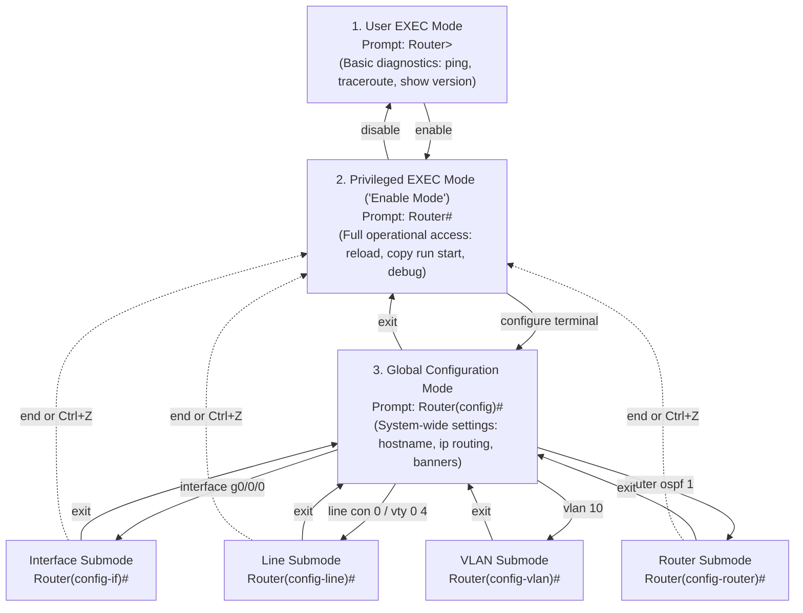
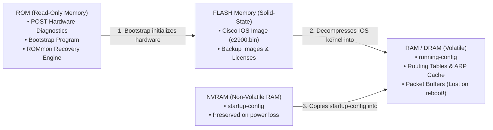
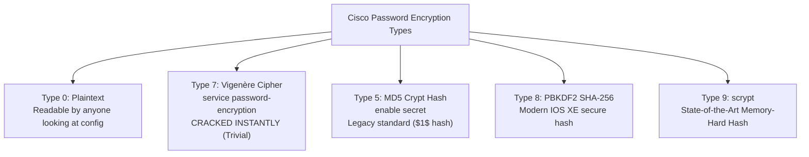

import { Callout } from 'fumadocs-ui/components/callout';

# Cisco IOS CLI Architecture, Navigation & Device Hardening

In corporate server rooms and cloud data center facilities, high-performance switches and routers do not ship with monitors, keyboards, or graphical desktop interfaces. They run specialized, deterministic operating systems built for zero-downtime routing.

The gold standard of enterprise network management is **Cisco IOS (Internetwork Operating System)**. Through its hierarchical **Command Line Interface (CLI)**, network engineers configure routing protocols, provision VLAN trunks, troubleshoot hardware interfaces, and enforce cryptographic security.

In this guide, we demystify Cisco IOS from bare-metal hardware connection to advanced device hardening.

---

## 1. Physical Out-of-Band (OOB) Access: The Console Connection

When a brand-new router arrives out of the box, it has no IP address, no SSH daemon, and no network connectivity. You cannot reach it over Ethernet or Wi-Fi. 

To configure a bare-metal device, you must establish an **Out-of-Band (OOB) Management** session using the physical **Console Port**.


### The Rollover Cable & 9600-8-N-1 Standard

The physical connection uses a distinct light-blue cable known as a **Rollover Cable** (or flat RJ-45 to DB-9 serial cable, and on modern hardware, USB-to-RJ45 or USB mini-B / Type-C):
- **Pinout Structure:** The cable is called "rollover" because Pin 1 on one end connects to Pin 8 on the other end, Pin 2 connects to Pin 7, Pin 3 to Pin 6, and so on (the pinout is physically reversed).
- **Serial Port Settings:** Terminal emulators (such as **PuTTY**, **Tera Term**, **SecureCRT**, or Linux **minicom**) must be configured with the universal asynchronous serial standard:

$$\mathbf{9600\text{ Baud}} \quad-\quad \mathbf{8\text{ Data Bits}} \quad-\quad \mathbf{No\ Parity} \quad-\quad \mathbf{1\text{ Stop Bit}} \quad-\quad \mathbf{No\ Flow\ Control} \quad \mathbf{(9600\text{-}8\text{-}N\text{-}1)}$$

| Parameter | Setting | Technical Purpose |
| :--- | :---: | :--- |
| **Baud Rate (Speed)** | `9600 bps` | The transmission symbol rate per second over the RS-232 serial UART. |
| **Data Bits** | `8` | Represents standard 8-bit ASCII characters. |
| **Parity** | `None (N)` | No extra parity bit calculated for error checking. |
| **Stop Bits** | `1` | A single high-voltage bit signaling the end of an incoming character frame. |
| **Flow Control** | `None` | Disables RTS/CTS and XON/XOFF hardware flow pacing. |

Once your terminal emulator opens with these parameters and you hit `Enter`, the Cisco IOS terminal prompt greets you:

```cisco
              --- System Configuration Dialog ---

Would you like to enter the initial configuration dialog? [yes/no]: no

Press RETURN to get started!

Router>
```
*(Always answer `no` to the initial configuration dialog wizard—professional engineers always configure devices manually to prevent incomplete or bloated template configurations!)*

---

## 2. The Cisco IOS Command Mode Hierarchy

Cisco IOS uses a structured **modal hierarchy**. Depending on what level of the operating system you are in, different commands become available, and the terminal prompt updates to indicate your current privilege level.



### Detailed Breakdown of the Modes

#### 1. User EXEC Mode (`Router>`)
The initial entry level upon logging in. You have limited read-only visibility.
- **Prompt:** Ends with a right angle bracket `>`.
- **Allowed actions:** Basic ping, traceroute, show clock, and limited show commands.
- **Restricted actions:** You cannot view the running configuration, alter device settings, or reboot the device.

#### 2. Privileged EXEC Mode (`Router#`)
Also known as **Enable Mode**. This is the administrative operational tier (equivalent to `root` or `Administrator`).
- **Prompt:** Ends with a hash symbol `#`.
- **How to enter:** Type `enable` at `Router>`.
- **How to leave:** Type `disable` to drop back down to User EXEC.
- **Allowed actions:** View configurations (`show running-config`), save files, restart the router (`reload`), wipe memory (`write erase`), and run diagnostic packet debuggers (`debug ip packet`).

#### 3. Global Configuration Mode (`Router(config)#`)
The root configuration mode where changes take effect globally across the entire operating system.
- **Prompt:** `Router(config)#`.
- **How to enter:** Type `configure terminal` (or shortcut `conf t`) from Privileged EXEC mode.
- **How to leave:** Type `exit` to return to Privileged EXEC mode.
- **Allowed actions:** Change the device name (`hostname`), configure NTP, define global routing protocols, build access control lists (ACLs).

#### 4. Subconfiguration Modes
From Global Configuration, entering specific subsystems places you in targeted subconfiguration modes:

| Submode | Typical Command to Enter | Prompt | What You Configure Here |
| :--- | :--- | :--- | :--- |
| **Interface** | `interface GigabitEthernet0/0/0` | `Router(config-if)#` | IP addresses, MTU, speed/duplex, `no shutdown` |
| **Subinterface** | `interface GigabitEthernet0/0.10` | `Router(config-subif)#` | 802.1Q VLAN encapsulation for router-on-a-stick |
| **Line** | `line console 0` or `line vty 0 4` | `Router(config-line)#` | Console and SSH/Telnet terminal access passwords |
| **Router** | `router ospf 1` or `router bgp 65000` | `Router(config-router)#` | Routing protocol metrics, networks, and neighbor peers |
| **VLAN** | `vlan 20` | `Switch(config-vlan)#` | VLAN names and Layer 2 broadcast domain parameters |

---

### CLI Navigation Shortcuts & Power Tricks

The Cisco IOS CLI features robust keyboard productivity controls:

- **Context-Sensitive Help (`?`):**
  - Type `?` at any prompt to view all available commands in that mode.
  - Type `sh?` to see commands starting with `sh` (`show`).
  - Type `show ?` to see valid arguments following the `show` keyword.
- **Tab Autocompletion:** Type the first few characters of a unique command and press `Tab` (e.g. `conf` + `Tab` $\to$ `configure`).
- **`exit` vs `end` vs `Ctrl+Z`:**
  - `exit`: Steps backward **one level** up the hierarchy.
  - `end` or `Ctrl+Z`: Jumps straight out of any nested subconfiguration mode directly back to **Privileged EXEC (`Router#`)**.
- **The `do` Command Override:**
  Normally, operational commands like `show ip interface brief` can only run in Privileged EXEC mode (`#`). If you are deep inside `Router(config-if)#`, prefix the command with `do`:
  ```cisco
  Router(config-if)# do show ip interface brief
  ```
  This saves thousands of keystrokes by preventing you from constantly having to `exit` to check your work!

---

## 3. Cisco Hardware Memory Architecture: RAM vs NVRAM

To understand how Cisco devices save and execute configurations, you must understand the physical memory hardware inside the chassis:



### The Four Memory Components

1. **ROM (Read-Only Memory):** 
   Non-volatile firmware soldered onto the motherboard. It runs the **POST (Power-On Self-Test)** when electricity is applied, launches the bootstrap loader, and hosts **ROMmon (ROM Monitor Mode)**, a mini diagnostic console used to recover lost admin passwords or repair corrupted IOS images.
2. **Flash Memory:** 
   Non-volatile EEPROM storage. It acts as the hard drive, storing the compressed Cisco IOS binary image file (e.g. `c2900-universalk9-mz.SPA.157-3.M3.bin`).
3. **RAM (Random Access Memory / DRAM):** 
   High-speed volatile operational memory. Whenever you type a configuration command, **it modifies the `running-config` in RAM instantly**. If someone trips over the power cord before you save, **all your changes are permanently lost**.
4. **NVRAM (Non-Volatile RAM):** 
   Small, battery-backed (or flash-based) non-volatile storage that retains data without power. It stores the **`startup-config`**, which the router reads every time it boots.

### Synchronizing Configurations

Whenever you make changes, your working configuration resides solely in RAM. You must explicitly commit RAM to NVRAM:

```cisco
! Method 1: The standard official Cisco command
Router# copy running-config startup-config
Destination filename [startup-config]? [Enter]
Building configuration...
[OK]

! Method 2: The classic network engineer shortcut
Router# write memory
! or simply:
Router# wr
```

To erase the saved configuration and return the router to factory defaults:
```cisco
Router# erase startup-config
! or:
Router# write erase
Erasing the nvram filesystem will remove all configuration files! Continue? [confirm] [Enter]
[OK]
Router# reload
Proceed with reload? [confirm] [Enter]
```

### The Configuration Register (`0x2102` vs `0x2142`)

The **Configuration Register** is a 16-bit software register in NVRAM controlling boot behavior:
- **`0x2102` (Factory Default):** Tells the router to boot the IOS image from Flash, and **load the `startup-config` from NVRAM**.
- **`0x2142` (Password Recovery Mode):** Sets Bit 6 (the "ignore NVRAM" bit). When the router boots, it **completely ignores the startup-config in NVRAM**, booting into empty factory defaults. This allows an administrator with physical console access to enter the device without knowing the admin password, view or reset the password, and reset the register back to `0x2102`.

---

## 4. Password Security: Plaintext vs Type 7 vs Type 5 vs Type 9

Securing physical and remote access to the CLI is paramount. Historically, Cisco supported various encryption schemes for stored passwords, ranging from laughable obfuscation to military-grade hashing.



### 1. Plaintext & The Danger of `enable password`
In early IOS versions, setting `enable password Cisco123` stored the password in **clear plaintext** inside `running-config`. Anyone running `show run` or looking over your shoulder saw the administrative password immediately.

### 2. Type 7 Encryption (`service password-encryption`)
To prevent over-the-shoulder viewing, Cisco added the global command:
```cisco
Router(config)# service password-encryption
```
This converts plaintext passwords into **Type 7 strings**, which look encrypted:
```cisco
line con 0
 password 7 0822455D0A16
```

<Callout type="warn">
**Type 7 is NOT Encryption—It is Obfuscation!**
Type 7 is a simple XOR Vigenère cipher that uses a static, hardcoded encryption key stored in the Cisco IOS source code. **Type 7 passwords can be decrypted in under 5 milliseconds** using free web tools or a 5-line Python script. Never rely on Type 7 to protect sensitive credentials from competent attackers!
</Callout>

### 3. Type 5 (MD5 Hashes)
To introduce one-way cryptographic hashing, Cisco introduced:
```cisco
Router(config)# enable secret MyStrongSecretPassword
```
This generates a **Type 5 hash** using a salted Unix MD5 algorithm:
```cisco
enable secret 5 $1$mERr$hx5rVt7rPNoSuCA2v2AqG.
```
Type 5 cannot be reversed or decrypted. It can only be cracked via brute-force dictionary attacks.

### 4. Type 8 (SHA-256) & Type 9 (scrypt)
Modern Cisco IOS XE hardware introduces modern cryptographic hashes resistant to GPU-accelerated hashcat cracking rigs:
- **Type 8:** Employs **PBKDF2 with HMAC-SHA256**.
- **Type 9:** Employs **scrypt**, a memory-hard key derivation function specifically engineered to defeat custom FPGA and ASIC password-cracking hardware.

```cisco
Router(config)# username admin algorithm-type scrypt secret MasterKey2026!
```

---

## 5. Complete Device Hardening: Production Cisco IOS Script

Below is a complete, enterprise-grade baseline hardening script used by network engineers to secure a brand-new router before deploying it into production:

```cisco
! ============================================================================
! 1. BASIC IDENTITY & DOMAIN
! ============================================================================
Router# configure terminal
Router(config)# hostname CORE-RTR-01
CORE-RTR-01(config)# ip domain-name enterprise.internal

! ============================================================================
! 2. PRIVILEGED ACCESS HARDENING (TYPE 9 SCRYPT)
! ============================================================================
! Disable weak legacy passwords and enforce scrypt for enable secret
CORE-RTR-01(config)# enable algorithm-type scrypt secret SuperAdminSecretKey99#

! Obfuscate remaining cleartext lines in configuration files
CORE-RTR-01(config)# service password-encryption

! ============================================================================
! 3. LOCAL ADMINISTRATIVE USER ACCOUNT
! ============================================================================
CORE-RTR-01(config)# username netadmin algorithm-type scrypt secret P@ssw0rdEnterprise2026!

! ============================================================================
! 4. CONSOLE PORT SECURITY (LINE CON 0)
! ============================================================================
CORE-RTR-01(config)# line console 0
! Require local username and password authentication
CORE-RTR-01(config-line)# login local
! Auto-logout idle sessions after 5 minutes, 0 seconds
CORE-RTR-01(config-line)# exec-timeout 5 0
! Prevent incoming syslog notices from interrupting half-typed commands
CORE-RTR-01(config-line)# logging synchronous
CORE-RTR-01(config-line)# exit

! ============================================================================
! 5. REMOTE ACCESS HARDENING: SSHv2 ONLY (NO TELNET!)
! ============================================================================
! Generate a 2048-bit RSA encryption key for the SSH server
CORE-RTR-01(config)# crypto key generate rsa modulus 2048
CORE-RTR-01(config)# ip ssh version 2
CORE-RTR-01(config)# ip ssh time-out 60
CORE-RTR-01(config)# ip ssh authentication-retries 3

! Lock down Virtual Terminal lines 0 through 15
CORE-RTR-01(config)# line vty 0 15
! Force local database authentication
CORE-RTR-01(config-line)# login local
! Strictly permit SSH traffic and block unencrypted Telnet (Cleartext port 23)
CORE-RTR-01(config-line)# transport input ssh
CORE-RTR-01(config-line)# exec-timeout 10 0
CORE-RTR-01(config-line)# logging synchronous
CORE-RTR-01(config-line)# exit

! ============================================================================
! 6. LEGAL NOTICE & BANNER
! ============================================================================
CORE-RTR-01(config)# banner motd ^C
*******************************************************************************
* WARNING: AUTHORIZED ACCESS ONLY!                                            *
* All activities on this system are monitored and logged.                     *
* Unauthorized access will be prosecuted to the full extent of applicable law.*
*******************************************************************************
^C

! ============================================================================
! 7. DISABLE UNNECESSARY SERVICES
! ============================================================================
CORE-RTR-01(config)# no ip http server
CORE-RTR-01(config)# no ip http secure-server
CORE-RTR-01(config)# no ip source-route

! ============================================================================
! 8. SAVE CONFIGURATION TO NVRAM
! ============================================================================
CORE-RTR-01(config)# end
CORE-RTR-01# copy running-config startup-config
Destination filename [startup-config]? [Enter]
Building configuration...
[OK]
```

---

## 6. Summary Checklist

When operating and maintaining enterprise Cisco infrastructure:

1. **Console access requires 9600-8-N-1** via a rollover cable directly into the UART console port.
2. **Understand your command prompt:** `>` is User EXEC, `#` is Privileged EXEC, `(config)#` is Global Configuration, and `(config-if)#` is Interface subconfiguration.
3. **RAM stores active changes (`running-config`); NVRAM stores permanent reboot state (`startup-config`).** Always run `wr` or `copy run start` before logging out!
4. **Never rely on Type 7 passwords for security.** Use `enable algorithm-type scrypt secret` (Type 9) or `enable secret` (Type 5).
5. **Always disable Telnet on VTY lines (`transport input ssh`)** and enforce `logging synchronous` so system log notices don't mangle your CLI prompt while typing.
