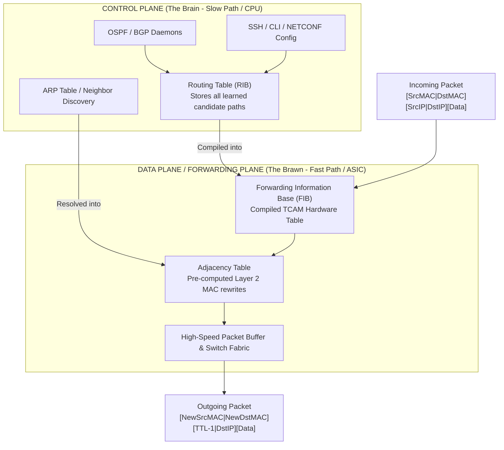
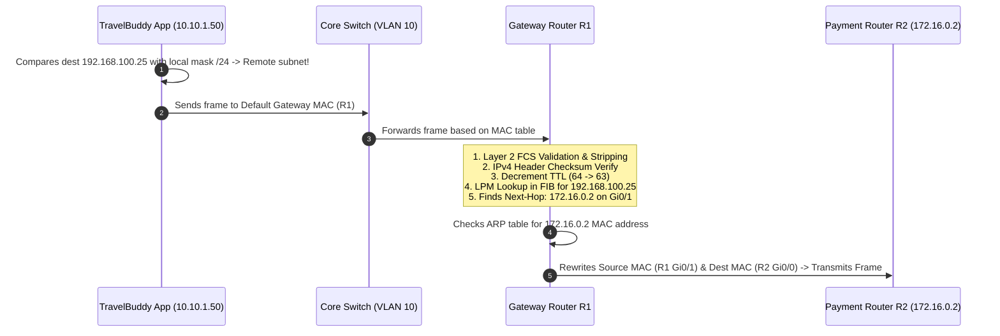
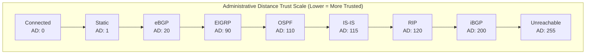
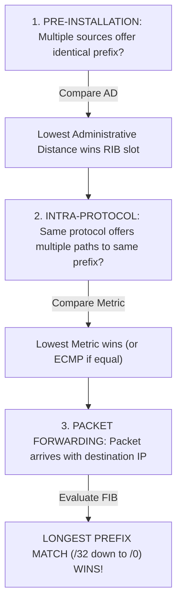
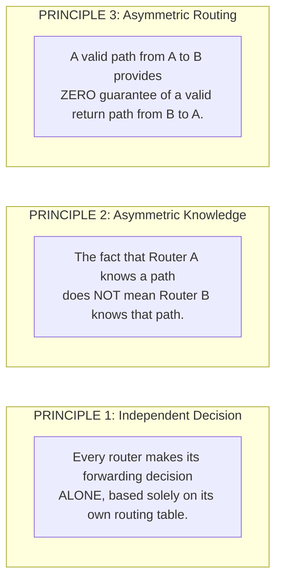
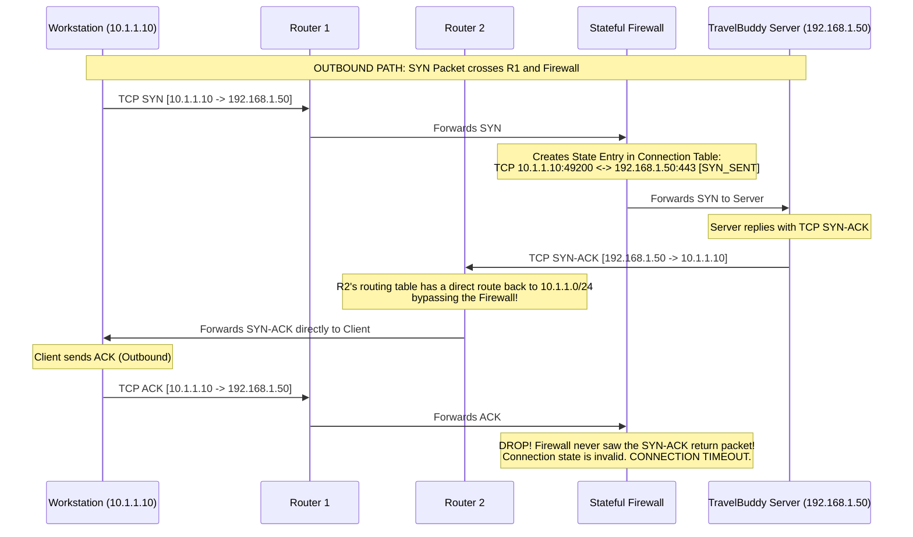
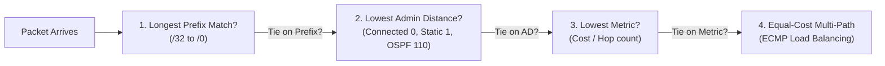

import { Callout } from 'fumadocs-ui/components/callout';

# Routing & Static Routes: Forwarding Logic, Routing Tables & Administrative Distance

A switch connects hosts inside a single local room. A router connects disparate worlds. When an engineer at **TravelBuddy** clicks "Deploy" from their office workstation in Chicago, that packet must cross seven autonomous networks, navigate through local VLANs, traverse a corporate MPLS backbone, penetrate an AWS DirectConnect border, and land on a microservices cluster in `us-east-1`.

How does every intermediary device know where to forward those 1,500 bytes of raw data? It doesn't guess. It consults its routing table—a deterministic database governing packet destiny across the global Internet.

In this chapter, we unpack Layer 3 forwarding from first principles: the anatomy of the routing table, why Cisco IOS creates `/32` local routes, how the **Longest Prefix Match (LPM)** rule strictly overrides metrics and administrative distance, Alex Zinin's three immutable laws of routing, and how to engineer robust static and floating backup routes.

---

## 1. Routing Fundamentals: Crossing Network Boundaries

A network without a router is a closed room. Devices inside can scream at each other via Layer 2 broadcast frames and resolve MAC addresses using ARP, but they can never communicate with a device on a different subnet.


### Switching vs. Routing

| Dimension | Layer 2 Switching | Layer 3 Routing |
| :--- | :--- | :--- |
| **Addressing** | 48-bit Media Access Control (MAC) | 32-bit (IPv4) or 128-bit (IPv6) Logical Address |
| **PDU** | Ethernet Frame | IP Packet |
| **Decision Table** | MAC Address Table (CAM Table) | Routing Information Base (RIB) / FIB |
| **Scope** | Single broadcast domain (LAN / VLAN) | Multiple broadcast domains (WAN / Inter-VLAN) |
| **Header Mutation** | Frame payload and headers untouched | TTL decremented; MAC headers stripped and rebuilt |
| **Broadcast Handling**| Floods unknown unicast and broadcasts | Stops broadcasts (does not forward `255.255.255.255`) |

### The Control Plane vs. The Data Plane

Modern routers split their operations into two strictly isolated architectures:



1. **Control Plane (RIB - Routing Information Base):** Runs on general-purpose CPUs. It runs routing protocols (OSPF, BGP, EIGRP), builds neighbor adjacencies, calculates shortest path trees, and maintains the master routing table.
2. **Data Plane (FIB - Forwarding Information Base):** Runs in dedicated silicon ASICs and **TCAM (Ternary Content-Addressable Memory)**. It takes the winning routes from the RIB and flattens them into a hardware lookup table capable of matching IP destination addresses in nanoseconds at line-rate (400 Gbps+).

---

## 2. The Microscopic Life of a Routed Packet

Let us trace a single packet generated by TravelBuddy's booking service (`10.10.1.50`) destined for the legacy on-prem payment gateway (`192.168.100.25`).



Notice what changed and what remained identical:
- **Source IP & Destination IP:** NEVER change during normal routing (unless traversing a NAT gateway). The destination remains `192.168.100.25` from start to finish.
- **Source MAC & Destination MAC:** Change at **every single router hop** along the wire. When R1 receives the frame, it strips the Ethernet header, inspects the IP packet, decrements the TTL, looks up the egress port, and builds a brand-new Ethernet header with its own interface MAC as the source and R2's interface MAC as the destination.
- **TTL (Time to Live):** Decremented by 1 at each Layer 3 hop. If a routing loop causes a packet to bounce between two routers, the TTL eventually hits 0. The router drops the packet and transmits an `ICMP Type 11 (Time-to-Live Exceeded)` back to the sender, preventing permanent bandwidth exhaustion.

---

## 3. Dissecting the Routing Table (`show ip route`)

To understand how a router thinks, log into a Cisco IOS XE enterprise router and execute `show ip route`.

```text
R1-Edge# show ip route
Codes: L - local, C - connected, S - static, R - RIP, M - mobile, B - BGP
       D - EIGRP, EX - EIGRP external, O - OSPF, IA - OSPF inter area 
       N1 - OSPF NSSA external type 1, N2 - OSPF NSSA external type 2
       E1 - OSPF external type 1, E2 - OSPF external type 2
       i - IS-IS, su - IS-IS summary, L1 - IS-IS level-1, L2 - IS-IS level-2
       * - candidate default, U - per-user static route, o - ODR
       P - periodic downloaded static route, H - NHRP, l - LISP
       a - application route
       + - replicated route, % - next hop override, p - overrides from PfR

Gateway of last resort is 203.0.113.1 to network 0.0.0.0

S*    0.0.0.0/0 [1/0] via 203.0.113.1, GigabitEthernet0/0
      10.0.0.0/8 is variably subnetted, 4 subnets, 2 masks
C        10.10.1.0/24 is directly connected, GigabitEthernet0/1
L        10.10.1.1/32 is directly connected, GigabitEthernet0/1
O        10.20.0.0/16 [110/20] via 172.16.0.2, 01:42:15, GigabitEthernet0/2
B        192.168.100.0/24 [20/0] via 198.51.100.5, 06:12:30
```

Let's dissect each component of the OSPF route entry:

```text
  O        10.20.0.0/16 [110/20] via 172.16.0.2, 01:42:15, GigabitEthernet0/2
 [1]           [2]         [3]         [4]          [5]              [6]
```

1. **Route Source (`O`):** How the router learned this prefix (`O` = OSPF, `C` = Connected, `S` = Static, `B` = eBGP).
2. **Destination Prefix & Mask (`10.20.0.0/16`):** The destination network range.
3. **Administrative Distance & Metric (`[110/20]`):** 
   - `110` is the **Administrative Distance (AD)**: The believability score of OSPF.
   - `20` is the **Metric**: The cost of reaching this network calculated by the protocol (OSPF interface cost).
4. **Next-Hop IP Address (`172.16.0.2`):** The Layer 3 IP address of the next router in the forwarding chain.
5. **Route Age (`01:42:15`):** How long this route has been continuously active in the routing table (1 hour, 42 minutes, 15 seconds).
6. **Outgoing Interface (`GigabitEthernet0/2`):** The local physical or logical interface through which the packet must be serialized.

<Callout type="info">
**Linux Equivalence:** On a modern Linux server or Kubernetes node, view the kernel routing table via `ip route show` or `ip route show table main`:
```bash
$ ip route show
default via 203.0.113.1 dev eth0 proto static onlink
10.10.1.0/24 dev eth1 proto kernel scope link src 10.10.1.1
10.20.0.0/16 via 172.16.0.2 dev eth2 proto bird metric 20
```
</Callout>

---

## 4. The Mystery of Connected (`C`) vs. Local (`L /32`) Routes

If you inspect a Cisco router running IOS 15.0 or newer, you will notice every directly connected subnet generates two entries:

```text
C        10.10.1.0/24 is directly connected, GigabitEthernet0/1
L        10.10.1.1/32 is directly connected, GigabitEthernet0/1
```

Engineers often ask: *Why does the router need the `/32` route if it already has the `/24` route covering the entire subnet?*

### The Architectural Reason: Fast-Path Kernel Demultiplexing

- **Connected Route (`C 10.10.1.0/24`):** Represents the entire broadcast domain. Any packet destined for `10.10.1.50` matches this route. The router knows it must broadcast an ARP request out `GigabitEthernet0/1` to find the host's MAC and forward the frame across the link.
- **Local Route (`L 10.10.1.1/32`):** Represents the **exact IP address assigned to the router's own interface**. 

When a packet arrives with destination IP `10.10.1.1` (e.g. an SSH session to manage the router, or an ICMP ping to the gateway), the router's hardware ASIC matches the `/32` prefix. 

Because `/32` is longer than `/24`, the hardware immediately knows: **"This packet is NOT meant to be routed out an interface; it is addressed to ME. Intercept it immediately and hand it to the local CPU control plane."**

Without `/32` local routes, the forwarding ASIC would have to perform software checks on every forwarded packet to verify whether the destination matches one of its own interface IPs. The `/32` entry pushes host-bound packet identification directly into the line-rate hardware FIB!

---

## 5. The Golden Rule of Routing: Longest Prefix Match (LPM)

The single most fundamental concept in IP networking is the **Longest Prefix Match (LPM)** algorithm.

<Callout type="warn">
### The Universal Law of LPM
When a router receives a packet, it compares the packet's destination IP address against **every single route** in its routing table. 
If multiple routes match, the router selects the route with the **most specific subnet mask (the longest prefix length)**.

**LPM overrides Administrative Distance. LPM overrides Metric. LPM overrides everything.**
</Callout>

### The TravelBuddy Routing Dilemma

Suppose Router R1 has the following four routes in its table:

```text
Route A (Static):   10.0.0.0/8       via 192.168.1.1   [AD: 1,   Metric: 0]
Route B (OSPF):     10.10.0.0/16     via 192.168.2.1   [AD: 110, Metric: 10]
Route C (RIP):      10.10.1.0/24     via 192.168.3.1   [AD: 120, Metric: 2]
Route D (Default):  0.0.0.0/0        via 203.0.113.1   [AD: 1,   Metric: 0]
```

A packet arrives at R1 destined for **`10.10.1.75`** (TravelBuddy API Server). Which route does R1 choose?

```mermaid
flowchart TD
    InPacket["Incoming Packet to 10.10.1.75"] --> EvalTable{"Evaluate All Routing Entries"}

    EvalTable -->|Matches 0 bits| D["Route D: 0.0.0.0/0<br/>Prefix Length: /0"]
    EvalTable -->|Matches 8 bits: 00001010| A["Route A: 10.0.0.0/8<br/>Prefix Length: /8<br/>(AD 1 - Static)"]
    EvalTable -->|Matches 16 bits: 00001010.00001010| B["Route B: 10.10.0.0/16<br/>Prefix Length: /16<br/>(AD 110 - OSPF)"]
    EvalTable -->|Matches 24 bits: 00001010.00001010.00000001| C["Route C: 10.10.1.0/24<br/>Prefix Length: /24<br/>(AD 120 - RIP)"]

    D --> Compare{"Compare Prefix Lengths"}
    A --> Compare
    B --> Compare
    C --> Compare

    Compare -->|Longest Prefix (/24 > /16 > /8 > /0)| WINNER["WINNER: Route C (10.10.1.0/24)<br/>via 192.168.3.1<br/>(Forwarded out interface to 192.168.3.1)"]

    style WINNER fill:#10b981,stroke:#059669,stroke-width:2px,color:#ffffff
```

Look closely at Route A vs. Route C:
- Route A is a **Static route** with an Administrative Distance of **1** (extremely reliable).
- Route C is a **RIP route** with an Administrative Distance of **120** (unreliable legacy protocol).

Many junior engineers assume R1 will choose Route A because "Static routes beat RIP." **That is completely false!** 

Administrative Distance is only evaluated to break a tie between two routes advertising the **exact same prefix length**. Because `10.10.1.0/24` has 24 matching network bits while `10.0.0.0/8` only has 8 matching network bits, Route C wins unconditionally.

---

## 6. Administrative Distance & Metrics: The Tie-Breakers

What happens when multiple routing protocols learn about the **exact same destination subnet**?

For example: Both OSPF and eBGP announce a path to `172.16.50.0/24`. Which one enters the routing table?

This is where **Administrative Distance (AD)** comes into play. AD is an integer from 0 to 255 representing the **trustworthiness** of the route source. Lower numbers are more trusted.



### Standard Administrative Distance Values

| Route Type / Protocol | Default AD | Metric Type |
| :--- | :--- | :--- |
| **Connected Interface** | 0 | None (Directly attached) |
| **Static Route** | 1 | Configured administrator preference |
| **eBGP (External BGP)** | 20 | Path Attributes (AS-PATH, Local Pref, MED) |
| **EIGRP (Internal)** | 90 | Composite (Bandwidth + Delay) |
| **OSPF** | 110 | Cost ($10^8 / \text{Bandwidth in bps}$) |
| **IS-IS** | 115 | Arbitrary Link Cost |
| **RIP** | 120 | Hop Count (Max 15 hops) |
| **iBGP (Internal BGP)** | 200 | BGP Path Attributes |
| **Unusable / Dropped** | 255 | Route will never be installed in the RIB |

### The Route Selection Decision Funnel

When a router receives routing updates and forwarding requests, it executes decisions through three hierarchical tiers:



---

## 7. The Default Route (`0.0.0.0/0`): Gateway of Last Resort

No enterprise or cloud router can store routes to every individual IP address on Earth. The global BGP routing table contains over 950,000 IPv4 prefixes. A small branch router would instantly run out of memory.

Enter the **Default Route (`0.0.0.0/0`)**, known colloquially as the **Gateway of Last Resort**.

```cisco
R1(config)# ip route 0.0.0.0 0.0.0.0 203.0.113.1
```

### The Math Behind `0.0.0.0 0.0.0.0`

Recall how subnet masks operate at the bit level:
- Subnet mask `255.255.255.0` (`/24`): The first 24 bits of the destination IP **must match** the network address.
- Subnet mask `255.0.0.0` (`/8`): The first 8 bits **must match**.
- Subnet mask `0.0.0.0` (`/0`): **Exactly 0 bits must match.**

Because 0 matching bits are required, **every IPv4 address on the planet matches `0.0.0.0/0`**. 

However, because its prefix length is `/0`, it has the lowest possible priority under the Longest Prefix Match rule. A router will only forward a packet to the default gateway if it fails to find a match in any `/32`, `/28`, `/24`, `/16`, or `/8` entry in its table.

---

## 8. Alex Zinin's Three Principles of Routing

In his seminal work *Cisco IP Routing*, network architect Alex Zinin formulated three fundamental principles that govern all packet-switched routing architectures. 

Every senior network engineer and SRE keeps these principles memorized when debugging routing black holes.



### Principle 1: Every Router Decides Alone
Router R1 does not know what Router R2 or Router R3 will do with a packet once R1 pushes it out its interface. R1 inspects its own table, finds the next hop, and sends the packet. If R2 lacks a route or has a misconfigured static entry pointing the packet into a loop, R1 cannot prevent it.

### Principle 2: Local Table Isolation
Just because you configured a static route to TravelBuddy's database on the edge router does not mean the core router or the branch office router knows anything about it. Routing information must be explicitly propagated to every hop along the entire path.

### Principle 3: The Asymmetric Return Path Trap
Packet delivery is fundamentally a round-trip operation. You cannot load a website or complete a TCP three-way handshake if only the outbound path works. 



<Callout type="error">
**The Production Nightmare:** In asymmetrical routing environments with stateful firewalls, traffic that leaves via Path A and returns via Path B will be **silently dropped** by the firewall on Path A because it never witnessed the TCP SYN-ACK reply packet!
</Callout>

---

## 9. Static Route Types & Configuration

While dynamic protocols like OSPF and BGP automatically discover network changes, static routes remain the backbone of deterministic network engineering: stub networks, default internet gateways, and management channels.

In Cisco IOS, static routes are declared using `ip route <destination-prefix> <subnet-mask> <next-hop | exit-interface> [distance]`.

### 1. Directly Connected Static Route (Interface Only)

```cisco
R1(config)# ip route 10.20.0.0 255.255.255.0 GigabitEthernet0/1
```

The administrator specifies only the outbound interface, without a next-hop IP.

<Callout type="error">
**The ARP Hazard on Broadcast Networks:** 
When an exit interface is specified on a multi-access Ethernet network, the router assumes the destination network is **directly attached to the physical wire**. 

When a packet arrives for `10.20.0.45`, R1 does not forward it to a specific router MAC. Instead, R1 broadcasts an **ARP request asking: *"Who has 10.20.0.45? Tell R1."*** 

If the remote router has **Proxy ARP** enabled, it replies with its own MAC address. But this causes severe production hazards:
1. R1's ARP table fills with thousands of individual `/32` host entries, exhausting memory.
2. Broadcast traffic floods the local segment.
3. If Proxy ARP is disabled on the remote device, the connection drops completely!
</Callout>

*Directly connected static routes should ONLY be used on point-to-point links (like serial lines or PPP connections) where there are only two devices on the wire.*

### 2. Recursive Static Route (Next-Hop IP Only)

```cisco
R1(config)# ip route 10.20.0.0 255.255.255.0 172.16.1.2
```

The administrator specifies only the next-hop IP address.

Before the router can forward a packet, it must perform a **recursive table lookup**:
1. **Lookup 1:** Search for `10.20.0.0/24`. Finds: Next-hop `172.16.1.2`.
2. **Lookup 2:** Search for `172.16.1.2`. Finds: Connected route `172.16.1.0/24` on interface `GigabitEthernet0/2`.

Modern routers resolve recursive lookups during FIB compilation in hardware, eliminating performance penalties.

### 3. Fully Specified Static Route (Interface + Next-Hop IP)

```cisco
R1(config)# ip route 10.20.0.0 255.255.255.0 GigabitEthernet0/1 172.16.1.2
```

The gold standard for multi-access Ethernet links. 
- Specifies the exact physical interface to transmit through.
- Specifies the exact next-hop IP address to query in the ARP table.
- Completely prevents ARP table bloat and eliminates recursive lookup overhead.

---

## 10. Floating Static Routes: High-Availability Failover

What happens when TravelBuddy's primary gigabit fiber link to the Internet fails?

We configure a **Floating Static Route**—a backup route configured with an **Administrative Distance higher than the primary route**.

```mermaid
flowchart TD
    Edge["TravelBuddy Edge Router (R1)"]
    ISP1["Primary ISP (Gigabit Fiber)<br/>AD: 1 (Active)"]
    ISP2["Backup ISP (5G Cellular / LTE)<br/>AD: 10 (Dormant)"]
    Internet(("The Internet"))

    Edge -->|Primary Path (Active)| ISP1 --> Internet
    Edge -.->|Backup Path (Floating - Waiting)| ISP2 -.-> Internet

    style ISP1 fill:#10b981,stroke:#059669,stroke-width:2px,color:#ffffff
    style ISP2 fill:#6b7280,stroke:#374151,stroke-width:2px,color:#ffffff
```

### Cisco IOS Configuration

```cisco
! 1. Primary Default Route pointing to Fiber ISP (Default AD = 1)
R1(config)# ip route 0.0.0.0 0.0.0.0 198.51.100.1

! 2. Floating Backup Default Route pointing to 5G LTE Modem with AD of 10
R1(config)# ip route 0.0.0.0 0.0.0.0 203.0.113.2 10
```

### How the Failover Operates in Silicon

1. **Normal Operation:** Both routes point to `0.0.0.0/0`. Because `198.51.100.1` has an Administrative Distance of **1**, it wins over the route with AD **10**. Only the primary route is installed in the active routing table (FIB). The backup route floats invisibly in the configuration.
2. **Link Failure:** If the fiber cable is severed, interface `GigabitEthernet0/0` transitions to `down/down`.
3. **Hardware Eviction:** The router instantly purges the primary route from the RIB and FIB because its next-hop interface is dead.
4. **Promotion:** The router re-evaluates candidate routes for `0.0.0.0/0`. The floating static route with AD **10** is now the lowest available AD! It is immediately installed in the FIB.
5. **Restoration:** When the fiber link recovers, the router re-evaluates the primary route (AD 1). Because 1 < 10, the primary route preempts the backup, and traffic seamlessly returns to the fiber link.

---

## 11. Engineering Summary & Quick Recall



- **Switching vs. Routing:** Switches read Layer 2 MAC addresses to move frames inside a LAN; routers read Layer 3 IP addresses to route packets across subnets, stripping and replacing Ethernet frames at every hop.
- **Local `/32` Routes:** Created automatically in Cisco IOS 15+ to direct packets destined for the router's own physical interfaces straight to the CPU control plane at line-rate.
- **LPM Rule:** The most specific prefix length ALWAYS wins packet forwarding, overriding AD and Metric.
- **Default Route (`0.0.0.0/0`):** Matches every IPv4 address with 0 required bit matches; acts as the Gateway of Last Resort when no specific route exists.
- **Zinin's 3 Principles:** Routers decide alone, routing tables are isolated, and outbound paths never guarantee return paths.
- **Floating Static Route:** A backup route with an Administrative Distance higher than the primary path, activating automatically when the primary link fails.
