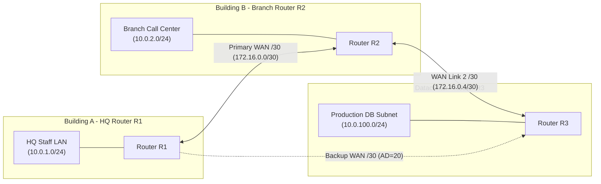

import { Callout } from 'fumadocs-ui/components/callout';
import { Steps, Step } from 'fumadocs-ui/components/steps';

Welcome to the Stage 3 Capstone: **Enterprise Multi-Subnet Static Routing Engine**.

In this milestone project, you will design a Variable Length Subnet Masking (VLSM) addressing scheme for **TravelBuddy's** multi-site infrastructure, configure Cisco routers with static routes and backup floating routes, and verify hop-by-hop packet forwarding.

---

## Lab Architecture Topology



---

## Engineering Tasks

<Steps>
<Step>
### Task 1: VLSM Subnet Plan
From the base network allocation `10.0.0.0/16`, assign the most efficient subnets without wasting host space:
* **HQ Staff Subnet:** 200 hosts needed $\rightarrow$ `/24` ($254$ usable hosts, `10.0.1.0/24`).
* **Branch Subnet:** 120 hosts needed $\rightarrow$ `/25` ($126$ usable hosts, `10.0.2.0/25`).
* **Datacenter Subnet:** 50 hosts needed $\rightarrow$ `/26` ($62$ usable hosts, `10.0.100.0/26`).
* **Point-to-Point WAN Links:** 2 hosts needed per link $\rightarrow$ `/30` ($2$ usable hosts, `172.16.0.0/30` and `172.16.0.4/30`).
</Step>

<Step>
### Task 2: Configure Router Interfaces & IP Addresses
On Router R1 (HQ):

```cisco
R1(config)# interface GigabitEthernet0/0
R1(config-if)# description LAN connection to HQ Staff
R1(config-if)# ip address 10.0.1.1 255.255.255.0
R1(config-if)# no shutdown
R1(config-if)# exit

R1(config)# interface Serial0/1/0
R1(config-if)# description Primary WAN Link to R2
R1(config-if)# ip address 172.16.0.1 255.255.255.252
R1(config-if)# no shutdown
R1(config-if)# exit
```
</Step>

<Step>
### Task 3: Static Routing & Floating Backup Route
Configure static routing on R1 to reach the Datacenter subnet `10.0.100.0/24` via R2 (`172.16.0.2`), with a floating static route via R3 (`172.16.0.6`) with Administrative Distance 20:

```cisco
! Primary Route via R2 (Default AD = 1)
R1(config)# ip route 10.0.100.0 255.255.255.0 172.16.0.2

! Floating Backup Route via R3 (AD = 20)
R1(config)# ip route 10.0.100.0 255.255.255.0 172.16.0.6 20

! Default gateway route out to the public Internet
R1(config)# ip route 0.0.0.0 0.0.0.0 203.0.113.1
```
</Step>
</Steps>

---

## Verification & Routing Table Inspection

Run `show ip route` to confirm that the Longest Prefix Match (LPM) logic prioritizes specific subnets over the default route:

```cisco
R1# show ip route
Gateway of last resort is 203.0.113.1 to network 0.0.0.0

S*    0.0.0.0/0 [1/0] via 203.0.113.1
      10.0.0.0/8 is variably subnetted, 3 subnets, 2 masks
C        10.0.1.0/24 is directly connected, GigabitEthernet0/0
L        10.0.1.1/32 is directly connected, GigabitEthernet0/0
S        10.0.100.0/24 [1/0] via 172.16.0.2
      172.16.0.0/16 is variably subnetted, 2 subnets, 2 masks
C        172.16.0.0/30 is directly connected, Serial0/1/0
```

Packet forwarding to `10.0.100.42` hits the `/24` static route, decrements TTL by 1, rewrites the Layer 2 destination MAC to R2's interface, and forwards cleanly out `Serial0/1/0`.
