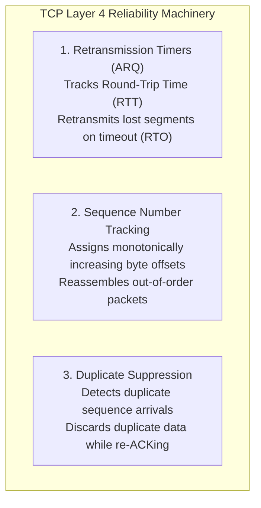
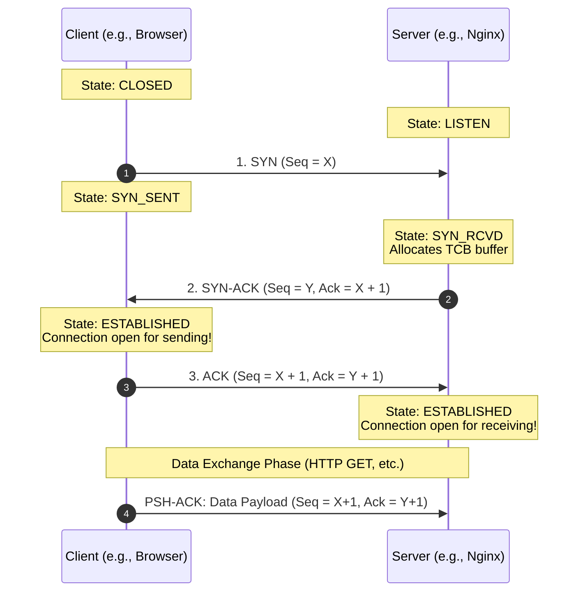
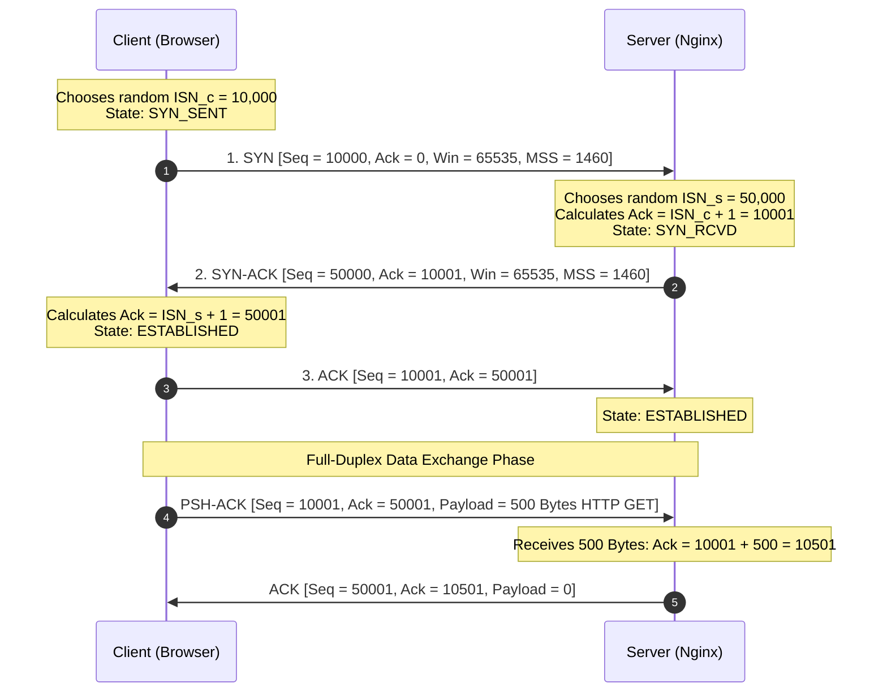
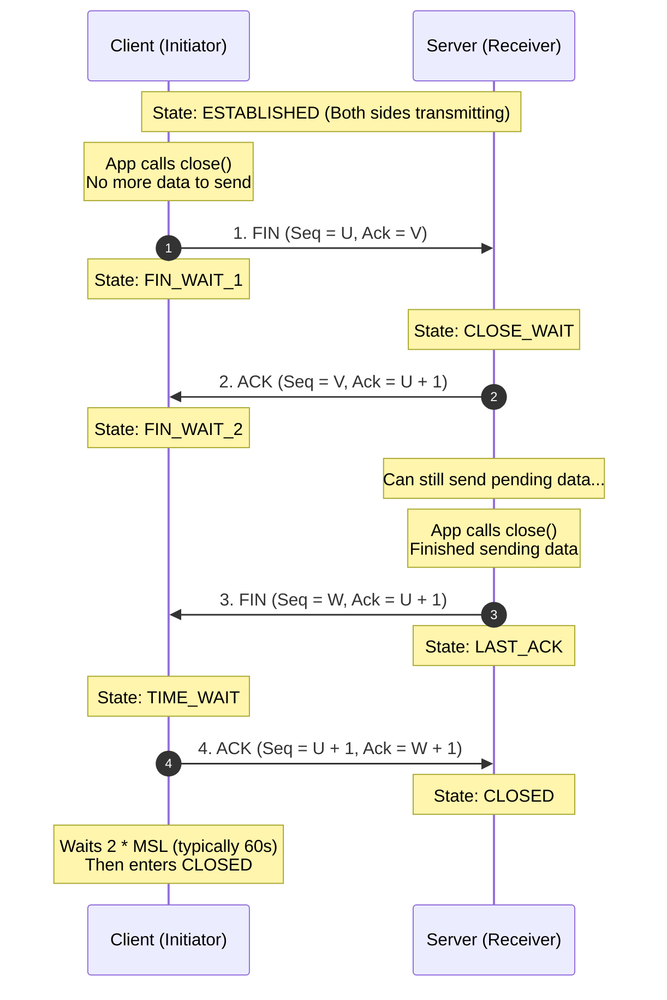

# Transport Layer: TCP vs. UDP, Port Multiplexing & Handshakes

The Internet Protocol (IP) at Layer 3 solves a massive engineering challenge: it moves a packet of data across millions of interconnected routers from one physical computer host to another across the globe.

However, once that packet arrives at the destination computer's Network Interface Card (NIC), IP has completed its duty. A modern computer does not run just one program. It runs hundreds of concurrent network programs: a web browser, a streaming music client, an SSH daemon, a PostgreSQL database, an email client, and background system updates.

How does the operating system kernel know which program should receive which incoming packet? And how do two programs coordinate ordered, reliable delivery over an inherently unreliable, packet-dropping network?

These questions are answered by Layer 4: the **Transport Layer**.

---

## 1. First Principles: Why Do We Need Ports?

Imagine a large office building with a single street address: `100 Enterprise Way`.

```
              Layer 3 (IP Address)                      Layer 4 (Port Numbers)
       Gets the letter to the building:            Gets the memo to the desk:
       
         ┌─────────────────────────┐               ┌───────────────────────────────┐
         │                         │               │ Office 80: Web Server (Nginx) │
         │  100 Enterprise Way     │  ───────────► │ Office 443: HTTPS Daemon      │
         │  (203.0.113.10)         │               │ Office 22: SSH Remote Shell   │
         │                         │               │ Office 5432: PostgreSQL DB    │
         └─────────────────────────┘               └───────────────────────────────┘
```

If a courier arrives at the front desk with a letter addressed only to `100 Enterprise Way` without an office number or employee name, the receptionist has no idea who should receive it.

- The **IP address** identifies the **building** (the host computer).
- The **Port number** identifies the **specific office room** (the running software process socket).

### The Socket 5-Tuple

In networking, an operating system identifies every unique network connection using a **5-Tuple**:

$$\text{Connection} = (\text{Source IP}, \text{Source Port}, \text{Destination IP}, \text{Destination Port}, \text{Protocol})$$

Because a connection is defined by the full tuple, a single web server on port `443` can easily maintain 50,000 simultaneous connections to 50,000 different remote client IPs and client ephemeral ports simultaneously.

---

## 2. Port Number Ranges & Categories

A port number is a **16-bit unsigned integer**, yielding $2^{16} = 65,536$ total possible ports (ranging from $0$ to $65,535$). The Internet Assigned Numbers Authority (IANA) divides these into three distinct operational bands:

| Range | Name | Description & Privileges | Common Examples |
| :--- | :--- | :--- | :--- |
| **0 – 1023** | **Well-Known Ports** (System Ports) | Reserved for standardized, core internet infrastructure services. On POSIX systems (Linux/macOS), binding to these ports requires superuser (`root`) privileges to prevent malicious local users from impersonating core services. | `20/21` (FTP)<br/>`22` (SSH)<br/>`25` (SMTP)<br/>`53` (DNS)<br/>`80` (HTTP)<br/>`443` (HTTPS) |
| **1024 – 49151** | **Registered Ports** (User Ports) | Listed by IANA for specific vendor proprietary or open-source application software. Any standard unprivileged user process can bind to them. | `3306` (MySQL)<br/>`5432` (PostgreSQL)<br/>`6379` (Redis)<br/>`8080` (HTTP-Alt / Dev)<br/>`27017` (MongoDB) |
| **49152 – 65535** | **Dynamic / Ephemeral Ports** (Private Ports) | Allocated automatically by the client operating system kernel when initiating an outbound connection. Temporarily assigned for the lifespan of that specific socket dialog and returned to the pool upon termination. | Client side of any outbound browser or API request (e.g. `51240`) |

---

## 3. Interactive Lab: Port Inspector

Use the interactive simulator below to observe how incoming Layer 4 packets are matched against the kernel's listening socket table and dispatched to their respective application daemons:

<PortInspector />

---

## 4. The Great Architectural Trade-off: TCP vs. UDP

When designing an application, software engineers must make a fundamental transport decision: **Do I care more about guaranteed reliability or minimal latency?**

```
                     Layer 4 Transport Protocols
                                 │
         ┌───────────────────────┴───────────────────────┐
         ▼                                               ▼
        TCP                                             UDP
 (Transmission Control Protocol)               (User Datagram Protocol)
  • Reliable & Acknowledged                     • Unreliable ("Fire and Forget")
  • In-Order Stream Delivery                    • Unordered Independent Datagrams
  • Connection-Oriented (Handshake)             • Connectionless (No Handshake)
  • Congestion & Flow Control                   • Zero Transmission State
  • Heavyweight (20-60B Header)                 • Ultralightweight (8B Header)
  • Ideal for: Web, DB, Files, SSH              • Ideal for: VoIP, Gaming, DNS, Video
```

### Head-to-Head Comparison

| Attribute | TCP (RFC 793) | UDP (RFC 768) |
| :--- | :--- | :--- |
| **Connection State** | **Connection-Oriented:** Requires 3-way handshake to establish state before sending data. | **Connectionless:** No setup. Packets are fired into the network immediately. |
| **Delivery Guarantee** | **Guaranteed:** Every packet is acknowledged. Dropped packets are automatically retransmitted. | **Best Effort:** No ACKs. If a router drops a packet, it is permanently gone. |
| **Ordering** | **Strictly Ordered:** Sequence numbers ensure packets arriving out of order are reassembled chronologically. | **Unordered:** Datagrams arrive in whatever order the physical network routes them. |
| **Data Stream Format** | **Continuous Byte Stream:** No message boundaries. Application must frame its own records. | **Discrete Datagrams:** Preserves exact message packet boundaries. |
| **Header Overhead** | **20 to 60 Bytes** (Heavy metadata tracking). | **8 Bytes** (Minimalist). |
| **Speed & Latency** | Higher latency (handshake delay + ACK round-trips + head-of-line blocking). | Minimum possible network latency. Zero handshake RTT penalty. |
| **Traffic Regulation** | Flow Control (Sliding Window) & Congestion Control (AIMD/Cubic/BBR). | None. Transmits as fast as the application feeds the socket buffer. |
| **Primary Use Cases** | Web pages (`HTTP/1.1`, `HTTP/2`), REST APIs, SSH, TLS, SQL Databases, File Transfers. | Real-time gaming, VoIP voice calls, Zoom video streaming, DNS lookups, DHCP, `QUIC` (`HTTP/3`). |

### The Real-Time Dilemma: Why Streaming Video & Voice Choose UDP

Why does a Discord voice call or a multiplayer first-person shooter use UDP rather than TCP?

Consider an online multiplayer game running at 60 frames per second ($16.6\text{ ms}$ per frame). If a network glitch drops a packet containing the enemy player's coordinates at frame 42:
- If running over **TCP**: The client receiver detects a hole in sequence numbers. It halts all subsequent processing (**Head-of-Line Blocking**), transmits a retransmission request, waits one full network Round Trip Time (say, $80\text{ ms}$), and receives the missing packet. By the time frame 42 arrives, the game has progressed to frame 47! Showing where the enemy was $80\text{ ms}$ ago creates unplayable stutter and rubber-banding.
- If running over **UDP**: The client simply ignores the missing frame 42 and immediately renders frame 43 when it arrives. In live audio and interactive video, **stale data is worthless data**.

---

## 5. Packet Header Dissection: UDP vs. TCP

Examining the binary structure of Layer 4 packet headers reveals why TCP and UDP behave so differently under load and latency constraints.


### The UDP Header (8 Bytes Total)

The UDP header (RFC 768) is one of the most minimalist, elegant designs in computing history. It contains exactly four 16-bit fields, requiring **precisely 8 bytes of total overhead**:

```
  0                   1                   2                   3
  0 1 2 3 4 5 6 7 8 9 0 1 2 3 4 5 6 7 8 9 0 1 2 3 4 5 6 7 8 9 0 1
 +-+-+-+-+-+-+-+-+-+-+-+-+-+-+-+-+-+-+-+-+-+-+-+-+-+-+-+-+-+-+-+-+
 |   Source Port (16 bits / 2B)  | Destination Port (16 bits / 2B)
 +-+-+-+-+-+-+-+-+-+-+-+-+-+-+-+-+-+-+-+-+-+-+-+-+-+-+-+-+-+-+-+-+
 |      Length (16 bits / 2B)    |    Checksum (16 bits / 2B)    |
 +-+-+-+-+-+-+-+-+-+-+-+-+-+-+-+-+-+-+-+-+-+-+-+-+-+-+-+-+-+-+-+-+
 |               User Application Payload (Data)...              |
```

#### Field Arithmetic & Maximum Payload Size:
1. **Source Port (16 bits / 2 bytes):** The ephemeral or listening port on the sending client or server.
2. **Destination Port (16 bits / 2 bytes):** The destination process listening port.
3. **Length (16 bits / 2 bytes):** The total length of the UDP header plus the payload in bytes (Minimum value is `8`).
   - Because the length field is a 16-bit unsigned integer, the theoretical maximum size of a complete UDP datagram is $2^{16} - 1 = \mathbf{65,535\text{ bytes}}$.
   - Subtracting the 8-byte UDP header yields:
     $$\text{Max UDP Payload} = 65,535 - 8 = \mathbf{65,527\text{ bytes}}$$
   - *(Note: In practical production networks, any datagram larger than the Ethernet MTU of 1,500 bytes triggers IP-level fragmentation, so UDP applications like DNS and WebRTC restrict packet sizes to ~1,200–1,400 bytes).*
4. **Checksum (16 bits / 2 bytes):** Error detection field.

#### UDP Checksum Calculation & Error Detection
A pervasive networking myth is that *"UDP does no error checking at all."* That is false. UDP does not *retransmit* or *order* data, but it does detect bit-level corruption!

1. **The Pseudo-Header Checksum:** The UDP checksum is calculated by taking the 16-bit one's complement sum of:
   - An **IP Pseudo-Header** (Source IP, Destination IP, Protocol number `17`, and UDP Length).
   - The 8-byte UDP Header.
   - The entire Application Payload.
2. **Why include the IP Pseudo-Header?** This proves Layer 3 integrity! If an intermediate faulty router flips a bit in the Destination IP address and delivers the datagram to the wrong computer host, the receiver's computed checksum will fail.
3. **What happens on Checksum Failure?** The receiving operating system **silently discards the corrupted datagram**. No negative acknowledgment (NACK) is sent, and no retransmission is attempted. In live voice and video, dropping a corrupted frame is far preferable to crashing the application decoder!

---

### Transport Layer Reliability Architecture

To understand how TCP builds bulletproof reliability atop the lossy physical world, compare the three reliability pillars missing in UDP:



1. **Retransmission Timers & Automatic Repeat Request (ARQ):** TCP continuously measures the network Round Trip Time (RTT). It calculates a dynamic **Retransmission Timeout (RTO)** using Jacobson's algorithm ($RTO = SRTT + 4 	imes RTTVAR$). If an ACK is not received before the timer fires, TCP assumes packet loss and automatically retransmits the data.
2. **Monotonic Byte Sequence Numbers:** Every byte transferred is numbered. Even if the underlying IP network routes packets across different optical fiber paths causing them to arrive scrambled ($P_3, P_1, P_2$), the receiver buffers them and delivers a continuous, perfectly ordered byte stream to the application.
3. **Duplicate Packet Suppression:** If an ACK is delayed in transit, the sender will retransmit. When the receiver sees a packet containing sequence numbers it has already accepted, it safely absorbs the ACK, acknowledges it again to satisfy the sender, and suppresses the duplicate bytes so the application layer never receives duplicated data.

---

### The TCP Header (20 to 60 Bytes)

TCP requires extensive tracking state to guarantee ordered, lossless delivery:

```
  0                   1                   2                   3
  0 1 2 3 4 5 6 7 8 9 0 1 2 3 4 5 6 7 8 9 0 1 2 3 4 5 6 7 8 9 0 1
 +-+-+-+-+-+-+-+-+-+-+-+-+-+-+-+-+-+-+-+-+-+-+-+-+-+-+-+-+-+-+-+-+
 |          Source Port          |       Destination Port        |
 +-+-+-+-+-+-+-+-+-+-+-+-+-+-+-+-+-+-+-+-+-+-+-+-+-+-+-+-+-+-+-+-+
 |                        Sequence Number                        |
 +-+-+-+-+-+-+-+-+-+-+-+-+-+-+-+-+-+-+-+-+-+-+-+-+-+-+-+-+-+-+-+-+
 |                    Acknowledgment Number                      |
 +-+-+-+-+-+-+-+-+-+-+-+-+-+-+-+-+-+-+-+-+-+-+-+-+-+-+-+-+-+-+-+-+
 |  Data |           |U|A|P|R|S|F|                               |
 | Offset| Reserved  |R|C|S|S|Y|I|            Window Size        |
 |(4 bit)|           |G|K|H|T|N|N|                               |
 +-+-+-+-+-+-+-+-+-+-+-+-+-+-+-+-+-+-+-+-+-+-+-+-+-+-+-+-+-+-+-+-+
 |           Checksum            |         Urgent Pointer        |
 +-+-+-+-+-+-+-+-+-+-+-+-+-+-+-+-+-+-+-+-+-+-+-+-+-+-+-+-+-+-+-+-+
 |                    Options (0 - 40 bytes)                     |
 +-+-+-+-+-+-+-+-+-+-+-+-+-+-+-+-+-+-+-+-+-+-+-+-+-+-+-+-+-+-+-+-+
 |                            Payload...                         |
```

### Critical Fields Explained

- **Sequence Number (32 bits):** Tracks the byte position of the data in the overall stream. If a segment starts with sequence number $10,001$ and contains $1,000$ bytes of payload, the next segment will have sequence number $11,001$.
- **Acknowledgment Number (32 bits):** If the `ACK` flag is set, this tells the sender: *"I have received all bytes up to byte $N-1$. I am expecting byte $N$ next."* This is a **cumulative acknowledgment**.
- **Data Offset (4 bits):** The number of 32-bit 4-byte words in the TCP header. Specifies where the header ends and payload data begins (minimum value is $5 \times 4 = 20\text{ bytes}$).
- **Flags (Control Bits):**
  - **SYN (Synchronize):** Initiates a connection, synchronizing Initial Sequence Numbers.
  - **ACK (Acknowledge):** Confirms receipt of packets and validates the acknowledgment field.
  - **FIN (Finish):** Gracefully requests connection termination from the sender side.
  - **RST (Reset):** Abruptly aborts a connection due to an unrecoverable error or unopen port.
  - **PSH (Push):** Instructs the receiver to deliver buffered data to the application immediately rather than waiting for buffers to fill.
  - **URG (Urgent):** Indicates that data pointed to by the Urgent Pointer should be prioritized.
- **Window Size (16 bits):** The number of bytes the receiver is currently willing to accept in its kernel buffer (the cornerstone of TCP flow control).

---

## 6. The TCP 3-Way Handshake (Connection Establishment)

Before a single byte of application data (such as an HTTP GET request) can be sent over TCP, the client and server must agree on connection parameters and synchronize their initial sequence numbers.


### Why Three Packets? (The Two Generals' Problem)

Why can't a connection be established with two packets?
1. **Packet 1 (Client $\rightarrow$ Server):** Verifies that the client can transmit and the server can receive.
2. **Packet 2 (Server $\rightarrow$ Client):** Verifies that the server can transmit and the client can receive.
3. **Packet 3 (Client $\rightarrow$ Server):** The server must know that the client received its acknowledgment. Without Packet 3, the server would have to allocate memory and resources without knowing whether its response survived transit.



### Handshake Step-by-Step: Sequence & ACK Mathematics

TCP connections are **full-duplex**: two independent, simultaneous conversations running in opposite directions on the same wire. Establishing this dual conversation requires synchronizing sequence numbers in both directions:



1. **Step 1 — SYN (Client to Server):**
   - The client selects a random 32-bit **Initial Sequence Number (ISN)**, denoted as $X$ (e.g. `10,000`).
   - Sends a segment with the `SYN` flag set: `Seq = X`, `Ack = 0`.
   - *Mathematical Note:* Even though a SYN segment carries 0 bytes of application payload, **the SYN flag consumes exactly 1 sequence number** (known as a "phantom byte") to guarantee reliable delivery.
   - Client enters `SYN_SENT` state.

2. **Step 2 — SYN-ACK (Server to Client):**
   - The server receives the SYN. It selects its own random Initial Sequence Number, denoted as $Y$ (e.g. `50,000`).
   - It acknowledges the client's SYN by calculating:
     $$\mathbf{\text{Ack}} = \text{Client's Seq} + 1 = X + 1 \implies \mathbf{10,001}$$
   - Sends a segment with both `SYN` and `ACK` flags set: `Seq = Y`, `Ack = X + 1`.
   - Like the client's SYN, the server's SYN consumes 1 phantom byte.
   - Server enters `SYN_RCVD` state.

3. **Step 3 — ACK (Client to Server):**
   - The client receives the SYN-ACK.
   - It confirms receipt of the server's SYN by acknowledging:
     $$\mathbf{\text{Ack}} = \text{Server's Seq} + 1 = Y + 1 \implies \mathbf{50,001}$$
   - Sends an ACK segment: `Seq = X + 1`, `Ack = Y + 1`.
   - Both endpoints transition to `ESTABLISHED` state. Full-duplex communication is now live!
   - *Optimization:* The client can piggyback initial application data (such as the HTTP GET request) directly inside this third packet!

4. **Full-Duplex Data Exchange Math:**
   - When the client transmits a 500-byte HTTP GET payload, its segment starts at `Seq = 10,001` and spans bytes `10,001` to `10,500`.
   - The server acknowledges receipt by replying with:
     $$\text{Next Expected Byte} = 10,001 + 500 = \mathbf{10,501}$$
   - Meanwhile, the server's outbound HTTP 200 response streams in reverse starting at `Seq = 50,001`, acknowledged independently by the client!

> [!NOTE]
> **Why are Initial Sequence Numbers (ISNs) Cryptographically Randomized?**  
> In early BSD Unix networking stacks, ISNs incremented by a predictable fixed constant every second. In 1995, security researcher Kevin Mitnick demonstrated the infamous **TCP Sequence Prediction Attack** (IP Spoofing): by sending a flood of packets, an attacker could predict the exact next ISN generated by a server, establish a blind spoofed session, and inject arbitrary commands without ever seeing the server's replies! Modern operating systems generate ISNs using cryptographic hash functions (such as SipHash or SHA-256) seeded with boot-time secrets, local/remote IPs, and ports.

---

## 7. The TCP 4-Way Connection Teardown (Graceful Close)

TCP connections are **full-duplex**: two independent, unidirectional streams of data flowing in opposite directions. Because either side can finish transmitting while the other still has data to send (**Half-Close**), terminating a connection requires a 4-way exchange.



### Why Does the TIME_WAIT State Exist?

When the initiator sends the final ACK (Packet 4), it does *not* immediately free the socket and close. It enters the `TIME_WAIT` state, holding the socket for **$2 \times \text{MSL}$** (Maximum Segment Lifetime, typically 60 to 120 seconds).

Why hold system resources in `TIME_WAIT`?
1. **To reliably close the connection:** If the final `ACK` is lost in transit, Server B will time out and retransmit its `FIN` packet. Because Client A is in `TIME_WAIT`, it receives the retransmitted FIN and can resend the ACK. If Client A had closed immediately, it would have responded with an aggressive `RST` (Reset) packet, making Server B believe an error occurred.
2. **To allow old duplicate packets to expire:** Routers in the Internet can delay packets for tens of seconds. If Client A closed instantly and immediately opened a brand-new connection using the exact same local port number to the same destination server, lingering duplicate packets from the first connection could arrive and corrupt the new application stream. Waiting $2 \times \text{MSL}$ guarantees that all orphaned packets have expired from the network.

---

## 8. Flow Control vs. Congestion Control

A common point of confusion is the distinction between flow control and congestion control:

```
  Flow Control:       Sender  ════════════════════════════════►  Receiver Buffer
                      (Prevents sender from overflowing the receiver's memory)

  Congestion Control: Sender  ════► [ Router Queue ] ════► Router ════►  Receiver
                      (Prevents sender from collapsing the intermediate network)
```

### 1. Flow Control: The Sliding Window

Flow control is an agreement between the sender and the receiver. The receiver informs the sender how much spare capacity remains in its operating system receive buffer using the **Window Size** field in the TCP header:

$$\text{Window Size} = \text{Buffer Size} - \text{Bytes Received but Not Yet Read by Application}$$

```
  Receiver Buffer (Sliding Window):
  ┌───────────────────┬───────────────────────────────────┬───────────────────┐
  │   Acknowledged    │     Received, Buffered in Kernel   │    Free Space     │
  │ (Read by App)     │     (Awaiting app read() call)    │  (Advertised Win) │
  └───────────────────┴───────────────────────────────────┴───────────────────┘
                                                           ◄─── Window Size ──►
```

- If the application is slow to read bytes from the socket, the receiver buffer fills up.
- The receiver sends an ACK with a shrinking `Window Size`.
- If the buffer becomes completely full, the receiver advertises a **Zero Window** (`Win = 0`). The sender must immediately halt transmission!
- **Zero Window Probing:** While paused, the sender periodically transmits a 1-byte probe packet to check if the receiver has freed up buffer memory.

---

### 2. Congestion Control: Protecting the Shared Internet

Even if the receiving server has a 10-gigabyte buffer, the intermediate routers between sender and receiver may have small buffers and limited bandwidth. If every host dumped data at maximum speed, router queues would overflow, causing massive packet drops and **congestion collapse**.

TCP manages this via a dynamically calculated **Congestion Window (`cwnd`)**:

$$\text{Effective Window} = \min(\text{rwnd}, \text{cwnd})$$

The sender can never transmit more unacknowledged bytes than the minimum of what the receiver can accept (`rwnd`) and what the network path can sustain (`cwnd`).

```
  TCP Reno / NewReno Congestion Control Phases:
  
  cwnd (Segments)
    ▲
 32 ┼                       /│ (Triple Duplicate ACK -> Cut in half!)
    │                      / │
 16 ┼──────ssthresh───────/  │──────────ssthresh = cwnd/2
    │                   /│   └───────────────► Additive Increase (+1/RTT)
    │                  / │
  8 ┼                 /  │
  4 ┼               /    │
  2 ┼             /      │
  1 ┼──Slow Start────────┴──────────────────────────────────────────► Time
```

1. **Slow Start:**
   - Starts cautiously with a small window (e.g., $10\text{ MSS}$).
   - For every ACK received, `cwnd` increases by $1\text{ MSS}$. This results in **exponential growth** ($1 \rightarrow 2 \rightarrow 4 \rightarrow 8 \rightarrow 16 \dots$) per Round Trip Time (RTT).
2. **Congestion Avoidance:**
   - When `cwnd` reaches the Slow Start Threshold (`ssthresh`), exponential growth stops.
   - It switches to **Additive Increase**: increases `cwnd` by only $1\text{ MSS}$ per complete RTT (linear growth) to probe for bottleneck capacity cautiously.
3. **Multiplicative Decrease (AIMD - Additive Increase / Multiplicative Decrease):**
   - If packet loss occurs (detected via 3 duplicate ACKs), `ssthresh` is set to $\frac{\text{cwnd}}{2}$, and `cwnd` is cut in half.
   - If a retransmission timeout (RTO) occurs (catastrophic drop), `cwnd` resets back to $1\text{ MSS}$ and enters Slow Start again.

### Modern Congestion Algorithms: Cubic vs. BBR

- **TCP CUBIC (Linux default):** Replaces linear growth with a cubic mathematical function. It ramps up bandwidth quickly, flattens out near the previous saturation point, and stabilizes before cautiously probing higher.
- **BBR (Bottleneck Bandwidth and RTT, Google):** Traditional algorithms assume packet drop equals network congestion. On high-speed fiber or Wi-Fi, random packet corruption drops packets without buffer bloat. BBR ignores packet drops and instead measures the actual **maximum delivery rate** and **minimum round-trip propagation time**, maintaining high throughput without filling router buffers.

---

## 9. Hands-On Lab: Capturing & Dissecting Packets with `tcpdump`

Nothing solidifies Layer 4 protocols better than inspecting live packets serialized across your network card. The industry-standard tool for Linux/macOS packet capture is `tcpdump`.

Run the following command in your terminal to capture exactly 5 TCP packets:

```bash
# Capture 5 TCP packets with numeric ports (-nn), verbose decoding (-vv)
sudo tcpdump -i any -nnvv -c 5 'tcp port 443'
```

### Dissecting a Captured TCP Handshake Packet:

```text
22:15:30.401824 IP (tos 0x0, ttl 64, id 38210, offset 0, flags [DF], proto TCP (6), length 60)
    192.168.1.101.52410 > 142.250.190.46.443: Flags [S], cksum 0x7a31 (correct), 
    seq 2849182301, win 65535, options [mss 1460,sackOK,TS val 3918201 ecr 0,nop,wscale 7], length 0
```

Let's dissect each field from this live capture:

| Field in `tcpdump` | Technical Meaning |
| :--- | :--- |
| `22:15:30.401824` | Precise microsecond timestamp of packet arrival at the network interface. |
| `IP (tos 0x0, ttl 64...)` | Layer 3 IPv4 header metadata: Default QoS (`tos 0x0`), initial Linux TTL (`64`), Don't Fragment flag (`[DF]`), and Layer 4 protocol code (`proto TCP (6)`). |
| `192.168.1.101.52410` | **Source IP & Ephemeral Port:** The client laptop on private IP `192.168.1.101` using kernel dynamic port `52410`. |
| `142.250.190.46.443` | **Destination IP & Well-Known Port:** Google web server (`142.250.190.46`) listening on HTTPS standard port `443`. |
| `Flags [S]` | **TCP Control Flags:** `[S]` indicates the **SYN** flag is set. (Other common tcpdump flags: `[S.]` = SYN-ACK, `[.]` = ACK, `[P.]` = PSH-ACK, `[F.]` = FIN-ACK, `[R]` = RST). |
| `seq 2849182301` | **Randomized ISN:** The client's cryptographically randomized 32-bit Initial Sequence Number. |
| `win 65535` | **Advertised Receive Window:** Client receive buffer space available for immediate incoming data. |
| `options [mss 1460...]` | **TCP Options Negotiated:**<br/>• `mss 1460`: Maximum Segment Size (Ethernet MTU 1500 - 20B IP - 20B TCP = 1460 bytes payload).<br/>• `sackOK`: Selective Acknowledgment enabled.<br/>• `wscale 7`: Window scaling factor ($2^7 = 128	imes$ window buffer multiplier). |
| `length 0` | **Payload Length:** The SYN packet carries 0 bytes of application data. |

---

## 10. Engineering Summary & Quick Recall

By combining the 3-way handshake, sequence-tracked byte streams, sliding window flow control, and adaptive congestion algorithms, TCP creates an illusion of a bulletproof, ordered communication pipeline atop an inherently chaotic, lossy network.
