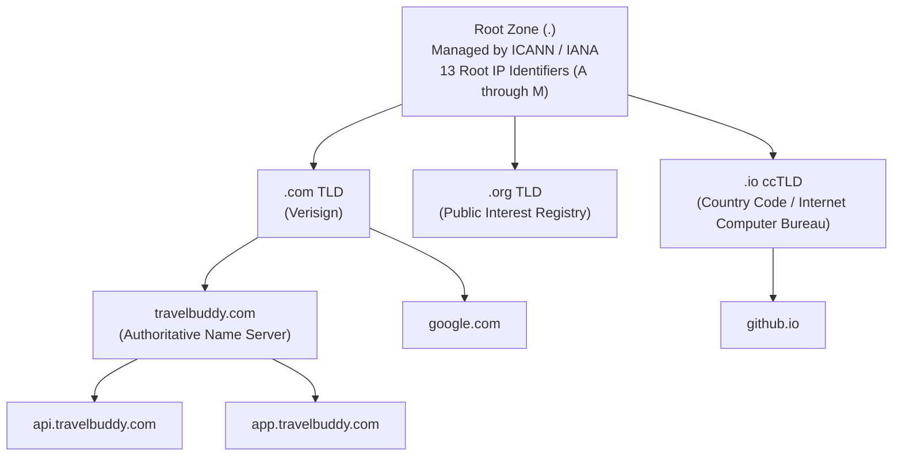
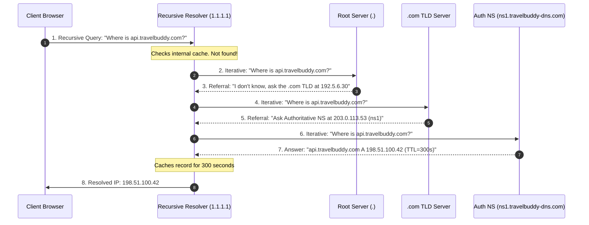
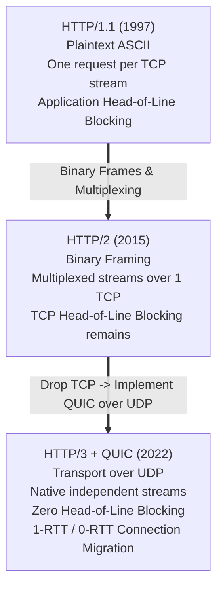
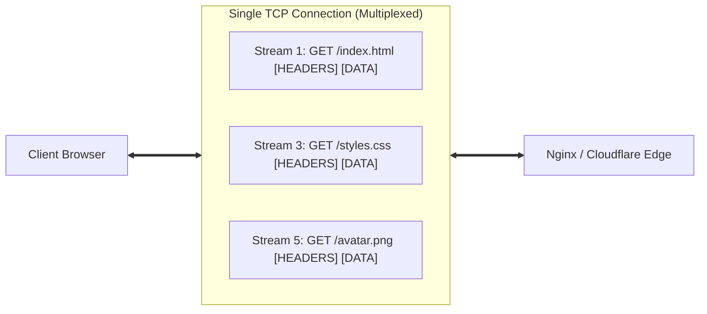
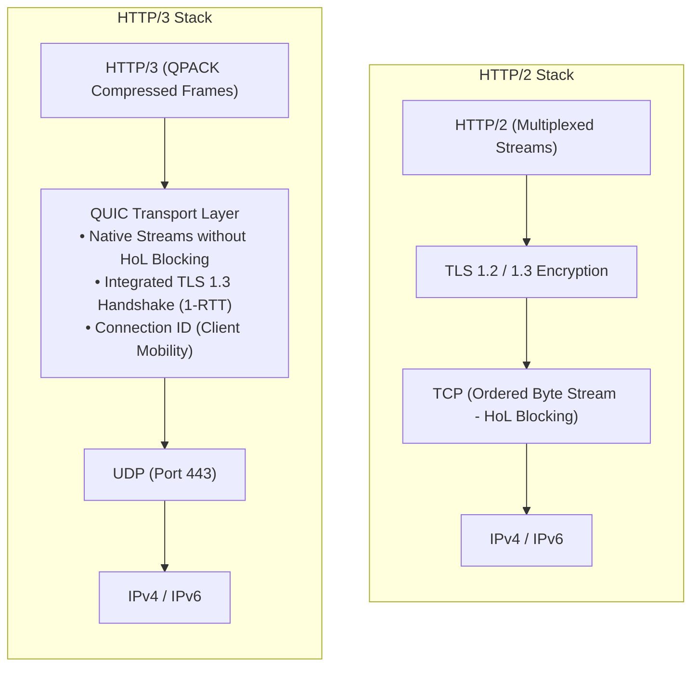
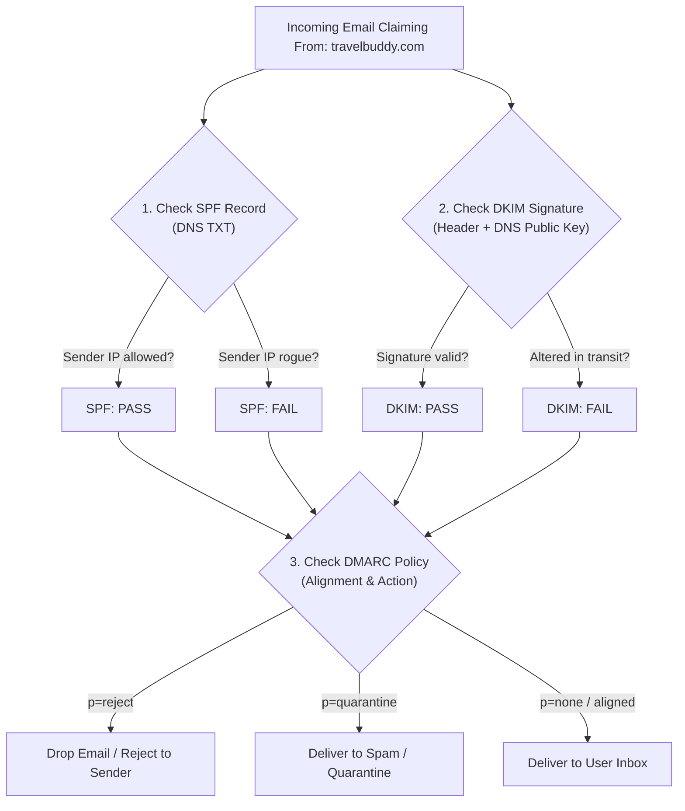

import { Callout } from 'fumadocs-ui/components/callout';
import { FirewallSimulator } from '@/components/computer-networking/networking-simulators';

# Application Layer: DNS Resolution, HTTP/1.1 to HTTP/3 QUIC & Email Protocols

When a traveler opens their mobile browser and taps `https://travelbuddy.com/book-flight`, they initiate one of the most sophisticated distributed computing choreographies ever created.

In under 150 milliseconds:
1. A recursive query navigates the global **Domain Name System (DNS)** tree from the root name servers to an authoritative edge zone.
2. A cryptographic transport channel negotiates encryption and multiplexes resource streams over **HTTP/3 and QUIC**.
3. A stateful session cookie authenticates the traveler's shopping cart across a distributed API cluster.
4. An automated reservation engine triggers transactional confirmation emails through **SMTP**, verified by **SPF, DKIM, and DMARC**.

In this chapter, we unpack the application protocols that power the modern web from first principles.

---

## 1. The Domain Name System: The Internet's Phonebook

IP addresses (`142.250.190.46` or `2607:f8b0:4005:805::200e`) are optimized for router silicon. Human brains, however, remember names like `travelbuddy.com`. 

The **Domain Name System (DNS)** is a globally distributed, hierarchical, fault-tolerant database that translates human-readable hostnames into machine-routable IP addresses (and vice versa).


### The Inverted Tree Structure

DNS is organized as an inverted hierarchical tree starting from the **Root Zone (`.`)**:



### The Four Actors in Resolution

1. **DNS Stub Resolver:** A lightweight library embedded inside the client's operating system (e.g. `getaddrinfo` in Linux glibc). It checks the local OS cache and `/etc/hosts`. If the name is missing, it dispatches a query to the configured recursive resolver.
2. **Recursive DNS Resolver (The Detective):** Typically operated by an ISP or a public anycast provider (Cloudflare `1.1.1.1`, Google `8.8.8.8`, Quad9 `9.9.9.9`). It does the heavy lifting: traveling across the world to query root, TLD, and authoritative servers on behalf of the client.
3. **Root Name Servers:** The foundation of the Internet. There are **13 root server IP addresses** (`a.root-servers.net` through `m.root-servers.net`), operated by 12 independent organizations (NASA, Verisign, ICANN, US Army, etc.). Through BGP Anycast, these 13 IPs are broadcast across more than 1,500 physical server clusters worldwide.
4. **TLD Name Servers:** Manage Top-Level Domains. Generic TLDs (gTLDs like `.com`, `.net`, `.org`) and country codes (ccTLDs like `.uk`, `.jp`, `.de`). They know which authoritative name servers host each registered domain.
5. **Authoritative Name Servers (The Source of Truth):** The final authority. Operated by domain registrars or cloud DNS providers (AWS Route 53, Cloudflare, NS1). They hold the actual DNS record database files (zone files) configured by domain owners.

---

## 2. Step-by-Step DNS Resolution Walkthrough

When resolving `api.travelbuddy.com`, the query goes through two distinct querying modes:
- **Recursive Query (Client ➔ Resolver):** The client says: *"Find me the IP address or return an error. Do not make me do the legwork."*
- **Iterative Queries (Resolver ➔ Hierarchy):** The resolver says: *"Do you know the IP?"* The upstream server replies: *"No, but I know the next server down the chain. Go ask them."*



---

## 3. Essential DNS Record Types

A DNS zone file contains individual Resource Records (RRs). Each record type serves a dedicated architectural purpose:

| Record Type | Name | Purpose | Example Value |
| :--- | :--- | :--- | :--- |
| **A** | Address (IPv4) | Maps hostname to a 32-bit IPv4 address | `api.travelbuddy.com. IN A 198.51.100.42` |
| **AAAA** | IPv6 Address | Maps hostname to a 128-bit IPv6 address | `api.travelbuddy.com. IN AAAA 2606:4700::6810` |
| **CNAME** | Canonical Name | Creates an alias pointing to another domain name | `www.travelbuddy.com. IN CNAME travelbuddy.com.` |
| **MX** | Mail Exchange | Directs incoming domain email to mail servers (with priority) | `travelbuddy.com. IN MX 10 mail.travelbuddy.com.` |
| **TXT** | Text Record | Arbitrary machine-readable text (SPF, DKIM, site verification) | `v=spf1 include:_spf.google.com ~all` |
| **NS** | Name Server | Delegates a subzone to authoritative servers | `travelbuddy.com. IN NS ns1.awsdns.com.` |
| **PTR** | Pointer | Reverse DNS: Maps an IP address back to a hostname | `42.100.51.198.in-addr.arpa. IN PTR api.travelbuddy.com.` |
| **SOA** | Start of Authority | Core administrative metadata, serial number, and refresh timers | Serial, Refresh, Retry, Expire, Minimum TTL |
| **SRV** | Service Locator | Defines hostname and port for specific services (SIP, LDAP) | `_sip._tcp.example.com. 3600 IN SRV 10 60 5060 bigbox.com.` |
| **CAA** | Certification Authority | Restricts which Certificate Authorities can issue SSL certs | `travelbuddy.com. IN CAA 0 issue "letsencrypt.org"` |

<Callout type="warn">
### The CNAME at Zone Apex Problem
RFC 1034 states that if a CNAME record exists for a node, **no other record data may exist for that same name**. 

Because the root domain (the zone apex, e.g. `travelbuddy.com`) must have `SOA` and `NS` records, **you cannot legally place a CNAME record on the root domain**!

Modern cloud DNS providers bypass this using proprietary virtual records:
- AWS Route 53: **ALIAS Record**
- Cloudflare: **CNAME Flattening**
- DNS Made Easy: **ANAME Record**

These systems dynamically resolve the target hostname on the server side and synthesize standard `A` records to the client, preserving RFC compliance.
</Callout>

### Inspecting DNS with `dig`

The professional diagnostic tool for DNS is `dig` (Domain Information Groper):

```bash
$ dig api.travelbuddy.com +trace +nodnssec
```

```text
; <<>> DiG 9.18.28 <<>> api.travelbuddy.com +trace
;; global options: +cmd
.                       518400  IN      NS      a.root-servers.net.
.                       518400  IN      NS      b.root-servers.net.
;; Received 525 bytes from 127.0.0.53#53 in 12 ms

com.                    172800  IN      NS      a.gtld-servers.net.
com.                    172800  IN      NS      b.gtld-servers.net.
;; Received 850 bytes from 198.41.0.4#53(a.root-servers.net) in 28 ms

travelbuddy.com.        172800  IN      NS      ns1.travelbuddy-dns.com.
travelbuddy.com.        172800  IN      NS      ns2.travelbuddy-dns.com.
;; Received 320 bytes from 192.5.6.30#53(a.gtld-servers.net) in 19 ms

api.travelbuddy.com.    300     IN      A       198.51.100.42
;; Received 74 bytes from 203.0.113.53#53(ns1.travelbuddy-dns.com) in 14 ms
```

---

## 4. The Evolution of the Web: HTTP/1.1 to HTTP/3 QUIC

Once DNS returns the IP address, the client connects to the web server. Over three decades, the Hypertext Transfer Protocol has undergone three monumental architectural shifts to conquer the latency of physical light traveling through fiber.



### 1. HTTP/1.1: The Text-Based Workhorse

HTTP/1.1 is human-readable ASCII. Headers are plain text terminated by CRLF (`\r\n`), and responses are delivered sequentially over a TCP connection.

```http
GET /api/v1/flights?origin=ORD&dest=LHR HTTP/1.1
Host: api.travelbuddy.com
User-Agent: TravelBuddy-Mobile/4.2
Accept: application/json
Connection: keep-alive
```

#### The Great Limitation: Application-Layer Head-of-Line (HoL) Blocking
In HTTP/1.1, a single TCP connection can only process **one request at a time**. 

If the client requests `main.js`, `style.css`, and `logo.png`, it must send the request for `style.css` only after `main.js` has finished downloading. If `main.js` requires 800ms of server computation, the entire queue is frozen behind it.

Web developers invented ugly engineering hacks to survive HTTP/1.1:
- **Domain Sharding:** Browsers limit concurrency to 6 TCP connections per domain. Engineers created `img1.travelbuddy.com`, `img2.travelbuddy.com` to trick browsers into opening up to 30 parallel TCP connections.
- **Asset Concatenation & CSS Spriting:** Merging 50 icon images into one giant image, or combining 20 JavaScript files into a monolithic bundle.

---

### 2. HTTP/2: Binary Framing & Multiplexing

In 2015, RFC 7540 revolutionized web performance by introducing the **Binary Framing Layer**.

HTTP/2 retained HTTP semantics (methods, headers, status codes), but discarded plaintext formatting. Communication is divided into binary frames:
- **HEADERS Frame:** Carries request/response metadata.
- **DATA Frame:** Carries payload bytes.



#### Key Innovations of HTTP/2:
1. **Full Stream Multiplexing:** Thousands of interleaved request and response frames travel simultaneously across a **single persistent TCP connection**. Fast assets never wait behind slow assets.
2. **HPACK Header Compression:** Eliminates redundant header transmissions. Common headers are indexed in a shared static table (e.g. index 2 = `GET`, index 7 = `:scheme: https`). Dynamic headers are stored in a rolling dictionary, cutting header overhead by up to 85%.
3. **Stream Prioritization:** Browsers can declare that `critical.css` has higher rendering priority than `analytics.js`.

#### The Achilles' Heel of HTTP/2: TCP Head-of-Line Blocking
While HTTP/2 eliminated Head-of-Line blocking at the *application layer*, it made Head-of-Line blocking at the *transport layer* drastically worse!

Because all streams share a **single TCP connection**, TCP guarantees strictly in-order byte delivery. 

```text
TCP Byte Stream: [Stream 1 (CSS)] [Stream 3 (JS - PACKET DROPPED)] [Stream 5 (Image)]
                                            ▲
                                            │
           TCP stops kernel delivery! Stream 1 and Stream 5 are BLOCKED
           waiting for Stream 3 retransmission!
```

If a single Wi-Fi packet drops, the receiving operating system **halts delivery of all multiplexed streams** until TCP retransmits and acknowledges the missing packet. On lossy cellular connections (2% packet loss), HTTP/1.1 multi-socket connections frequently outperform HTTP/2!

---

### 3. HTTP/3 and QUIC: Re-architecting Transport on UDP

To eliminate TCP's architectural constraints without requiring kernel updates across billions of routers worldwide (middleboxes drop unknown transport protocols), the IETF built **QUIC** directly on top of **UDP (User Datagram Protocol)**.

HTTP/3 runs HTTP over QUIC (RFC 9114).



#### Why QUIC and HTTP/3 Outperform Everything:

1. **Independent Loss Recovery (Zero HoL Blocking):** In QUIC, streams are first-class transport citizens. If Packet 4 belonging to Stream B is dropped, the OS continues delivering Stream A and Stream C to the browser uninterrupted! Only Stream B pauses.
2. **1-RTT and 0-RTT Connection Establishment:** In traditional HTTPS (TCP + TLS), establishing a connection requires 2 to 3 round trips before data flows. QUIC combines the transport handshake and TLS 1.3 cryptographic key exchange into **a single round trip (1-RTT)**. For returning visitors, QUIC supports **0-RTT Early Data**, transmitting encrypted HTTP GET requests inside the very first UDP packet!
3. **Connection Migration via Connection IDs:** Traditional TCP connections are bound to a 4-tuple: `(Source IP, Source Port, Dest IP, Dest Port)`. When you walk out of your office and your phone switches from Wi-Fi (`192.168.1.50`) to 5G Cellular (`172.56.21.9`), your IP address changes. In TCP, every ongoing connection instantly terminates with `RST`. In QUIC, connections are identified by a **64-bit Connection ID**. When your IP changes, the phone simply sends the next UDP packet with the same Connection ID; your live flight booking or video stream continues without dropping!

---

## 5. Statelessness, Cookies, and State Management

HTTP is architecturally a **stateless protocol**: the server retains no memory of previous requests. Request #2 from a browser is evaluated in complete isolation from Request #1.

To build interactive applications (shopping carts, user logins, checkout flows), engineers inject state using **HTTP Cookies**.

```mermaid
sequenceDiagram
    participant User as Traveler Browser
    participant API as TravelBuddy Auth API

    User->>API: POST /login { user: "alice", pass: "secret" }
    Note over API: Verifies credentials in Database.<br/>Generates Cryptographic Session Token.
    API-->>User: HTTP 200 OK<br/>Set-Cookie: session_id=x9f7a8b2; Secure; HttpOnly; SameSite=Strict; Path=/; Max-Age=86400
    
    Note over User: Browser securely stores cookie in jar.<br/>Tags with domain travelbuddy.com

    User->>API: GET /account/bookings<br/>Cookie: session_id=x9f7a8b2
    Note over API: Extracts session_id, validates in Redis, loads Alice's flights.
    API-->>User: HTTP 200 OK [{ flight: "UA104", status: "Confirmed" }]
```

### The Security Flags of `Set-Cookie`

Writing production cookies requires strict adherence to security attributes:

```http
Set-Cookie: auth_token=eyJhbGciOi...; Secure; HttpOnly; SameSite=Strict; Domain=travelbuddy.com; Path=/; Max-Age=7200
```

1. **`Secure`:** The browser will **only** transmit this cookie over encrypted HTTPS connections. It will never leak over plaintext HTTP.
2. **`HttpOnly`:** Prevents client-side scripts from accessing the cookie via `document.cookie`. This single flag neutralizes the threat of token theft via **Cross-Site Scripting (XSS)**.
3. **`SameSite`:** Governs whether cookies are transmitted with cross-site requests, providing the primary defense against **Cross-Site Request Forgery (CSRF)**:
   - `SameSite=Strict`: The cookie is never sent with cross-site requests (e.g. clicking an external link to TravelBuddy will not send the session cookie).
   - `SameSite=Lax`: (Modern default) Cookies are held back on cross-site subrequests (images, iframes), but sent when a user navigates to the origin site via top-level link clicks.
   - `SameSite=None`: The cookie is sent on all cross-site requests. Requires the `Secure` flag.

---

## 6. Enterprise Email Architecture: SMTP, IMAP, and Authentication

Email is the oldest federated communication network on the planet. Unlike modern walled gardens (Slack, WhatsApp), anyone can host an email server and exchange messages with Google, Microsoft, or Apple.

### The Email Pipeline

```mermaid
flowchart LR
    MUA_Sender["Sender MUA<br/>(Apple Mail / Outlook)"]
    MSA["Submission Agent<br/>(smtp.travelbuddy.com:587)"]
    MTA_Out["Outbound MTA<br/>(Postfix / SendGrid)"]
    MTA_In["Inbound MX Server<br/>(mx.gmail.com:25)"]
    MDA["Delivery Agent<br/>(Dovecot Storage)"]
    MUA_Recv["Recipient MUA<br/>(Gmail Web / Mobile)"]

    MUA_Sender -->|SMTP + TLS (Port 587)| MSA
    MSA --> MTA_Out
    MTA_Out -->|SMTP Relay (Port 25)| MTA_In
    MTA_In --> MDA
    MDA -->|IMAP / POP3 (Port 993/995)| MUA_Recv
```

### The Three Core Mail Protocols

| Protocol | Full Name | Standard Ports | Architectural Role |
| :--- | :--- | :--- | :--- |
| **SMTP** | Simple Mail Transfer Protocol | **25** (Relay between MTAs)<br/>**587** (Submission from clients with STARTTLS) | **Push Protocol:** Used by clients to send mail and by mail servers to relay mail to destination MX hosts. |
| **IMAP** | Internet Message Access Protocol | **143** (Plaintext)<br/>**993** (IMAPS over TLS) | **Sync Protocol:** Leaves mail on the server. Synchronizes folders, read status, and drafts across multiple devices concurrently. |
| **POP3** | Post Office Protocol v3 | **110** (Plaintext)<br/>**995** (POP3S over TLS) | **Download-and-Delete Protocol:** Downloads messages to local storage and removes them from the server. Legacy. |

---

## 7. Email Security: SPF, DKIM, and DMARC

Because SMTP was created in 1982 with zero authentication, anyone can open a telnet session to an open relay and claim to be `ceo@travelbuddy.com`. Modern mail deliverability depends on a cryptographic triad:



### 1. SPF (Sender Policy Framework)
An authoritative DNS TXT record declaring which IP addresses and mail providers are authorized to send email for this domain:

```text
travelbuddy.com. IN TXT "v=spf1 ip4:198.51.100.10 include:_spf.google.com include:sendgrid.net -all"
```
- `ip4:198.51.100.10`: TravelBuddy's dedicated mail server.
- `include:_spf.google.com`: Authorizes Google Workspace.
- `-all`: **Hard fail**. Reject any email coming from an IP not listed here.

### 2. DKIM (DomainKeys Identified Mail)
Cryptographic authenticity. The sending server hashes the email body and headers, encrypts the hash with its private key, and attaches the resulting signature in a `DKIM-Signature` header.

The receiving mail server fetches the sender's public key from a DNS TXT record at `<selector>._domainkey.travelbuddy.com` and verifies the signature. If a rogue intermediary modified a single character of the email, the signature fails.

### 3. DMARC (Domain-based Message Authentication, Reporting, and Conformance)
DMARC links SPF and DKIM together. It verifies **header alignment** (ensuring the human-visible `From:` address matches the domain evaluated by SPF and DKIM) and tells recipient servers what to do if checks fail:

```text
_dmarc.travelbuddy.com. IN TXT "v=DMARC1; p=reject; rua=mailto:dmarc-reports@travelbuddy.com; pct=100"
```
- `p=reject`: Instructs recipient mail systems (Gmail, Outlook) to outright block fraudulent emails pretending to come from TravelBuddy.
- `rua=...`: Requests daily aggregate XML reports of all servers attempting to send mail on behalf of the domain.

---

## 8. Interactive Laboratory: Inspecting & Securing Ports

Web and mail servers rely on firewalls to expose necessary public services (HTTP/HTTPS, submission) while shielding internal administrative daemons (SSH, Postgres databases) from Internet scanning.

Configure the inbound security rules below and test external packet delivery to observe stateful firewall decisions:

<FirewallSimulator />

---

## 9. Engineering Summary & Quick Recall

- **DNS Hierarchy:** Resolves hostnames via Root (`.`), TLD (`.com`), and Authoritative servers. Recursive resolvers cache records according to TTL.
- **Apex CNAME Restriction:** Root domains (`example.com`) cannot host CNAME records due to RFC 1034 collisions with SOA/NS; cloud providers solve this with ALIAS/ANAME virtualization.
- **HTTP Evolution:** 
  - HTTP/1.1 introduced persistent connections but suffers from application-layer Head-of-Line blocking.
  - HTTP/2 introduced binary multiplexing over single TCP sockets but suffers from TCP-layer Head-of-Line blocking on packet loss.
  - HTTP/3 runs over UDP with QUIC, providing native independent streams, 1-RTT/0-RTT handshakes, and IP-agile Connection IDs.
- **Cookie Security:** Always protect session identifiers with `Secure` (HTTPS only), `HttpOnly` (blocks JavaScript XSS extraction), and `SameSite=Strict/Lax` (blocks CSRF).
- **Email Security Triad:** SPF authorizes IP senders; DKIM cryptographically signs message bodies; DMARC enforces alignment and instructs recipient servers to reject spoofed messages.
