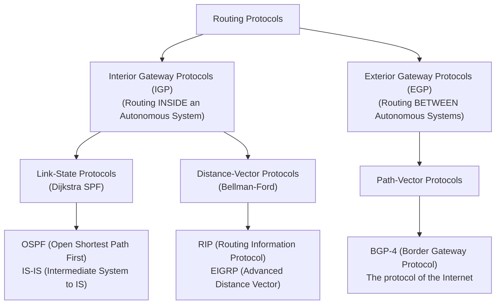
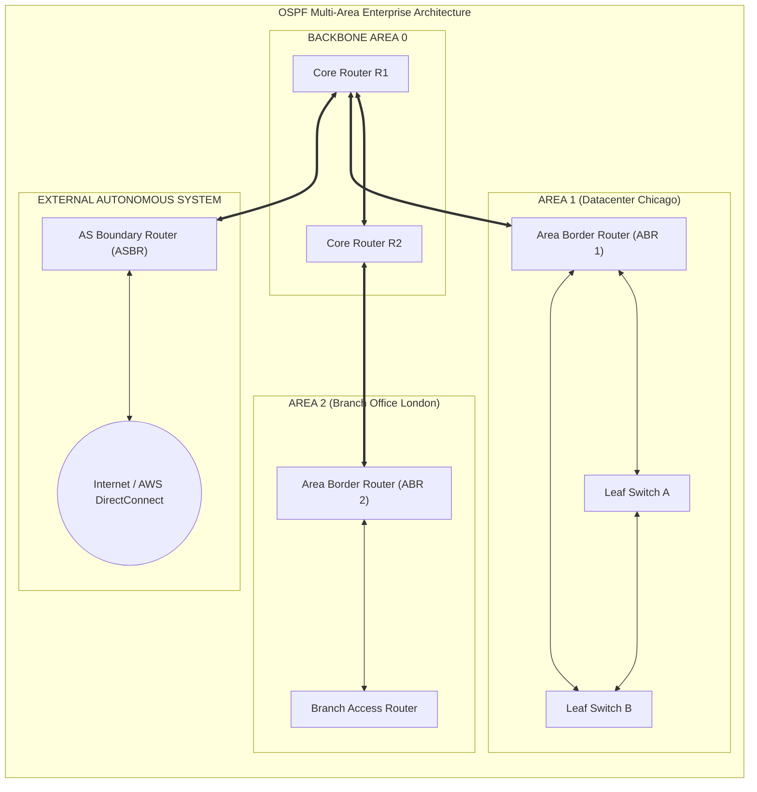
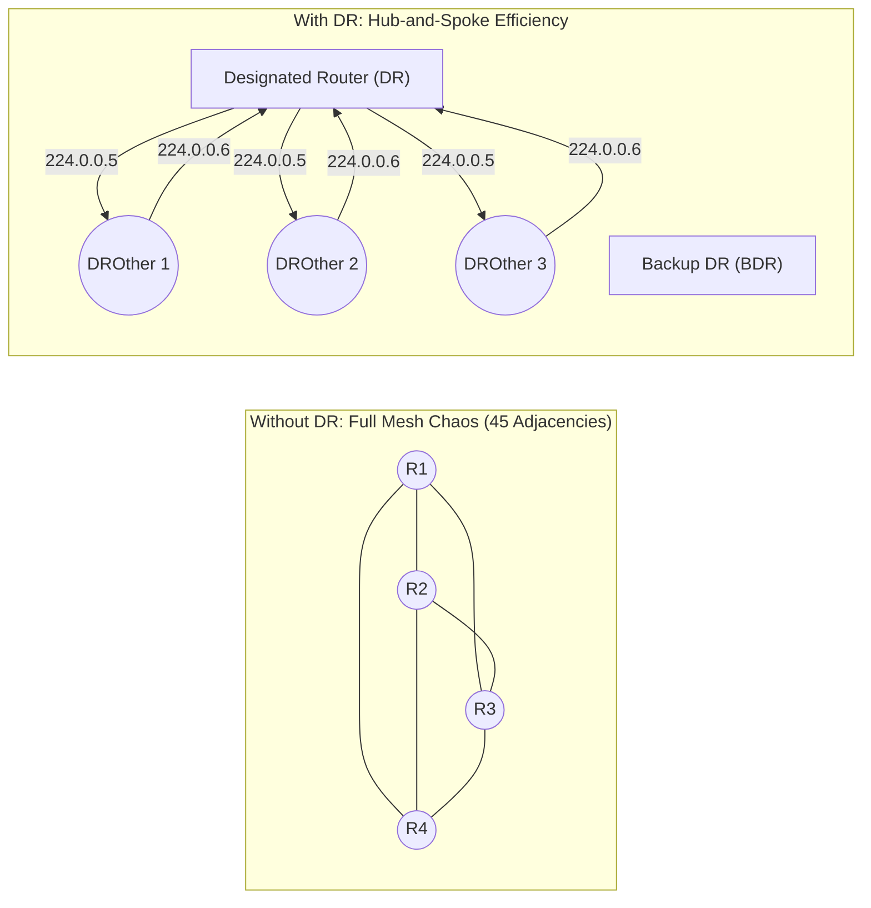
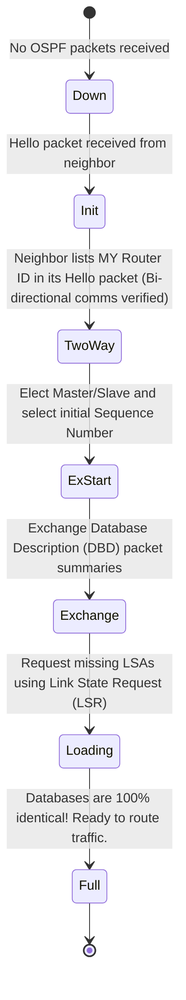
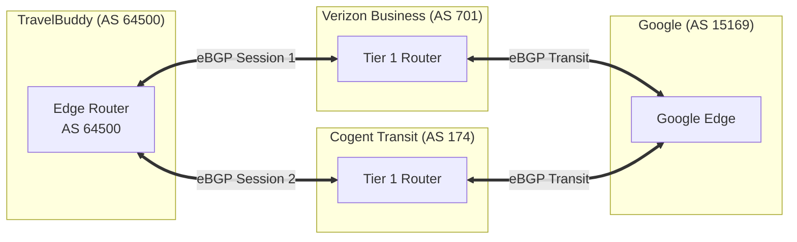
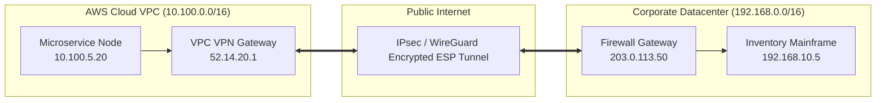
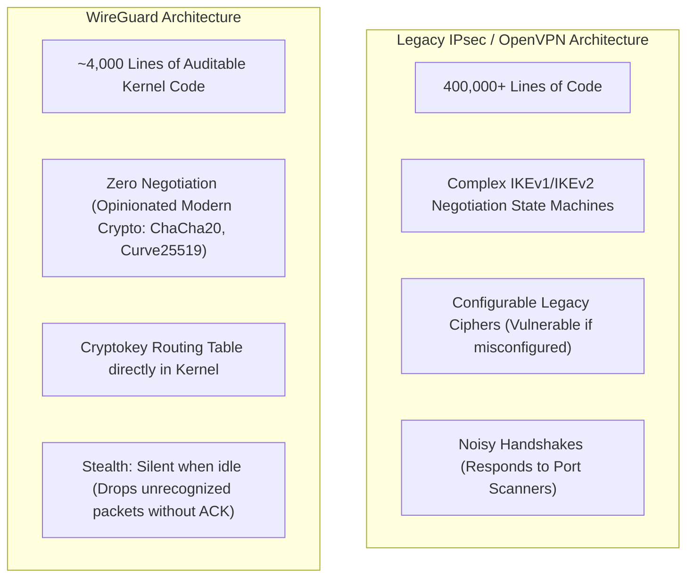
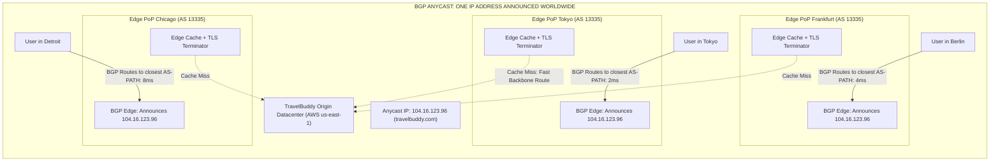
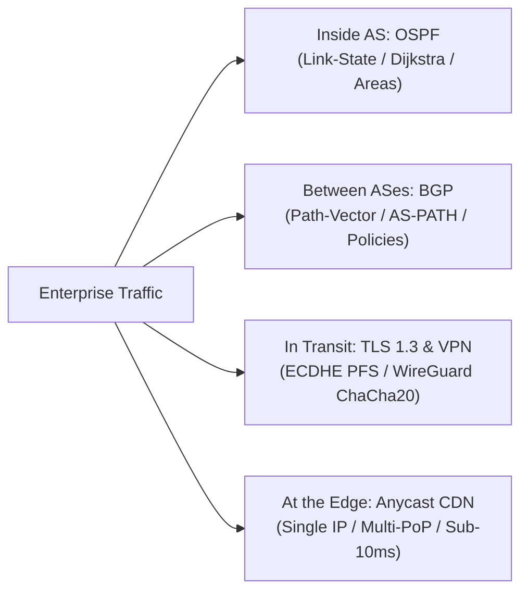

import { Callout } from 'fumadocs-ui/components/callout';

# Enterprise & Internet Architecture: Dynamic Routing (OSPF & BGP), TLS 1.3, VPNs & Anycast CDNs

When **TravelBuddy** operated as a single-server startup in Chicago, static routing was sufficient. But as traffic scaled to tens of millions of global travelers, the infrastructure transformed into an enterprise distributed system:

- Hundreds of internal microservices spanning two private datacenters and three AWS regions, requiring autonomic sub-second path failover.
- Direct multi-homed BGP peering sessions with Tier 1 telecommunication transit providers across multiple continents.
- End-to-end encryption securing customer credit card transactions against nation-state wiretapping.
- Encrypted site-to-site tunnels linking regional airline partners into TravelBuddy's internal booking bus.
- Global **BGP Anycast** networks delivering cached static assets within 15 milliseconds of any user on the planet.

In this chapter, we explore how large-scale enterprise networks route packets dynamically, secure transport channels cryptographically, and distribute traffic globally.


---

## 1. Dynamic Routing Protocols: IGP vs. EGP

Static routing breaks when networks grow beyond a handful of routers. If a fiber link between Chicago and Virginia is severed at 3:00 AM, static routes will blindly dump traffic into a black hole until an on-call engineer manually reconfigures the next hop.

**Dynamic Routing Protocols** allow routers to discover each other, continuously advertise reachability, measure link metrics, and compute alternate paths around network outages automatically in milliseconds.

Routing protocols fall into two distinct administrative categories:



| Characteristic | Interior Gateway Protocol (IGP) | Exterior Gateway Protocol (EGP) |
| :--- | :--- | :--- |
| **Typical Protocol** | **OSPF**, IS-IS, EIGRP | **BGP-4** |
| **Domain Scope** | Inside a single organization (LAN/WAN/DC) | Across the global Internet (between ISPs) |
| **Primary Metric** | Speed, Bandwidth, Latency (Lowest Cost) | Policy, Business Relationships, AS-PATH |
| **Convergence Speed** | Sub-second to seconds (Fast) | Tens of seconds to minutes (Deliberate) |
| **Table Scale** | Thousands of prefixes | **> 950,000 IPv4 prefixes** (Default-Free Zone) |

---

## 2. OSPF: The Enterprise Link-State Standard

**Open Shortest Path First (OSPF)** is the world's most widely deployed enterprise IGP. Unlike legacy distance-vector protocols (which pass rumors from neighbor to neighbor), OSPF is a **Link-State protocol**.

### The Link-State Philosophy
Every OSPF router floods **Link-State Advertisements (LSAs)** describing its connected interfaces and link costs. 

Every router in the area accumulates these LSAs into an identical **Link-State Database (LSDB)**. The LSDB is a complete, panoramic blueprint of the entire network topology. Each router then executes **Edsger Dijkstra's Shortest Path First (SPF)** algorithm on this map, calculating the mathematically optimal, loop-free shortest path tree rooted at itself!



### OSPF Hierarchical Areas

To prevent Dijkstra calculations from overwhelming router CPUs when networks contain thousands of subnets, OSPF divides networks into **Areas**:

1. **Backbone Area (Area 0 / 0.0.0.0):** The central core. **All non-backbone areas must physically or virtually connect directly to Area 0.** All inter-area traffic must traverse the backbone to prevent routing loops.
2. **Area Border Router (ABR):** A router with interfaces in Area 0 and one or more non-backbone areas. It condenses local topology information into summary LSAs (Type 3) before advertising it to the backbone.
3. **Autonomous System Boundary Router (ASBR):** A router that redistributes routes learned from external sources (BGP, static routes) into the OSPF domain via Type 5 External LSAs.

### The OSPF Cost Metric

OSPF calculates link cost inversely proportional to bandwidth:

$$\text{Cost} = \frac{\text{Reference Bandwidth}}{\text{Interface Bandwidth}}$$

By default, Cisco's reference bandwidth is $10^8 \text{ bps}$ ($100 \text{ Mbps}$). Under this legacy default:
- $10 \text{ Mbps Ethernet} = 100 / 10 = 10$
- $100 \text{ Mbps FastEthernet} = 100 / 100 = 1$
- $1 \text{ Gbps GigabitEthernet} = 100 / 1000 = 0.1 \rightarrow 1$ (Rounded up to 1!)
- $10 \text{ Gbps TenGigabit} = 1$

<Callout type="warn">
### Production Best Practice: Adjust Reference Bandwidth
In modern datacenters with 10G, 40G, and 100G links, the default $100 \text{ Mbps}$ reference causes OSPF to view a 100 Mbps link and a 100 Gbps fiber trunk as having the **exact same cost (1)**!

Always configure the reference bandwidth to at least 100 Gbps ($100,000 \text{ Mbps}$):
```cisco
Router(config)# router ospf 1
Router(config-router)# auto-cost reference-bandwidth 100000
% OSPF: Reference bandwidth is changed. 
Please ensure reference bandwidth is consistent across all routers.
```
</Callout>

### DR / BDR Election on Multi-Access Networks

On a broadcast network (like a VLAN connecting 10 routers), if every router formed full neighbor relationships with every other router, they would create $\frac{n(n-1)}{2}$ adjacencies:

$$\frac{10 \times 9}{2} = 45 \text{ adjacencies!}$$

The broadcast traffic from LSA synchronizations would choke the network.



To eliminate this overhead:
- Routers elect a **Designated Router (DR)** and a **Backup Designated Router (BDR)** based on highest OSPF interface priority (0–255), tie-broken by highest **Router ID (RID)**.
- Non-designated routers (**DROthers**) only form full adjacencies with the DR and BDR.
- DROthers transmit LSA updates to multicast address **`224.0.0.6`** (All DR Routers).
- The DR distributes updates to all other routers via multicast address **`224.0.0.5`** (All OSPF Routers).

### The Seven OSPF Adjacency States

When two OSPF routers boot up on a wire, they progress through seven strictly defined states to achieve full synchronization:



---

## 3. BGP: The Protocol That Glues the Planet

OSPF cannot scale to the global Internet. If a router in Tokyo flap-cycled its link every 500ms, running Dijkstra's SPF across the millions of routers on Earth would cause global CPU meltdown.

The Internet is glued together by **Border Gateway Protocol (BGP-4)**, defined in RFC 4271.

### Autonomous Systems (ASNs)
The Internet is not a single network; it is a federation of over 100,000 independent networks called **Autonomous Systems (ASNs)**. An ASN is a connected group of IP networks under the control of a single administrative entity with a clearly defined routing policy.

- **AS15169:** Google
- **AS13335:** Cloudflare
- **AS16509:** Amazon Web Services (AWS)
- **AS32934:** Meta (Facebook)
- **AS64512–AS65534:** Private ASNs (used internally, like RFC 1918 private IPs)



### The Path-Vector Model & Loop Prevention

BGP is not link-state and not distance-vector; it is a **Path-Vector protocol**.

Instead of advertising link costs, BGP advertises the **entire sequence of Autonomous Systems** a route has traversed. This sequence is recorded in the **`AS-PATH`** attribute:

```text
Prefix: 198.51.100.0/24
AS-PATH: 701 174 64500
```

#### The Universal Loop Prevention Mechanism
When a BGP router receives an update from an external peer (eBGP), it inspects the `AS-PATH`. 

**If the router sees its own ASN anywhere inside the `AS-PATH` list, it immediately drops the update!**

```text
Router in AS 64500 receives update:
Prefix: 10.0.0.0/8
AS-PATH: 174 15169 64500 209
                  ▲
                  └── MY ASN IS IN THIS PATH! This route already passed through me!
                      DROP ROUTE IMMEDIATELY TO PREVENT ROUTING LOOP.
```

### eBGP vs. iBGP

| Feature | External BGP (eBGP) | Internal BGP (iBGP) |
| :--- | :--- | :--- |
| **Peering Neighbors** | Routers in **different** ASNs | Routers in the **same** ASN |
| **Default Admin Distance** | **20** (High trust for external border) | **200** (Prefers internal IGP routes) |
| **Physical Connection** | Usually directly connected (TTL = 1) | Can be multiple hops away (Traverses IGP) |
| **AS-PATH Mutation** | Prepends local ASN upon export | Does NOT modify the AS-PATH attribute |
| **Propagation Rule** | Advertises routes to all peers | Does NOT re-advertise iBGP routes to other iBGP peers (Split-Horizon requires Full Mesh or Route Reflectors) |

---

## 4. OSPF vs. BGP: Architectural Comparison

| Dimension | OSPF | BGP |
| :--- | :--- | :--- |
| **Algorithm** | Dijkstra Shortest Path First (Link-State) | Path-Vector (Best Path Decision Algorithm) |
| **Transport Protocol** | Raw IP (Protocol 89) | **TCP (Port 179)** |
| **Convergence** | Milliseconds to seconds (Very fast) | Tens of seconds to minutes (Dampened) |
| **Primary Metric** | Cost ($\propto 1/\text{bandwidth}$) | Policy-driven (Weight, Local Pref, AS-PATH, MED) |
| **Resource Demands** | High CPU (SPF recalculation), Moderate RAM | High RAM (Storing 950,000+ Internet prefixes) |
| **Design Hierarchy** | Two-tier areas (Area 0 Backbone) | Autonomous Systems (ASNs) |

---

## 5. Transport Layer Security (TLS 1.3): Cryptographic Transit

Routing ensures packets reach their destination; **Transport Layer Security (TLS)** ensures nobody eavesdrops or alters those packets along the way.


In 2018, RFC 8446 standardized **TLS 1.3**, sweeping away two decades of cryptographic baggage from SSL and TLS 1.2:
- Stripped out insecure legacy primitives (RSA key transport without forward secrecy, CBC mode ciphers, RC4, 3DES, MD5, SHA-1).
- Mandated **Perfect Forward Secrecy (PFS)** via Ephemeral Diffie-Hellman (**ECDHE**).
- Cut the cryptographic connection handshake from **2 round trips (2-RTT) down to 1 round trip (1-RTT)**!

```mermaid
sequenceDiagram
    autonumber
    participant Client as Traveler Browser
    participant Server as TravelBuddy TLS Edge

    Note over Client,Server: TCP 3-Way Handshake completes in 1-RTT (or 0-RTT in QUIC)
    
    rect rgb(30, 41, 59)
    Note over Client,Server: TLS 1.3 Handshake (1-RTT)
    Client->>Server: ClientHello<br/>+ Supported Cipher Suites (AES-256-GCM, ChaCha20)<br/>+ Supported Groups (X25519, P-256)<br/>+ Client Key Share (ECDHE Public Key g^a)
    
    Server->>Client: ServerHello<br/>+ Selected Cipher Suite<br/>+ Server Key Share (ECDHE Public Key g^b)<br/>[HANDSHAKE ENCRYPTION STARTS HERE]<br/>+ EncryptedExtensions<br/>+ Certificate (X.509 Server Identity)<br/>+ CertificateVerify (Digital Signature)<br/>+ Finished (HMAC Authenticator)
    end

    Note over Client: Client verifies Certificate & Signature.<br/>Both sides compute shared secret S = g^(ab) mod p.<br/>Derive symmetric traffic keys!

    Client->>Server: Finished<br/>+ [ENCRYPTED APPLICATION DATA]<br/>GET /api/v1/checkout HTTP/2
    Server-->>Client: [ENCRYPTED APPLICATION DATA]<br/>HTTP 200 OK
```



### Why Perfect Forward Secrecy (PFS) is Non-Negotiable

In legacy TLS 1.2 architectures using static RSA key exchange:
1. An intelligence agency or malicious actor taps the undersea fiber line and records every gigabyte of encrypted traffic passing between users and TravelBuddy.
2. Three years later, the attacker compromises TravelBuddy's datacenter and steals the server's private RSA SSL certificate key.
3. The attacker loads the stolen private key into Wireshark and **retroactively decrypts every single recorded terabyte from the past three years**, revealing every user password and credit card number!

With **ECDHE (Elliptic Curve Diffie-Hellman Ephemeral)** in TLS 1.3:
- For every individual connection, the client and server generate temporary, one-time private numbers ($a$ and $b$).
- They exchange public shares ($g^a$ and $g^b$) and compute a shared session key.
- **The ephemeral keys $a$ and $b$ are instantly erased from RAM.**
- Even if an attacker steals the server's master certificate private key, they **cannot calculate the ephemeral keys**, rendering previously recorded traffic permanently indecipherable!

---

## 6. Virtual Private Networks (VPNs): IPsec and WireGuard

When TravelBuddy's AWS VPC needs to query the internal legacy inventory mainframe in our on-premise datacenter, traffic cannot traverse the public Internet in the clear. 

We bridge the networks across the public Internet using an encrypted **Virtual Private Network (VPN)** tunnel.



### 1. IPsec (IP Security)
The battle-tested enterprise standard (RFC 4301). Operates at Layer 3:

- **Protocols:**
  - **ESP (Encapsulating Security Payload - IP Protocol 50):** Provides encryption, data origin authentication, and anti-replay protection.
  - **AH (Authentication Header - IP Protocol 51):** Authenticates the entire packet (including outer IP header). *Breaks instantly across NAT routers because NAT rewrites IP addresses, invalidating AH's cryptographic signature! Rarely used.*
- **Modes:**
  - **Transport Mode:** Encrypts only the L4 payload. Used for host-to-host communication.
  - **Tunnel Mode:** Encrypts the **entire original IP packet** (headers included), and wraps it in a brand-new public routable IP header. The foundation of site-to-site VPNs.
- **IKEv2 (Internet Key Exchange):**
  - **Phase 1:** Authenticates endpoints (certificates or pre-shared keys) and builds a secure management channel (IKE SA).
  - **Phase 2:** Negotiates symmetric keys and parameters for the actual encrypted data tunnel (IPsec Child SA).

---

### 2. WireGuard: The Modern VPN Revolution

While IPsec requires over 400,000 lines of complex C code across user-space daemons, **WireGuard** was merged directly into the Linux kernel in 2020 with fewer than **4,000 lines of code**.



#### Cryptokey Routing
WireGuard associates peer public keys directly with allowed tunnel IP addresses:

```ini
# /etc/wireguard/wg0.conf (TravelBuddy Cloud Gateway)
[Interface]
Address = 10.0.0.1/24
PrivateKey = aAAA...
ListenPort = 51820

[Peer]
# On-Premise Datacenter Gateway
PublicKey = bBBB...
AllowedIPs = 192.168.0.0/16
Endpoint = 203.0.113.50:51820
```

When a packet arrives destined for `192.168.10.5`, the kernel checks the routing table, matches `AllowedIPs = 192.168.0.0/16`, encrypts the payload using Peer `bBBB...`'s public key with ChaCha20-Poly1305, and pushes it out UDP port 51820. Fast, lightweight, and mathematically secure.

---

## 7. Content Delivery Networks (CDNs) & BGP Anycast

A traveler in Sydney, Australia attempting to load flight photos from a web server in Virginia, USA faces an insurmountable physical boundary: the speed of light in fiber optics.

$$\text{Latency} = \frac{2 \times 15,000 \text{ km}}{200,000 \text{ km/s}} \approx 150 \text{ ms minimum round-trip!}$$

If a page requires 5 round trips, the user experiences nearly a full second of latency before rendering begins.

To eliminate geographic latency, companies deploy **Content Delivery Networks (CDNs)** (Cloudflare, Fastly, Akamai, CloudFront) powered by **BGP Anycast**.



### Unicast vs. Anycast

- **Unicast (One-to-One):** Every IP address on Earth belongs to exactly one physical server interface. If that server is in Virginia, every packet on the planet must travel to Virginia.
- **Anycast (One-to-Nearest):** The **exact same IP address** is assigned to servers in hundreds of datacenters (Points of Presence - PoPs) across the globe. Each datacenter advertises that identical IP prefix via eBGP to local transit ISPs.

### How BGP Naturally Routes to the Closest PoP

When a traveler in Tokyo queries `travelbuddy.com`, their local ISP receives BGP advertisements for `104.16.123.96` from:
1. The CDN PoP in Tokyo (AS-PATH length: 1 hop)
2. The CDN PoP in California (AS-PATH length: 4 hops)

Because BGP selects the shortest AS-PATH, **the traveler's packets are automatically routed to the local Tokyo edge facility in 2 milliseconds**!

### What Anycast & CDNs Deliver:
1. **Edge TLS Termination:** The TLS 1.3 handshake is completed with the local PoP. Instead of a 150ms round-trip to the USA, cryptographic keys are negotiated in 5ms locally!
2. **Static Asset Caching:** Images, CSS, and JavaScript bundles are cached on local NVMe SSDs, offloading 90%+ of traffic from origin servers.
3. **DDoS Absorption:** If a 500 Gbps distributed denial-of-service botnet attacks the Anycast IP, the malicious traffic is divided and absorbed concurrently across hundreds of global PoPs, preventing the origin server from collapsing.

---

## 8. Engineering Summary & Quick Recall



- **OSPF:** An Interior Gateway Protocol using Dijkstra's Shortest Path First algorithm on an identical Link-State Database; scales via a two-tier hierarchy anchored to Backbone Area 0.
- **BGP:** The exterior routing protocol of the Internet; tracks sequences of Autonomous Systems (`AS-PATH`) and drops any route containing its own ASN to prevent routing loops.
- **TLS 1.3:** Cuts connection latency to 1-RTT and enforces Perfect Forward Secrecy using ephemeral Diffie-Hellman (ECDHE), preventing retroactive decryption of recorded traffic.
- **IPsec vs. WireGuard:** IPsec provides legacy enterprise tunnel security; WireGuard modernizes VPNs with 4,000 lines of kernel code, cryptokey routing, and silent-when-idle stealth.
- **BGP Anycast:** Announces a single IP address from hundreds of worldwide edge datacenters simultaneously, allowing Internet routing to direct each user to the physically closest edge server for sub-10ms latency and distributed DDoS protection.
