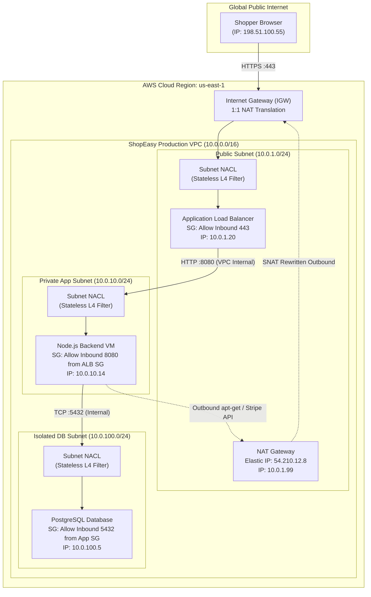

# Virtual Machines & Cloud VPC Architecture

Every modern internet enterprise—from payment gateways and streaming platforms to retail giants—relies on virtualized cloud networking. Yet to truly appreciate the engineering ingenuity of Software-Defined Networking (SDN) and the Cloud Virtual Private Cloud (VPC), we must first understand the catastrophic failure modes of the physical hardware era.

---

## 1. The ShopEasy Story: The Black Friday Single-Server Tragedy

In the early 2010s, an ambitious e-commerce startup named **ShopEasy** launched their entire business on a single physical, bare-metal rack server hosted in a colocated datacenter.


Their architecture looked deceptively simple:

```
[ Internet Users ]
       │ (Public IP: 198.51.100.10)
       ▼
┌────────────────────────────────────────────────────────┐
│ PHYSICAL SERVER (Dell PowerEdge R720 - "Production")   │
│                                                        │
│  ┌──────────────┐   ┌───────────────┐  ┌─────────────┐ │
│  │ Nginx Reverse│──►│ Node.js Store │─►│ PostgreSQL  │ │
│  │    Proxy     │   │   Application │  │  Database   │ │
│  └──────────────┘   └───────────────┘  └─────────────┘ │
│                                                        │
│  RAM: 64 GB ECC     Storage: 2x 1TB HDD (RAID 1)       │
│  NIC: 1x 1Gbps      Power: Single PDU                  │
└────────────────────────────────────────────────────────┘
```

On Black Friday at 00:01 AM, marketing blast emails drove 50,000 concurrent shoppers to ShopEasy. Within 90 seconds:
1. **CPU & Memory Exhaustion:** Node.js consumed 100% CPU on all cores; PostgreSQL ran out of buffer pool memory and began swapping aggressively to spinning mechanical disks.
2. **Cascading Failure:** Disk I/O wait spiked to 98%. Nginx ran out of file descriptors and dropped incoming TCP SYN packets (`Connection refused`).
3. **Physical Hardware Meltdown:** The primary power supply unit (PSU) blew a capacitor under sustained peak electrical load. With no secondary power feed or redundant server, the entire machine went black.
4. **Catastrophic Blast Radius:** The database, web server, payment processor, and customer session cache were all destroyed in a single second. Recovery required a technician to drive to the physical datacenter at 2:00 AM to replace the hardware, resulting in 8 hours of downtime and hundreds of thousands of dollars in lost sales.

### The Single Server Failure Modes

| Failure Domain | What Broke | Consequence in Single-Server Architecture | Modern Cloud Architecture Solution |
| :--- | :--- | :--- | :--- |
| **Hardware Component** | PSU, Motherboard, RAM ECC error | Complete system death; physical repair needed | Ephemeral VMs across redundant physical racks |
| **No Fault Isolation** | App memory leak crashes database | Co-located services crash each other | Dedicated instances per tier in private subnets |
| **Vertical Scaling Ceiling** | Cannot add more RAM without shutting down | Hard traffic limit during peak sales | Horizontal Auto Scaling Groups (ASGs) |
| **Network Security** | Database exposed on public interface | Attackers target database port directly | Private subnets + strict security group boundaries |
| **Geographic Redundancy** | Datacenter flood, fiber cut, or power outage | 100% total outage across all users | Multi-Availability Zone (Multi-AZ) VPC deployment |

---

## 2. Virtualization & The Hypervisor

To break free from hardware lock-in, computer scientists developed **virtualization**: the technique of abstracting physical hardware into multiple isolated, independent virtual execution environments known as **Virtual Machines (VMs)**.

The software engine responsible for creating, isolating, scheduling, and managing virtual machines is the **Hypervisor** (also known as the **Virtual Machine Monitor**, or **VMM**).

```
         Type 1 (Bare-Metal) Hypervisor             Type 2 (Hosted) Hypervisor
     ┌────────────────────────────────────┐    ┌───────────────────────────────────┐
     │  VM 1 (App)   │    VM 2 (DB)       │    │  VM 1 (App)   │    VM 2 (DB)      │
     │  Guest OS     │    Guest OS        │    │  Guest OS     │    Guest OS       │
     ├───────────────┴────────────────────┤    ├───────────────┴───────────────────┤
     │      Hypervisor / VMM              │    │   Type 2 Hypervisor (VirtualBox)  │
     │   (KVM, VMware ESXi, Xen, Hyper-V) │    ├───────────────────────────────────┤
     ├────────────────────────────────────┤    │     Host OS Kernel (Linux / Win)  │
     │        Physical Hardware           │    ├───────────────────────────────────┤
     │    (CPU, RAM, NIC, NVMe Storage)   │    │        Physical Hardware          │
     └────────────────────────────────────┘    └───────────────────────────────────┘
```

### Type 1 vs. Type 2 Hypervisors

#### Type 1: Bare-Metal Hypervisors
- Runs directly on the host computer's physical hardware without any underlying general-purpose operating system.
- **Examples:** VMware ESXi, Linux KVM (Kernel-based Virtual Machine), Xen Project (which powered early AWS EC2), Microsoft Hyper-V Server.
- **Performance:** Near-native bare-metal execution speed (typically within 1–3% of bare metal CPU/memory performance).
- **Use Case:** Production cloud datacenters (AWS Nitro System, Google Cloud Compute Engine, Azure Hyper-V).

#### Type 2: Hosted Hypervisors
- Runs as an application layer on top of an existing host operating system (such as Windows, macOS, or desktop Ubuntu).
- **Examples:** VirtualBox, VMware Workstation, Parallels Desktop.
- **Performance:** Substantially higher overhead because every hardware I/O request must be translated through the hypervisor *and* the host OS kernel before reaching physical hardware.
- **Use Case:** Local software development, student labs, desktop experimentation.

### Hardware-Assisted Virtualization (Intel VT-x / AMD-V)
Early x86 processors were notoriously difficult to virtualize because certain sensitive CPU instructions (such as modifying page table registers or clearing interrupt flags) behaved differently or failed silently when executed outside **Ring 0** (the most privileged CPU execution ring).

In 2005–2006, Intel and AMD introduced hardware extensions:
- **Intel VT-x (VMX) / AMD-V (SVM):** Added a new CPU mode: **Root Operation** (where the hypervisor runs) and **Non-Root Operation** (where guest operating systems run). When a guest OS tries to execute a privileged instruction, the CPU triggers a **VM Exit**, pausing the guest and handing control cleanly to the hypervisor.
- **Extended Page Tables (EPT / SLAT):** Hardware-level Nested Page Tables that translate Guest Virtual Addresses (GVA) $\to$ Guest Physical Addresses (GPA) $\to$ Host Physical Addresses (HPA) directly in silicon without expensive software shadow page tables.
- **SR-IOV (Single Root I/O Virtualization):** Allows a physical network interface card (NIC) to present itself to the PCIe bus as hundreds of distinct **Virtual Functions (VFs)**. A guest VM can be granted direct PCIe passthrough access to a VF, bypassing the hypervisor entirely for sub-microsecond, 100 Gbps network line rates!

---

## 3. Cloud Virtual Private Cloud (VPC) Architecture

When ShopEasy migrated to the cloud, they did not simply rent standalone virtual machines scattered across the internet. Instead, they provisioned a **Virtual Private Cloud (VPC)**.

A **Virtual Private Cloud (VPC)** is a logically isolated, software-defined virtual network dedicated entirely to your cloud account. It grants you total control over:
- IP address allocation ranges (CIDR blocks).
- Creation of public and private subnets across multiple physical datacenters (Availability Zones).
- Software-defined routing tables.
- Network Gateways (Internet Gateways, NAT Gateways, Transit Gateways).
- Multi-layer stateful and stateless firewall rules.

```
                  ShopEasy Multi-AZ VPC (10.0.0.0/16)
 ┌─────────────────────────────────────────────────────────────────────────────┐
 │ Internet Gateway (IGW) ◄═══════════════════════════════════════════════════ │
 │      │                                                                      │
 │   ┌──▼─────────────────────────────┐     ┌──────────────────────────────┐   │
 │   │ Public Subnet (AZ-A)           │     │ Public Subnet (AZ-B)         │   │
 │   │ CIDR: 10.0.1.0/24              │     │ CIDR: 10.0.2.0/24            │   │
 │   │  ┌──────────────────────────┐  │     │  ┌────────────────────────┐  │   │
 │   │  │ Public Load Balancer     │  │     │  │ Public Load Balancer   │  │   │
 │   │  │ (ALB Node 1)             │  │     │  │ (ALB Node 2)           │  │   │
 │   │  │ NAT Gateway (AZ-A)       │  │     │  │ NAT Gateway (AZ-B)     │  │   │
 │   │  └──────────┬───────────────┘  │     │  └──────────┬─────────────┘  │   │
 │   └─────────────┼──────────────────┘     └─────────────┼────────────────┘   │
 │                 ▼                                      ▼                    │
 │   ┌────────────────────────────────┐     ┌──────────────────────────────┐   │
 │   │ Private App Subnet (AZ-A)      │     │ Private App Subnet (AZ-B)    │   │
 │   │ CIDR: 10.0.10.0/24             │     │ CIDR: 10.0.20.0/24           │   │
 │   │  ┌──────────────────────────┐  │     │  ┌────────────────────────┐  │   │
 │   │  │ App Server (EC2 / VM 1)  │  │     │  │ App Server (EC2 / VM 2)│  │   │
 │   │  │ IP: 10.0.10.15           │  │     │  │ IP: 10.0.20.88         │  │   │
 │   │  └──────────┬───────────────┘  │     │  └──────────┬─────────────┘  │   │
 │   └─────────────┼──────────────────┘     └─────────────┼────────────────┘   │
 │                 ▼                                      ▼                    │
 │   ┌────────────────────────────────┐     ┌──────────────────────────────┐   │
 │   │ Private Database Subnet (AZ-A) │     │ Private Database Subnet (AZ-B│   │
 │   │ CIDR: 10.0.100.0/24            │     │ CIDR: 10.0.200.0/24          │   │
 │   │  ┌──────────────────────────┐  │     │  ┌────────────────────────┐  │   │
 │   │  │ Primary PostgreSQL (RDS) │  │════►│  │ Read Replica (RDS)     │  │   │
 │   │  │ IP: 10.0.100.4           │  │     │  │ IP: 10.0.200.9         │  │   │
 │   │  └──────────────────────────┘  │     │  └────────────────────────┘  │   │
 │   └────────────────────────────────┘     └──────────────────────────────┘   │
 └─────────────────────────────────────────────────────────────────────────────┘
```

### VPC CIDR Planning (RFC 1918)
When creating a VPC, you specify an IPv4 Classless Inter-Domain Routing (CIDR) block. The standard practice is selecting from private IPv4 ranges:
- `10.0.0.0/16` (65,536 private IP addresses: `10.0.0.0` to `10.0.255.255`) — *Most popular enterprise choice*.
- `172.31.0.0/16` (65,536 private IP addresses) — *AWS default VPC choice*.
- `192.168.0.0/16` (65,536 private IP addresses) — *Common for hybrid-cloud branches*.

### Reserved Cloud Subnet IP Addresses
In a traditional on-premise subnet, only **2** IP addresses are reserved: the Network Address (all host bits 0) and the Broadcast Address (all host bits 1).

In major cloud providers like AWS, **5 IP addresses** are automatically reserved in every single subnet. In a `/24` subnet (256 addresses total), only $256 - 5 = 251$ addresses can be assigned to resources:

1. `10.0.1.0`: **Network address** (Layer 3 wire definition).
2. `10.0.1.1`: **VPC Router** (Default gateway for the subnet).
3. `10.0.1.2`: **DNS Server** (AmazonProvidedDNS / Route 53 Resolver, base IP + 2).
4. `10.0.1.3`: **Future use** (Reserved by the cloud provider for future network expansion).
5. `10.0.1.255`: **Broadcast address** (Clouds do not support physical broadcast; this address is reserved).

---

## 4. Public vs. Private Subnets

A subnet's identity as **public** or **private** is not determined by its IP range (all subnets use private RFC 1918 IPs). Instead, it is determined **entirely by its Route Table configuration**.

```
                Public Subnet Route Table
     ┌────────────────────────┬────────────────────────┐
     │ Destination            │ Target                 │
     ├────────────────────────┼────────────────────────┤
     │ 10.0.0.0/16 (VPC CIDR) │ local (Internal VPC)   │
     │ 0.0.0.0/0   (Default)  │ igw-01234567 (Internet)│
     └────────────────────────┴────────────────────────┘

                Private Subnet Route Table
     ┌────────────────────────┬────────────────────────┐
     │ Destination            │ Target                 │
     ├────────────────────────┼────────────────────────┤
     │ 10.0.0.0/16 (VPC CIDR) │ local (Internal VPC)   │
     │ 0.0.0.0/0   (Default)  │ nat-09876543 (NAT-GW)  │
     └────────────────────────┴────────────────────────┘

            Isolated Database Subnet Route Table
     ┌────────────────────────┬────────────────────────┐
     │ Destination            │ Target                 │
     ├────────────────────────┼────────────────────────┤
     │ 10.0.0.0/16 (VPC CIDR) │ local (Internal VPC)   │
     └────────────────────────┴────────────────────────┘
```

### The Three-Tier Subnet Topology

#### 1. Public Subnets (Ingress Tier)
- **Route Table:** Contains a default route pointing directly to an **Internet Gateway**: `0.0.0.0/0 -> igw-xxxx`.
- **Resources Hosted:** Public Application Load Balancers (ALBs), Network Load Balancers (NLBs), NAT Gateways, and Bastion / Jump hosts.
- **Security Posture:** Every host has an Elastic IP (Public IPv4) or public DNS name. Exposed to internet scans; guarded heavily by Security Groups.

#### 2. Private Application Subnets (Compute Tier)
- **Route Table:** Contains a default route pointing to a **NAT Gateway**: `0.0.0.0/0 -> nat-xxxx`.
- **Resources Hosted:** Web API containers, Kubernetes worker nodes, microservices, background job workers (Celery, Sidekiq).
- **Security Posture:** **No public IP addresses**. No internet user can ever establish a direct inbound TCP connection to these servers. However, instances *can* initiate outbound internet connections (e.g. to call Stripe APIs or fetch security patches) via the NAT Gateway.

#### 3. Isolated Database Subnets (Data Persistence Tier)
- **Route Table:** Contains **no route to the internet** (`0.0.0.0/0` does not exist).
- **Resources Hosted:** Relational databases (PostgreSQL, MySQL), Redis caches, Elasticsearch clusters.
- **Security Posture:** Completely air-gapped from the public internet. Only accessible over private internal IP addresses (`10.0.0.0/16`) from approved application servers.

---

## 5. Internet Gateway (IGW) vs. NAT Gateway

Connecting a private VPC to the global public internet requires two fundamentally different gateway mechanisms:

```
        Internet Gateway (1:1 2-Way NAT)          NAT Gateway (1:Many Outbound SNAT)
             ┌──────────────────┐                       ┌──────────────────┐
             │ Internet Gateway │                       │   NAT Gateway    │
             │   (Public ALB)   │                       │  (Private App)   │
             └────────┬─────────┘                       └────────┬─────────┘
                      │                                          │
       INBOUND: ALLOWED (Public Access)           INBOUND: BLOCKED (Dropped by NAT)
       OUTBOUND: ALLOWED                          OUTBOUND: ALLOWED (Source Rewritten)
```

### The Internet Gateway (IGW)
- An **Internet Gateway** is a horizontally scaled, redundant, and highly available VPC component that imposes **no availability risk or bandwidth bottleneck** on network traffic.
- It is **not a physical router** sitting in a rack; it is an SDN software construct running on the hypervisor fleet.
- **Function:** It performs bidirectional 1:1 NAT mapping between the private IPv4 address of an instance (`10.0.1.50`) and its associated public IPv4 Elastic IP (`198.51.100.25`).
- When traffic leaves the VPC toward the internet, the IGW swaps the source private IP for the public Elastic IP. When internet traffic responds, the IGW translates the destination public IP back to the private IP and forwards it into the VPC.

### The NAT Gateway (Network Address Translation)
Why do we need a **NAT Gateway** if we already have an Internet Gateway?
Because instances in private subnets do not have public IP addresses and must never be directly addressable from the internet. Yet they frequently need outbound connectivity:
- Running `apt-get update` or `dnf upgrade` to apply Linux kernel security patches.
- Calling external SaaS APIs (Stripe, Twilio, OpenAI, GitHub webhook deliveries).
- Downloading Docker container images from public registries.

The **NAT Gateway** resides in a **Public Subnet** and possesses an attached Elastic IP address. When an application server in a private subnet sends an outbound packet to `api.stripe.com`:
1. The packet routes to `nat-xxxx`.
2. The NAT Gateway performs **Source NAT (SNAT)**: it records the private host's IP and port in its internal state table, overwrites the packet's source IP with its own public Elastic IP, and sends it out through the IGW.
3. When Stripe responds, the packet arrives at the NAT Gateway. The NAT Gateway inspects its state table, recognizes the active session, translates the destination back to `10.0.10.15`, and forwards it over the private VPC subnet.
4. If an external attacker attempts to send unsolicited packets to the NAT Gateway's public IP, the NAT Gateway drops them immediately because no matching outbound session exists in its state table!

---

## 6. Stateful Security Groups vs. Stateless NACLs

Cloud network security relies on **Defense in Depth**: two distinct layers of software firewalls operating at different architectural boundaries.


```
 [ Public Internet ]
          │
          ▼
   ┌─────────────┐
   │ Subnet NACL │  ◄── LAYER 1: Stateless Subnet Boundary (NACL)
   └──────┬──────┘
          │
          ▼
   ┌─────────────┐
   │  Security   │  ◄── LAYER 2: Stateful Instance / ENI Boundary (Security Group)
   │    Group    │
   └──────┬──────┘
          │
          ▼
   ┌─────────────┐
   │ Virtual NIC │
   │ (EC2 / VM)  │
   └─────────────┘
```

### Security Groups (Stateful Virtual Firewalls)
- **Scope:** Applied at the **Elastic Network Interface (ENI)** level of individual virtual machines.
- **Statefulness:** **100% STATEFUL**. If you create an inbound rule allowing TCP traffic on port 443 (HTTPS), any response traffic generated by your server is **automatically permitted outbound**, regardless of what outbound rules say!
- **Rule Syntax:** Allow rules only. You cannot write explicit "Deny" rules; anything not explicitly allowed is dropped by default.
- **Rule Evaluation:** All rules are evaluated simultaneously as a comprehensive set; rule order does not matter.

### Network Access Control Lists (NACLs) (Stateless Subnet Firewalls)
- **Scope:** Applied at the **Subnet boundary**. Traffic crossing into or out of the subnet must pass through the NACL.
- **Statefulness:** **100% STATELESS**. The NACL has zero memory of previous packets. If you allow inbound traffic on port 443, return packets traveling outbound **will be dropped** unless you create an explicit outbound rule!
- **Rule Syntax:** Supports both **Allow** and **Deny** rules (e.g. "Deny traffic from malicious IP `203.0.113.66`").
- **Rule Evaluation:** Rules are evaluated strictly in **ascending numerical order** (Rule 100 is tested before Rule 200). The first rule matching the packet is applied immediately, and subsequent rules are ignored.

### The Infamous Ephemeral Port Gotcha
The most common disaster for junior network engineers configuring stateless NACLs is forgetting **ephemeral return ports**.

When an internet user connects from their home laptop to your public web server on port 443:
- Inbound packet: Source IP `198.51.100.99`, Source Port `54321` (random ephemeral client port) $\to$ Destination IP `10.0.1.10`, Destination Port `443`.
- The NACL inbound rule allows `TCP 443`. The packet enters the subnet.
- Your web server replies: Source IP `10.0.1.10`, Source Port `443` $\to$ Destination IP `198.51.100.99`, Destination Port `54321`.
- **The Failure:** If your outbound NACL rule only allows `TCP 443`, the response packet is **dropped** because its destination port is `54321`!
- **The Fix:** Outbound NACLs must always contain a rule permitting traffic to ephemeral ports (`1024–65535` for Linux/Windows clients) so replies can return.

### Comprehensive Comparison: Security Groups vs. NACLs

| Feature | Security Group (SG) | Network ACL (NACL) |
| :--- | :--- | :--- |
| **Operates At** | Instance / Virtual Network Interface (ENI) | Subnet boundary |
| **State Tracking** | **Stateful** (Return traffic automatically allowed) | **Stateless** (Return traffic must be explicitly allowed) |
| **Rule Capabilities** | **ALLOW rules only** (Implicit deny all else) | **ALLOW and DENY rules** |
| **Rule Evaluation Order** | Evaluates all rules as a single unified filter | Evaluates in strict **numerical order** (lowest number first) |
| **Default Configuration** | Denies all inbound; allows all outbound | Default NACL allows all inbound & all outbound |
| **Ephemeral Port Rule Needed?** | **No** (Handled automatically by connection tracking) | **Yes** (Must explicitly permit outbound ports `1024-65535`) |
| **Granular IP Blocking** | Cannot block a single rogue IP (No deny rules) | Ideal for instantly blocking attacking IPs/CIDRs |

---

## 7. Interactive Architecture: The Complete Cloud VPC Flow

The following Mermaid diagram maps out the end-to-end network topology of ShopEasy's multi-tier, fault-tolerant cloud VPC:



---

## 8. Real-World Infrastructure as Code (Terraform)

In production, cloud VPCs are never built by clicking buttons in a web console. They are declared as immutable code using tools like **Terraform**:

```hcl
# 1. Define the VPC
resource "aws_vpc" "shopeasy_vpc" {
  cidr_block           = "10.0.0.0/16"
  enable_dns_support   = true
  enable_dns_hostnames = true

  tags = {
    Name = "shopeasy-production-vpc"
  }
}

# 2. Attach an Internet Gateway
resource "aws_internet_gateway" "igw" {
  vpc_id = aws_vpc.shopeasy_vpc.id

  tags = {
    Name = "shopeasy-igw"
  }
}

# 3. Create Public Subnet for Load Balancers
resource "aws_subnet" "public_subnet_a" {
  vpc_id            = aws_vpc.shopeasy_vpc.id
  cidr_block        = "10.0.1.0/24"
  availability_zone = "us-east-1a"

  tags = {
    Name = "shopeasy-public-1a"
  }
}

# 4. Route Table for Public Subnet (Direct to IGW)
resource "aws_route_table" "public_rt" {
  vpc_id = aws_vpc.shopeasy_vpc.id

  route {
    cidr_block = "0.0.0.0/0"
    gateway_id = aws_internet_gateway.igw.id
  }
}

resource "aws_route_table_association" "public_assoc" {
  subnet_id      = aws_subnet.public_subnet_a.id
  route_table_id = aws_route_table.public_rt.id
}

# 5. Stateful Security Group for Backend Application
resource "aws_security_group" "app_sg" {
  name        = "shopeasy-app-sg"
  description = "Allow inbound traffic exclusively from ALB Security Group"
  vpc_id      = aws_vpc.shopeasy_vpc.id

  ingress {
    description     = "Node.js Port from ALB"
    from_port       = 8080
    to_port         = 8080
    protocol        = "tcp"
    security_groups = [aws_security_group.alb_sg.id] # Chained SG reference!
  }

  egress {
    description = "Allow all outbound through NAT Gateway"
    from_port   = 0
    to_port     = 0
    protocol    = "-1"
    cidr_blocks = ["0.0.0.0/0"]
  }
}
```

---

## 9. Summary & Architectural Invariants

1. **Bare-metal servers possess single-point-of-failure blast radiuses:** Any CPU spike, disk corruption, or power failure destroys all co-located applications simultaneously.
2. **Type 1 Hypervisors run on physical silicon:** Utilizing CPU hardware virtualization (Intel VT-x, EPT) to execute guest virtual machines at near bare-metal performance.
3. **Subnets are made public or private by Route Tables:** A subnet is public if its default route (`0.0.0.0/0`) points to an **Internet Gateway (IGW)**; it is private if its default route points to a **NAT Gateway** or is absent entirely.
4. **Internet Gateways perform 1:1 bidirectional NAT; NAT Gateways perform 1:Many outbound SNAT:** NAT Gateways allow private instances to initiate outbound connections while blocking all unsolicited inbound internet packets.
5. **Security Groups are stateful; NACLs are stateless:** SGs evaluate all rules together and automatically permit return traffic. NACLs evaluate rules numerically and require explicit outbound ephemeral port permissions.
