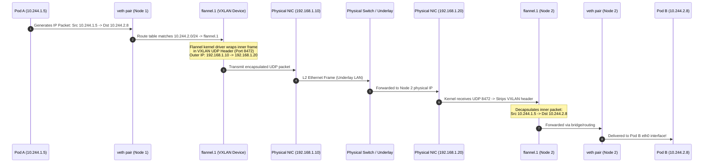

# Docker & Kubernetes Networking: From Netns to eBPF

As ShopEasy scaled beyond monolithic virtual machines, they adopted microservices. Instead of packaging each service into a heavy 20 GB VM with its own Linux kernel, they packaged applications into lightweight **Linux containers**. 

Yet running hundreds of isolated processes on shared host operating systems introduces a fundamental networking dilemma: **How can thousands of ephemeral containers communicate securely across hundreds of physical servers without IP address collisions, manual port mapping nightmares, or crippling performance overhead?**


---

## 1. The Building Blocks of Container Networking

Containers are not virtual machines. There is no hypervisor, no virtual BIOS, and no guest kernel. A container is simply an ordinary Linux process running in isolated kernel namespaces.

### Linux Network Namespaces (`netns`)
The Linux kernel maintains network resources—interfaces, routing tables, ARP tables, firewall rules, and socket lists—globally by default. The `CLONE_NEWNET` system call creates a **Network Namespace (`netns`)**, providing a process with its own private network stack.

```
 HOST ROOT NETWORK NAMESPACE                  CONTAINER NETWORK NAMESPACE (netns-web)
┌─────────────────────────────────────────┐  ┌────────────────────────────────────────┐
│ Host Physical NIC: eth0 (192.168.1.50)  │  │ Loopback: lo (127.0.0.1)               │
│ Host Routing Table                      │  │ Container Interface: eth0 (172.17.0.2) │
│ Host iptables rules                     │  │ Isolated Routing Table                 │
│                                         │  │ Isolated Sockets & Port Bindings       │
│               veth_host ◄═══════════════╪══╪════════════► veth_cont (renamed eth0)  │
└─────────────────────────────────────────┘  └────────────────────────────────────────┘
                       Virtual Ethernet (veth) Pair Pipe
```

### The Virtual Ethernet (`veth`) Pair
A network namespace starts with only a loopback interface (`lo`). To connect an isolated namespace to the outside world, the Linux kernel provides **Virtual Ethernet (`veth`) pairs**:
- A `veth` pair behaves like a virtual Ethernet cable with two RJ-45 jacks.
- Packets transmitted into one end instantly emerge out of the other end.
- One end stays in the host root namespace, while the other end is moved into the container's network namespace.

#### Manual Plumbing: Creating a Container Network by Hand
You can build Docker-style networking using raw Linux utilities:

```bash
# 1. Create a new isolated network namespace named "netns-web"
ip netns add netns-web

# 2. Create a veth pair: veth_host and veth_cont
ip link add veth_host type veth peer name veth_cont

# 3. Move veth_cont into the netns-web namespace
ip link set veth_cont netns netns-web

# 4. Rename veth_cont to standard eth0 inside the namespace
ip netns exec netns-web ip link set dev veth_cont name eth0

# 5. Assign IP addresses and bring interfaces up
ip addr add 172.17.0.1/24 dev veth_host
ip link set veth_host up

ip netns exec netns-web ip addr add 172.17.0.2/24 dev eth0
ip netns exec netns-web ip link set eth0 up
ip netns exec netns-web ip link set lo up

# 6. Add default gateway inside the container namespace pointing to veth_host
ip netns exec netns-web ip route add default via 172.17.0.1
```

---

## 2. Docker Networking & Port Mapping (DNAT)

When Docker starts on a Linux host, it creates a virtual Linux Layer 2 software bridge named **`docker0`** (typically assigned `172.17.0.1/16`).

```
                    Host Physical Network (192.168.1.0/24)
                                      │ (eth0: 192.168.1.100)
                                      ▼
                      ┌────────────────────────────────┐
                      │    iptables PREROUTING DNAT    │
                      │ :8080 ──► 172.17.0.2:80        │
                      └───────────────┬────────────────┘
                                      │
                         ┌────────────▼───────────┐
                         │   docker0 Linux Bridge │
                         │      (172.17.0.1)      │
                         └───────┬────────────┬───┘
                                 │            │
            ┌────────────────────┘            └────────────────────┐
            ▼ vethA                                                ▼ vethB
┌───────────────────────┐                              ┌───────────────────────┐
│ Container 1 (Web)     │                              │ Container 2 (API)     │
│ IP: 172.17.0.2        │                              │ IP: 172.17.0.3        │
│ eth0 (vethA peer)     │                              │ eth0 (vethB peer)     │
└───────────────────────┘                              └───────────────────────┘
```

### Docker Network Modes
1. **Bridge (`--net=bridge`, Default):** Every container gets its own network namespace, an IP from `docker0`, and attaches via a `veth` pair to the `docker0` bridge.
2. **Host (`--net=host`):** The container shares the host's root network namespace directly. Zero network virtualization overhead, but ports conflict with host processes (e.g. two containers cannot both bind to `:80`).
3. **None (`--net=none`):** Only a loopback interface is created. The container has no network connectivity (useful for secure batch cryptographic jobs).
4. **Container (`--net=container:<id>`):** Shares the exact network namespace of another container (the foundational primitive of Kubernetes Pods!).

### Port Mapping via Netfilter DNAT
When you run `docker run -p 8080:80 nginx`, external clients connect to the host's public IP on port 8080. How does traffic reach `172.17.0.2:80` inside the container?

Docker inserts a **Destination NAT (DNAT)** rule into the host's `iptables` `PREROUTING` chain:

```bash
# View Docker's nat PREROUTING table
iptables -t nat -L DOCKER -n -v

# The generated DNAT rule:
Chain DOCKER (2 references)
 pkts bytes target     prot opt in     out     source      destination         
    5   300 DNAT       tcp  --  !docker0 *     0.0.0.0/0   0.0.0.0/0   tcp dpt:8080 to:172.17.0.2:80
```

#### Why Port Mapping Breaks at Scale:
- **Port Clashes:** If you run 20 instances of an API on a single host, you must map them to random ports (8081, 8082, 8083...).
- **NAT Complexity:** Clients must know the specific host IP and translated port.
- **Service Discovery Overhead:** Load balancers must track dynamic host-port tuples.

---

## 3. Kubernetes Networking & The 3 Core Invariants

Kubernetes rejected Docker's host-port mapping model entirely. Instead, Kubernetes mandates an elegant, IP-per-Pod flat network model governed by **Three Fundamental Invariants**:


> ### The 3 Kubernetes Networking Invariants
> 1. **All Pods can communicate with all other Pods** on any node without Network Address Translation (NAT).
> 2. **All Nodes (system daemons like kubelet) can communicate with all Pods** on that node, and vice versa.
> 3. **The IP that a Pod sees itself as is the exact same IP that all other Pods and Nodes see it as.**

Because every Pod possesses its own unique, routable IP address across the entire cluster, applications can bind to standard well-known ports (like `:80` or `:443`) without port collision fears!

---

## 4. The Pod & The Pause Container

A Kubernetes **Pod** is not a container—it is a co-located group of one or more containers sharing storage and network resources.

```
 ┌────────────────────────────────────────────────────────────────────────┐
 │ POD: shopeasy-web-7f89b (IP: 10.244.1.44)                              │
 │                                                                        │
 │  ┌──────────────────────────────────────────────────────────────────┐  │
 │  │ SHARED NETWORK NAMESPACE                                         │  │
 │  │ IP: 10.244.1.44  │  Routing Table  │  Loopback (127.0.0.1)        │  │
 │  │                                                                  │  │
 │  │  ┌────────────────────┐   ┌─────────────────┐   ┌─────────────┐  │  │
 │  │  │ PAUSE CONTAINER    │   │ MAIN CONTAINER  │   │ SIDECAR     │  │  │
 │  │  │ (k8s.gcr.io/pause) │   │ (Node.js API)   │   │ (Envoy/Log) │  │  │
 │  │  │ Holds Netns Open   │   │ Listens :8080   │   │ Reads :8080 │  │  │
 │  │  └────────────────────┘   └────────┬────────┘   └──────▲──────┘  │  │
 │  │                                    │                   │         │  │
 │  │                                    └─► localhost:8080 ─┘         │  │
 │  └──────────────────────────────────────────────────────────────────┘  │
 └────────────────────────────────────────────────────────────────────────┘
```

### What is the Pause Container?
When Kubernetes schedules a Pod onto a worker node, the **first container started is always the `pause` container** (`k8s.gcr.io/pause`).
- The pause container is an ultra-minimal C program (~300 KB binary) that makes a single system call: `pause()`, sleeping indefinitely until receiving `SIGTERM`.
- **Purpose:** The pause container creates the Pod's network namespace (`netns`).
- When application containers (`Node.js`, `Nginx`, `Envoy sidecars`) are started, they join the pause container's network namespace using Docker's `--net=container:<pause-id>`.
- If an application container crashes and restarts, the network namespace, IP address, and socket bindings remain alive and intact because the pause container never dies!
- **Localhost Inter-Process Communication:** Because all containers in the Pod inhabit the same network namespace, they communicate over `localhost` at lightning memory bus speeds.

---

## 5. Container Network Interface (CNI) Plugins

Kubernetes does not implement the network fabric itself; it defines the **Container Network Interface (CNI)** specification. CNI plugins configure the network interfaces whenever a Pod is created or deleted.

```
                   CNI ARCHITECTURE LANDSCAPE
 ┌─────────────────┐     ┌───────────────────┐     ┌─────────────────────┐
 │  Flannel (VXLAN)│     │   Calico (BGP)    │     │   Cilium (eBPF)     │
 ├─────────────────┤     ├───────────────────┤     ├─────────────────────┤
 │ Overlay Network │     │ Flat Routed (L3)  │     │ Kernel eBPF Bypass  │
 │ Encapsulated UDP│     │ Pure BGP Peering  │     │ Bypasses iptables   │
 │ No NetworkPolicy│     │ High Perf + ACLs  │     │ L3-L7 Security      │
 └─────────────────┘     └───────────────────┘     └─────────────────────┘
```

### 1. Flannel: The Overlay Network (VXLAN)
Flannel creates an **overlay network** by encapsulating Layer 2 Ethernet frames inside Layer 4 UDP packets (**Virtual Extensible LAN, VXLAN**, destination port 8472 or 4789).
- **Pros:** Runs on top of any underlying network (AWS, GCP, bare metal) without network switch reconfiguration.
- **Cons:** ~50 bytes of VXLAN header overhead per packet; CPU penalty for encapsulation/decapsulation; does not support Kubernetes `NetworkPolicy`.

### 2. Calico: Pure Layer 3 BGP Routing
Calico avoids encapsulation entirely. Each Kubernetes node acts as a **Border Gateway Protocol (BGP)** virtual router:
- Every node advertises its Pod CIDR (`10.244.1.0/24`) to top-of-rack physical switches and neighboring nodes.
- Packets travel across the physical network with **zero encapsulation overhead** at full wire speed.
- Includes a robust policy engine that compiles Kubernetes `NetworkPolicy` objects into host `iptables` or IP sets.

### 3. Cilium: The eBPF Revolution
Cilium replaces Linux `iptables` and connection tracking entirely using **Extended Berkeley Packet Filter (eBPF)**:
- Programs are compiled and injected directly into the Linux kernel socket buffer (`sk_buff`) hooks (XDP, TC).
- Pod-to-Pod packet routing occurs directly in kernel space without traversing user space or slow `iptables` chains.
- Supports native Layer 7 security filtering (e.g. allow only `GET /v1/products`, block `POST /v1/admin`).

---

## 6. Pod-to-Pod Inter-Node VXLAN Packet Traversal

The following Mermaid diagram traces a packet sent from **Pod A on Node 1** to **Pod B on Node 2** over a Flannel VXLAN overlay network:



---

## 7. Kubernetes Services & kube-proxy

Pod IPs are **ephemeral**: when a Pod crashes or a Deployment performs a rolling update, new Pods receive brand-new IP addresses. If clients connected directly to Pod IPs, upstream systems would constantly fail.

A Kubernetes **Service** provides a stable, virtual IP address (**ClusterIP**) and persistent DNS entry that dynamically load balances traffic across an evolving set of backend Pods.

```
       Client Request to ClusterIP (10.96.0.100:80)
                         │
                         ▼
        ┌──────────────────────────────────┐
        │  kube-proxy (iptables / IPVS)    │
        │  Selects active backend Endpoint │
        └───────┬──────────────┬───────────┘
                │              │
        50% Prob│              │ 50% Prob
                ▼              ▼
     ┌──────────────────┐  ┌──────────────────┐
     │ Pod 1 (Healthy)  │  │ Pod 2 (Healthy)  │
     │ 10.244.1.14:8080 │  │ 10.244.2.22:8080 │
     └──────────────────┘  └──────────────────┘
```

### The ClusterIP Illusion
- A ClusterIP (e.g. `10.96.0.100`) **does not belong to any physical network card, virtual interface, or MAC address**.
- If you run `arping 10.96.0.100`, no device will ever respond.
- The ClusterIP is a purely mathematical construct programmed into the host Linux kernel's `iptables` or `IPVS` tables by the **`kube-proxy`** daemon!

### kube-proxy Operating Modes

#### 1. Userspace Mode (Legacy)
`kube-proxy` opens a listening socket on the host. Packets are redirected from kernel space to user space, proxying connections. Terrible performance due to constant context switches.

#### 2. iptables Mode (Standard)
`kube-proxy` writes deterministic chains of netfilter rules. When a packet targets `10.96.0.100:80`, iptables uses the **statistic module** with random probability to balance traffic across backends:

```bash
# How iptables balances 3 pods with 33% probability:
-A KUBE-SVC-WEB -m statistic --mode random --probability 0.33333 -j KUBE-SEP-POD1
-A KUBE-SVC-WEB -m statistic --mode random --probability 0.50000 -j KUBE-SEP-POD2
-A KUBE-SVC-WEB -j KUBE-SEP-POD3
```

- **Limitation:** In clusters with 5,000 services and 40,000 pods, iptables grows to hundreds of thousands of sequential rules, causing $O(N)$ packet latency degradation.

#### 3. IPVS Mode (High Scale)
Uses Linux **IP Virtual Server (LVS)**, a dedicated kernel-level transport-layer load balancer.
- Stores endpoints in **hash tables**, providing $O(1)$ lookup performance regardless of whether your cluster has 10 pods or 100,000 pods!
- Supports advanced balancing algorithms: Least Connections, Weighted Round Robin, Destination Hashing.

---

## 8. Interactive Lab: Kubernetes Service Simulator

Experiment with how Kubernetes handles pod churn and dynamic service load balancing below. Kill a pod, resurrect another, and observe how traffic dispatched to the stable `ClusterIP` dynamically adapts:

<K8sServiceSimulator />

---

## 9. Ingress Controllers: Layer 7 Routing

While `ClusterIP` and `NodePort` operate at Layer 4 (TCP/UDP), modern microservices require Layer 7 HTTP intelligence:
- Routing by URL path: `/api/v1/orders` $\to$ Order Service; `/static` $\to$ Asset Service.
- Routing by Host Header: `shop.com` vs. `admin.shop.com`.
- Centralized TLS Termination with automatic Let's Encrypt certificates.

An **Ingress Controller** (such as Ingress-NGINX, Traefik, Envoy, or AWS ALB Controller) is a specialized reverse proxy pod running in your cluster that reads `Ingress` custom resources and translates them into live proxy configurations:

```yaml
apiVersion: networking.k8s.io/v1
kind: Ingress
metadata:
  name: shopeasy-ingress
  annotations:
    nginx.ingress.kubernetes.io/ssl-redirect: "true"
spec:
  ingressClassName: nginx
  tls:
  - hosts:
    - shopeasy.com
    secretName: shopeasy-tls-cert
  rules:
  - host: shopeasy.com
    http:
      paths:
      - path: /api/checkout
        pathType: Prefix
        backend:
          service:
            name: checkout-service
            port:
              number: 8080
      - path: /
        pathType: Prefix
        backend:
          service:
            name: web-frontend-service
            port:
              number: 80
```

---

## 10. CoreDNS & The "ndots:5" Performance Pitfall

Every Kubernetes Pod automatically receives a `/etc/resolv.conf` file populated by the kubelet pointing to the cluster's internal **CoreDNS** service:

```ini
# /etc/resolv.conf inside a Pod
nameserver 10.96.0.10
search default.svc.cluster.local svc.cluster.local cluster.local us-east-1.compute.internal
options ndots:5
```

### How Cluster DNS Resolves Services
When Pod A queries `checkout`, the resolver iterates through the search list:
1. `checkout.default.svc.cluster.local` $\to$ **Match!** Returns `10.96.0.150`.

### The "ndots:5" Catastrophe
What does `ndots:5` mean?
If a domain name has **fewer than 5 dots**, the Linux resolver treats it as an internal cluster domain and appends every entry in the `search` list *before* querying the raw domain!

Consider an external API call to `api.stripe.com` (which has only 2 dots):
1. Query 1: `api.stripe.com.default.svc.cluster.local.` $\to$ **NXDOMAIN** (Error)
2. Query 2: `api.stripe.com.svc.cluster.local.` $\to$ **NXDOMAIN** (Error)
3. Query 3: `api.stripe.com.cluster.local.` $\to$ **NXDOMAIN** (Error)
4. Query 4: `api.stripe.com.us-east-1.compute.internal.` $\to$ **NXDOMAIN** (Error)
5. Query 5: `api.stripe.com.` $\to$ **200 OK!** (Finally returns public IP)

> [!WARNING] The 5x DNS Query Tax
> Every single outbound HTTPS request to an external SaaS provider triggers **4 failed DNS queries** before succeeding! At high traffic volumes, this floods CoreDNS, causing throttling, connection timeouts, and microservice latencies.

#### The Production Fix:
1. **Append a trailing dot:** In application configuration, specify `api.stripe.com.` (the trailing dot tells the resolver the domain is fully qualified, bypassing `search` paths immediately).
2. **Override Pod DNS options:**
```yaml
spec:
  dnsConfig:
    options:
      - name: ndots
        value: "2"
```

---

## 11. Kubernetes NetworkPolicies: Cluster Micro-Segmentation

By default, Kubernetes implements a **flat, non-isolated network**: any Pod can talk to any other Pod across any namespace. If a compromised frontend container is hacked, an attacker can pivot across the internal network to dump your private database.

A **NetworkPolicy** is a Kubernetes declarative firewall rule evaluated at Layer 3/Layer 4:

```yaml
apiVersion: networking.k8s.io/v1
kind: NetworkPolicy
metadata:
  name: protect-database
  namespace: production
spec:
  podSelector:
    matchLabels:
      role: database          # Apply to PostgreSQL pods
  policyTypes:
  - Ingress
  ingress:
  - from:
    - podSelector:
        matchLabels:
          role: backend-api   # Allow ONLY pods labeled role=backend-api
    ports:
    - protocol: TCP
      port: 5432              # Allow ONLY port 5432
```

> [!IMPORTANT] CNI Enforcement Requirement
> NetworkPolicies are declarative API objects. **Kubernetes does not enforce them directly.** If your cluster uses Flannel without a policy engine, NetworkPolicy objects are completely ignored! You must use a security-capable CNI like **Calico**, **Cilium**, or **Weave Net** to enforce isolation in kernel space.

---

## 12. Summary: The Container Networking Evolution

| Mechanism | Technology | Architectural Function |
| :--- | :--- | :--- |
| **Process Isolation** | Linux Network Namespaces (`netns`) | Creates isolated interfaces, routing tables, and socket spaces |
| **Host-Container Bridge** | `veth` pair + `docker0` bridge | Connects isolated container namespaces to the host Linux network |
| **Docker Ingress** | Netfilter DNAT (`iptables -t nat`) | Maps external host ports to container private ports |
| **Pod Co-location** | Pause Container (`CLONE_NEWNET`) | Holds network namespace open across container restarts; enables `localhost` IPC |
| **Cluster Overlay** | CNI Plugins (Flannel, Calico, Cilium) | Delivers flat IP-per-Pod routability across multi-node clusters |
| **Service Virtualization** | `kube-proxy` (iptables / IPVS / eBPF) | Translates static `ClusterIP` to dynamic Pod endpoints with zero-downtime routing |
| **L7 Routing** | Ingress Controllers (NGINX / Envoy) | Path, host-header, and TLS termination for HTTP microservices |
| **Zero-Trust Security** | Kubernetes `NetworkPolicy` | Enforces micro-segmentation firewall rules at the Pod boundary |
