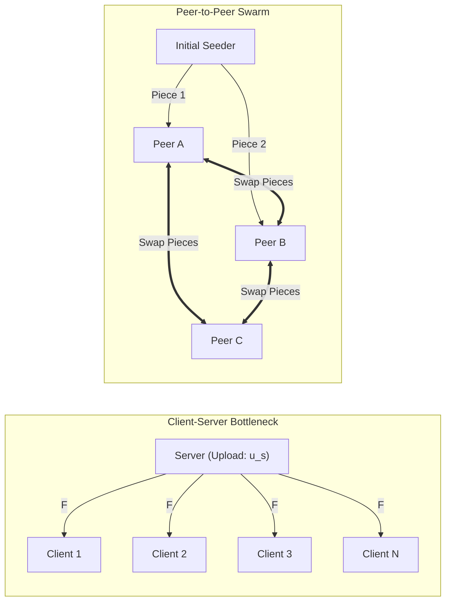
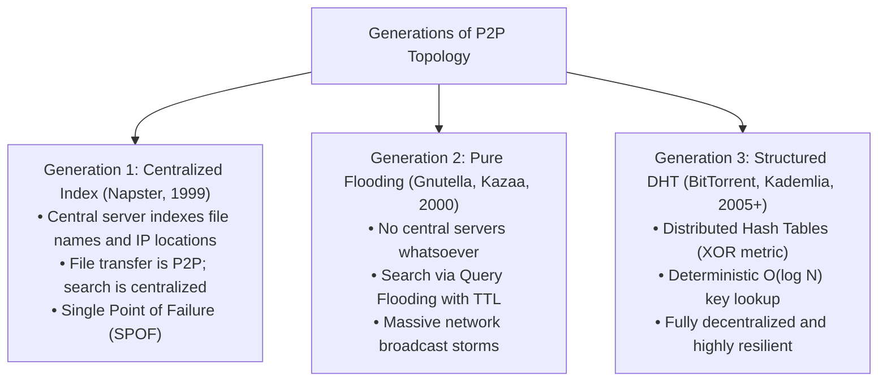
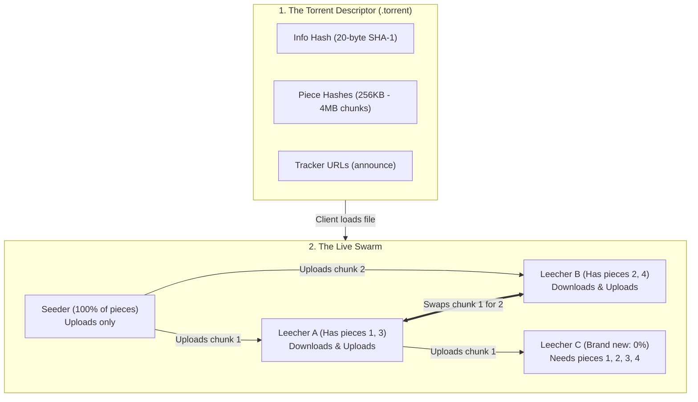
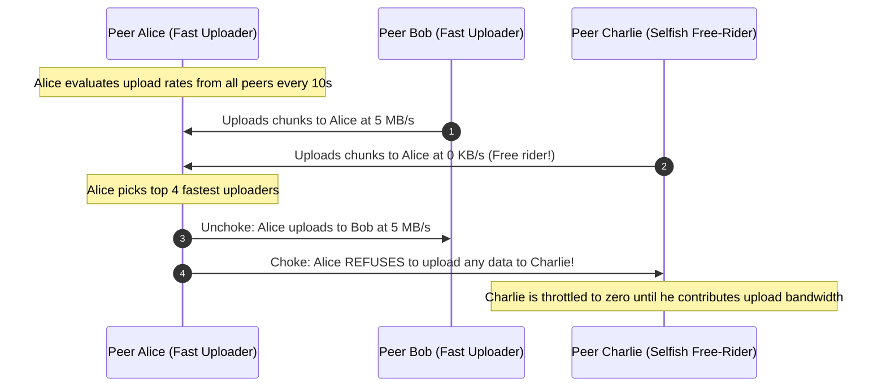
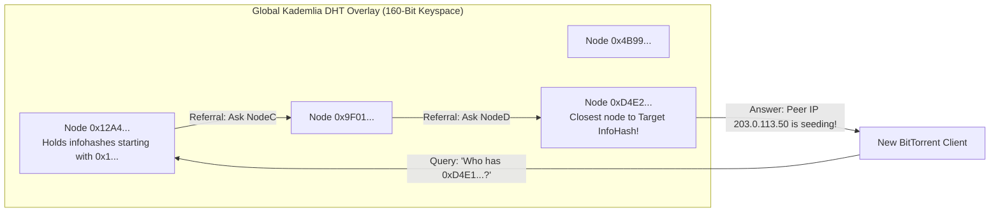
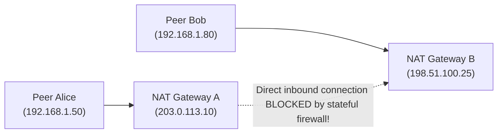

import { Callout } from 'fumadocs-ui/components/callout';
import { Step, Steps } from 'fumadocs-ui/components/steps';
import { Card, Cards } from 'fumadocs-ui/components/card';
import { Tab, Tabs } from 'fumadocs-ui/components/tabs';

# Peer-to-Peer (P2P) Architecture & Distributed Networks

For the vast majority of web interactions—visiting a website, streaming a video on YouTube, or querying a database—the Internet operates on a strictly asymmetric paradigm: the **Client-Server model**. Powerful servers sitting in climate-controlled datacenters shoulder the entire burden of storing data, running computation, and provisioning massive network upload bandwidth, while millions of resource-constrained clients simply consume.

However, when an operating system vendor needs to distribute a 5-gigabyte update to 500 million computers simultaneously on launch day, or when millions of users wish to exchange petabytes of media without paying cloud hosting bills, the client-server model collapses under bandwidth costs and server bottleneck saturation.

This dilemma gave birth to **Peer-to-Peer (P2P) Distributed Networks**. In a P2P architecture, every node on the periphery of the Internet acts as both a consumer and a provider—a **servent** (server + client).

In this chapter, we explore P2P systems from first principles: mathematical scalability, BitTorrent swarms, piece-selection game theory, trackerless Distributed Hash Tables (DHT), and modern enterprise hybrid applications.

---

## 1. The Fundamental Architectural Divide: Client-Server vs. P2P

To understand why P2P is mathematically revolutionary, consider the problem of distributing a large file of size $F$ (e.g. a 4 GB Linux ISO image) to $N$ independent client machines across the globe.


### The Mathematics of File Distribution

Let:
- $F$ = Size of the file in bits.
- $N$ = Number of client peers requesting the file.
- $u_s$ = Server upload bandwidth capacity.
- $d_{min}$ = Download bandwidth of the slowest client peer.
- $u_i$ = Upload bandwidth contributed by peer $i$.



#### 1. Client-Server Distribution Time ($D_{cs}$)
In a centralized client-server architecture, the server must transmit a distinct copy of file $F$ to every one of the $N$ clients. The server must upload $N \times F$ bits in total:

$$D_{cs} \ge \max \left( \frac{F}{d_{min}}, \frac{N \cdot F}{u_s} \right)$$

- If 1,000 clients request a 4 GB file from a server with a 1 Gbps uplink, the minimum distribution time is:
  $$D_{cs} \ge \frac{1000 \times (4 \times 8 \times 10^9\text{ bits})}{10^9\text{ bps}} = 32,000\text{ seconds} \approx \mathbf{8.9\text{ hours}}$$
- **Scalability Limitation:** As the number of clients $N$ grows linearly, distribution time grows **linearly ($O(N)$)**. The server quickly encounters CPU, socket, or bandwidth exhaustion.

#### 2. Peer-to-Peer Distribution Time ($D_{p2p}$)
In a P2P network, the initial server only needs to upload each piece of the file **once** into the swarm. Once a peer downloads a chunk, that peer immediately uploads that chunk to other peers. 

The total upload capacity of the entire system is the sum of the server's upload capacity plus the upload capacities of all $N$ peers:

$$D_{p2p} \ge \max \left( \frac{F}{u_s}, \frac{F}{d_{min}}, \frac{N \cdot F}{u_s + \sum_{i=1}^N u_i} \right)$$

- **Self-Scaling Magic:** In P2P, **each new consumer is also a new producer!** As $N$ increases, the denominator ($u_s + \sum u_i$) increases concurrently. 
- While $D_{cs}$ heads toward infinity as $N \to \infty$, $D_{p2p}$ approaches a horizontal asymptote bounded simply by the physical download limits of the clients:
  $$\lim_{N \to \infty} D_{p2p} \approx \frac{F}{\bar{u}}$$

---

## 2. The Three Generations of P2P Architecture

P2P networks evolved across three distinct architectural generations in response to technical bottlenecks, single points of failure, and legal pressures:



### Generation 1: Centralized Directory (Napster, 1999)
- **Mechanism:** Peers connected to a central cluster of Napster servers. Each peer uploaded a list of files it was willing to share. When Alice searched for "song.mp3", the Napster server looked up the filename in a database and gave Alice Bob's IP address (`198.51.100.42:6699`). Alice then downloaded the file directly from Bob via HTTP.
- **Flaw:** The central indexing server was a critical **Single Point of Failure (SPOF)**. When federal courts ordered Napster's central index shut down in 2001, the entire network died overnight.

### Generation 2: Query Flooding (Gnutella, 2000)
- **Mechanism:** In response to Napster's shutdown, developers designed a "pure" P2P network with zero central servers. When Alice searched for a file, she sent a `Query` message to all 5 of her connected neighbors. Each neighbor forwarded the query to all of their neighbors, creating an exponential broadcast flood bounded by a Time-to-Live (TTL) counter (typically 7 hops).
- **Flaw:** Query flooding generated catastrophic network congestion ($O(N^d)$ packets). If a file resided 8 hops away outside Alice's TTL horizon, it was completely invisible.

### Generation 3: Structured P2P & Distributed Hash Tables (BitTorrent, Kademlia, IPFS)
- Instead of random flooding or fragile central servers, modern P2P networks organize nodes into structured geometric topologies using **Consistent Hashing** and **Distributed Hash Tables (DHT)**, providing deterministic $O(\log N)$ lookup guarantees without any centralized coordination.

---

## 3. BitTorrent Protocol Deep Dive

Created by Bram Cohen in 2001, **BitTorrent (RFC 5694 / BEP 3)** is the undisputed gold standard of P2P file-sharing protocols. It handles file transfers ranging from open-source operating system distributions to massive machine learning model weights.

### The BitTorrent Ecosystem: Anatomy of a Swarm



#### Key Terminology:
- **Metainfo (`.torrent` file):** A bencoded metadata file containing:
  - File name, total size, and chunk size (typically 256 KB to 4 MB).
  - A contiguous list of **SHA-1 hashes** (20 bytes each) for every single piece.
  - The **Info Hash**: The SHA-1 hash of the bencoded `info` dictionary, serving as the globally unique cryptographic identifier for that specific dataset.
- **Swarm:** The collective mesh of all peers participating in transferring a specific torrent.
- **Seeder:** A peer that possesses **100% of the complete file** and continues uploading to the swarm without downloading.
- **Leecher:** A peer that possesses only a partial set of pieces (or 0%) and is actively downloading missing pieces while simultaneously uploading pieces it already has.

---

### Algorithmic Piece Selection in BitTorrent

How does a BitTorrent client decide which 256 KB chunk to request next out of 10,000 available pieces? It does not download sequentially from beginning to end!

<Steps>
### Step 1: Random First Piece
When a brand-new leecher joins a swarm with zero pieces, it has nothing to upload to others. To bootstrap as quickly as possible, it selects a **random piece** from any available peer. Once this first piece completes, the peer can immediately start offering it to neighbors in exchange for new data.

### Step 2: The Rarest-First Algorithm
Once a peer has bootstrapped, it switches strictly to **Rarest-First**:
- Peers periodically exchange **Bitfield** messages indicating which pieces they own.
- The client counts the availability of each piece across all connected peers.
- The client requests pieces that are **least replicated in the swarm first**!
- **Why Rarest-First is Genius:**
  1. It prevents rare pieces from vanishing if the only seeder disconnects unexpectedly.
  2. It maximizes chunk variety across the swarm, ensuring peers always have unique pieces to trade with one another.
  3. It protects the swarm against the "last chunk" bottleneck.

### Step 3: Endgame Mode
Near the end of a download (when only 1 or 2 pieces remain), a slow or dropped connection from an unresponsive peer can stall completion for minutes. In **Endgame Mode**, the client transmits requests for the remaining missing blocks to **all connected peers simultaneously**. Whichever peer delivers the block first wins, and the client sends `Cancel` messages to all others.
</Steps>

---

### Game Theory & Incentive Alignment: Tit-for-Tat

P2P networks face a classic economic hazard: the **Free-Rider Problem** (Tragedy of the Commons). What stops selfish leechers from configuring their client to download at 100 Mbps while setting their upload rate to 0 Kbps?

BitTorrent solves this using an algorithm inspired by Robert Axelrod's Iterated Prisoner's Dilemma: **Tit-for-Tat (Choking & Unchoking)**.



#### 1. Regular Unchoking (Top 4 Peers)
Every 10 seconds, each BitTorrent client measures the download speeds it is receiving from all connected peers. It unchokes (permits uploading to) the **top 4 peers** that are delivering data to it the fastest. All other peers are **choked** (blocked from downloading).

#### 2. Optimistic Unchoking (Discovering New Peers)
If everyone only uploaded to their existing fastest peers, a brand new peer with 0% data would be permanently choked and never be able to download anything. 

To solve this, every 30 seconds, each peer selects **one random peer** from its choked list and unchokes them, regardless of their current upload contribution.
- If the new peer is on a high-speed fiber connection, it will quickly begin uploading back to the host, knocking out one of the previous top 4 peers.
- This continuously probes the swarm for optimal peer routes while allowing new leechers to bootstrap.

---

## 4. Trackerless P2P: Distributed Hash Tables (DHT) & Kademlia

In traditional BitTorrent, clients discovered peers by contacting a centralized web service known as a **Tracker** via HTTP or UDP:

```text
GET /announce?info_hash=%89%ab%cd...&peer_id=-qB4500-...&port=6881 HTTP/1.1
Host: tracker.opentrackr.org:1337
```

If the tracker was blocked, DDOSed, or seized, peers could no longer find each other. In 2005, BitTorrent introduced **BEP 5 (Trackerless Torrents)** powered by the **Kademlia Distributed Hash Table (DHT)**.



### The Kademlia XOR Metric

In Kademlia DHT, both network nodes (clients) and stored items (torrents) are assigned a **160-bit identifier**:
- **Node ID:** A random 160-bit integer chosen by the client when it boots.
- **Key (Info Hash):** The 160-bit SHA-1 hash of the torrent metainfo.

The "distance" between any two identifiers $x$ and $y$ is computed using the **Bitwise XOR ($\oplus$) metric**:

$$d(x, y) = x \oplus y$$

#### Mathematical Properties of the XOR Metric:
1. $d(x, x) = 0$ (Distance from an identifier to itself is 0).
2. $d(x, y) > 0$ for $x \neq y$ (Non-negativity).
3. $d(x, y) = d(y, x)$ (Symmetry: distance from $A$ to $B$ equals distance from $B$ to $A$).
4. $d(x, z) \le d(x, y) \oplus d(y, z)$ (Triangle inequality).

### The Routing Table: $k$-Buckets
Each DHT node maintains a list of known peers organized into **$k$-buckets** (typically $k = 8$ or $20$).
- Bucket $i$ holds contacts whose XOR distance from the node's own ID falls between $2^i$ and $2^{i+1}$.
- Because buckets store detailed knowledge of nodes close to itself and exponentially fewer contacts for nodes far away, routing queries toward any target 160-bit key converges in **$O(\log N)$ routing hops**!

### Magnet Links: The Death of the `.torrent` File

A **Magnet Link** (RFC urn:btih) eliminates the need to download a physical `.torrent` file from a website. It encodes the 160-bit infohash directly into a URI:

```text
magnet:?xt=urn:btih:da39a3ee5e6b4b0d3255bfef95601890afd80709&dn=Ubuntu-24.04-Desktop.iso&tr=udp%3A%2F%2Ftracker.opentrackr.org%3A1337
```

- `xt=urn:btih:` (Exact Topic / BitTorrent Info Hash): The 40-character hexadecimal cryptographic hash.
- `dn=` (Display Name): Human-readable filename.
- `tr=` (Trackers): Optional fallback trackers.

When a client clicks a magnet link, it queries its local DHT routing table for nodes closest to `da39a3...`. It contacts those nodes to find active peers, downloads the torrent metadata dictionary directly from those peers via the BitTorrent Extension Protocol (BEP 9), and immediately begins downloading the payload!

---

## 5. Real-World Applications & Modern Hybrid Architectures

P2P is no longer confined to underground media sharing. Modern enterprise tech giants rely heavily on P2P principles to distribute enormous software payloads at datacenter scale:

<Cards>
  <Card title="Linux & OS Distributions" icon="Server">
    Debian, Ubuntu, Arch Linux, and Fedora distribute official ISO installation images via BitTorrent to save millions of dollars in monthly mirror hosting bandwidth and protect against launch-day DDOS crashes.
  </Card>
  <Card title="Windows Update Delivery Optimization (WUDO)" icon="Laptop">
    Windows 10 and 11 incorporate native P2P local network caching. When one office PC downloads a patch from Microsoft servers, it shares that patch locally with all other computers on the LAN over port 7680, slashing corporate WAN congestion by up to 90%.
  </Card>
  <Card title="Datacenter Container Image Distribution (Uber Kraken / Dragonfly)" icon="Boxes">
    When deploying a new microservice container across 20,000 servers simultaneously in a cluster, a centralized Docker registry crashes. Uber built **Kraken**, and CNCF hosts **Dragonfly**—internal P2P swarms that blast container image layers across thousands of production servers in seconds.
  </Card>
  <Card title="Blockchain Consensus Networks (Bitcoin / Ethereum)" icon="Coins">
    Cryptocurrencies have no central bank. Bitcoin nodes maintain a peer-to-peer gossip network over TCP port 8333, broadcasting new transactions and mined blocks across the globe in seconds without trusting any central authority.
  </Card>
</Cards>

---

## 6. P2P Technical Challenges: NAT Traversal & Firewalls

The greatest technical obstacle facing modern P2P protocols is that **most consumer computers do not have public IP addresses**. As covered in our NAT chapter, consumer machines reside behind home Wi-Fi routers with private RFC 1918 IPs.

If Alice is behind NAT Gateway A and Bob is behind NAT Gateway B, **neither peer can initiate an inbound TCP or UDP connection to the other!**



### The Solution: NAT Traversal (STUN, UPnP & Hole Punching)

1. **Universal Plug and Play (UPnP) / NAT-PMP:** The client asks the local router via an internal RPC: *"Please open WAN port 6881 and forward all traffic to my local IP."* If enabled on the home router, incoming connections work automatically.
2. **UDP Hole Punching (STUN - Session Traversal Utilities for NAT):** Both Alice and Bob connect outbound to a mutual rendezvous server (or DHT node). The server informs each peer of the external public IP and port mapped by their respective NAT gateways. Both peers then transmit simultaneous UDP packets to each other's mapped public ports, punching temporary holes through their stateful firewalls.
3. **Relay Servers (TURN):** If one or both peers are behind a strict Symmetric NAT, direct peer-to-peer connections are mathematically impossible. The connection must fall back to relaying traffic through a third-party server.

---

## 7. Hands-On Lab: Inspecting Torrent Metadata from the Terminal

You can inspect the binary bencoded anatomy of any torrent metainfo file using Python directly from your terminal without third-party tools:

<Tabs items={["Inspect Torrent Script", "Example Output"]}>
  <Tab value="Inspect Torrent Script">
```python
# Save as inspect_torrent.py
import urllib.request
import hashlib

# Example: Inspecting BitTorrent Bencoding format
def parse_info_hash(torrent_bytes):
    # Search for the '4:info' key delimiter in the bencoded dictionary
    info_start = torrent_bytes.find(b'4:info') + 6
    # In a full client, you parse bencoding; here we compute SHA-1 of the info dict
    info_dict = torrent_bytes[info_start:-1]
    info_hash = hashlib.sha1(info_dict).hexdigest()
    return info_hash

print("BitTorrent Metainfo Anatomy:")
print("• 20-byte SHA-1 InfoHash uniquely identifies the content.")
print("• Piece length typically ranges from 262,144 (256KB) to 4,194,304 (4MB) bytes.")
print("• Each piece has a dedicated 20-byte verification checksum.")
```
  </Tab>
  <Tab value="Example Output">
```text
BitTorrent Metainfo Anatomy:
• 20-byte SHA-1 InfoHash uniquely identifies the content.
• Piece length typically ranges from 262,144 (256KB) to 4,194,304 (4MB) bytes.
• Each piece has a dedicated 20-byte verification checksum.
```
  </Tab>
</Tabs>

---

## 8. Engineering Summary & Quick Recall

- **Client-Server vs. P2P:** Centralized architectures scale at $O(N)$ distribution time; P2P leverages downloaders as uploaders, achieving near-constant distribution time as swarms scale.
- **Swarm Participants:** Seeders upload complete copies; Leechers download missing chunks while uploading acquired pieces to other peers.
- **Rarest-First Algorithm:** Prioritizes pieces with the lowest replication count across the swarm, preventing piece extinction and maximizing trading diversity.
- **Tit-for-Tat Game Theory:** Chokes peers that fail to contribute upload bandwidth, rewarding the top 4 fastest uploaders and optimistically unchoking 1 random peer every 30 seconds to discover new routes.
- **Kademlia DHT:** Replaces fragile centralized trackers with a trackerless 160-bit XOR metric overlay, enabling $O(\log N)$ peer lookups.
- **Magnet Links:** Contain only the 40-character cryptographic infohash, allowing clients to bootstrap directly from the DHT without downloading `.torrent` files.
- **Modern Deployments:** Powers operating system updates (WUDO), datacenter container deployment (Uber Kraken), and decentralized blockchains (Bitcoin, Ethereum).
