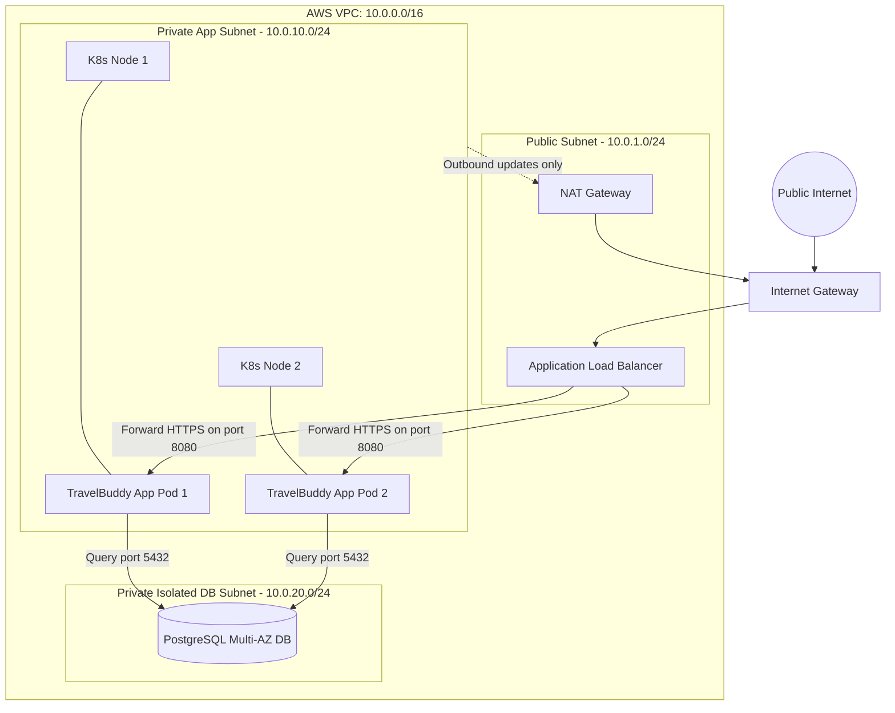

import { Callout } from 'fumadocs-ui/components/callout';
import { Steps, Step } from 'fumadocs-ui/components/steps';

Welcome to the Stage 4 Capstone: **Enterprise Cloud VPC & Kubernetes Ingress Architecture**.

In this milestone project, you will design the production cloud networking architecture for **TravelBuddy** as it transitions from legacy on-premises servers to a scalable AWS Cloud VPC and multi-node Kubernetes container cluster.

---

## Architectural Specification



---

## Implementation Tasks

<Steps>
<Step>
### Task 1: CIDR Supernet & Subnet Allocation
Allocate subnets within the `10.0.0.0/16` VPC block:
* **Public DMZ Subnet:** `10.0.1.0/24` (houses ALB and Managed NAT Gateway).
* **Private EKS Worker Nodes Subnet:** `10.0.10.0/24` (houses Kubernetes worker nodes).
* **Isolated Database Subnet:** `10.0.20.0/24` (no default route to IGW or NAT).
</Step>

<Step>
### Task 2: Route Table Engineering
Configure routing tables to enforce strict isolation:
* **Public Route Table:**
  * `10.0.0.0/16` $\rightarrow$ `local`
  * `0.0.0.0/0` $\rightarrow$ `igw-0a1b2c3d`
* **Private App Route Table:**
  * `10.0.0.0/16` $\rightarrow$ `local`
  * `0.0.0.0/0` $\rightarrow$ `nat-0987fedc` (enables Pods to pull container images and reach external APIs without accepting inbound Internet connections).
* **Database Route Table:**
  * `10.0.0.0/16` $\rightarrow$ `local` (completely air-gapped from Internet traffic).
</Step>

<Step>
### Task 3: Stateful Security Group Chaining
Chain security group rules using reference IDs instead of hardcoded IP addresses:

```json
{
  "AlbSecurityGroup": {
    "Inbound": [
      { "Port": 443, "Protocol": "tcp", "Source": "0.0.0.0/0" }
    ],
    "Outbound": [
      { "Port": 8080, "Protocol": "tcp", "Destination": "sg-k8s-nodes" }
    ]
  },
  "K8sNodesSecurityGroup": {
    "Inbound": [
      { "Port": 8080, "Protocol": "tcp", "Source": "sg-alb" }
    ],
    "Outbound": [
      { "Port": 5432, "Protocol": "tcp", "Destination": "sg-rds" },
      { "Port": 443, "Protocol": "tcp", "Destination": "0.0.0.0/0" }
    ]
  },
  "RdsSecurityGroup": {
    "Inbound": [
      { "Port": 5432, "Protocol": "tcp", "Source": "sg-k8s-nodes" }
    ],
    "Outbound": []
  }
}
```
</Step>
</Steps>

---

## Zero-Trust Verification

1. Verify that database instances in `10.0.20.0/24` have no public IP addresses assigned.
2. Verify that an attacker sending direct HTTP packets to a Kubernetes Pod in `10.0.10.0/24` is dropped at the VPC border because no public routing exists to that subnet.
3. Test that outbound security updates from Pods transit the NAT Gateway with source IP masquerading.
