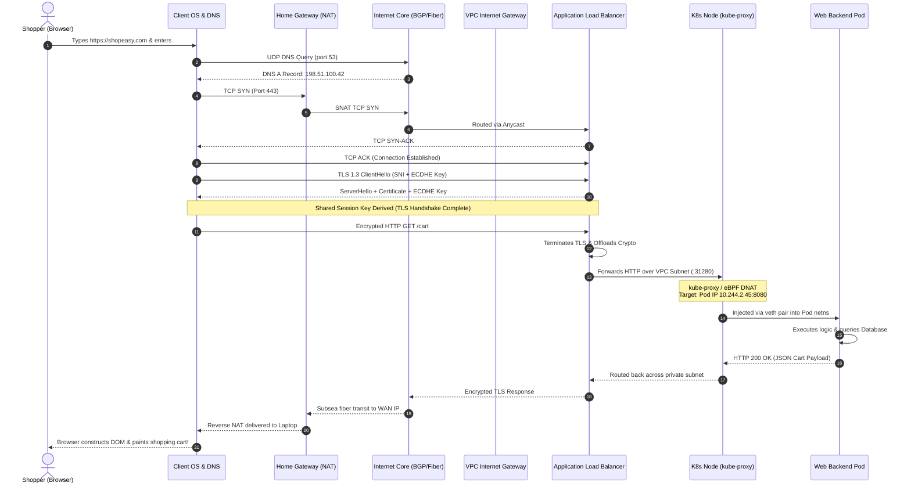

# The Full Packet Journey & Networking Cheatsheet

Throughout this curriculum, we have dissected the layers of computer networking: physical copper and optical glass, Ethernet switching, IP routing, TCP handshakes, TLS encryption, cloud VPCs, and Kubernetes overlays.

Now, we synthesize everything. We will trace the **entire lifecycle of a single HTTP request** as a user visits ShopEasy, following every microscopic event across operating systems, subsea fiber optic cables, and container kernels.


---

## 1. The Interactive Packet Journey

Step through each major milestone in the end-to-end transmission flow using the interactive simulator below:

<PacketJourneyFlow />

---

## 2. The 14-Step End-to-End Packet Lifecycle

Let us trace a user sitting in London who opens their laptop, types `https://shopeasy.com/cart` into their browser address bar, and presses **Enter**.

```
[ User Laptop ] ──► [ Home Router ] ──► [ Subsea Fiber ] ──► [ Cloud VPC ] ──► [ K8s Pod ]
```

---

### Step 1: Keystroke, URL Parsing & HSTS
1. The operating system window manager registers the **Enter** keypress event and delivers it to the browser's UI thread.
2. The browser parses the URL:
   - **Protocol:** `https` (indicates TLS encryption on TCP port 443).
   - **Hostname:** `shopeasy.com`.
   - **Resource Path:** `/cart`.
3. **HSTS Preload Check:** The browser inspects its internal HTTP Strict Transport Security (HSTS) database. Because `shopeasy.com` is registered, the browser enforces HTTPS immediately, refusing to send any plaintext HTTP request.

---

### Step 2: Layer 7 DNS Resolution
Before a single TCP packet can be created, the browser must map the human-readable domain name `shopeasy.com` to an IP address.

```
Browser Cache ──► OS Cache (/etc/hosts) ──► Recursive Resolver ──► Root/TLD/Authoritative DNS
```

1. **Local Caches:** The browser checks its internal DNS cache (Chrome: `chrome://net-internals/#dns`). If missed, it calls the OS resolver (`getaddrinfo` on Linux or `DnsQuery` on Windows), which checks the local `/etc/hosts` file and system DNS cache.
2. **Recursive Query:** On a cache miss, the OS transmits a UDP query (destination port 53) to the configured recursive resolver (e.g. `8.8.8.8` or the local ISP router `192.168.1.1`).
3. **Iterative Hierarchy Walk:**
   - Recursive resolver queries a **Root Nameserver (`.`)**, which refers it to the **`.com` Top-Level Domain (TLD) Nameservers**.
   - The `.com` TLD nameserver refers it to the **Authoritative Nameservers** for `shopeasy.com` (e.g. AWS Route 53 or Cloudflare).
   - The authoritative server returns an **A Record** (`198.51.100.42`) and an **AAAA Record** (`2001:db8::42`).
4. The OS caches the DNS response respecting the Time-To-Live (TTL) and returns the IP address to the browser.

---

### Step 3: Layer 4 TCP 3-Way Handshake
With the target IP address known, the browser requests the OS kernel create a TCP stream socket (`AF_INET`, `SOCK_STREAM`).

1. The OS kernel selects an unused **ephemeral source port** (e.g. `52418`) and generates a cryptographically random Initial Sequence Number ($ISN_c = 1000$).
2. **Packet 1 (SYN):** The client sends a TCP segment with the `SYN` flag set to `198.51.100.42:443`, specifying TCP options:
   - Maximum Segment Size (MSS = 1460 bytes).
   - Window Scale factor (enabling large receive windows).
   - Selective Acknowledgments (SACK-permitted).
3. **Packet 2 (SYN-ACK):** The remote server receives the SYN, generates its own sequence number ($ISN_s = 5000$), acknowledges the client ($ACK = 1001$), and sets the `SYN` and `ACK` flags.
4. **Packet 3 (ACK):** The client acknowledges the server ($ACK = 5001$). The socket state transitions to **`ESTABLISHED`**.

---

### Step 4: Layer 5/6 TLS 1.3 Cryptographic Handshake
With the reliable transport pipe open, the client secures the channel against eavesdropping and tampering.


1. **ClientHello:** The browser sends a `ClientHello` message containing:
   - Supported TLS versions (`TLS 1.3`).
   - Supported Cipher Suites (e.g. `TLS_AES_256_GCM_SHA384`).
   - **Server Name Indication (SNI):** Specifies `shopeasy.com` so the server can present the correct virtual certificate.
   - **Key Share:** A public Diffie-Hellman parameter generated by the client.
2. **ServerHello & Certificate:** The server replies with:
   - Selected cipher suite and its own Diffie-Hellman key share.
   - Its **X.509 Digital Certificate**, signed by a trusted Certificate Authority (CA).
3. **Verification & Key Derivation:**
   - The browser verifies the certificate cryptographic signature against its pre-installed Root CA store.
   - Both client and server combine their public key shares via **Elliptic Curve Diffie-Hellman Ephemeral (ECDHE)** to independently compute an identical, shared symmetric session key.
4. Total latency: **Only 1 Round-Trip Time (1-RTT)**! All subsequent data is encrypted with AES-GCM or ChaCha20-Poly1305.

---

### Step 5: Local Network Egress (L2 / L3 Encapsulation)
The browser writes the encrypted HTTP GET request into the kernel socket buffer:
`GET /cart HTTP/1.1\r\nHost: shopeasy.com\r\nUser-Agent: Mozilla/5.0...`

```
┌─────────────────┬────────────────┬────────────────┬──────────────────────────┐
│ Ethernet Header │ IPv4 Header    │ TCP Header     │ Encrypted TLS / HTTP Data│
│ Dest: MAC_Router│ Src: 192.168.1.50│ SrcPort: 52418 │ Length: 485 bytes        │
│ Src:  MAC_Laptop│ Dst: 198.51.100.42│ DstPort: 443   │                          │
└─────────────────┴────────────────┴────────────────┴──────────────────────────┘
```

1. **Routing Decision:** The laptop OS examines its local routing table (`ip route`):
   - Destination `198.51.100.42` does not match local subnet `192.168.1.0/24`.
   - The packet is routed via the **Default Gateway** (`192.168.1.1`).
2. **Address Resolution (ARP):** The OS inspects its ARP cache for the MAC address of `192.168.1.1`. If not present, it broadcasts an **ARP Request** (`Who has 192.168.1.1? Tell 192.168.1.50`). The home router replies with its hardware MAC address.
3. **Serialization:** The network interface card (NIC) converts digital bits into radio frequency modulations (Wi-Fi 802.11ax) or electrical pulses over copper twisted-pair.

---

### Step 6: Home Router, NAT & ISP Gateway
1. The home Wi-Fi router receives the radio frame, verifies the Frame Check Sequence (FCS), and strips the Layer 2 802.11 header.
2. **Network Address Translation (NAT/PAT):**
   - The router replaces the private source IP `192.168.1.50:52418` with its assigned public WAN IP `203.0.113.88:41920`.
   - It inserts a state entry into its `conntrack` table so return packets can be demultiplexed back to the laptop.
3. The router encapsulates the packet into an optical frame and transmits it across a Passive Optical Network (**GPON/FTTH**) to the ISP's Optical Line Terminal (OLT).

---

### Step 7: Internet Core & Submarine Fiber Transit
The ISP forwards the packet through its core network into the global Internet backbone:


1. **Border Gateway Protocol (BGP):** Tier 1 transit providers (Arelion, Lumen, NTT) evaluate their routing tables using **Longest Prefix Match** across hundreds of thousands of autonomous systems (AS).
2. **Subsea Optical Transit:** To reach the cloud datacenter in North America, the packet enters an undersea fiber-optic cable crossing the Atlantic Ocean floor:
   - Light pulses travel through single-mode silica glass fiber at ~200,000 km/s (~$2/3$ the speed of light in a vacuum).
   - **EDFA (Erbium-Doped Fiber Amplifiers)** spaced every 60 km boost the optical signal without converting it back to electricity.
   - **DWDM (Dense Wavelength Division Multiplexing)** multiplexes hundreds of separate laser frequencies onto a single glass strand, achieving over 100 Terabits/sec per pair.
3. Every Layer 3 router decrements the IPv4 header's **Time to Live (TTL)** by 1.

---

### Step 8: Cloud Edge Point of Presence (PoP) & Cloud Backbone
1. The packet reaches the cloud provider's **Edge Point of Presence (PoP)** in New York via BGP Anycast.
2. The packet enters the provider's private, dedicated global fiber backbone, bypassing the congested public internet, and is delivered directly to the region's physical datacenter.

---

### Step 9: VPC Ingress: Internet Gateway & Subnet NACLs
1. **Internet Gateway (IGW):** The packet arrives at ShopEasy's Virtual Private Cloud (VPC). The software-defined Internet Gateway performs a 1:1 NAT translation:
   - Public Destination IP `198.51.100.42` $\to$ Private IP of the Application Load Balancer `10.0.1.20`.
2. **Stateless Subnet NACL:** The public subnet's Network ACL evaluates rule 100 (`ALLOW TCP :443`). The packet passes into the public subnet.

---

### Step 10: Cloud Application Load Balancer (ALB)
1. **Stateful Security Group:** The ALB's security group confirms TCP port 443 is permitted.
2. **TLS Termination & HTTP/2 Processing:**
   - The ALB terminates the client's TLS session using hardware crypto offloading.
   - It parses the HTTP request headers (`User-Agent`, `Host`, path `/cart`).
3. **Target Routing:** The ALB looks up its target group, identifies an available Kubernetes worker node, and opens a new internal connection across the private VPC network to the node's NodePort:
   `Destination: 10.0.10.14:31280`

---

### Step 11: Worker Node Ingress & CNI Packet Routing
The packet enters the physical network interface (`eth0`) of Kubernetes Worker Node 1:

1. **`kube-proxy` / eBPF Interception:**
   - The Linux kernel's packet processing hook (iptables or Cilium eBPF) matches destination port `31280`.
   - It performs **Destination NAT (DNAT)**, rewriting the destination IP to the selected backend **Pod IP**: `10.244.2.45:8080`.
2. **CNI Routing:** The CNI router determines that `10.244.2.45` lives in an isolated network namespace attached via a `veth` pair. The packet is injected directly into the Pod's virtual interface.

---

### Step 12: Application Container Execution
Inside the Pod:
1. The **Node.js / Go application server** receives the `read` event on its listening socket (`:8080`).
2. The application parses the HTTP request, validates the session cookie, and executes SQL queries against the private PostgreSQL database over the internal subnet:
   `SELECT item_name, price, qty FROM cart WHERE user_id = 9182;`
3. The database returns the rows; the application formats a JSON response body:
   `{"status": "ok", "items": [{"id": 101, "name": "Mechanical Keyboard", "price": 89.99}]}`
4. The server writes the HTTP 200 response headers and body to the socket buffer.

---

### Step 13: The Return Journey
The response packet traces the exact journey in reverse:
1. Pod $\to$ Node veth $\to$ Worker Node kernel.
2. Reverse DNAT / SNAT restores the socket parameters.
3. Packet flows across private VPC subnet to the ALB.
4. ALB encrypts the HTTP 200 payload with the TLS 1.3 session key and transmits it through the IGW.
5. Packet travels across the internet backbone and subsea fiber.
6. Home router receives the packet, matches its `conntrack` NAT table, translates public IP `203.0.113.88:41920` back to `192.168.1.50:52418`, and forwards it to the laptop.

---

### Step 14: Browser Rendering & Screen Painting
1. The laptop NIC interrupts the CPU; the kernel places incoming bytes into the TCP receive buffer.
2. The browser decrypts the TLS record and processes the HTTP 200 OK stream.
3. **Critical Rendering Path:**
   - **HTML Parsing:** Builds the **DOM (Document Object Model)** tree.
   - **CSS Parsing:** Computes the **CSSOM (CSS Object Model)**.
   - **Render Tree:** Merges DOM and CSSOM to determine visible elements.
   - **Layout (Reflow):** Calculates the exact geometric position and size of every element on the screen.
   - **Paint & Composite:** Rasterizes pixels and dispatches GPU draw calls.
4. The user sees their shopping cart displayed beautifully on screen!

---

## 3. The Sequence Diagram

The following Mermaid sequence diagram visualizes the primary interaction across every actor in the 14-step journey:



---

## 4. Network Diagnostic Tools Matrix

When production traffic fails, senior engineers do not guess—they diagnose using the standard diagnostic toolkit.

| Tool | OSI Layer | Primary Diagnostic Purpose | Must-Know Command Syntax | What to Look For |
| :--- | :--- | :--- | :--- | :--- |
| **`ping`** | Layer 3 | Basic reachability, latency (RTT), and packet loss | `ping -c 4 8.8.8.8` | 0% packet loss, stable RTT; 100% loss may mean ICMP is firewalled |
| **`traceroute` / `tracert`** | Layer 3 | Path discovery; pinpoints the exact router where packets drop | `traceroute -n -T -p 443 example.com` | `* * *` indicates router drops ICMP Time Exceeded; latency jumps isolate slow hops |
| **`dig` / `nslookup`** | Layer 7 | DNS resolution inspection, record validation, TTL auditing | `dig +trace +nocmd shopeasy.com A` | Authoritative answers, NXDOMAIN errors, proper A/AAAA records |
| **`curl`** | Layer 7 | Full HTTP/HTTPS testing, status codes, TLS certificates | `curl -Iv https://shopeasy.com` | TLS certificate chain, HTTP response code (`200` vs `502`), response headers |
| **`tcpdump`** | Layers 2–7 | Raw packet capture and wire-level packet analysis | `tcpdump -nn -i eth0 port 443 and host 10.0.1.5` | TCP retransmissions, RST flags, zero-window probes, duplicate ACKs |
| **`ss` / `netstat`** | Layer 4 | Socket statistics, listening ports, active TCP state tables | `ss -tulpn` | Processes bound to `0.0.0.0` vs `127.0.0.1`, queues filling (`Recv-Q`) |
| **`ip route` / `route`** | Layer 3 | Kernel routing table verification, next-hop selection | `ip route get 8.8.8.8` | Confirms which interface and gateway the kernel selects for a target |
| **`nc` (netcat)** | Layer 4 | Arbitrary TCP/UDP port probing and raw socket testing | `nc -zv -w 3 10.0.1.10 5432` | Immediate `open` or `Connection refused` (active port) vs `timed out` (firewalled) |

---

## 5. Port & Subnet Quick Reference

### Well-Known & Standard Service Ports

| Port | Protocol | Default Service | Layer | Common Purpose |
| :--- | :--- | :--- | :--- | :--- |
| **20 / 21** | TCP | FTP | L7 | File Transfer Protocol (20 Data, 21 Control) |
| **22** | TCP | SSH / SFTP | L7 | Secure Shell remote server administration |
| **25** | TCP | SMTP | L7 | Simple Mail Transfer Protocol (server-to-server email) |
| **53** | UDP / TCP | DNS | L7 | Domain Name System (UDP queries, TCP zone transfers/EDNS) |
| **67 / 68** | UDP | DHCP | L7 | Dynamic Host Configuration (67 Server, 68 Client) |
| **80** | TCP | HTTP | L7 | Plaintext Hypertext Transfer Protocol |
| **123** | UDP | NTP | L7 | Network Time Protocol (clock synchronization) |
| **143 / 993**| TCP | IMAP / IMAPS | L7 | Email retrieval (993 encrypted with TLS) |
| **443** | TCP / UDP | HTTPS / HTTP/3 | L7 | Encrypted web traffic (TCP TLS, UDP QUIC) |
| **587** | TCP | SMTP Submission | L7 | Client-to-server authenticated email relay |
| **3306** | TCP | MySQL | L7 | MySQL / MariaDB database default port |
| **5432** | TCP | PostgreSQL | L7 | PostgreSQL database default port |
| **6379** | TCP | Redis | L7 | Redis in-memory key-value cache |
| **8080** | TCP | HTTP-Proxy / App | L7 | Alternative HTTP port; common for Spring, Tomcat, Node.js |
| **8472** | UDP | VXLAN (Linux/Flannel)| L4 | Virtual Extensible LAN overlay encapsulation |

---

### IPv4 Subnetting Cheat Sheet (/8 to /32)

| CIDR Prefix | Subnet Mask | Total IPs | Usable Hosts (LAN) | Usable Hosts (AWS VPC) | Wildcard Mask | Typical Use Case |
| :--- | :--- | :--- | :--- | :--- | :--- | :--- |
| **/8** | `255.0.0.0` | 16,777,216 | 16,777,214 | N/A | `0.255.255.255` | Entire enterprise private block (`10.0.0.0/8`) |
| **/16** | `255.255.0.0` | 65,536 | 65,534 | 65,531 | `0.0.255.255` | Standard Cloud VPC Supernet (`10.0.0.0/16`) |
| **/20** | `255.255.240.0`| 4,096 | 4,094 | 4,091 | `0.0.15.255` | Large production Kubernetes Node Subnet |
| **/24** | `255.255.255.0`| 256 | 254 | 251 | `0.0.0.255` | Standard enterprise LAN / Cloud Subnet |
| **/27** | `255.255.255.224`| 32 | 30 | 27 | `0.0.0.31` | Small public DMZ / Bastion Subnet |
| **/28** | `255.255.255.240`| 16 | 14 | 11 | `0.0.0.15` | Minimum allowable AWS VPC Subnet size |
| **/30** | `255.255.255.252`| 4 | 2 | 0 (Unsupported) | `0.0.0.3` | Point-to-Point router serial link (WAN) |
| **/31** | `255.255.255.254`| 2 | 2 (RFC 3021) | 0 (Unsupported) | `0.0.0.1` | Modern ISP router-to-router links |
| **/32** | `255.255.255.255`| 1 | 1 (Host Route) | 1 (Host Route) | `0.0.0.0` | Exact single host IP / Security Group rule |

---

### Special IPv4 Ranges & RFC 1918 Private Blocks

| Range | CIDR Block | RFC Standard | Purpose | Routable on Internet? |
| :--- | :--- | :--- | :--- | :--- |
| **Private Class A** | `10.0.0.0/8` | RFC 1918 | Enterprise corporate and cloud VPC networks | **No** |
| **Private Class B** | `172.16.0.0/12` | RFC 1918 | Medium enterprise and Docker bridge networks | **No** |
| **Private Class C** | `192.168.0.0/16` | RFC 1918 | Small office, home office (SOHO) LANs | **No** |
| **Carrier-Grade NAT** | `100.64.0.0/10` | RFC 6598 | Shared address space for ISP CGNAT systems | **No** |
| **Loopback** | `127.0.0.0/8` | RFC 1122 | Host local loopback testing (`localhost`) | **No** |
| **Link-Local (APIPA)** | `169.254.0.0/16`| RFC 3927 | Auto-assigned when DHCP fails; Cloud metadata | **No** |
| **Multicast** | `224.0.0.0/4` | RFC 5771 | One-to-many multicast traffic (OSPF, mDNS) | **No** |

---

### HTTP Status Code Taxonomy

| Family | Name | Meaning | Common Examples |
| :--- | :--- | :--- | :--- |
| **1xx** | Informational | Request received; continuing process | `101 Switching Protocols` (WebSockets upgrade) |
| **2xx** | Success | Action successfully received, understood, and accepted | `200 OK`, `201 Created` (POST), `204 No Content` |
| **3xx** | Redirection | Further action must be taken by user agent | `301 Moved Permanently`, `302 Found`, `304 Not Modified` |
| **4xx** | Client Error | Request contains bad syntax or cannot be fulfilled | `400 Bad Request`, `401 Unauthorized`, `403 Forbidden`, `404 Not Found`, `429 Too Many Requests` |
| **5xx** | Server Error | Server failed to fulfill an apparently valid request | `500 Internal Server Error`, `502 Bad Gateway` (Upstream crashed), `503 Service Unavailable`, `504 Gateway Timeout` |
