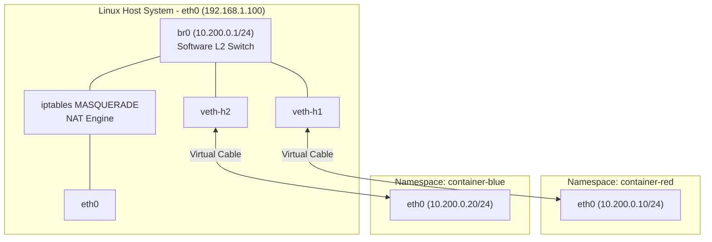

import { Callout } from 'fumadocs-ui/components/callout';
import { Steps, Step } from 'fumadocs-ui/components/steps';

Have you ever wondered what `docker run -p 8080:80` actually does inside the Linux kernel?

Docker and Kubernetes do not use virtual machines. They use **Linux Network Namespaces (`netns`)**, **Virtual Ethernet (`veth`) pairs**, a software **Linux Bridge (`br0`)**, and **`iptables` NAT rules**. In this recipe, you build that exact architecture by hand in 6 commands.

---

## Architectural Blueprint



---

## Step-by-Step Shell Script

<Steps>
<Step>
### Step 1: Create Isolated Network Namespaces
Create two isolated namespaces (isolated routing tables, loopback interfaces, and sockets):

```bash
sudo ip netns add container-red
sudo ip netns add container-blue

# Verify namespace creation
ip netns list
```
</Step>

<Step>
### Step 2: Create and Activate the Linux Bridge
Create a software Layer 2 switch (`br0`) on the host and assign it the default gateway IP:

```bash
sudo ip link add name br0 type bridge
sudo ip addr add 10.200.0.1/24 dev br0
sudo ip link set dev br0 up
```
</Step>

<Step>
### Step 3: Create Virtual Ethernet (`veth`) Pairs
Create two virtual cables. One end plugs into the host bridge, while the other end plugs into the container namespace:

```bash
# Cable 1 for container-red
sudo ip link add veth-red type veth peer name c-eth0
sudo ip link set c-eth0 netns container-red
sudo ip link set veth-red master br0
sudo ip link set dev veth-red up

# Cable 2 for container-blue
sudo ip link add veth-blue type veth peer name c-eth0
sudo ip link set c-eth0 netns container-blue
sudo ip link set veth-blue master br0
sudo ip link set dev veth-blue up
```
</Step>

<Step>
### Step 4: Configure Container IP Addresses and Gateways
Assign IPs and default routes inside each isolated namespace:

```bash
# Configure container-red
sudo ip netns exec container-red ip link set lo up
sudo ip netns exec container-red ip addr add 10.200.0.10/24 dev c-eth0
sudo ip netns exec container-red ip link set c-eth0 up
sudo ip netns exec container-red ip route add default via 10.200.0.1

# Configure container-blue
sudo ip netns exec container-blue ip link set lo up
sudo ip netns exec container-blue ip addr add 10.200.0.20/24 dev c-eth0
sudo ip netns exec container-blue ip link set c-eth0 up
sudo ip netns exec container-blue ip route add default via 10.200.0.1
```
</Step>

<Step>
### Step 5: Test Inter-Container Connectivity
Ping from `container-red` to `container-blue` across the software bridge:

```bash
sudo ip netns exec container-red ping -c 3 10.200.0.20
```
Frames travel from `c-eth0` in red, through `veth-red`, into `br0`, where the bridge CAM table switches the frame to `veth-blue` and arrives at `c-eth0` in blue!
</Step>

<Step>
### Step 6: Enable Outbound Internet Access via NAT
Allow containers to communicate with the outside Internet through the host's physical network adapter (`eth0`):

```bash
# Enable kernel IP packet forwarding
sudo sysctl -w net.ipv4.ip_forward=1

# Configure iptables SNAT / Masquerade on egress
sudo iptables -t nat -A POSTROUTING -s 10.200.0.0/24 -o eth0 -j MASQUERADE

# Test ping from container to Google DNS
sudo ip netns exec container-red ping -c 3 8.8.8.8
```
</Step>
</Steps>
