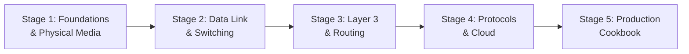

import { Callout } from 'fumadocs-ui/components/callout';
import { Tabs, Tab } from 'fumadocs-ui/components/tabs';
import { Cards, Card } from 'fumadocs-ui/components/card';
import { PacketJourneyFlow } from '@/components/computer-networking/networking-simulators';


Computer networking is the nervous system of modern computing. Every day, software engineers, DevOps architects, and security professionals build upon four fundamental pillars:

1. **Cloud & Infrastructure Engineering**: Architecting multi-region Virtual Private Clouds (VPCs), subnets, transit gateways, and resilient hybrid on-prem connections.
2. **Distributed Systems & Microservices**: Orchestrating thousands of containers across Kubernetes clusters via Linux network namespaces, veth pairs, CNI plugins, and service meshes.
3. **High-Performance Web Applications**: Eliminating latency bottlenecks through HTTP/3 QUIC streams, Anycast CDN edge termination, and connection pooling.
4. **Cybersecurity & Zero-Trust Architecture**: Enforcing cryptographic isolation with TLS 1.3, stateful firewalls, WireGuard/IPsec VPNs, and micro-segmentation.

This curriculum is engineered to guide you from the physical reality of **photons traveling through silica glass** all the way to **planetary BGP routing**, **eBPF container packet filtering**, and **cloud-native network virtualization**.

---

## Curriculum Tracks

The curriculum is structured into five progressive tracks:



### 1. Stage 1: Foundations & Physical Media

**[Open Stage 1: Foundations →](/docs/computer-networking/01-foundations)**

- **Network Evolution**: Circuit switching telephone networks vs. packet-switched survivability, ARPANET, and Tier 1 ISP peering.
- **Topologies**: PAN, LAN, MAN, WAN, SAN; Bus, Star, Mesh, and datacenter Spine-and-Leaf Clos fabrics.
- **Transmission Physics**: Cat5e–Cat8 copper pair cancellation, Single-Mode (OS2) vs Multi-Mode (OM4) fiber, subsea cables, and speed of light calculations.
- **Stage 1 Capstone**: Campus Network Physical Topology Design Lab & Optical Budget calculation.
- **Quick Reference**: Comprehensive cheat sheet for cable categories and fiber specifications.

### 2. Stage 2: Data Link & Switching

**[Open Stage 2: Data Link & Switching →](/docs/computer-networking/02-switching-and-data-link)**

- **Architectural Models**: The 7-layer OSI model vs the 4-layer DoD TCP/IP internet model.
- **Encapsulation**: Protocol Data Units (PDUs) — Segment, Packet, Frame, and Bits.
- **Ethernet & Switching**: Ethernet II framing, CRC FCS checks, auto-negotiation, and non-blocking full duplex.
- **CAM Tables & ARP**: Hardware MAC learning, broadcast discovery, and ICMP diagnostics.
- **VLANs & Wi-Fi**: 802.1Q trunking, native VLAN security, and 802.11 wireless airtime arbitration.
- **Stage 2 Capstone**: Multi-VLAN Enterprise Switching Lab with 802.1Q trunking.
- **Quick Reference**: Ethernet frame layout, 802.1Q tags, and Layer 2 diagnostic commands.

### 3. Stage 3: Layer 3 & Routing

**[Open Stage 3: Layer 3 & Routing →](/docs/computer-networking/03-ip-addressing-and-routing)**

- **IPv4 & Subnetting**: Binary math, powers of 2, CIDR notation (/8 to /32), network IDs, and broadcast boundaries.
- **Address Management**: DHCP DORA lease negotiation, Port Address Translation (NAT/PAT), and 128-bit IPv6 architecture.
- **Cisco IOS CLI**: User EXEC, Privileged EXEC, and Global Config modes, interface addressing, and device hardening.
- **Forwarding Logic**: Longest Prefix Match (LPM), administrative distances, routing tables, and static failover routes.
- **Stage 3 Capstone**: Enterprise Multi-Subnet VLSM Design & Cisco Static Routing Engine.
- **Quick Reference**: IPv4 subnetting cheat sheet (/8 to /32) and Cisco IOS command matrix.

### 4. Stage 4: Protocols & Cloud Networking

**[Open Stage 4: Protocols & Cloud →](/docs/computer-networking/04-protocols-and-cloud)**

- **Transport Layer**: TCP vs UDP, port multiplexing, 3-way handshakes, sliding window flow control, and UDP streaming.
- **Application Protocols**: Recursive DNS resolution hierarchy, HTTP/1.1 vs HTTP/2 vs HTTP/3 QUIC, SSH, and SMTP.
- **Dynamic Routing & Crypto**: OSPF link-state, planetary BGP autonomous systems, TLS 1.3 key exchange, and Anycast CDNs.
- **Cloud VPCs**: Subnets, Internet Gateways, NAT Gateways, route tables, and stateful Security Groups.
- **Container Overlays**: Linux network namespaces (`netns`), veth pairs, bridge interfaces, Kubernetes ClusterIP, and CNI plugins.
- **Stage 4 Capstone**: Cloud VPC & Kubernetes Ingress Architecture Lab.
- **Quick Reference**: Standard service ports, TCP control flags, and Cloud/K8s primitives.

### 5. Stage 5: Production Cookbook & Diagnostics

**[Open Stage 5: Cookbook & Diagnostics →](/docs/computer-networking/05-cookbook)**

Battle-tested, copy-pasteable production recipes and troubleshooting playbooks:
- Wire-level packet capture and analysis with `tcpdump` and `tshark`.
- Diagnosing DNS failures, latency spikes, and slow TLS handshakes with `mtr`, `dig`, and `curl`.
- Building Docker-style container bridges from scratch with `ip netns`, `veth`, and `iptables`.
- Stateful Linux firewall hardening with `iptables` and modern `nftables`.
- High-performance, zero-trust encrypted site-to-site tunnels with **WireGuard**.
- **The Master Synthesis**: The complete 14-step packet journey from browser URL keystroke to backend container.

---

## Interactive End-to-End Packet Journey

Click through each phase below to observe the request traveling across every layer of modern network infrastructure:

<PacketJourneyFlow />

---

## Modern Networking Toolchain

In modern systems engineering, you need three indispensable diagnostic toolsets:

<Tabs items={['Wire & Packet Analysis', 'CLI Diagnostics', 'Network Simulation']}>
<Tab value="Wire & Packet Analysis">
```bash
# Capture packets with tcpdump on Linux
sudo tcpdump -nn -i eth0 port 443 -w capture.pcap

# Inspect live protocol streams with tshark
tshark -r capture.pcap -Y "http.request" -T fields -e ip.src -e http.request.full_uri

# Wireshark GUI (Cross-Platform)
# Open Wireshark to visually dissect byte headers, stream flows, and TCP retransmissions
```
</Tab>

<Tab value="CLI Diagnostics">
```bash
# Test reachability and round-trip time
ping -c 4 8.8.8.8

# Trace path and pinpoint slow hops
mtr -rw -c 50 -T -P 443 api.example.com

# Deep DNS resolution trace
dig +trace api.example.com

# Inspect socket statistics and listening ports
ss -tulpn

# Inspect kernel routing table
ip route show
```
</Tab>

<Tab value="Network Simulation">
```bash
# Cisco Packet Tracer (Free student & CCNA lab simulator)
# Practice switch VLAN configuration, router serial links, and DHCP servers

# GNS3 / EVE-NG (Advanced real-world network emulator)
# Run actual Cisco IOS, Arista EOS, Juniper JunOS, and Linux virtual appliances

# Linux Network Namespaces (Native built-in OS lab)
sudo ip netns add lab-host1
sudo ip netns add lab-host2
```
</Tab>
</Tabs>

---

## The Golden Rule

> *"Don't try to memorize port numbers or header bit offsets in isolation. Understand the **problem that forced engineers to invent the protocol**. Every RFC, every header field, and every layer exists because something failed without it."*

Jump right in: start with **[01. What Is a Network, the Internet & How It Began](/docs/computer-networking/01-foundations/01-what-is-network-internet-history)**.
