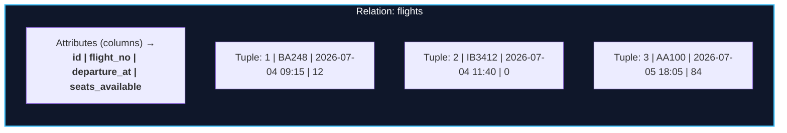
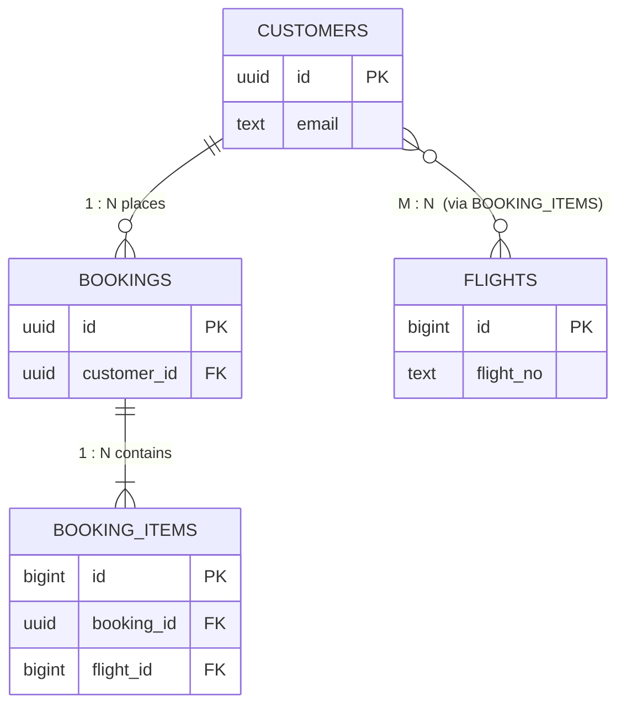

import { Callout } from 'fumadocs-ui/components/callout';
import { Tabs, Tab } from 'fumadocs-ui/components/tabs';
import { Cards, Card } from 'fumadocs-ui/components/card';

SQL is a language on top of an algebra. If you keep the algebra in mind, SQL stops being a pile of syntax to memorize and becomes a small set of composable operations. This lesson builds that foundation.

---

## Relations, Tuples, Attributes & Domains

The relational model uses precise vocabulary that maps directly onto SQL — but the mapping is not one-to-one, and the gaps cause real bugs.



| Formal term | SQL term | Meaning |
| :--- | :--- | :--- |
| **Relation** | Table | A *set* of tuples over a fixed set of attributes |
| **Tuple** | Row / record | One element of the relation |
| **Attribute** | Column | A named position with a declared type |
| **Domain** | Data type | The set of legal values for an attribute |
| **Degree (arity)** | Column count | Number of attributes |
| **Cardinality** | Row count | Number of tuples |

### The Set vs. Bag Distinction (A Real Trap)

The relational model says a relation is a **set** — no duplicate tuples. SQL, however, operates on **bags (multisets)** by default: `SELECT` does *not* remove duplicates unless you explicitly say `SELECT DISTINCT`. In practice, SQL tables allow duplicate rows unless a key forbids them.

```sql
-- These are different:
SELECT     route FROM flights;   -- may repeat 'MAD→BCN' 40 times
SELECT DISTINCT route FROM flights;  -- each route once
```

<Callout type="warn" title="The NULL-in-a-Set Trap">
Because rows are a bag and predicates can evaluate to `UNKNOWN`, `NULL` breaks naive set reasoning. We cover this explicitly below — it is the single most common source of "why does my query return zero rows?" bugs.
</Callout>

---

## Keys: The Spine of a Relational Schema

A **key** is a minimal set of attributes that uniquely identifies a tuple. Keys are not bureaucratic — they are how the engine guarantees uniqueness and how you express relationships.

| Key type | Definition | TravelBuddy example |
| :--- | :--- | :--- |
| **Superkey** | *Any* attribute set that uniquely identifies a row | `{id}`, `{id, email}`, `{email, full_name}` |
| **Candidate key** | A *minimal* superkey — remove any attribute and uniqueness breaks | `{id}`, `{email}` |
| **Primary key (PK)** | The candidate key you *choose* as the row's identity | `id` |
| **Alternate key** | A candidate key not chosen as the PK | `email` (enforced with `UNIQUE`) |
| **Composite key** | A key spanning multiple attributes | `{flight_id, seat_no}` |
| **Foreign key (FK)** | An attribute referencing another relation's key | `bookings.customer_id → customers.id` |

### Natural vs. Surrogate Keys

- **Natural key**: an attribute from the domain (`email`, `flight_no + departure_at`). Meaningful, but can change and may be wide.
- **Surrogate key**: an artificial identifier with no business meaning (`id`). Stable, narrow, ideal for FKs.

<Callout type="tip" title="Production Default">
Use a **surrogate primary key** (`uuidv7()` or `bigint GENERATED ALWAYS AS IDENTITY`) for identity, and add **`UNIQUE` constraints** on the natural keys (`email`) that must not collide. This gives you stable joins *and* integrity. In PostgreSQL 18, `uuidv7()` generates time-ordered UUIDs that keep B+ tree inserts sequential instead of scattering random pages (we revisit this in Stage 2).
</Callout>

---

## Relationship Cardinality: How Tables Connect



| Relationship | Implementation |
| :--- | :--- |
| **1 : 1** | FK with a `UNIQUE` constraint (or merge the tables) |
| **1 : N** | FK on the "many" side pointing at the "one" side |
| **M : N** | A **junction table** (`booking_items`) holding two FKs |

<Callout type="error" title="Never Store a Many-to-Many List in a String">
`flights = '12,44,91'` looks harmless and destroys your schema: you cannot enforce referential integrity, you cannot index individual ids efficiently, and every query needs fragile string splitting. This is the **first normal form** violation, and Stage 5 shows how to fix it properly.
</Callout>

---

## `NULL` and Three-Valued Logic

`NULL` does not mean "zero" or "empty string". It means **unknown / absent**. Because of that, SQL comparison is not two-valued (true/false) but **three-valued**: `TRUE`, `FALSE`, and `UNKNOWN`.

```text
TRUE  AND UNKNOWN = UNKNOWN
FALSE AND UNKNOWN = FALSE
TRUE  OR  UNKNOWN = TRUE
FALSE OR  UNKNOWN = UNKNOWN
NOT   UNKNOWN     = UNKNOWN
```

Any `WHERE` clause keeps a row **only when the predicate is `TRUE`** — `UNKNOWN` and `FALSE` both discard it. This single rule explains the classic bugs:

```sql
-- Suppose customers.phone is NULL for some rows.

SELECT * FROM customers WHERE phone <> '+1-555';   -- NULL phone → UNKNOWN → excluded!
SELECT * FROM customers WHERE phone IS DISTINCT FROM '+1-555';  -- NULL-safe, includes them

-- The NOT IN disaster: if ANY value in the subquery is NULL,
-- NOT IN returns UNKNOWN for every row and the query returns ZERO rows.
SELECT * FROM customers
WHERE id NOT IN (SELECT customer_id FROM bookings);  -- returns nothing if any customer_id is NULL!
```

<Callout type="warn" title="Prefer NOT EXISTS Over NOT IN">
`NOT EXISTS` is immune to the `NULL` trap and is the standard recommendation. It also usually optimizes at least as well:

```sql
SELECT * FROM customers c
WHERE NOT EXISTS (SELECT 1 FROM bookings b WHERE b.customer_id = c.id);
```
</Callout>

| Use this | Not this | Why |
| :--- | :--- | :--- |
| `col IS NULL` / `IS NOT NULL` | `col = NULL` | `= NULL` is always `UNKNOWN` |
| `a IS DISTINCT FROM b` | `a <> b` | Null-safe comparison |
| `NOT EXISTS (...)` | `NOT IN (...)` | Immune to the `NULL` trap |
| `COALESCE(col, 0)` | assuming a default exists | Explicit default handling |

---

## PostgreSQL Data Types & the Size Matters Myth

Picking the wrong type inflates storage, wastes cache lines, and creates subtle math bugs.

| Category | Type | Size | Use it for |
| :--- | :--- | :--- | :--- |
| Integer | `smallint` | 2 B | Small enums/counters |
| Integer | `integer` | 4 B | Flags, small ids |
| Integer | `bigint` | 8 B | Row counts, money-in-cents |
| Exact decimal | `numeric(p, s)` | variable | **Money, prices, balances** |
| Inexact | `real` / `double precision` | 4 / 8 B | Scientific measurements |
| Text | `text` | variable | **All strings** |
| Text | `varchar(n)` | variable | Only when a real max length matters |
| Identifier | `uuid` | 16 B | Distributed-safe ids (`uuidv7()`) |
| Time | `timestamptz` | 8 B | **Always** — stores UTC, renders per session |
| Boolean | `boolean` | 1 B | Flags |
| Binary JSON | `jsonb` | variable | Semi-structured payloads (indexable) |

<Callout type="error" title="The Financial Arithmetic Trap">
Never store money in a float. IEEE 754 cannot represent `0.1` exactly:

```sql
SELECT (0.1::float8 + 0.2::float8) = 0.3::float8;   -- FALSE (0.30000000000000004)
SELECT (0.1::numeric + 0.2::numeric) = 0.3::numeric; -- TRUE
```
Use `numeric`, or store integer **cents** in a `bigint` (TravelBuddy uses `total_cents`).
</Callout>

<Callout type="tip" title="The `VARCHAR(255)` Myth">
In PostgreSQL, `varchar(n)`, `varchar`, and `text` share the identical `varlena` storage layout and have **zero performance difference**. `varchar(255)` adds only a length check on insert — and a future schema migration when a value grows to 300 characters. Prefer `text` plus a `CHECK (length(col) <= n)` only if a genuine business limit exists.
</Callout>

---

## DDL: Defining the Schema with Constraints

Constraints are the DBMS enforcing truth at the storage layer — the strongest place to put it. Define the TravelBuddy core:

```sql
CREATE TABLE customers (
    id         uuid        PRIMARY KEY DEFAULT uuidv7(),
    email      text        NOT NULL UNIQUE,
    full_name  text        NOT NULL,
    created_at timestamptz NOT NULL DEFAULT now()
);

CREATE TABLE flights (
    id              bigint      GENERATED ALWAYS AS IDENTITY PRIMARY KEY,
    flight_no       text        NOT NULL,
    departure_at    timestamptz NOT NULL,
    seats_available integer     NOT NULL CHECK (seats_available >= 0),
    UNIQUE (flight_no, departure_at)          -- composite natural key
);

CREATE TABLE bookings (
    id          uuid        PRIMARY KEY DEFAULT uuidv7(),
    customer_id uuid        NOT NULL REFERENCES customers(id) ON DELETE RESTRICT,
    status      text        NOT NULL DEFAULT 'pending'
                            CHECK (status IN ('pending', 'paid', 'cancelled')),
    total_cents bigint      NOT NULL CHECK (total_cents >= 0),
    created_at  timestamptz NOT NULL DEFAULT now()
);

CREATE INDEX idx_bookings_customer ON bookings (customer_id);
```

| Constraint | Guarantees |
| :--- | :--- |
| `PRIMARY KEY` | Uniqueness + `NOT NULL`; creates a unique B+ tree index |
| `UNIQUE` | No duplicate combinations (allows one `NULL` in Postgres) |
| `NOT NULL` | The column can never be unknown |
| `CHECK (...)` | A row-level boolean predicate must hold |
| `FOREIGN KEY` | The referenced row must exist (referential integrity) |
| `DEFAULT` | Value supplied when the column is omitted |

### Referential Actions: What Happens on Delete?

```sql
-- ON DELETE options on a foreign key:
-- RESTRICT / NO ACTION : refuse the delete if children exist (safest)
-- CASCADE              : delete children too (dangerous — can wipe data)
-- SET NULL             : null out the child FK (child must be nullable)
-- SET DEFAULT          : set the child FK to its default
```

<Callout type="tip" title="Index Every Foreign Key">
PostgreSQL does **not** automatically index foreign keys. Without an index on `bookings(customer_id)`, deleting a customer forces a full scan of `bookings` to check for children — and every join filtering by `customer_id` degrades to a sequential scan. This is the single most common missing index in real schemas.
</Callout>

---

## DML: Changing Data

<Tabs items={['INSERT', 'UPDATE', 'DELETE', 'Upsert']}>
<Tab value="INSERT">
```sql
INSERT INTO customers (email, full_name)
VALUES ('ada@example.com', 'Ada Lovelace')
RETURNING id, created_at;   -- get generated values back
```
</Tab>
<Tab value="UPDATE">
```sql
-- PostgreSQL 18: RETURNING can expose both OLD and NEW values
UPDATE bookings
SET status = 'paid'
WHERE id = '...'
RETURNING OLD.status AS was, NEW.status AS now;
```
</Tab>
<Tab value="DELETE">
```sql
DELETE FROM bookings
WHERE status = 'cancelled' AND created_at < now() - interval '90 days';
```
</Tab>
<Tab value="Upsert">
```sql
-- INSERT ... ON CONFLICT is PostgreSQL's atomic upsert
INSERT INTO customers (email, full_name)
VALUES ('ada@example.com', 'Ada Lovelace')
ON CONFLICT (email) DO UPDATE
SET full_name = EXCLUDED.full_name;
```
</Tab>
</Tabs>

<Callout type="warn" title="`UPDATE` and `DELETE` Without a `WHERE`">
An `UPDATE` or `DELETE` with no `WHERE` touches **every row**. Always run the equivalent `SELECT` first, wrap destructive changes in a transaction you can `ROLLBACK`, and remember that every `UPDATE` writes a *new row version* (MVCC) rather than editing in place — a fact that drives bloat and vacuum, covered in Stage 3.
</Callout>

---

## From Requirements to Schema: ER Modeling

The disciplined path from a product idea to tables:

1. **Identify entities** (nouns): customers, flights, bookings, airlines, airports.
2. **Identify attributes** and their domains: `email` is `text`, `departure_at` is `timestamptz`.
3. **Choose keys** for each entity.
4. **Draw relationships** and their cardinality (1:1, 1:N, M:N).
5. **Resolve M:N** into junction tables.
6. **Normalize** (Stage 5) to remove redundancy.

<Cards>
  <Card title="Entity → Table" href="#keys-the-spine-of-a-relational-schema">
    Each entity becomes a relation with a primary key and typed attributes.
  </Card>
  <Card title="Relationship → Foreign Key" href="#relationship-cardinality-how-tables-connect">
    1:N becomes an FK on the many side; M:N becomes a junction table with two FKs.
  </Card>
  <Card title="Business Rule → Constraint" href="#ddl-defining-the-schema-with-constraints">
    "Seats can't go negative" becomes `CHECK (seats_available >= 0)`. Push truth into the schema.
  </Card>
</Cards>

<Callout type="info" title="Next Up: Lesson 03">
Your schema now describes *what* data exists. The next lesson teaches you to ask precise questions of it: joins, aggregation, subqueries, CTEs, and window functions. Continue to **[Querying Data: Joins, Aggregation & Window Functions](/docs/databases-sql/01-foundations-and-relational-modeling/03-queries-joins-and-aggregation)**.
</Callout>
