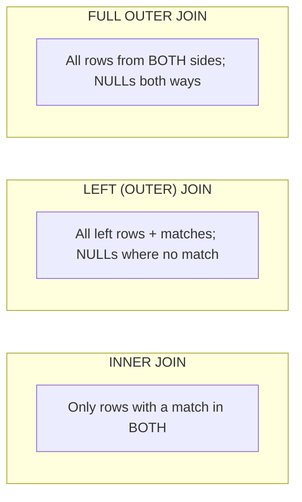

import { Callout } from 'fumadocs-ui/components/callout';
import { Tabs, Tab } from 'fumadocs-ui/components/tabs';
import { Cards, Card } from 'fumadocs-ui/components/card';

## The Logical Order of `SELECT`

The biggest source of confusion for SQL learners is that **you write a query in one order, but the engine evaluates it in another.** Understanding the true order explains almost every "why doesn't this work?" moment.

```mermaid
flowchart TD
    F["1. FROM + JOIN<br/><i>Assemble the working set of rows</i>"] --> W
    W["2. WHERE<br/><i>Filter individual rows</i>"] --> G
    G["3. GROUP BY<br/><i>Collapse rows into groups</i>"] --> H
    H["4. HAVING<br/><i>Filter whole groups</i>"] --> S
    S["5. SELECT<br/><i>Compute output columns & aliases</i>"] --> D
    D["6. DISTINCT<br/><i>Remove duplicate output rows</i>"] --> O
    O["7. ORDER BY<br/><i>Sort the result</i>"] --> L
    L["8. LIMIT / OFFSET<br/><i>Slice the final rows</i>"]

    style F fill:#0f172a,stroke:#38bdf8,stroke-width:2px
    style S fill:#0f172a,stroke:#34d399,stroke-width:2px
```



Two consequences fall straight out of this order:

- You **cannot** use a `SELECT` alias in `WHERE` (step 5 runs after step 2), but you **can** in `ORDER BY` (step 7 runs after step 5).
- `WHERE` filters rows *before* grouping; `HAVING` filters groups *after* aggregation.

```sql
SELECT status, COUNT(*) AS n
FROM bookings
WHERE created_at >= now() - interval '30 days'   -- rows, before grouping
GROUP BY status
HAVING COUNT(*) > 100                             -- groups, after aggregation
ORDER BY n DESC;                                  -- can use the alias
```

---

## Filtering: A Compact Toolkit

```sql
SELECT *
FROM flights
WHERE departure_at BETWEEN '2026-07-01' AND '2026-07-31'   -- inclusive range
  AND flight_no LIKE 'BA%'                                 -- pattern match (% = any)
  AND seats_available > 0
  AND route_id IN (1, 2, 3)                                -- membership
  AND status NOT IN ('cancelled');                         -- careful with NULLs!
```

| Predicate | Matches | Notes |
| :--- | :--- | :--- |
| `=` `<>` `<` `>` | Comparisons | `= NULL` never matches |
| `BETWEEN a AND b` | Inclusive `[a, b]` | Careful with timestamps (see below) |
| `LIKE 'A%'` / `ILIKE` | Pattern (case-sensitive / insensitive) | `_` = one char, `%` = any run |
| `IN (...)` | Membership | `NOT IN` breaks on `NULL` |
| `IS NULL` / `IS NOT NULL` | Null test | The only correct way |
| `col = ANY(array)` | Array membership | Postgres-native |

<Callout type="warn" title="The BETWEEN Timestamp Trap">
`BETWEEN '2026-07-01' AND '2026-07-31'` on a `timestamptz` **excludes almost all of July 31st** because the upper bound is midnight. Prefer half-open ranges:

```sql
WHERE departure_at >= '2026-07-01'
  AND departure_at <  '2026-08-01'   -- clean, index-friendly, no off-by-one
```
</Callout>

---

## Joins: Combining Relations

A join matches rows from two relations on a predicate. The **join type** determines what happens to rows that find no match.



| Join | Keeps | Typical use |
| :--- | :--- | :--- |
| `INNER JOIN` | Rows matched on **both** sides | Bookings **with** their customer |
| `LEFT JOIN` | All **left** rows, matched or not | Customers, **with or without** bookings |
| `RIGHT JOIN` | All **right** rows, matched or not | Rarely used (rewrite as `LEFT`) |
| `FULL OUTER JOIN` | All rows from **both** sides | Reconciliation (A vs B datasets) |
| `CROSS JOIN` | Cartesian product (every pair) | Generating calendars / dense grids |
| `SELF JOIN` | A table joined to itself | Employee → manager hierarchies |
| `LATERAL` | Correlated subquery in `FROM` | Top-N per group, per-row function calls |

```sql
-- TravelBuddy: total spend per customer, including customers who never booked
SELECT c.id, c.full_name, COALESCE(SUM(b.total_cents), 0) AS lifetime_cents
FROM customers c
LEFT JOIN bookings b ON b.customer_id = c.id
GROUP BY c.id, c.full_name
ORDER BY lifetime_cents DESC;
```

<Callout type="error" title="The `LEFT JOIN` → `WHERE` Killer">
Putting a condition on the *right* table in the `WHERE` clause silently turns your `LEFT JOIN` into an `INNER JOIN`:

```sql
-- BROKEN: customers without bookings are filtered out by the WHERE clause
SELECT c.* FROM customers c
LEFT JOIN bookings b ON b.customer_id = c.id
WHERE b.status = 'paid';           -- NULL status fails this → row dropped

-- FIXED: move the condition into the ON clause
SELECT c.* FROM customers c
LEFT JOIN bookings b ON b.customer_id = c.id AND b.status = 'paid';
```
The first filters *after* the outer join produces `NULL`s; the second filters *while* matching.
</Callout>

---

## Aggregation: Collapsing Rows into Groups

Aggregate functions take a set of rows and return one value. `GROUP BY` defines the sets.

| Function | Returns | Note |
| :--- | :--- | :--- |
| `COUNT(*)` | Number of rows | Counts `NULL`s too |
| `COUNT(col)` | Non-null values in `col` | Ignores `NULL` |
| `COUNT(DISTINCT col)` | Distinct non-null values | Useful for unique visitors |
| `SUM`, `AVG` | Numeric totals / mean | `SUM` of no rows = `NULL`, not `0` |
| `MIN`, `MAX` | Extremes | Works on any orderable type |
| `string_agg` / `array_agg` | Concatenate / collect | Postgres-specific rollups |

```sql
SELECT
    f.flight_no,
    COUNT(*)                            AS bookings,
    COUNT(DISTINCT b.customer_id)       AS unique_customers,
    SUM(b.total_cents)                  AS revenue_cents,
    ROUND(AVG(b.total_cents) / 100.0, 2) AS avg_dollars
FROM booking_items bi
JOIN bookings b ON b.id = bi.booking_id
JOIN flights  f ON f.id = bi.flight_id
WHERE b.status = 'paid'
GROUP BY f.flight_no
HAVING SUM(b.total_cents) > 1_000_000
ORDER BY revenue_cents DESC;
```

<Callout type="info" title="The Golden Rule of GROUP BY">
Every column in the `SELECT` list must be either **aggregated** or **listed in `GROUP BY`**. If it is neither, the value is ambiguous (which row's value should appear?). PostgreSQL enforces this; some engines silently pick one and hide the bug.
</Callout>

---

## Subqueries: Queries Inside Queries

| Subquery type | Returns | Placed in | Example intent |
| :--- | :--- | :--- | :--- |
| **Scalar** | One row, one column | `SELECT` / `WHERE` | Latest booking date |
| **Row / Column** | One row / one column | `IN`, comparison | Membership |
| **Table** | A full table | `FROM` | Derived table |
| **Correlated** | Depends on outer row | `WHERE`, `SELECT` | Per-row comparison |
| **`EXISTS`** | Boolean | `WHERE` | "Has at least one…" |

```sql
-- Scalar subquery: each customer's most recent booking date
SELECT c.full_name,
       (SELECT MAX(b.created_at) FROM bookings b WHERE b.customer_id = c.id) AS last_booking
FROM customers c;

-- EXISTS: customers who have at least one cancelled booking
SELECT c.* FROM customers c
WHERE EXISTS (SELECT 1 FROM bookings b
              WHERE b.customer_id = c.id AND b.status = 'cancelled');
```

<Callout type="tip" title="`IN` vs `EXISTS` — Modern Planners Usually Tie">
Historically `EXISTS` won because it could short-circuit, while `IN` materialized the whole list. Modern cost-based optimizers frequently rewrite one into the other and pick the cheaper plan. Choose for **readability and `NULL`-safety** (`EXISTS` is `NULL`-safe); then measure.
</Callout>

---

## Common Table Expressions (CTEs)

A CTE names a subquery so a complex query reads top-to-bottom. Use `WITH`.

```sql
WITH paid_bookings AS (
    SELECT * FROM bookings WHERE status = 'paid'
),
revenue_by_customer AS (
    SELECT customer_id, SUM(total_cents) AS total
    FROM paid_bookings
    GROUP BY customer_id
)
SELECT c.full_name, r.total
FROM revenue_by_customer r
JOIN customers c ON c.id = r.customer_id
ORDER BY r.total DESC;
```

### Recursive CTEs: Querying Trees and Graphs

Recursive CTEs are how SQL traverses hierarchies (org charts, category trees, flight connections):

```sql
-- Find all flights reachable from Madrid in up to 2 connections
WITH RECURSIVE reachable AS (
    -- Base case: direct destinations from MAD
    SELECT dest_airport, 0 AS hops, ARRAY[dest_airport] AS path
    FROM routes WHERE src_airport = 'MAD'
    UNION ALL
    -- Recursive case: extend by one hop, avoiding cycles
    SELECT r.dest_airport, rc.hops + 1, rc.path || r.dest_airport
    FROM reachable rc
    JOIN routes r ON r.src_airport = rc.dest_airport
    WHERE rc.hops < 2 AND NOT r.dest_airport = ANY(rc.path)
)
SELECT DISTINCT dest_airport FROM reachable;
```

<Callout type="warn" title="The Recursion Hazard">
Always include a **depth limit or cycle guard**. A recursive CTE over a cyclic graph with no guard will run until it exhausts memory.
</Callout>

---

## `LATERAL`: Top-N Per Group Without Contortions

A `LATERAL` subquery can reference columns from tables to its **left** — a correlated subquery in `FROM`. It is the clean way to do "top 3 per group".

```sql
-- The 3 most recent bookings for each customer
SELECT c.full_name, b.created_at, b.total_cents
FROM customers c
CROSS JOIN LATERAL (
    SELECT created_at, total_cents
    FROM bookings b
    WHERE b.customer_id = c.id
    ORDER BY b.created_at DESC
    LIMIT 3
) b;
```

---

## Window Functions: Aggregation Without Collapsing Rows

Aggregates collapse rows. **Window functions** compute over a set of related rows (a "window") while **keeping every row**. This is the tool for running totals, rankings, and moving averages.

```text
function_name(...) OVER (
    PARTITION BY ...   -- reset the window per group
    ORDER BY ...       -- order within the window
    frame_clause       -- which rows count (default: up to current row)
)
```

```sql
SELECT
    customer_id,
    created_at,
    total_cents,
    -- Rank customers' bookings by size (ties share a rank)
    RANK()       OVER (PARTITION BY customer_id ORDER BY total_cents DESC) AS spend_rank,
    -- Running total of spend per customer, oldest → newest
    SUM(total_cents) OVER (
        PARTITION BY customer_id
        ORDER BY created_at
        ROWS BETWEEN UNBOUNDED PRECEDING AND CURRENT ROW
    ) AS running_total_cents,
    -- 7-day moving average of booking value
    AVG(total_cents) OVER (
        ORDER BY created_at
        RANGE BETWEEN interval '7 days' PRECEDING AND CURRENT ROW
    ) AS avg_7d
FROM bookings
WHERE status = 'paid';
```

| Window function | Purpose |
| :--- | :--- |
| `ROW_NUMBER()` | Unique sequential number (no ties) |
| `RANK()` / `DENSE_RANK()` | Ranking with / without gaps on ties |
| `LAG(col)` / `LEAD(col)` | Previous / next row's value (deltas, churn) |
| `FIRST_VALUE` / `LAST_VALUE` | Boundary values of the window |
| `NTILE(n)` | Split into `n` buckets (deciles, quartiles) |
| `SUM/AVG/COUNT` + `OVER` | Running totals and moving averages |

<Callout type="tip" title="`ROW_NUMBER()` for Deduplication">
A wildly useful pattern: assign a row number within a duplicate group and keep only `rn = 1`.

```sql
WITH ranked AS (
    SELECT *, ROW_NUMBER() OVER (
        PARTITION BY email ORDER BY created_at DESC
    ) AS rn
    FROM customers
)
SELECT * FROM ranked WHERE rn = 1;   -- one row per email, the newest
```
</Callout>

---

## Putting It Together

A realistic TravelBuddy report: the top-spending customer per route, each customer's share of route revenue, and how many bookings they have.

```sql
WITH route_revenue AS (
    SELECT
        f.flight_no,
        b.customer_id,
        SUM(b.total_cents)                       AS spend,
        COUNT(*)                                 AS bookings,
        SUM(SUM(b.total_cents)) OVER (PARTITION BY f.flight_no) AS route_total
    FROM booking_items bi
    JOIN bookings b ON b.id = bi.booking_id AND b.status = 'paid'
    JOIN flights  f ON f.id = bi.flight_id
    GROUP BY f.flight_no, b.customer_id
),
ranked AS (
    SELECT *,
        ROW_NUMBER() OVER (PARTITION BY flight_no ORDER BY spend DESC) AS rn,
        ROUND(100.0 * spend / route_total, 1)                          AS pct_of_route
    FROM route_revenue
)
SELECT r.flight_no, c.full_name, r.spend, r.pct_of_route, r.bookings
FROM ranked r
JOIN customers c ON c.id = r.customer_id
WHERE r.rn = 1
ORDER BY r.flight_no;
```

Notice how CTEs let you name intermediate results (`route_revenue`), and a window function (`SUM(...) OVER (PARTITION BY ...)`) computes the route total *without* a second aggregation pass.

---

## Chapter Summary & Quick Recall

<Cards>
  <Card title="Write in one order, evaluate in another" href="#the-logical-order-of-select">
    FROM → WHERE → GROUP BY → HAVING → SELECT → DISTINCT → ORDER BY → LIMIT. This explains alias visibility and WHERE-vs-HAVING.
  </Card>
  <Card title="Join type is about unmatched rows" href="#joins-combining-relations">
    INNER drops non-matches; LEFT/FULL keep them with NULLs. Move filters into `ON`, not `WHERE`, to preserve outer joins.
  </Card>
  <Card title="Windows keep rows, aggregates collapse them" href="#window-functions-aggregation-without-collapsing-rows">
    Use `OVER (...)` for running totals, rankings, and per-group top-N — the everyday workhorses of analytics.
  </Card>
</Cards>

<Callout type="info" title="Next Up: Stage 2">
You can now ask precise questions. But *how* the engine answers them — pages, indexes, and the optimizer — is where performance lives. Continue to **[Stage 2: Storage, Indexing & Query Optimization](/docs/databases-sql/02-indexing-and-query-tuning)**.
</Callout>
