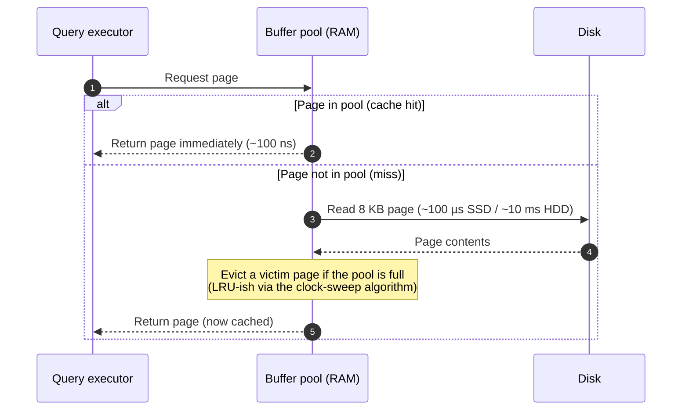

import { Callout } from 'fumadocs-ui/components/callout';
import { Tabs, Tab } from 'fumadocs-ui/components/tabs';
import { Cards, Card } from 'fumadocs-ui/components/card';

## The Core Insight: Disk Is a Block Device

Memory is byte-addressable and fast. Disk (HDD *or* SSD) is a **block device**: the smallest unit it can read or write is a whole block — historically 512 B or 4 KB, and effectively a **page** in database terms. You cannot update one byte on disk; you read a page, modify it in memory, and write the page back.

That single hardware fact shapes everything: databases are page-oriented engines.

```mermaid
flowchart LR
    subgraph RAM["RAM — fast, volatile, byte-addressable"]
        BP["Buffer Pool<br/>(e.g. shared_buffers = 4 GB)"]
    end
    subgraph DISK["Disk/SSD — slow, durable, block-addressable"]
        P1["Page 0"]
        P2["Page 1"]
        P3["Page 2"]
        P4["Page N"]
    end
    BP <-->|"fetch / evict whole 8 KB pages"| DISK

    style RAM fill:#0f172a,stroke:#34d399,stroke-width:2px
    style DISK fill:#0f172a,stroke:#f59e0b,stroke-width:2px
```



<Callout type="info" title="The Numbers That Matter">
Approximate modern latencies — memorize the ratios, not the absolutes:

| Access | Latency | Relative |
| :--- | :--- | :--- |
| L1 cache | ~1 ns | 1× |
| Main memory (RAM) | ~100 ns | 100× |
| NVMe SSD random read | ~100 µs | 100,000× |
| Spinning disk seek | ~10 ms | 10,000,000× |

A random RAM access is ~1000× cheaper than a random SSD read. **This is why caching works and why indexes that avoid disk I/O are worth their weight.**
</Callout>

---

## The 8 KB Slotted Page

PostgreSQL's default page size is **8 KB**. Every table and index is a sequence of pages. A page is not a naive array of rows; it is a *slotted page* designed so rows can move within the page without external references breaking.

```text
+---------------------------------------------------------------+  offset 0
| Page Header (24 bytes)                                        |
|  - LSN (log sequence number of last change)                   |
|  - checksum, flags, free space pointers                       |
+---------------------------------------------------------------+
| ItemId array (line pointers), grows downward →                |
|  [ offset,len ] [ offset,len ] [ offset,len ] ...             |
+---------------------------------------------------------------+
|                        <-- free space -->                     |
+---------------------------------------------------------------+
|  ... tuple N      [actual row data, grows upward from bottom] |
|  tuple 2          (variable-length values, NULL bitmap)       |
|  tuple 1                                                      |
+---------------------------------------------------------------+  offset 8192

      Each ItemId is a stable "slot" pointing at a tuple's offset.
      The tuple can be moved within the page; only the pointer updates.
```

### Why Slotted Pages?

- **Variable-length rows**: TEXT, JSON, and arrays make rows different sizes; a fixed array would waste or overflow.
- **Indirection**: an index entry typically points to `(page, slot Id)`. Because the slot pointer is stable even if the tuple is compacted, indexes never need updating on internal reorganization.
- **In-page free space management**: `VACUUM` and updates reuse space by rewriting tuples and updating their slots.

### The Tuple Header (Row Overhead)

Every row carries a header (≈23 bytes plus a NULL bitmap). In PostgreSQL this includes:

| Field | Purpose |
| :--- | :--- |
| `xmin` | Transaction that created this row version |
| `xmax` | Transaction that deleted/superseded it (0 if live) |
| `cmin` / `cmax` | Command ids within the transaction |
| `ctid` | Physical location `(block, offset)` |
| NULL bitmap | One bit per nullable column, set if `NULL` |

<Callout type="tip" title="`xmin` / `xmax` Are MVCC — Preview">
That `xmin`/`xmax` pair is the entire mechanism behind Multi-Version Concurrency Control: a row version is *visible* to a transaction based on which transaction created and deleted it. We unpack this fully in **[Stage 3](/docs/databases-sql/03-transactions-and-concurrency)**. For now, just note that **an `UPDATE` creates a new tuple version and marks the old one dead** — it does not edit in place.
</Callout>

---

## Heap Files: How Rows Are Organized

PostgreSQL tables are **heap files**: an unordered collection of pages, with rows appended wherever there is free space. The primary structure is deliberately dumb and cheap to write.

```mermaid
flowchart LR
    subgraph Heap["Heap file: bookings"]
        direction LR
        HP0["Page 0<br/>rows 1,2,3"]
        HP1["Page 1<br/>rows 4,5"]
        HP2["Page 2<br/>rows 12,9,7 (out of order!)"]
    end
    idx["B+ tree index on id<br/>(page, slot pointer)"] --> HP2
    idx --> HP0

    style Heap fill:#0f172a,stroke:#38bdf8,stroke-width:2px
```



| Property | Consequence |
| :--- | :--- |
| Rows appended in insert order | Fast writes; no global ordering maintenance |
| No inherent sort order | Every unindexed lookup is a full scan, O(N) |
| Sequential scan reads pages in order | Cheap for analytics that touch most rows |
| Deleted/updated rows leave dead space | Requires `VACUUM` to reclaim (Stage 3) |

<Callout type="warn" title="Why `ctid` Is Fragile">
PostgreSQL's `ctid` is a physical pointer `(block, offset)`. An `UPDATE` moves a row to a new `ctid`, so you must **never** store `ctid` as a long-lived identifier in your application. Use a primary key. `ctid` is for short-lived, within-query tricks only.
</Callout>

---

## The Buffer Pool: Caching Pages in RAM

Reading a page from disk is expensive, so the engine caches pages in memory. In PostgreSQL this is `shared_buffers`; other engines call it the **buffer pool** (MySQL/InnoDB) or **page cache**.



The goal is a high **cache hit ratio** — the fraction of page requests served from RAM. A workload that randomly touches far more data than fits in `shared_buffers` will thrash, and no query tuning can fully fix it; you need better indexes or more RAM.

<Callout type="tip" title="Two Layers of Caching">
PostgreSQL has its own `shared_buffers` **and** relies on the **OS page cache** below it. So "cold" and "warm" cache are not binary — a page can be in `shared_buffers`, in the OS cache (still RAM-fast), or truly on disk. `EXPLAIN (ANALYZE, BUFFERS)` distinguishes `shared hit` (pool) from `read` (disk).
</Callout>

---

## TOAST: Storing Oversized Values

A row must fit in a page (~8 KB minus overhead). What happens when a customer writes a 2 MB free-text review? PostgreSQL uses **TOAST** (The Oversized-Attribute Storage Technique):

1. Values above ~2 KB are **compressed** (if compressible).
2. If still too big, the value is **moved out-of-line** to a separate TOAST table, and the main tuple stores a small pointer.
3. The main row stays small, so scans stay fast — the giant value is only fetched when actually selected.

<Callout type="info" title="Practical Consequence">
`SELECT *` on a table with TOASTed columns forces the engine to fetch and decompress the out-of-line data. Listing only the columns you need lets the engine skip TOAST entirely — sometimes a 10× win on wide tables. Another reason to avoid `SELECT *`.
</Callout>

---

## Relative Row vs. Column Storage

This is one of the most consequential architecture decisions. A **row store** keeps all of a row's columns adjacent; a **column store** keeps one column's values adjacent across all rows.

```text
ROW STORE (OLTP) — good when you fetch/update whole rows
Page: [ id=1, name=Ada,  city=London, spend=1200 ]
      [ id=2, name=Bob,  city=Paris,  spend=800  ]
      [ id=3, name=Cy,   city=Madrid, spend=1500 ]

COLUMN STORE (OLAP) — good when you scan one column over millions of rows
Page: [ id:   1, 2, 3, ... 1_000_000 ]
Page: [ name: Ada, Bob, Cy, ... ]
Page: [ city: London, Paris, Madrid, ... ]
Page: [ spend: 1200, 800, 1500, ... ]   ← SUM(spend) reads ONLY this page range
```

| Dimension | Row store | Column store |
| :--- | :--- | :--- |
| **Best for** | OLTP: point reads, small writes | OLAP: aggregations over huge tables |
| **Reading a full row** | One page fetch | Many column pages (slow) |
| **`SUM` over one column** | Reads every column of every row | Reads only that column |
| **Compression** | Modest (mixed types per page) | Excellent (same type/domain per block) |
| **Update cost** | Low (rewrite one tuple) | Higher (column segments) |
| **Examples** | PostgreSQL, MySQL, SQL Server | ClickHouse, Redshift, BigQuery, Parquet |

<Callout type="tip" title="HTAP and Columnar Extensions">
Some engines blur the line: PostgreSQL has **`columnar`/`citus_columnar`** extensions and SQL Server/Azure have **columnstore indexes**, letting a row store keep a compressed columnar copy for analytics. The principle stands: keep write-optimized and scan-optimized representations separate.
</Callout>

---

## B-Tree vs. LSM-Tree: The Two Index Architectures

Underneath indexes, there are two dominant storage architectures. Both solve "find a key quickly", but with opposite trade-offs.

<Tabs items={['B+ Tree (read-optimized)', 'LSM-Tree (write-optimized)']}>
<Tab value="B+ Tree (read-optimized)">
```text
Writes: update a page in place; may split pages (random I/O)
Reads:  O(log N) — a few page reads; excellent point + range queries
Used by: PostgreSQL, MySQL/InnoDB, SQL Server, SQLite

    [ internal ]
       /     \
   [leaf]   [leaf] ← leaves linked for range scans
```
</Tab>
<Tab value="LSM-Tree (write-optimized)">
```text
Writes: append to an in-memory memtable, flush to sorted files, compact
Reads:  check memtable + several SSTables (read amplification)
Used by: RocksDB, Cassandra, ScyllaDB, LevelDB, ClickHouse

    memtable --> L0 SST --> L1 SST --> L2 SST (compaction merges them)
```
</Tab>
</Tabs>

| Property | B+ Tree | LSM-Tree |
| :--- | :--- | :--- |
| Write throughput | Moderate (in-place + splits) | Very high (sequential appends) |
| Read latency | Predictable, low | Variable (multiple levels to check) |
| Space overhead | Some fragmentation | Compaction overhead; bloom filters help |
| Best for | Read-heavy OLTP | Write-heavy ingestion, time-series |

<Callout type="info" title="Bloom Filters Kill the LSM Read Tax">
LSM stores keep a **Bloom filter** per SSTable: a compact probabilistic set that answers "is this key *definitely not* here?" in memory. It lets a read skip SSTables that cannot contain the key, making LSM reads nearly as fast as B-tree reads.
</Callout>

---

## Hands-on: Watching Pages and Cache Behavior

```sql
-- How big is a table on disk, and how many pages?
SELECT
    pg_size_pretty(pg_total_relation_size('bookings')) AS total_size,
    pg_size_pretty(pg_relation_size('bookings'))       AS heap_size,
    pg_relation_size('bookings') / 8192                AS heap_pages_8kb
FROM bookings;

-- Physical location of a row (block, offset) — changes on UPDATE!
SELECT ctid, id, status FROM bookings LIMIT 5;

-- Cache behavior of a query: hits vs. disk reads
EXPLAIN (ANALYZE, BUFFERS)
SELECT * FROM bookings WHERE customer_id = '...';

-- Output includes lines like:
--   Buffers: shared hit=3 read=1
--       → 3 pages served from the pool, 1 fetched from disk
```

<Callout type="warn" title="`shared_buffers` Is Not a Silver Bullet">
Tuning `shared_buffers` larger is not always better: too large and you starve the OS page cache that also caches pages, causing double caching. A common starting point is **25% of RAM**, then measure. Index and schema design almost always beats buffer tuning.
</Callout>

---

## Chapter Summary & Quick Recall

<Cards>
  <Card title="Everything is a page" href="#the-core-insight-disk-is-a-block-device">
    Disk is block-addressable, so engines read/write whole 8 KB pages. Rows live in slotted pages, each with a stable slot pointer and an MVCC tuple header.
  </Card>
  <Card title="Row stores write fast, column stores scan fast" href="#relative-row-vs-column-storage">
    OLTP row stores keep whole rows together; OLAP column stores keep one column together for compression and fast aggregation. Never conflate the workloads.
  </Card>
  <Card title="B-trees read, LSM-trees write" href="#b-tree-vs-lsm-tree-the-two-index-architectures">
    B+ trees give predictable low-latency reads with in-place updates; LSM-trees give very high write throughput with compaction and bloom-filter-assisted reads.
  </Card>
</Cards>

<Callout type="info" title="Next Up: Lesson 02">
Now that you know how pages and rows are laid out, let's make lookups fast with indexes — starting with the workhorse B+ tree. Continue to **[Indexes: B-Trees, Hash, GIN/GiST/BRIN & Covering Indexes](/docs/databases-sql/02-indexing-and-query-tuning/02-indexes-btree-hash-and-beyond)**.
</Callout>
