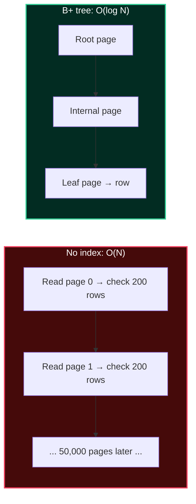

import { Callout } from 'fumadocs-ui/components/callout';
import { Tabs, Tab } from 'fumadocs-ui/components/tabs';
import { Cards, Card } from 'fumadocs-ui/components/card';


## Why Indexes Exist

A table without a suitable index forces a **sequential scan**: read every page, check every row. For `bookings` with 10 million rows, finding one customer's bookings means reading ~10 million tuples. An index turns that into a handful of page reads.



<Callout type="info" title="The Index Trade-off">
An index is a **copy of some columns, kept sorted, plus pointers back to rows**. That copy costs disk space and every `INSERT`/`UPDATE`/`DELETE` must maintain it. Indexes make reads faster and writes slower. The art is indexing the columns your read paths actually need — no more, no less.
</Callout>

---

## The B+ Tree, Anatomy of the Workhorse

PostgreSQL calls its default index a "B-tree," but it is really a **B+ tree**: values are stored only in leaf pages, and leaves are linked for fast range scans.

```text
                      [ 500 | 1500 ]              ← root (internal)
                     /      |       \
        [100|300]  [700|1100]   [1700|1900]      ← internal (branch)
         /  |  \     /  |  \       /   |   \
      leaves ... linked left→right for range scans ...

  Leaf page: [ (100,ctid) (120,ctid) (140,ctid) ... ]  ← sorted keys + row pointers
```

| Property | Value / meaning |
| :--- | :--- |
| **Fanout** | Hundreds of keys per page (internal nodes are dense) |
| **Height** | Usually 3–4 for millions of rows (root → branch → leaf) |
| **Search cost** | `O(log_fanout N)` page reads — 3–4 page reads for billions of rows |
| **Range scans** | Excellent, thanks to linked leaves |
| **Equality** | Excellent |
| **Sort by index order** | Yes — can supply `ORDER BY` for free |
| **Prefix matching** | Yes for `LIKE 'abc%'` (with the right collation) |

### Page Splits: The Cost of Inserting into a Sorted Structure

When a leaf page fills up and a new key must go in, the page **splits** into two and a separator key is pushed up. This is the main write cost of a B+ tree.

<Callout type="tip" title="Sequential vs. Random Inserts">
Inserting **always-increasing** keys (a `bigint` identity, or **UUIDv7**) appends to the rightmost leaf — cheap, no random splits. Inserting **random** keys (UUIDv4) scatters inserts across every leaf, causing frequent splits and index bloat. This is exactly why PostgreSQL 18 added the **`uuidv7()`** function: time-ordered ids that keep B+ tree inserts sequential.
</Callout>

---

## Creating and Reading Indexes

```sql
-- A basic B+ tree on one column
CREATE INDEX idx_bookings_customer ON bookings (customer_id);

-- Unique index (also enforces the constraint)
CREATE UNIQUE INDEX idx_customers_email ON customers (email);

-- Composite index: column ORDER matters (see below)
CREATE INDEX idx_bookings_cust_status ON bookings (customer_id, status);

-- Index build without locking writes (online-ish)
CREATE INDEX CONCURRENTLY idx_bookings_created ON bookings (created_at);
```

Query the catalog to inspect indexes:

```sql
SELECT indexname, indexdef FROM pg_indexes WHERE tablename = 'bookings';
```

<Callout type="warn" title="`CREATE INDEX` (Not `CONCURRENTLY`) Locks the Table">
A plain `CREATE INDEX` takes a lock that blocks writes for the duration of the build. On a large production table, **always** use `CREATE INDEX CONCURRENTLY`, which builds without blocking writes (at the cost of a slower build and the possibility of leaving an invalid index to drop-and-retry).
</Callout>

---

## Composite Indexes & the Leftmost-Prefix Rule

A composite index on `(a, b, c)` is sorted by `a`, then `b`, then `c` — like a phone book sorted by last name, then first name. It can satisfy a query only if the query constrains a **leading prefix** of its columns.

```sql
CREATE INDEX idx ON bookings (customer_id, status, created_at);
```

| Query predicate | Uses index? | Why |
| :--- | :--- | :--- |
| `customer_id = ?` | ✅ | Leading column |
| `customer_id = ? AND status = ?` | ✅ | Leading prefix `(customer_id, status)` |
| `customer_id = ? AND status = ? AND created_at > ?` | ✅ | Full index, all columns |
| `status = ?` | ❌ | Skips the leading column |
| `status = ? AND created_at > ?` | ❌ | Skips the leading column |
| `customer_id = ? AND created_at > ?` | ⚠️ | Uses `customer_id`; `created_at` filtered after (or via skip scan in PG18) |

<Callout type="tip" title="PostgreSQL 18: Skip Scan Rescues the Skipped Prefix">
Historically, `WHERE status = ? AND created_at > ?` could **not** use a `(customer_id, status, created_at)` index. PostgreSQL 18's **skip scan** lets the planner jump across the distinct values of the unfiltered leading column and still use the index. It is a safety net — good index design is still better — but it eliminates many duplicate indexes in practice.
</Callout>

### Column Ordering Heuristics

1. **Equality columns first**, then range/sort columns: `(status, created_at)`.
2. **Highest selectivity first** among equality columns (the one that filters most).
3. Columns used in `ORDER BY` last (so the index can supply sorting).
4. One well-designed composite index often replaces several single-column indexes.

---

## Covering Indexes & Index-Only Scans

When an index contains **every column a query needs**, the engine can answer without ever touching the heap table — an **index-only scan**.

```sql
-- Query needs customer_id and status only:
SELECT customer_id, status FROM bookings WHERE customer_id = '...';

-- A covering index includes both (key + INCLUDE payload)
CREATE INDEX idx_bookings_covering
    ON bookings (customer_id) INCLUDE (status);
```

```text
Regular index scan:            Index-only scan:
  Index leaf → heap row          Index leaf → DONE
  (2 page reads per row)         (no heap access!)
```

<Callout type="warn" title="Index-Only Scans Still Need a Visible Map (PostgreSQL)">
Because of MVCC, PostgreSQL cannot always trust an index entry to be current. It consults the **visibility map** to confirm the page has no un-vacuumed dead tuples. If the table is bloated, the "index-only" scan quietly falls back to heap reads. Keeping `VACUUM` (or autovacuum) healthy is what makes index-only scans actually pay off.
</Callout>

---

## The Index Family: Choosing the Right Structure

PostgreSQL ships several index access methods. B+ tree is the default and covers ~90% of cases; the rest exist for specific data shapes.

| Index type | Best for | Key operators / example |
| :--- | :--- | :--- |
| **B-tree** (default) | Equality, ranges, sorting, prefix `LIKE` | `=`, `<`, `>`, `BETWEEN`, `ORDER BY` |
| **Hash** | Pure equality on large values | `=`. Smaller than B-tree; no ranges, no ordering |
| **GIN** | Composite/multi-valued values: arrays, `jsonb`, full-text | `@>`, `?`, `@@`, `&&` |
| **GiST** | Geometric, ranges, nearest-neighbor, exclusion constraints | `&&`, `<->`, `@>` |
| **SP-GiST** | Non-balanced trees: quadtrees, k-d trees, IP trie | Points, prefix/SIMD search |
| **BRIN** | Very large, naturally ordered tables (time-series) | Range scans; tiny index footprint |
| **Bloom** | Many columns, ad-hoc equality combinations | Multi-column `=` with low selectivity |

```sql
-- Hash: equality-only, compact, for large opaque values
CREATE INDEX idx_sessions_token ON sessions USING hash (token);

-- GIN: "does this JSONB contain this tag?" / array containment / full-text
CREATE INDEX idx_bookings_tags ON bookings USING gin (tags);
CREATE INDEX idx_events_search ON events USING gin (to_tsvector('english', body));

-- GiST: no overlapping bookings for the same room (exclusion constraint)
ALTER TABLE room_bookings ADD CONSTRAINT no_overlap
  EXCLUDE USING gist (room_id WITH =, period WITH &&);

-- BRIN: cheap summary index for a huge append-only table
CREATE INDEX idx_logs_ts ON logs USING brin (created_at);
```

### BRIN in Depth: The Tiny Index

A BRIN index stores, per **block range** (e.g. every 128 pages), only the **min and max** of the indexed column. For a table where rows arrive roughly in `created_at` order, `WHERE created_at > '2026-01-01'` can skip entire block ranges in a few bytes.

```text
BRIN entry:  [ blocks 0–127  → created_at min=max 2025-01-01..2025-01-08 ]
             [ blocks 128–255 → 2025-01-08..2025-01-15 ]
             ...
             → For a recent range, skip 99% of ranges at nearly zero index size
```

| | B-tree | BRIN |
| :--- | :--- | :--- |
| Index size (1 TB table) | GBs | **KBs–MBs** |
| Works when data is unordered | Yes | No |
| Insert cost | Moderate | Negligible |
| Precision | Exact | Block-range coarse (recheck needed) |

<Callout type="tip" title="BRIN for Time-Series and Append-Only Logs">
If your table is naturally clustered by time (an append-only event log), a BRIN index on the timestamp can replace a giant B-tree at a tiny fraction of the size. Pair it with **range partitioning** (Stage 4) for even better pruning.
</Callout>

---

## Special-Purpose Indexes: Partial, Expression, Multicolumn

### Partial (Filtered) Indexes

Index only the rows that matter. Smaller, faster, cheaper to maintain.

```sql
-- Only 0.5% of bookings are pending; index just those
CREATE INDEX idx_pending ON bookings (created_at)
WHERE status = 'pending';
```

### Expression (Functional) Indexes

Index the *result* of an expression — essential when you query on derived values.

```sql
-- Without this, WHERE lower(email) = ? can't use an index on email
CREATE INDEX idx_customers_email_lower ON customers (lower(email));
```

<Callout type="warn" title="The Query Must Match the Index Expression">
`CREATE INDEX ... (lower(email))` is only used by queries that write `lower(email) = ?` *identically*. `WHERE email = ?` will not use it. Consider a `citext` column or a normalized column if case-insensitive lookup is pervasive.
</Callout>

---

## The Hidden Cost: Write Amplification & Bloat

Every index is maintained on every write. A table with 8 indexes turns one `INSERT` into nine page modifications.

```text
INSERT 1 row
  → heap page write
  → index 1 update
  → index 2 update
  → ...
  → index 8 update
```

| Symptom | Cause | Remedy |
| :--- | :--- | :--- |
| Slow `INSERT`/`UPDATE` | Too many indexes | Drop unused indexes |
| Large disk usage | Index & table bloat | `REINDEX CONCURRENTLY`, tune autovacuum |
| Planner ignoring an index | Low selectivity / bad stats | `ANALYZE`, check predicate match |

```sql
-- Find unused indexes (candidates to drop)
SELECT relname AS table, indexrelname AS index, idx_scan
FROM pg_stat_user_indexes
WHERE idx_scan = 0
ORDER BY pg_relation_size(indexrelid) DESC;
```

<Callout type="error" title="Do Not Blindly Drop Unused Indexes">
`idx_scan = 0` may just mean the stats were reset, or the index backs a `UNIQUE`/`PRIMARY KEY` constraint, or it is only exercised by a monthly report. Verify it is not a constraint index and watch over a full business cycle before dropping.
</Callout>

---

## Index Selection Cheat Sheet

<Cards>
  <Card title="Equality on one column" href="#creating-and-reading-indexes">
    Default B-tree. Done.
  </Card>
  <Card title="Equality + range / sort on the same table" href="#column-ordering-heuristics">
    Composite B-tree: equality column(s) first, then the range/sort column.
  </Card>
  <Card title="Query needs only indexed columns" href="#covering-indexes--index-only-scans">
    Add an `INCLUDE (...)` covering index for an index-only scan.
  </Card>
  <Card title="Array, JSONB, or full-text containment" href="#the-index-family-choosing-the-right-structure">
    GIN.
  </Card>
  <Card title="Ranges, geometry, or exclusion constraints" href="#the-index-family-choosing-the-right-structure">
    GiST.
  </Card>
  <Card title="Huge append-only time-series table" href="#brin-in-depth-the-tiny-index">
    BRIN on the timestamp (with partitioning).
  </Card>
</Cards>

<Callout type="info" title="Next Up: Lesson 03">
Indexes only help if the optimizer *chooses* them. The next lesson explains the cost model, statistics, and join algorithms behind that choice — and how to read the plan it produces. Continue to **[Query Optimization: Cost Models, Join Algorithms & `EXPLAIN`](/docs/databases-sql/02-indexing-and-query-tuning/03-query-planning-and-explain)**.
</Callout>
