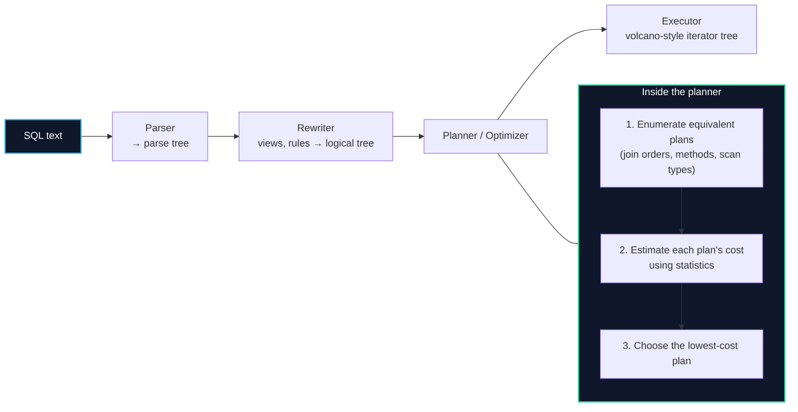

import { Callout } from 'fumadocs-ui/components/callout';
import { Tabs, Tab } from 'fumadocs-ui/components/tabs';
import { Steps, Step } from 'fumadocs-ui/components/steps';
import { Cards, Card } from 'fumadocs-ui/components/card';

## From SQL to Plan: What the Optimizer Does

You write SQL declaratively — you say *what*. The **query optimizer (planner)** decides *how*. It does this in three phases:



The planner is a **search algorithm over possible plans**, guided by a cost model that approximates the dominant resource: page reads.

### The Cost Units

PostgreSQL's costs are in arbitrary units tied to page access:

| Constant | Default | Meaning |
| :--- | :--- | :--- |
| `seq_page_cost` | 1.0 | Cost to read one page sequentially |
| `random_page_cost` | 4.0 | Cost to read one page randomly (SSDs → often 1.1) |
| `cpu_tuple_cost` | 0.01 | Cost to process one tuple |
| `cpu_index_tuple_cost` | 0.005 | Cost per index entry |
| `effective_cache_size` | — | Planner's estimate of available OS+PG cache |

<Callout type="warn" title="Tune `random_page_cost` for SSDs">
The default `random_page_cost = 4.0` assumes spinning disks. On NVMe SSD, where random reads are nearly as cheap as sequential, lowering it to `1.1` tells the planner index scans are cheaper than it thinks — often unlocking plans that were wrongly avoided. This is one of the highest-leverage tuning knobs.
</Callout>

---

## Selectivity & Statistics: The Foundation of Every Estimate

To cost a plan, the planner must guess **how many rows each step returns** (its *cardinality*). It does so using statistics gathered by `ANALYZE`.

```sql
-- Gather (or refresh) statistics for a table
ANALYZE bookings;

-- Inspect stored stats: distinct count, most-common values, histogram
SELECT attname, n_distinct, most_common_vals, histogram_bounds
FROM pg_stats
WHERE tablename = 'bookings';
```

| Statistic | Question it answers |
| :--- | :--- |
| `n_distinct` | How many distinct values? (drives selectivity) |
| `most_common_vals` / `_freqs` | Skewed hot values and their frequencies |
| `histogram_bounds` | Value distribution for range estimation |
| `correlation` | 1.0 = physically sorted (favors index scans); 0 = random |

**Selectivity** = fraction of rows a predicate keeps. Equality on a unique column ≈ 1/N. Equality on a low-cardinality boolean ≈ 0.5 or 0.001 depending on skew.

<Callout type="error" title="The #1 Cause of Bad Plans: Cardinality Misestimation">
If the planner thinks a step returns 10 rows but it actually returns 10 million, it will pick a nested loop (great for small inputs, catastrophic for large). This single error underlies most "why is my query slow?" incidents. Fixes:
- Run `ANALYZE` (or raise autovacuum's analyze frequency).
- Increase `default_statistics_target` for skewed columns.
- Correlate columns with **extended statistics** (`CREATE STATISTICS`).
- Rewrite predicates so the estimator can reason about them.
</Callout>

```sql
-- Multi-column correlation: the planner assumes independence by default
-- "city = Paris AND country = France" — but city implies country!
CREATE STATISTICS st_geo (dependencies, ndistinct)
ON city, country FROM customers;
ANALYZE customers;   -- now estimates far more accurately
```

---

## The Three Join Algorithms

The planner picks one per join based on input sizes and available indexes.

<Tabs items={['Nested Loop', 'Hash Join', 'Merge Join']}>
<Tab value="Nested Loop">
```text
For each row in the OUTER input:
    find matching rows in the INNER input
    (via index lookup, or a full scan)
```
- **Best when**: outer input is small and the inner has an index on the join key.
- **Worst when**: both inputs are large (O(N×M) without an index).
- **Latency**: can return the first rows immediately (good for `LIMIT`).
</Tab>
<Tab value="Hash Join">
```text
1. Build a hash table on the SMALLER input (the "build" side)
2. Probe it with each row of the LARGER input
```
- **Best when**: both inputs are large and equality is the join condition.
- **Cost**: O(N+M); needs `work_mem` to hold the hash table.
- **Failure mode**: spills to disk ("Batches") if it exceeds `work_mem`.
</Tab>
<Tab value="Merge Join">
```text
1. Sort both inputs on the join key (or read them in index order)
2. Walk both sorted streams together, matching like a zipper
```
- **Best when**: both inputs are already sorted (e.g. by an index) and the join is a range/inequality.
- **Cost**: O(N log N + M log M) if sorting is required.
</Tab>
</Tabs>

| Join method | Inputs | Equality only? | Sorted output? |
| :--- | :--- | :--- | :--- |
| Nested loop | Small outer + indexed inner | No (any predicate) | No |
| Hash join | Large + large | Yes | No |
| Merge join | Pre-sorted / index order | Yes (± ranges) | Yes |

---

## Reading `EXPLAIN`: The Anatomy of a Plan

`EXPLAIN` shows the plan; `EXPLAIN ANALYZE` **runs** it and shows actuals. Always read plans bottom-up: the innermost node executes first.

```sql
EXPLAIN (ANALYZE, BUFFERS, VERBOSE)
SELECT c.full_name, COUNT(*)
FROM customers c
JOIN bookings b ON b.customer_id = c.id
WHERE b.status = 'paid'
GROUP BY c.full_name;
```

```text
HashAggregate  (cost=12450.3..12500.1 rows=498 width=40) (actual time=88.2..89.0 rows=4801 loops=1)
  Group Key: c.full_name
  Buffers: shared hit=2104 read=88
  ->  Hash Join  (cost=320.0..12100.0 rows=140000 width=36) (actual time=3.1..70.4 rows=132054 loops=1)
        Hash Cond: (b.customer_id = c.id)
        ->  Seq Scan on bookings b  (cost=0.0..9800.0 rows=140000 width=20) (actual time=0.02..35.9 rows=132054 loops=1)
              Filter: (status = 'paid'::text)
              Rows Removed by Filter: 421946
        ->  Hash  (cost=180.0..180.0 rows=9600 width=20) (actual time=2.9..2.9 rows=9600 loops=1)
              ->  Seq Scan on customers c  (cost=0.0..180.0 rows=9600 width=20) (actual time=0.1..1.4 rows=9600 loops=1)
```

### How to Read Each Node

| Field | Meaning |
| :--- | :--- |
| `cost=startup..total` | Estimated units (not milliseconds!) to first row and to completion |
| `rows=` | **Estimated** rows output by this node |
| `actual time=first..last` | Real ms to first and last row (`ANALYZE` only) |
| `actual rows=` | **Real** rows output — compare with `rows=` to spot misestimation |
| `loops=` | How many times this node executed (e.g. nested loop inner side) |
| `Buffers: shared hit/read` | Pages served from pool vs. fetched from disk |
| `Rows Removed by Filter` | Rows read then discarded — a sign of missing/wrong index |

### Plan Node Glossary (Common Ones)

| Node | What it means |
| :--- | :--- |
| `Seq Scan` | Full table scan (fine for large-result queries, bad for selective ones) |
| `Index Scan` | Uses an index, then fetches rows from the heap |
| `Index Only Scan` | Answers from the index alone (no heap) |
| `Bitmap Index Scan` + `Bitmap Heap Scan` | Collects many matching pages, then reads them in physical order |
| `Nested Loop` / `Hash Join` / `Merge Join` | The three join implementations |
| `HashAggregate` / `GroupAggregate` | Two ways to do `GROUP BY` |
| `Sort` | Explicit sort (watch for `external merge Disk` — spilling) |
| `Materialize` | Caches an inner input reused across loops |
| `Gather` / `Gather Merge` | Collects parallel worker output |
| `Limit` | Stops early — makes nested loops attractive |

<Callout type="tip" title="The #1 Diagnostic Move">
Find the node where `actual time` or `actual rows` **diverges hardest from the estimate**, or where `Rows Removed by Filter` is huge. That node is almost always the bottleneck. A `Seq Scan` with `Rows Removed by Filter: 421946` and only 132054 kept screams "this predicate needs an index or better statistics."
</Callout>

---

## The Bitmap Scan: Best of Both Worlds

When a query matches many scattered rows, fetching them one-by-one via the index causes random I/O. A **bitmap scan** collects matching row locations into a bitmap, then reads the heap **in physical page order**.

```text
Index Scan:        leaf→heap, leaf→heap, ... (random access, repeated pages)
Bitmap Index Scan: build bitmap of matching (block, slot)
Bitmap Heap Scan:  read blocks 0,1,2,... once each in order
```

| Scan | Best for |
| :--- | :--- |
| `Index Scan` | Highly selective queries (few rows) or `ORDER BY` via index |
| `Bitmap Heap Scan` | Medium selectivity, many rows scattered across pages |
| `Seq Scan` | Low selectivity (most rows match) or tiny tables |

<Callout type="info" title="Workload Reality: Sometimes `Seq Scan` Is Correct">
A sequential scan is not a failure. If a predicate keeps 40% of the table, a full scan (one pass over pages, no random I/O) genuinely beats an index scan. Do not force an index with hints; if the planner chose a `Seq Scan` on a low-selectivity predicate, that is often right. The pathology is a `Seq Scan` on a *highly selective* predicate.
</Callout>

---

## A Diagnostic Workflow

<Steps>
<Step>
### 1. Reproduce with `EXPLAIN (ANALYZE, BUFFERS)`

```sql
EXPLAIN (ANALYZE, BUFFERS, VERBOSE)
SELECT ...;   -- the slow query
```
Never tune without the actual plan and row counts.
</Step>

<Step>
### 2. Find the worst node

Look for the largest gap between `rows=` estimate and `actual rows=`, or the largest `Rows Removed by Filter`, or `Buffers: read` that is huge (cold cache / no index).
</Step>

<Step>
### 3. Check statistics and predicates

```sql
ANALYZE the_table;                       -- refresh stats
SELECT correlation FROM pg_stats WHERE ...;  -- is the column clustered?
```
</Step>

<Step>
### 4. Fix the cause, not the symptom

- **Missing index** → add a composite/covering index (Lesson 02).
- **Misestimate** → `ANALYZE`, `default_statistics_target`, `CREATE STATISTICS`.
- **Spilling sort/hash** → raise `work_mem` for the session (or rewrite).
- **Wrong join method** → often a downstream effect of misestimation.
</Step>

<Step>
### 5. Re-run and compare

```sql
EXPLAIN (ANALYZE, BUFFERS) SELECT ...;   -- did actual rows fall? did pages read drop?
```
</Step>
</Steps>

---

## Parallelism & Modern Planner Improvements

PostgreSQL can parallelize scans, joins, and aggregation across worker processes:

```sql
EXPLAIN (ANALYZE) SELECT count(*) FROM bookings;
-- Finalize Aggregate
--   -> Gather
--        -> Partial Aggregate  (in each worker)
--             -> Parallel Seq Scan on bookings
```

| Setting | Role |
| :--- | :--- |
| `max_parallel_workers_per_gather` | Workers per plan node |
| `min_parallel_table_scan_size` | Table size before parallelism kicks in |
| `parallel_setup_cost` / `parallel_tuple_cost` | Planner cost of going parallel |

PostgreSQL 18 adds an **asynchronous I/O subsystem** that lets backends queue multiple reads at once — speeding up sequential scans, bitmap heap scans, and vacuum. It is transparent, but it further rewards keeping `effective_io_concurrency` sensible for your storage.

---

## Chapter Summary & Quick Recall

<Cards>
  <Card title="The planner searches plans by estimated cost" href="#from-sql-to-plan-what-the-optimizer-does">
    It enumerates join orders and scan/join methods, estimates cardinality from statistics, and picks the cheapest. Costs approximate page reads.
  </Card>
  <Card title="Misestimation is the root of most bad plans" href="#selectivity--statistics-the-foundation-of-every-estimate">
    When estimated rows diverge from actual, the planner picks the wrong algorithm. Fix with `ANALYZE`, extended statistics, and honest predicates.
  </Card>
  <Card title="Always read `EXPLAIN (ANALYZE, BUFFERS)`" href="#reading-explain-the-anatomy-of-a-plan">
    Read bottom-up; find the node with the biggest estimate-vs-actual gap or `Rows Removed by Filter`. Fix the cause, then re-run.
  </Card>
</Cards>

<Callout type="info" title="Next Up: Stage 3">
You now understand how single queries are executed efficiently. The next stage tackles the harder problem: keeping many concurrent queries **correct**. Continue to **[Stage 3: Transactions, Concurrency & Reliability](/docs/databases-sql/03-transactions-and-concurrency)**.
</Callout>
