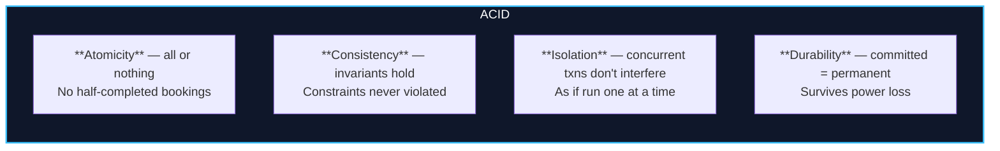
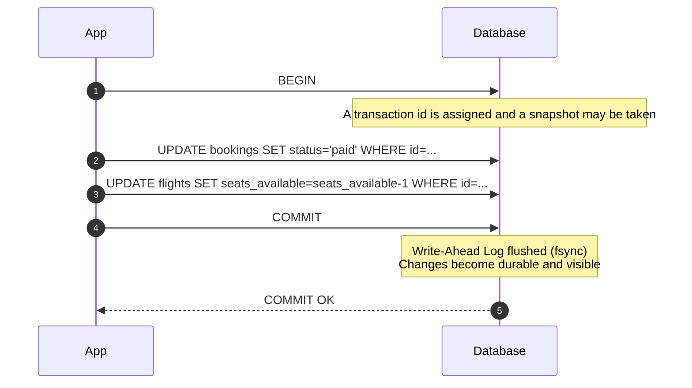

import { Callout } from 'fumadocs-ui/components/callout';
import { Tabs, Tab } from 'fumadocs-ui/components/tabs';
import { Cards, Card } from 'fumadocs-ui/components/card';

## The TravelBuddy Booking That Half-Happened

A customer pays for a flight. Your code does two writes:

```js
await db.query('UPDATE bookings SET status = $1 WHERE id = $2', ['paid', id]);
await db.query('UPDATE flights SET seats_available = seats_available - 1 WHERE id = $1', [flightId]);
```

If the process crashes **between** those two statements, the booking is `paid` but the seat count never decremented — you have sold a seat that is still listed as available. Oversold flights, angry customers, refunds. The unit of work is *two operations that must succeed or fail together*.

That unit is a **transaction**.

> **A transaction is a sequence of operations that the database treats as a single, indivisible unit: either all of its effects become visible and durable, or none do.**

---

## The Four Properties: ACID



| Property | Guarantee | TravelBuddy failure it prevents | Where it lives |
| :--- | :--- | :--- | :--- |
| **Atomicity** | The whole transaction applies or none of it does | Booking marked paid but seats not decremented | Undo info / MVCC + abort |
| **Consistency** | All constraints and invariants hold before & after | Negative seat count, orphan FK row | Constraints + transaction logic |
| **Isolation** | Concurrent transactions behave as if serial | Two agents booking the last seat | Concurrency control (MVCC/locks) |
| **Durability** | Once committed, it survives a crash | A paid booking lost when the server reboots | Write-Ahead Log + `fsync` |

<Callout type="warn" title="C Is the Odd One Out">
A, I, and D are *guarantees the DBMS provides*. **Consistency** is partly *your* responsibility: the database can enforce declared constraints, but it cannot know your unwritten business rules ("a customer may hold at most 10 active bookings"). Atomicity + Isolation + correct constraints is what delivers consistency. Do not assume it is automatic.
</Callout>

---

## The Transaction Lifecycle



If any statement fails and you issue `ROLLBACK` (or the connection drops), the engine discards every change — the transaction **aborts**.

```sql
BEGIN;
UPDATE bookings SET status = 'paid'   WHERE id = 'b1';
UPDATE flights  SET seats_available = seats_available - 1 WHERE id = 42;
COMMIT;   -- both effects become permanent, atomically
```

<Callout type="error" title="Autocommit Is the Default">
Outside an explicit `BEGIN`, **every statement is its own transaction** (autocommit). The crash-between-two-statements bug happens precisely because the two `UPDATE`s were *not* wrapped in a transaction. Whenever multiple writes must succeed together, open an explicit transaction.
</Callout>

---

## Atomicity in Depth: How "All or Nothing" Works

The engine cannot undo a page write that already hit disk. Instead, atomicity is implemented by **not making changes permanent until commit**, and by keeping enough information to reverse uncommitted work:

- **Before images (undo):** the old row versions needed to roll back.
- **Write-Ahead Log:** records of intended changes, replayed on recovery.
- **MVCC versions:** uncommitted changes are simply invisible to other transactions until commit.

At `COMMIT`, the engine ensures every change's log record is durable **before** acknowledging. At `ROLLBACK` (or crash), it uses undo / ignores uncommitted versions.

```sql
BEGIN;
INSERT INTO bookings (customer_id, status, total_cents)
VALUES ('...', 'paid', 49900);
-- Oops — wrong customer. Discard everything:
ROLLBACK;
-- The row never existed to anyone. Not even a gap.
```

---

## Savepoints: Partial Rollback

Sometimes you want to undo *part* of a transaction without abandoning the whole thing. A **savepoint** is a named marker you can roll back to.

```sql
BEGIN;

INSERT INTO bookings (customer_id, status, total_cents)
VALUES ('c1', 'pending', 49900);

SAVEPOINT before_second;

INSERT INTO booking_items (booking_id, flight_id, price_cents)
VALUES (currval('bookings_id_seq'), 42, 49900);  -- suppose this fails validation

ROLLBACK TO SAVEPOINT before_second;   -- undo only the second insert
-- keep the first booking

INSERT INTO booking_items (booking_id, flight_id, price_cents)
VALUES (currval('bookings_id_seq'), 99, 49900);  -- retry with a valid flight

COMMIT;   -- the booking AND the corrected item persist
```

| Statement | Effect |
| :--- | :--- |
| `SAVEPOINT name` | Create a rollback marker |
| `ROLLBACK TO SAVEPOINT name` | Undo everything after the marker; keep the transaction alive |
| `RELEASE SAVEPOINT name` | Discard the marker (changes remain) |

<Callout type="tip" title="ORMs Use Savepoints for `try`/`catch`">
Frameworks like Django, Rails, and SQLAlchemy wrap nested transaction blocks in savepoints so an inner failure can be caught and retried without killing the whole outer transaction. This is why `nested = True` / `begin_nested()` exists.
</Callout>

---

## Durability in Depth: `fsync` and `synchronous_commit`

Durability sounds absolute, but it is a **dial**. The OS buffers writes; a `COMMIT` that returns before the data reaches stable storage can be lost in a power failure.


| `synchronous_commit` | Behavior | Risk |
| :--- | :--- | :--- |
| `on` (default) | `fsync` before acknowledging | None (slower) |
| `off` | Acknowledge before flush | Last ~few ms of commits lost on crash (consistency usually OK) |
| `local` / `remote_apply` | Wait for local WAL / standby apply | Tunable durability vs. latency |
| `remote_write` | Wait for standby to write (not flush) | Between `local` and `on` |

<Callout type="info" title="Durability vs. Latency Is a Deliberate Trade">
Turning `synchronous_commit = off` can dramatically boost write throughput by batching `fsync`s, at the cost of possibly losing the most recent handful of committed transactions on an OS crash or power loss. Many high-throughput systems accept this. Decide deliberately per workload — never by accident.
</Callout>

---

## Isolation: The Property That Needs Its Own Lesson

Isolation is the richest of the four and the source of the most bugs. In one sentence:

> **Isolation makes concurrent transactions behave as if they ran one at a time (serial), even though they actually interleaved.**

Perfect serial execution is trivially correct but slow (no concurrency). Real databases offer *degrees* of isolation, each permitting certain anomalies in exchange for performance. That entire spectrum — and the anomalies it leaks — is the subject of **[Lesson 02](/docs/databases-sql/03-transactions-and-concurrency/02-isolation-levels-and-anomalies)**.

```sql
-- The four SQL-standard levels, settable per transaction:
BEGIN;
SET TRANSACTION ISOLATION LEVEL READ COMMITTED;   -- PostgreSQL default
-- ... work ...
COMMIT;
```

---

## Transactions in Application Code

<Tabs items={['Explicit & correct', 'The partial-failure bug', 'Idempotency']}>
<Tab value="Explicit & correct">
```js
const client = await pool.connect();
try {
  await client.query('BEGIN');
  await client.query('UPDATE bookings SET status = $1 WHERE id = $2', ['paid', id]);
  await client.query('UPDATE flights SET seats_available = seats_available - 1 WHERE id = $1', [flightId]);
  await client.query('COMMIT');
} catch (err) {
  await client.query('ROLLBACK');
  throw err;
} finally {
  client.release();      // ALWAYS return the connection to the pool
}
```
</Tab>
<Tab value="The partial-failure bug">
```js
// Two autocommitted statements → the half-booking bug
await db.query('UPDATE bookings SET status = $1 WHERE id = $2', ['paid', id]);
// crash here = paid booking, seat not decremented
await db.query('UPDATE flights SET seats_available = seats_available - 1 WHERE id = $1', [flightId]);
```
</Tab>
<Tab value="Idempotency">
```sql
-- Networks retry. Make replay safe with a unique idempotency key.
INSERT INTO payment_attempts (idempotency_key, booking_id, amount_cents)
VALUES ('pay_abc123', 'b1', 49900)
ON CONFLICT (idempotency_key) DO NOTHING;  -- double charge prevented
```
</Tab>
</Tabs>

<Callout type="error" title="Never Hold a Transaction Open Across a Network Call">
An open transaction holds locks and a connection. Calling a third-party payment API *inside* a transaction can hold a row lock for seconds, block other users, and exhaust your connection pool. Pattern: do the external call **outside** the transaction, then transact a short, local update keyed by an idempotency key.
</Callout>

---

## Chapter Summary & Quick Recall

<Cards>
  <Card title="A transaction is the unit of atomic work" href="#the-travelbuddy-booking-that-half-happened">
    Multiple statements that must all succeed or all fail belong in one explicit transaction. Autocommit turns each statement into its own transaction — a classic bug source.
  </Card>
  <Card title="A, I, D are guarantees; C is partly yours" href="#the-four-properties-acid">
    Atomicity, Isolation, and Durability are provided by the engine. Consistency depends on your constraints and business rules too.
  </Card>
  <Card title="Durability is a dial" href="#durability-in-depth-fsync-and-synchronous_commit">
    `synchronous_commit` trades durability for latency. Choose deliberately; the default (`on`) survives crashes at the cost of throughput.
  </Card>
</Cards>

<Callout type="info" title="Next Up: Lesson 02">
Atomicity is intuitive; **isolation** is subtle. The next lesson dissects every concurrency anomaly — including the write-skew bug that breaks otherwise-careful engineers. Continue to **[Isolation Levels & Anomalies](/docs/databases-sql/03-transactions-and-concurrency/02-isolation-levels-and-anomalies)**.
</Callout>
