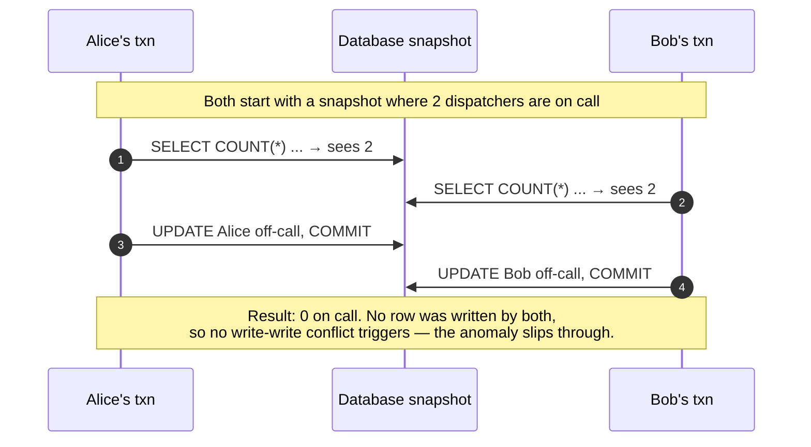
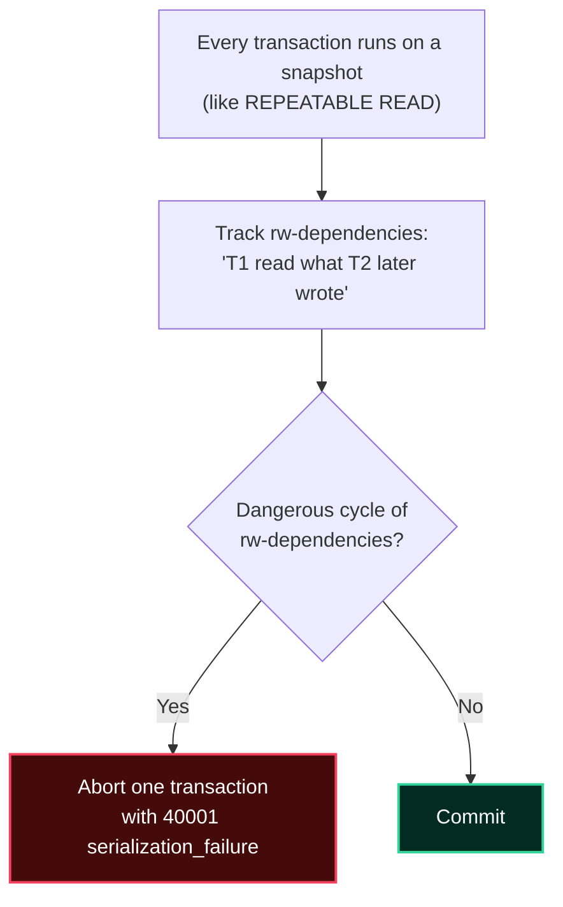

import { Callout } from 'fumadocs-ui/components/callout';
import { Tabs, Tab } from 'fumadocs-ui/components/tabs';
import { Cards, Card } from 'fumadocs-ui/components/card';

## Why Isolation Is Subtle

Serial execution is trivially correct. Full concurrency is fast but riddled with races. **Isolation levels** are a spectrum between the two: each permits certain **anomalies** (specific bad interleavings) in exchange for throughput. If you know the anomalies by name and which levels forbid them, you can choose correctly instead of guessing.

<Callout type="warn" title="The Names Lie">
The SQL standard's four level names suggest a tidy ladder. In reality, implementations differ wildly. Most famously, **PostgreSQL's `REPEATABLE READ` is stronger than the standard requires** (it is true snapshot isolation), and **MySQL's `REPEATABLE READ` is weaker** (it can still allow phantoms in some cases historically). Always verify your specific engine. We give PostgreSQL's real mapping below.
</Callout>

---

## The Anomaly Zoo

Let's define each anomaly with a concrete TravelBuddy timeline. `T1` and `T2` are concurrent transactions.

### Dirty Read — reading uncommitted data

```text
T1: UPDATE flights SET seats_available = 0 WHERE id = 42;   -- not committed
T2: SELECT seats_available FROM flights WHERE id = 42;       -- reads 0
T1: ROLLBACK;                                                -- the 0 never existed!
```

T2 acted on a value that was never real. **Forbidden by every level except `READ UNCOMMITTED`** (and PostgreSQL never actually allows it — it treats `READ UNCOMMITTED` as `READ COMMITTED`).

### Lost Update — two writers overwrite each other

```text
Initial: seats_available = 1
T1: reads 1 → plans to write 0
T2: reads 1 → plans to write 0
T1: writes 0   (sells the seat to customer A)
T2: writes 0   (sells the SAME seat to customer B)   ← lost update: two seats sold
```

The classic read-modify-write race. Fixes: atomic `UPDATE ... SET x = x - 1` (single statement), `SELECT ... FOR UPDATE`, or a higher isolation level.

### Non-Repeatable Read — the same row changes mid-transaction

```text
T1: SELECT total_cents FROM bookings WHERE id = b1;  -- reads 49900
T2: UPDATE bookings SET total_cents = 39900 WHERE id = b1; COMMIT;
T1: SELECT total_cents FROM bookings WHERE id = b1;  -- reads 39900 — different!
```

Within T1, the same query returned two different values. **Prevented by `REPEATABLE READ` and above.**

### Phantom Read — new rows appear mid-transaction

```text
T1: SELECT COUNT(*) FROM bookings WHERE customer_id = c1;  -- 3
T2: INSERT INTO bookings (customer_id, ...) VALUES (c1, ...); COMMIT;
T1: SELECT COUNT(*) FROM bookings WHERE customer_id = c1;  -- 4 — a phantom!
```

Same predicate, different row set — because rows were *added*. **Prevented by `SERIALIZABLE`; PostgreSQL's `REPEATABLE READ` (snapshot isolation) also prevents it** because T1 sees a fixed snapshot.

### Read Skew — inconsistent snapshot across rows

```text
Initial: account A = 600, account B = 400 (total 1000)
T1 reads A = 600
T2: transfers 200 from A to B, COMMIT  (now A=400, B=600)
T1 reads B = 600
T1 concludes total = 1200  ← impossible!
```

Each read is individually committed, but together they mix two points in time. Prevented by snapshot isolation (`REPEATABLE READ`+).

### Write Skew — the one that fools careful engineers

Write skew is the anomaly that **snapshot isolation permits** and that a single `SELECT ... FOR UPDATE` will *not* fix, because the two transactions write **disjoint rows**.

**Scenario:** TravelBuddy requires at least **one** on-call dispatcher at all times. Alice and Bob are both on call.

```text
Initial: Alice on_call = true, Bob on_call = true  (2 dispatchers, fine)

T1 (Alice): SELECT COUNT(*) FROM dispatchers WHERE on_call;  -- sees 2 → OK to go off call
T2 (Bob):   SELECT COUNT(*) FROM dispatchers WHERE on_call;  -- sees 2 → OK to go off call

T1: UPDATE dispatchers SET on_call = false WHERE name = 'Alice';  COMMIT
T2: UPDATE dispatchers SET on_call = false WHERE name = 'Bob';    COMMIT

Final: 0 dispatchers on call  ← invariant violated!
```



| Why `FOR UPDATE` doesn't help | Why `SERIALIZABLE` does |
| :--- | :--- |
| The two transactions update **different rows** (Alice vs. Bob), so there is no row to lock in common. | SSI tracks read-write dependencies and detects the dangerous cycle, aborting one transaction. |

<Callout type="error" title="Write Skew Is the Reason `SERIALIZABLE` Exists">
Write skew cannot be prevented by row locking, by atomic single-statement updates, or by snapshot isolation. It is prevented **only** by true serializability (or by an explicit, coarser lock such as `LOCK TABLE dispatchers IN EXCLUSIVE MODE`). If your invariant spans multiple rows — staffing minimums, budget caps, "no double booking" — this is the bug you are at risk of.
</Callout>

### The Full Anomaly Table

| Anomaly | What it means | Prevented by (PostgreSQL) |
| :--- | :--- | :--- |
| **Dirty read** | Reading uncommitted data | `READ COMMITTED`+ (all real levels) |
| **Dirty write** | Overwriting uncommitted data | All levels |
| **Lost update** | Two read-modify-writes clobber | `REPEATABLE READ`+ (or atomic update / `FOR UPDATE`) |
| **Read skew** | Inconsistent multi-row snapshot | `REPEATABLE READ`+ |
| **Non-repeatable read** | Same row changes mid-txn | `REPEATABLE READ`+ |
| **Phantom read** | New rows appear mid-txn | `REPEATABLE READ`+ (PG) / `SERIALIZABLE` (standard) |
| **Write skew** | Two txns write disjoint rows, invariant broken | **`SERIALIZABLE` only** |

---

## The Classic Isolation Grid vs. PostgreSQL's Real One

### SQL-92 (the standard, simplified)

| Level | Dirty read | Non-repeatable read | Phantom |
| :--- | :--- | :--- | :--- |
| `READ UNCOMMITTED` | Possible | Possible | Possible |
| `READ COMMITTED` | No | Possible | Possible |
| `REPEATABLE READ` | No | No | Possible |
| `SERIALIZABLE` | No | No | No |

### PostgreSQL's Actual Behavior (the one you should memorize)

| Level | Dirty read | Non-repeatable | Phantom | Write skew | Implementation |
| :--- | :--- | :--- | :--- | :--- | :--- |
| `READ UNCOMMITTED` | No* | Possible | Possible | Possible | treated as `READ COMMITTED` |
| `READ COMMITTED` **(default)** | No | Possible | Possible | Possible | new snapshot **per statement** |
| `REPEATABLE READ` | No | No | **No** | **Possible** | snapshot **per transaction** (true SI) |
| `SERIALIZABLE` | No | No | No | **No** | SSI (snapshot + dangerous-cycle detection) |

\* PostgreSQL never permits dirty reads.

<Callout type="info" title="PostgreSQL's `REPEATABLE READ` Is Snapshot Isolation">
PostgreSQL implements `REPEATABLE READ` as **snapshot isolation**: the transaction sees one consistent snapshot for its entire life. This is *stronger* than the SQL standard mandates (which only forbids non-repeatable reads), and it is why PostgreSQL's `REPEATABLE READ` also rules out phantoms and read skew. The one thing it still permits is **write skew**.
</Callout>

---

## Serializable Snapshot Isolation (SSI)

`SERIALIZABLE` in PostgreSQL is **SSI**: it runs every transaction on a snapshot (like `REPEATABLE READ`) but additionally tracks **read-write dependencies** and aborts a transaction when it detects a pattern that could produce a non-serializable outcome.



The trade-off: `SERIALIZABLE` may **abort** transactions that *could* have conflicted. Your application must be prepared to **retry** on the `40001` error.

```sql
-- Application pattern for SERIALIZABLE: retry on serialization failure
BEGIN ISOLATION LEVEL SERIALIZABLE;
  -- ... read/write ...
COMMIT;   -- may raise SQLSTATE 40001; catch and retry the WHOLE transaction
```

<Callout type="tip" title="Retry Is Mandatory, Not Optional">
If you set `SERIALIZABLE` and your code does not catch `40001 (serialization_failure)` and retry, your application will randomly *fail* under load instead of producing a wrong answer. Serializability converts silent data corruption into loud, retryable errors — which is a good trade, but only if you handle it.
</Callout>

---

## Choosing an Isolation Level

| Workload | Recommended | Why |
| :--- | :--- | :--- |
| Read-mostly, independent statements | `READ COMMITTED` (default) | Fast; each statement sees fresh committed data |
| Multi-statement reads needing consistency | `REPEATABLE READ` | One stable snapshot; no read skew |
| Accounting, inventory, reservation invariants | `SERIALIZABLE` + retry | Only level that forbids write skew |
| Analytics on a replica | `REPEATABLE READ` | Long consistent snapshot without surprises |

### Fixing Lost Updates Without Raising the Level

You often do not need `SERIALIZABLE` for a simple counter or seat decrement — just make the read-modify-write **atomic** or **lock explicitly**:

```sql
-- Atomic: the read and write happen in one statement (no lost update)
UPDATE flights
SET seats_available = seats_available - 1
WHERE id = 42 AND seats_available > 0;   -- guard the invariant in the predicate
-- Check: if 0 rows were affected, the seat was gone → retry / report sold out

-- Or pessimistic locking: serialize on the row
BEGIN;
SELECT seats_available FROM flights WHERE id = 42 FOR UPDATE;  -- row lock
-- ... decide ...
UPDATE flights SET seats_available = seats_available - 1 WHERE id = 42;
COMMIT;
```

<Callout type="tip" title="The Conditional-Update Pattern Beats Read-Then-Write">
`UPDATE ... WHERE id = ? AND seats_available > 0` is the cheapest correct way to enforce a per-row invariant. It is atomic, takes a row lock internally, and lets you detect failure by checking the affected-row count — all without raising the isolation level. Reach for `SERIALIZABLE` only when the invariant spans **multiple rows** (write skew territory).
</Callout>

---

## Chapter Summary & Quick Recall

<Cards>
  <Card title="Know the anomalies by name" href="#the-anomaly-zoo">
    Dirty read, lost update, non-repeatable read, phantom, read skew, and **write skew**. Naming the anomaly is most of the diagnosis.
  </Card>
  <Card title="PostgreSQL's REPEATABLE READ is snapshot isolation" href="#postgresqls-actual-behavior-the-one-you-should-memorize">
    It prevents phantoms and read skew but still permits write skew. The default is `READ COMMITTED` (a fresh snapshot per statement).
  </Card>
  <Card title="Write skew needs SERIALIZABLE (and retries)" href="#write-skew-the-one-that-fools-careful-engineers">
    Multi-row invariants cannot be protected by row locks. Use SSI and handle `40001` by retrying the whole transaction.
  </Card>
</Cards>

<Callout type="info" title="Next Up: Lesson 03">
How does the engine actually provide these levels — and keep data safe across a crash? Next we open up MVCC, locking, the Write-Ahead Log, and crash recovery. Continue to **[MVCC, Locking, WAL & Crash Recovery](/docs/databases-sql/03-transactions-and-concurrency/03-mvcc-wal-and-recovery)**.
</Callout>
