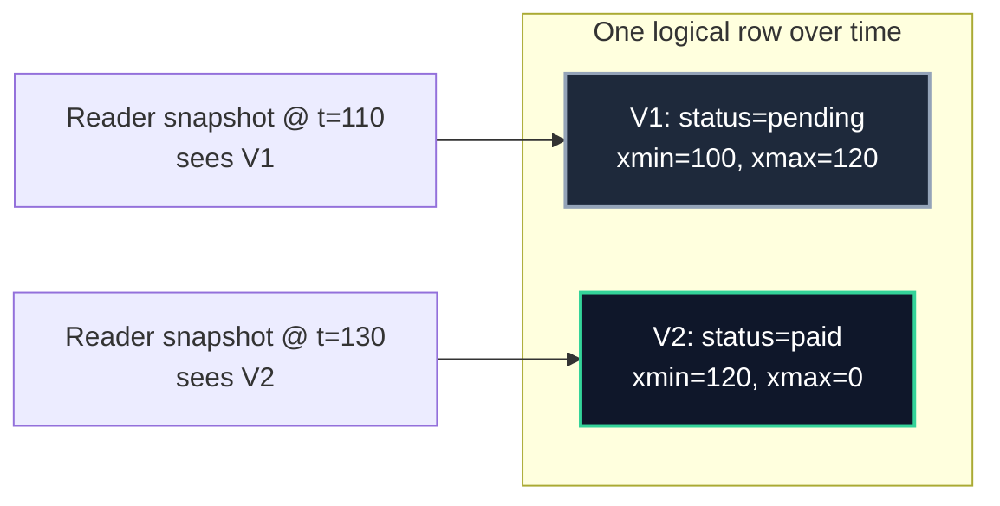
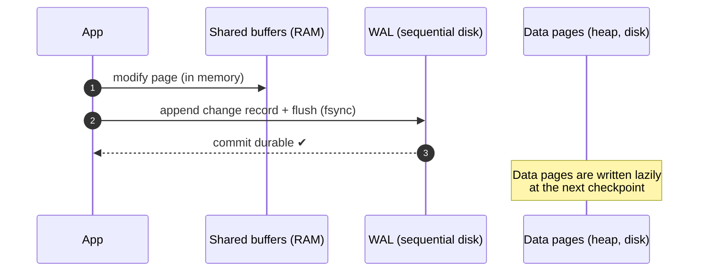

import { Callout } from 'fumadocs-ui/components/callout';
import { Tabs, Tab } from 'fumadocs-ui/components/tabs';
import { Cards, Card } from 'fumadocs-ui/components/card';

## MVCC: Readers Never Block Writers

The naïve way to control concurrency is locking: a reader takes a shared lock, a writer takes an exclusive lock, and they block each other. That is correct but terrible — a long report would freeze all writes.

**Multi-Version Concurrency Control (MVCC)** takes a different approach: **keep multiple versions of each row**. A reader sees the version that was current when its snapshot was taken; a writer creates a *new* version. Neither blocks the other.



Recall from Stage 2 that every PostgreSQL tuple carries a header:

| Field | Meaning |
| :--- | :--- |
| `xmin` | Transaction id that **created** this version |
| `xmax` | Transaction id that **deleted/superseded** it (0 = still live) |

A row version is **visible** to a transaction's snapshot if `xmin` committed before the snapshot and `xmax` is not committed-before the snapshot. An `UPDATE` is not an in-place edit — it writes a new tuple version and sets the old version's `xmax`.

<Callout type="info" title="The Profound Consequence">
**Reads never block writes, and writes never block reads.** Writers only ever conflict on writes to the *same* row. This is why PostgreSQL handles mixed read/write workloads so well — but it is also why the table accumulates **dead tuples** that must later be cleaned up.
</Callout>

---

## Dead Tuples, Bloat & `VACUUM`

Every `UPDATE` and `DELETE` leaves a **dead tuple** (an older version no transaction will ever see again). If nothing reclaimed them, a hot table would grow without bound.

```text
After many updates to the same row:
Page: [ V1 dead ] [ V2 dead ] [ V3 dead ] [ V4 LIVE ]
                 ↑ unreclaimable space — "bloat"
```

**`VACUUM`** reclaims this space:

1. Marks dead tuple slots reusable.
2. Updates the **visibility map** so index-only scans know a page has no dead tuples.
3. In `VACUUM FULL`, physically rewrites the table (heavy lock — rarely worth it).

```sql
VACUUM bookings;              -- reclaim dead tuples (no full lock)
VACUUM ANALYZE bookings;      -- also refresh statistics
VACUUM FULL bookings;         -- rewrite the table (ACCESS EXCLUSIVE lock!)
```

<Callout type="warn" title="Autovacuum Is Not Optional">
PostgreSQL runs **autovacuum** automatically, but on high-churn tables it often lags. Bloat causes: heavier scans, index-only scans falling back to the heap, and — worst case — **transaction ID wraparound**, where the engine shuts down to protect data. Tune `autovacuum_vacuum_scale_factor` per hot table and monitor dead tuples (Stage 5).
</Callout>

### Wraparound: Why `xmin`/`xmax` Are Only 32 Bits

Transaction ids are a rolling 32-bit counter (~4 billion values). Old ids get reused after wraparound, so a tuple that was never vacuumed could be misinterpreted as "created in the future." PostgreSQL's defense is aggressive: if a table approaches the wraparound limit, it refuses new writes. Keeping vacuum healthy is what keeps the database *writeable*.

---

## Explicit Locking: When You Need Control

MVCC handles most cases, but sometimes you need to *reserve* a row or serialize a critical section. PostgreSQL offers explicit lock modes.

```sql
BEGIN;
-- Lock the row so nobody else can read-for-update or write it until COMMIT
SELECT * FROM flights WHERE id = 42 FOR UPDATE;
-- ... decide based on the locked values ...
UPDATE flights SET seats_available = seats_available - 1 WHERE id = 42;
COMMIT;
```

| Lock clause | Effect |
| :--- | :--- |
| `FOR UPDATE` | Exclusive row lock; blocks other `FOR UPDATE` and writers |
| `FOR NO KEY UPDATE` | Weaker; allows FK references |
| `FOR SHARE` | Shared lock; others may `FOR SHARE` but not update |
| `FOR KEY SHARE` | Weakest; blocks key changes only |
| `NOWAIT` | Fail immediately instead of waiting |
| `SKIP LOCKED` | Skip already-locked rows — the job-queue pattern |

### Lock Modes on a Table

| Mode | Conflicts with | Typical cause |
| :--- | :--- | :--- |
| `ACCESS SHARE` | `ACCESS EXCLUSIVE` | `SELECT` |
| `ROW SHARE` | `EXCLUSIVE`, `ACCESS EXCLUSIVE` | `SELECT FOR UPDATE` |
| `ROW EXCLUSIVE` | `SHARE`, `SHARE ROW EXCLUSIVE`, ... | `INSERT`/`UPDATE`/`DELETE` |
| `SHARE` | `ROW EXCLUSIVE`+ | `CREATE INDEX` (non-concurrent) |
| `ACCESS EXCLUSIVE` | **everything** | `ALTER TABLE`, `VACUUM FULL`, `DROP` |

<Callout type="error" title="The `ALTER TABLE` Outage">
`ALTER TABLE` (and `CREATE INDEX` without `CONCURRENTLY`) takes `ACCESS EXCLUSIVE`, which conflicts with *every* other lock — including `SELECT`. On a busy table it queues behind active queries, and every subsequent query queues behind *it*. The fix: use `CONCURRENTLY` where available, set a `lock_timeout`, and apply schema changes during maintenance windows.
</Callout>

### Deadlocks: When Two Transactions Wait on Each Other

```text
T1: UPDATE accounts SET ... WHERE id = 1;   -- locks row 1
T2: UPDATE accounts SET ... WHERE id = 2;   -- locks row 2
T1: UPDATE accounts SET ... WHERE id = 2;   -- waits for T2
T2: UPDATE accounts SET ... WHERE id = 1;   -- waits for T1  → circular wait!
```

PostgreSQL's **deadlock detector** notices the cycle after `deadlock_timeout` (default 1 s) and aborts one transaction with `40P01 deadlock_detected`. The database never hangs forever — but the aborted transaction must be retried.

<Callout type="tip" title="Prevent Deadlocks by Lock Ordering">
The reliable fix is to always acquire locks in a **consistent order** (e.g., by ascending id). Deadlocks are a *design* problem, not a database limitation. Also keep transactions short and avoid ad-hoc multi-row updates in unpredictable order.
</Callout>

```sql
-- Find blocking chains (who is blocking whom)
SELECT
    pid, pg_blocking_pids(pid) AS blocked_by, state, wait_event_type, query
FROM pg_stat_activity
WHERE cardinality(pg_blocking_pids(pid)) > 0;
```

---

## The Write-Ahead Log (WAL): How Durability Actually Works

Reading from memory is fine, but if the server crashes, only what reached **durable storage** survives. Rewriting scattered heap pages on every commit would be catastrophically slow (random I/O). The **Write-Ahead Log** solves this with one rule:

> **Write-Ahead Logging rule: before any change is written to a data page on disk, a record describing that change must first be flushed to the WAL.**

Because the WAL is written **sequentially** (append-only), flushing it is fast. Committed changes are durable as soon as the WAL record is `fsync`ed — the actual data pages can be written lazily later.



### Key WAL Concepts

| Term | Meaning |
| :--- | :--- |
| **LSN** | Log Sequence Number — a byte offset identifying a WAL position |
| **Checkpoint** | Point where all dirty pages up to an LSN are flushed; recovery can start here |
| **Redo** | Replaying WAL records forward to restore committed changes |
| **Undo** | Rolling back uncommitted changes (in PostgreSQL, largely unnecessary thanks to MVCC) |
| **`wal_level`** | How much detail is logged (`replica` supports replication) |

### Crash Recovery

On startup after a crash, PostgreSQL performs **recovery**: it finds the last checkpoint and **replays** WAL forward from there, redoing every change that reached the log — committed or not. Uncommitted changes are effectively "undone" because their tuples carry an aborted `xmin` and are never made visible.

<Callout type="info" title="ARIES in One Sentence">
Classic recovery is **ARIES**: *Analysis* (find the state), *Redo* (replay history — repeat history), *Undo* (roll back losers). PostgreSQL's MVCC means "undo" is mostly a visibility decision rather than physical reversal — but the analysis + redo structure is the same.
</Callout>

---

## Checkpoints: Bounding Recovery Time

If the WAL grew forever, recovery would take forever. A **checkpoint** flushes dirty pages to disk and records a safe starting point, letting old WAL be recycled.

| Setting | Effect |
| :--- | :--- |
| `checkpoint_timeout` | Max time between checkpoints (default 5 min) |
| `max_wal_size` | WAL size that triggers a checkpoint |
| `checkpoint_completion_target` | Spreads the flush to smooth I/O spikes (e.g. 0.9) |

<Callout type="warn" title="Too-Frequent Checkpoints Hurt Throughput">
Checkpoints are a burst of random writes. Too frequent → I/O storms and slow commits; too rare → long recovery times and unbounded WAL. The defaults are conservative; tune with `checkpoint_completion_target ≈ 0.9` to smooth the spikes.
</Callout>

---

## Point-in-Time Recovery (PITR)

Because WAL is a complete, ordered history, you can restore a **base backup** and then replay WAL up to an exact timestamp — recovering from an accidental `DROP TABLE` at 14:32 by restoring to 14:31.

```bash
# 1. Take a base backup
pg_basebackup -D /backups/base -Ft -z -P

# 2. Continuously archive WAL segments
#    archive_command = 'cp %p /backups/wal/%f'   (in postgresql.conf)

# 3. To recover, restore the base backup and replay WAL up to a point
#    restore_command = 'cp /backups/wal/%f %p'
#    recovery_target_time = '2026-07-04 14:31:00+00'
```

<Callout type="tip" title="WAL Powers More Than Recovery">
The same append-only log underlies **streaming replication** (Stage 4), **logical replication**, and **Change Data Capture (CDC)** — streaming every row change to Kafka or another system. One log, many uses.
</Callout>

---

## Chapter Summary & Quick Recall

<Cards>
  <Card title="MVCC = many versions, no reader/writer blocking" href="#mvcc-readers-never-block-writers">
    Updates create new tuple versions with `xmin`/`xmax`; snapshots decide visibility. Reads never block writes — but dead tuples accumulate.
  </Card>
  <Card title="Vacuum keeps the database alive and writeable" href="#dead-tuples-bloat--vacuum">
    Autovacuum reclaims dead tuples, maintains the visibility map for index-only scans, and prevents transaction-id wraparound.
  </Card>
  <Card title="WAL makes commits durable and recoverable" href="#the-write-ahead-log-wal-how-durability-actually-works">
    Log the change sequentially before touching data pages; replay it after a crash. Checkpoints bound recovery time; PITR replays to any point.
  </Card>
</Cards>

<Callout type="info" title="Next Up: Stage 4">
One machine has limits. The next stage scales out: replication, partitioning, consensus, and the NoSQL families. Continue to **[Stage 4: Distributed Data, Scaling & NoSQL](/docs/databases-sql/04-distributed-data-and-nosql)**.
</Callout>
