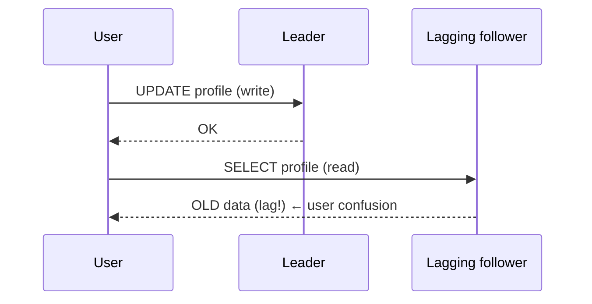

import { Callout } from 'fumadocs-ui/components/callout';
import { Tabs, Tab } from 'fumadocs-ui/components/tabs';
import { Cards, Card } from 'fumadocs-ui/components/card';

## Why Replicate at All?

TravelBuddy's single database now serves millions of users. You replicate for three reasons:

1. **Availability / durability** — survive the loss of a machine or an entire region.
2. **Read scalability** — fan reads out across many replicas.
3. **Latency** — put a copy near users in each continent.

But the moment you have more than one copy, you must decide **how writes propagate** and **what consistency** readers see. That is the whole game.

---

## Single-Leader (Primary/Replica) Replication

The dominant model (PostgreSQL streaming replication, MySQL, MongoDB default). One node accepts writes; others replicate from it.

```mermaid
flowchart LR
    C["Clients"] -->|writes + reads| L["Leader (primary)"]
    C -->|reads| R1["Follower A"]
    C -->|reads| R2["Follower B"]
    L -->|"replication stream (WAL)"| R1
    L -->|"replication stream (WAL)"| R2

    style L fill:#0f172a,stroke:#38bdf8,stroke-width:2px
    style R1 fill:#0f172a,stroke:#34d399,stroke-width:2px
    style R2 fill:#0f172a,stroke:#34d399,stroke-width:2px
```



### Synchronous vs. Asynchronous

| Mode | Leader waits for… | Consistency | Availability cost |
| :--- | :--- | :--- | :--- |
| **Asynchronous** | Nothing | Followers lag; possible data loss on failover | Highest (leader never blocks) |
| **Synchronous** | A follower to confirm the write | No data loss; write durability guaranteed | Leader blocks if the follower is down |
| **Semi-synchronous** | One follower (or N of M) | Bounded loss (none if the sync follower is up) | Middle ground |

```sql
-- PostgreSQL: inspect replication state and lag
SELECT client_addr, state, sync_state,
       pg_wal_lsn_diff(pg_current_wal_lsn(), replay_lsn) AS lag_bytes
FROM pg_stat_replication;
```

<Callout type="warn" title="Asynchronous Replication Can Lose Committed Data">
With asynchronous replication, the leader acknowledges a commit before the follower has it. If the leader then dies, the promotion of a lagging follower **silently loses** those acknowledged commits. For financial data, use synchronous (or semi-synchronous) replication and accept the latency cost.
</Callout>

### Failover & Split Brain

When the leader dies, a follower must be **promoted**. Getting this right is notoriously hard:

- **Detecting** death — timeouts lie; a slow network looks like a dead leader.
- **Choosing** the new leader — the most up-to-date follower should win.
- **Split brain** — two nodes both believe they are leader and accept conflicting writes.

<Callout type="error" title="Split Brain Is the Scariest Failure">
If two leaders accept writes independently (e.g., during a network partition), you get **divergent histories** that must be manually reconciled. Real systems defend with a **fencing token** or **STONITH** (shoot the other node in the head) to guarantee at most one active leader. Managed failover (Patroni, RDS Multi-AZ) exists precisely to make this safe.
</Callout>

---

## Replication Lag & the Consistency You Must Build Yourself

Even with a running leader, followers lag by milliseconds to seconds. That lag leaks through your API as **inconsistencies** unless you handle them.

### Read-Your-Writes

A user writes (to the leader) then immediately reads (from a lagging follower) and does not see their own change — "I saved it, why is it gone?!"



**Fixes:**
- Route a user's reads to the leader for N seconds after their write.
- Remember the write's LSN / timestamp and only read from a replica that has caught up.
- Pin the session to the leader for read-your-writes-sensitive flows.

### Monotonic Reads

A user reads fresh data, refreshes, and sees *older* data (because the second read hit a *more* lagging replica). Prevent it by pinning a user to a consistent replica (e.g., hash user id → replica).

### Consistent Prefix

No reader should see an effect before its cause (a reply before its message). Preserving write order in replication handles this.

<Callout type="tip" title="Replication Lag Is an Application Concern">
The database gives you a *stream* of committed changes. It does **not** magically make every replica instant. Read-your-writes and monotonic reads are **client-side guarantees** you must design for — commonly by session pinning or LSN tracking.
</Callout>

---

## Multi-Leader Replication

Multiple nodes accept writes (e.g., one leader per region), each replicating to the others.

```mermaid
flowchart LR
    subgraph EU
        L1["Leader: Europe"]
    end
    subgraph US
        L2["Leader: US"]
    end
    subgraph APAC
        L3["Leader: APAC"]
    end
    L1 <-->|bidirectional| L2
    L2 <-->|bidirectional| L3
    L3 <-->|bidirectional| L1

    style L1 fill:#0f172a,stroke:#38bdf8,stroke-width:2px
    style L2 fill:#0f172a,stroke:#34d399,stroke-width:2px
    style L3 fill:#0f172a,stroke:#f59e0b,stroke-width:2px
```



**Upside:** low-latency writes everywhere, each region writes locally.
**Downside:** the same row can be written concurrently in two regions → **write conflicts** that must be resolved.

| Conflict resolution | How it works | Weakness |
| :--- | :--- | :--- |
| **Last-Write-Wins (LWW)** | Highest timestamp wins | Silently drops the "losing" write; clocks matter |
| **Version vectors** | Detect concurrent updates | Requires manual merge logic |
| **CRDTs** | Data types that merge deterministically | Only for specific structures (counters, sets) |
| **Application merge** | Custom domain logic on conflict | Complex, but correct |

<Callout type="info" title="CRDTs: Convergence by Construction">
**Conflict-free Replicated Data Types** (grow-only counters, OR-Sets, RGA sequences) are designed so that any two replicas that have seen the same set of updates **converge to the same state**, regardless of order. They power collaborative editors ("every keystroke merges") and are the principled answer to multi-leader conflicts. Google Docs' operational transform and Automerge's CRDT are two implementations.
</Callout>

---

## Leaderless Replication & Quorums (Dynamo-Style)

No leader at all. The client (or a coordinator) writes to **several replicas** and reads from **several**, using quorums to guarantee consistency. This is the model behind Cassandra, DynamoDB, and Riak.

Let:
- `N` = number of replicas that hold each key.
- `W` = number of replicas that must acknowledge a write.
- `R` = number of replicas that must respond to a read.

> **The quorum rule:** if **`W + R > N`**, every read overlaps every write, so at least one replica in the read set has the latest write — meaning the read will see it.

```mermaid
flowchart LR
    C["Client"] -->|write to W of N| N1["Node 1"]
    C -->|write| N2["Node 2"]
    C -->|write| N3["Node 3"]
    C -->|read from R of N| N1
    C -->|read| N2
    N1 & N2 & N3 <-->|"anti-entropy / hinted handoff"| N1

    style N2 fill:#0f172a,stroke:#34d399,stroke-width:2px
```



| Configuration | `W + R > N`? | Behavior |
| :--- | :--- | :--- |
| `N=3, W=3, R=1` | 4 > 3 ✅ | Fast strong reads, slow/fragile writes |
| `N=3, W=2, R=2` | 4 > 3 ✅ | Balanced |
| `N=3, W=1, R=1` | 2 < 3 ❌ | Fast, **eventually consistent** |
| `N=3, W=1, R=3` | 4 > 3 ✅ | Fast writes, slow reads |

**Handling failures:**
- **Hinted handoff**: if a target replica is down, another node stores the write and delivers it when the node returns.
- **Read repair**: if a read finds a stale replica, it updates it.
- **Anti-entropy**: a background process compares replicas and reconciles differences.

<Callout type="warn" title="Quorums Give You a *Likely* Latest Value, Not a Version">
`W + R > N` guarantees overlap, but resolving *which* value is newest often falls back to **timestamps or version numbers** — so LWW semantics leak back in. To get true consistency you also need a conflict resolution rule and sometimes a read-repair pass. Quorums are a powerful primitive, not a magic consistency switch.
</Callout>

---

## How Replication Is Physically Implemented

| Method | Replicates | Use for |
| :--- | :--- | :--- |
| **WAL / physical shipping** | Byte-for-byte page changes | Hot standby, exact clone, fast failover |
| **Logical replication** | Row-level changes per table | Selective replication, cross-version, upgrades |
| **Change Data Capture (CDC)** | Row changes as events | Streaming to Kafka, search index, cache, warehouse |

```sql
-- PostgreSQL physical standby: stream WAL from the primary
-- primary:  wal_level = replica ;  standby: primary_conninfo = 'host=... '
-- Logical replication: publish a table to a subscriber
CREATE PUBLICATION travelbuddy_pub FOR TABLE customers, bookings;
-- on the subscriber:
CREATE SUBSCRIPTION travelbuddy_sub
  CONNECTION 'host=primary dbname=travelbuddy'
  PUBLICATION travelbuddy_pub;
```

<Callout type="tip" title="CDC Is How You Keep Search & Caches Consistent">
You will rarely run analytics, full-text search, or caches on the transactional primary. Instead, stream every change via CDC (e.g., Debezium reading the WAL) into Elasticsearch, Redis, or a warehouse. This **decouples** systems while keeping them eventually consistent — a pattern we complete in Stage 5.
</Callout>

---

## Chapter Summary & Quick Recall

<Cards>
  <Card title="Single-leader is the default; sync vs async is the key dial" href="#synchronous-vs-asynchronous">
    Async is fast but can lose acknowledged commits on failover; sync is safe but blocks. Semi-sync balances them. Failover risks split brain.
  </Card>
  <Card title="Replication lag creates consistency bugs you must fix in the app" href="#replication-lag--the-consistency-you-must-build-yourself">
    Read-your-writes and monotonic reads need session pinning or LSN tracking. The database ships the changes; you guarantee the experience.
  </Card>
  <Card title="Quorums: W + R > N means reads overlap writes" href="#leaderless-replication--quorums-dynamo-style">
    Leaderless systems use tunable quorums plus hinted handoff, read repair, and anti-entropy to converge — with LWW-style conflict resolution as the usual tiebreaker.
  </Card>
</Cards>

<Callout type="info" title="Next Up: Lesson 02">
Replication copies *the same* data. The next technique splits *different* data across machines — partitioning and sharding. Continue to **[Partitioning & Sharding](/docs/databases-sql/04-distributed-data-and-nosql/02-partitioning-and-sharding)**.
</Callout>
