import { Callout } from 'fumadocs-ui/components/callout';
import { Tabs, Tab } from 'fumadocs-ui/components/tabs';
import { Cards, Card } from 'fumadocs-ui/components/card';

## Two Kinds of "Split"

The word *partitioning* covers two related ideas:

- **Replication** (Stage 4, Lesson 01) keeps *copies of the same data* on many machines — for availability and read scaling.
- **Partitioning / sharding** splits *different subsets of the data* across machines — for write scaling and dataset size.

```mermaid
flowchart TD
    subgraph Repl["Replication: same data, many copies"]
        direction LR
        A["[A B C]"] --> A1["[A B C]"]
        A --> A2["[A B C]"]
    end
    subgraph Shard["Sharding: different data, one home each"]
        direction LR
        B["[A B C D E F]"] --> B1["[A B]"]
        B --> B2["[C D]"]
        B --> B3["[E F]"]
    end

    style Repl fill:#0f172a,stroke:#38bdf8,stroke-width:2px
    style Shard fill:#0f172a,stroke:#34d399,stroke-width:2px
```



They compose: each shard is typically replicated for durability.

---

## Partitioning *Within* a Node (Declarative)

Before you reach for multiple machines, PostgreSQL 18-compatible declarative partitioning splits a large table into physical child tables while presenting one logical table. This is the **first, cheapest scaling lever**.

```sql
-- Range partitioning by month: the canonical time-series pattern
CREATE TABLE bookings (
    id          uuid        NOT NULL,
    customer_id uuid        NOT NULL,
    created_at  timestamptz NOT NULL,
    total_cents bigint      NOT NULL,
    PRIMARY KEY (id, created_at)          -- partition key must be in the PK
) PARTITION BY RANGE (created_at);

CREATE TABLE bookings_2026_07 PARTITION OF bookings
    FOR VALUES FROM ('2026-07-01') TO ('2026-08-01');
CREATE TABLE bookings_2026_08 PARTITION OF bookings
    FOR VALUES FROM ('2026-08-01') TO ('2026-09-01');
```

| Partition strategy | Keys to a partition by… | Best for |
| :--- | :--- | :--- |
| **Range** | Value intervals (`created_at`) | Time-series; easy archive/drop of old data |
| **List** | Explicit value sets (`region IN (...)`) | Categorical data (tenant, region) |
| **Hash** | Hash of a key → even buckets | Even distribution; no natural range |

### Partition Pruning: The Big Win

When a query constrains the partition key, the planner **prunes** partitions it can prove are irrelevant:

```sql
-- Touches ONLY bookings_2026_07 — other partitions are skipped entirely
SELECT * FROM bookings
WHERE created_at >= '2026-07-01' AND created_at < '2026-08-01';
```

<Callout type="tip" title="Why Time-Series Loves Range Partitions">
Retention becomes a metadata operation: `DROP TABLE bookings_2026_01` is instant and does not bloat (no `DELETE` + `VACUUM`). Combined with BRIN or per-partition indexes, this is the standard high-volume logging design.
</Callout>

<Callout type="error" title="The Partition-Key Constraint">
In PostgreSQL, a **unique or primary key must include the partition key**. You cannot enforce global uniqueness across partitions on `id` alone — because two partitions do not know about each other. If you need globally unique ids across shards, generate them (UUIDv7, Snowflake) or maintain a dedicated registry.
</Callout>

---

## Sharding Across Machines

When one node cannot hold the data or handle the write rate, split rows across **nodes**.

### Range Sharding

Assign key ranges to shards, like a phone book by first letter.

```text
Shard 0: customer_id < 100000
Shard 1: 100000 ≤ customer_id < 200000
Shard 2: customer_id ≥ 200000
```

| Pro | Con |
| :--- | :--- |
| Efficient range scans within a shard | Prone to **hotspots** if ranges are uneven |
| Easy to reason about | A single hot range can overload one shard |

### Hash Sharding

Apply a hash function to the key and mod into `N` shards.

```text
shard = hash(customer_id) mod N
```

| Pro | Con |
| :--- | :--- |
| Even distribution | Range scans must scatter across all shards |
| No hotspots from clustering | Changing `N` remaps almost every key (see below) |

### The Naïve Modulo Problem

`hash(key) mod N` looks fine until you add a node. Going from `N=4` to `N=5` remaps **~80% of all keys**, forcing a massive data shuffle.

### Consistent Hashing

**Consistent hashing** places both nodes and keys on a ring (hash space `0 … 2^32−1`). A key belongs to the first node clockwise from it.

```mermaid
flowchart LR
    subgraph Ring["Hash ring (0 → 2³²−1 → 0)"]
        direction LR
        N1(("Node A")) --- N2(("Node B")) --- N3(("Node C")) --- N1
        K1["key 'ada'"] -.-> N2
        K2["key 'bob'"] -.-> N3
        K3["key 'cy'"] -.-> N1
    end

    style Ring fill:#0f172a,stroke:#38bdf8,stroke-width:2px
```



Adding or removing a node moves only the keys in the arc between it and its neighbor — roughly `1/N` of keys instead of almost all of them.

**Virtual nodes (vnodes):** each physical node is placed at *many* points on the ring. This smooths distribution (a physical node with a bad hash is not stuck with a huge arc) and lets you weight stronger machines higher.

<Callout type="info" title="Consistent Hashing Is Everywhere">
Beyond databases, consistent hashing is the standard technique for distributing keys across a changing set of servers in memcached/Redis clusters, CDNs, service meshes, and Kafka partitions. Learn it once; you will recognize it constantly.
</Callout>

### The Celebrity / Hotspot Problem

Even perfect hashing cannot help if **one key is disproportionately popular** — a celebrity's profile, a viral post, a single mega-tenant. Hashing spreads *keys* evenly but not *load*.

| Mitigation | Idea |
| :--- | :--- |
| **Key salting** | Append a random suffix: `celebrity#0`…`celebrity#9` across shards; read all and merge |
| **Read caching** | Serve the hot key from a cache (Stage 5) |
| **Dedicated shard** | Move the hot tenant to its own node |
| **Manual splitting** | Split the hot key's range across nodes |

---

## Rebalancing

Adding or removing a shard requires redistributing data. Strategies:

| Strategy | How it works | Trade-off |
| :--- | :--- | :--- |
| **Fixed # of partitions** | Create many more partitions than nodes (e.g. 1,000); move whole partitions between nodes | Clean and idiomatic (used by many systems) |
| **Fixed # of shards per node** | Assign multiple shards per node; move some on change | Balances load without moving keys within partitions |
| **Dynamic (split/merge)** | Split hot partitions, merge cold ones | Adaptive but operationally complex |
| **Consistent hashing** | Move only the arc between nodes | Simple; may be uneven without vnodes |

<Callout type="tip" title="Rebalance Without Downtime">
Rebalancing moves live data. Do it **incrementally**, copying data while serving reads from the old location and dual-writing, then cut over atomically. This is the same "expand → migrate → contract" discipline as schema changes (Stage 5). Never `FLUSHALL`-style moves on production data.
</Callout>

---

## Secondary Indexes in a Sharded System

The hard part of sharding is not the primary key lookup — it is the **secondary indexes**. If bookings are sharded by `customer_id`, how do you query "all bookings for flight 42"?

<Tabs items={['Local (document-partitioned)', 'Global (term-partitioned)']}>
<Tab value="Local (document-partitioned)">
```text
Each shard indexes ONLY its own rows.
Query by a non-shard key → scatters to EVERY shard, then merges results.
```
- **Pros:** simple; each shard maintains its own indexes; writes are local.
- **Cons:** scatter/gather reads; tail latency is the slowest shard.
- **Used by:** most document stores, Cassandra (with ALLOW FILTERING).
</Tab>
<Tab value="Global (term-partitioned)">
```text
The index itself is sharded by the INDEXED value (e.g. hash(flight_id)).
To find bookings for flight 42, look up ONE index shard → get the row locations.
```
- **Pros:** fast secondary lookups without scatter/gather.
- **Cons:** the index is updated across the network on every write; more fragile.
- **Used by:** DynamoDB Global Secondary Indexes, Vitess, Spanner.
</Tab>
</Tabs>

<Callout type="warn" title="Shard Key Choice Is Nearly Irreversible">
The shard key determines *which queries are cheap*. If most of your queries filter by `customer_id`, shard by `customer_id`. If you later need to query by `flight_id`, you are stuck with scatter/gather or a rebuilt global index. **Enumerate your top 5 access patterns before choosing a shard key.** Changing it later means re-sharding the entire dataset.
</Callout>

---

## Choosing a Shard Key: A Checklist

1. **High cardinality** — enough distinct values to spread evenly (avoid `status`!).
2. **Even access** — no single value dominates (avoid a celebrity key).
3. **Matches your queries** — co-locate data you query together.
4. **Stable** — the key does not change over a row's lifetime.
5. **Enables co-location** — related rows (a customer and their bookings) on the same shard to avoid cross-shard joins.

<Callout type="info" title="The Cross-Shard Cost">
Once sharded, a join or transaction spanning keys becomes a **distributed** operation: scatter/gather, or two-phase commit (next lesson). Good shard-key design makes the common queries **single-shard**. This is the entire art of sharding — put the data you touch together on the same machine.
</Callout>

---

## Chapter Summary & Quick Recall

<Cards>
  <Card title="Partition within a node first" href="#partitioning-within-a-node-declarative">
    Declarative range/list/hash partitioning plus pruning handles enormous tables without distributing anything. Drop old partitions instead of deleting rows.
  </Card>
  <Card title="Consistent hashing moves ~1/N of keys, not ~all" href="#the-naïve-modulo-problem">
    Placing nodes and keys on a hash ring keeps rebalancing cheap. Virtual nodes smooth distribution and allow weighting.
  </Card>
  <Card title="The shard key decides everything" href="#choosing-a-shard-key-a-checklist">
    Choose high-cardinality, evenly-accessed, query-matching keys so common queries stay single-shard. Secondary indexes then become local or global.
  </Card>
</Cards>

<Callout type="info" title="Next Up: Lesson 03">
Sharding and replication create the hardest problem in databases: agreeing on the truth across machines. Next: **CAP, consensus (Raft), distributed transactions**, and how to choose among the **NoSQL families**. Continue to **[Distributed Transactions, Consensus & the NoSQL Families](/docs/databases-sql/04-distributed-data-and-nosql/03-distributed-transactions-consensus-and-nosql)**.
</Callout>
