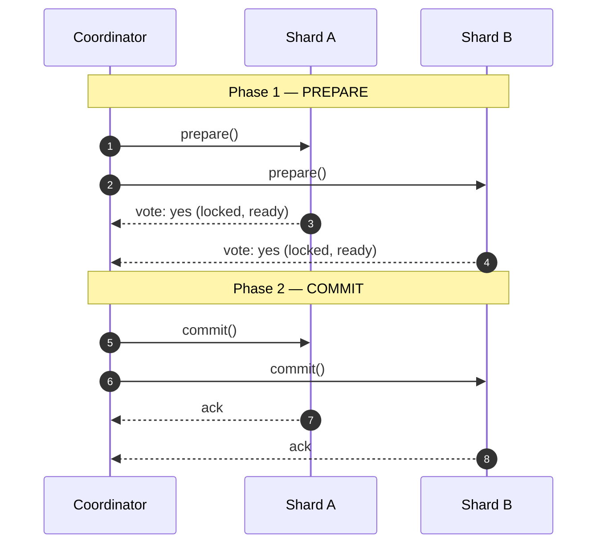

import { Callout } from 'fumadocs-ui/components/callout';
import { Tabs, Tab } from 'fumadocs-ui/components/tabs';
import { Cards, Card } from 'fumadocs-ui/components/card';

## The Two Hard Problems

Distribution gives you scale and fault tolerance — and creates two deep problems:

1. **Consistency**: with data on many nodes and links that fail, how do copies agree?
2. **Transactions**: how do you keep an operation atomic when it spans multiple shards?

---

## CAP: The Theorem Everyone Quotes, Few Explain

The **CAP theorem** (Eric Brewer) states that a distributed data system can, during a **network partition**, guarantee at most **two** of:

```mermaid
flowchart TD
    C["Consistency<br/>(every read sees the latest write)"]
    A["Availability<br/>(every request gets a non-error response)"]
    P["Partition tolerance<br/>(the system works despite dropped/delayed messages)"]
    C --- A
    A --- P
    P --- C

    style CAP fill:#0f172a,stroke:#38bdf8,stroke-width:2px
```



<Callout type="warn" title="The Crucial Nuance: P Is Not Optional">
In any real network, **partitions happen**. So "partition tolerance" is not a choice you get to decline — you must tolerate partitions, and the theorem reduces to: **when a partition occurs, choose Consistency or Availability.**

- **CP** systems refuse requests rather than return stale data (e.g., a quorum is unreachable → error).
- **AP** systems keep answering, risking stale reads, and reconcile later (eventual consistency).

CAP describes behavior *during a partition only*. That is why **PACELC** was proposed.
</Callout>

### PACELC: The More Useful Framing

> **P**artition: if a partition, choose **A**vailability or **C**onsistency. **E**lse (no partition): choose **L**atency or **C**onsistency.

| System | Behavior |
| :--- | :--- |
| Traditional PostgreSQL (single node) | PC/EC — consistent always; unavailable on partition |
| DynamoDB | PA/EL — available during partition; low latency over strong consistency |
| Spanner / CockroachDB | PC/EC — strongly consistent, paying coordination latency |
| Cassandra (tunable) | PA/EL with tunable quorums |

### Linearizability vs. Serializability

These are frequently confused:

| Property | About | Definition |
| :--- | :--- | :--- |
| **Linearizability (strong consistency)** | Single objects | Every operation appears to take effect atomically at one instant, in real-time order |
| **Serializability** | Multiple objects / transactions | The result equals some serial order of transactions |

A system can be one without the other. Spanner provides both (linearizable transactions); many systems provide neither.

---

## Distributed Transactions: Two-Phase Commit

To make writes atomic across shards, the classic protocol is **two-phase commit (2PC)**.



**The blocking problem:** once a participant votes "yes", it must **hold locks** until it hears the coordinator's decision. If the coordinator crashes after collecting votes but before deciding, participants are stuck holding locks — sometimes indefinitely. 2PC is **blocking** and needs a durable coordinator log and recovery.

<Callout type="error" title="2PC Is Correct but Fragile">
Two-phase commit guarantees atomicity across nodes, at the cost of: holding locks across a network round-trip, a single point of failure (the coordinator), and poor availability. It is used inside systems that control their own coordinator (Spanner, CockroachDB) but is painful as an application-level protocol. Prefer **single-shard transactions** (via a good shard key) or **sagas** where possible.
</Callout>

### The Saga Pattern

Instead of one distributed ACID transaction, model it as a sequence of **local** transactions, each with a **compensating action** to undo it.

```text
Book flight ✔ → Reserve hotel ✔ → Charge card ✖ (declined)
                                      ↓ compensate backwards:
                              Cancel hotel ↩ → Cancel flight ↩
```

| Saga style | How |
| :--- | :--- |
| **Choreography** | Services react to each other's events |
| **Orchestration** | A central saga orchestrator directs the steps |

Sagas trade **atomicity for availability** — the system is *eventually* consistent, and compensations must be **idempotent**.

---

## Consensus: Making Machines Agree

Consensus is the problem of getting a set of nodes to agree on a single value (or an ordered log of values) despite crashes. It underpins leader election, replicated logs, configuration, and strongly-consistent databases.

### Raft in One Diagram

Raft is the widely-implemented, understandable consensus algorithm (used by etcd, CockroachDB, TiDB, Consul).

```mermaid
flowchart TD
    subgraph Raft["Raft: three roles + a replicated log"]
        direction LR
        F["Follower"] -->|"election timeout"| C["Candidate"]
        C -->|"majority vote"| L["Leader"]
        L -->|"append entries (heartbeat + log)"| F
    end
    Log["Replicated log: [entry1][entry2][entry3] ...<br/>committed once a MAJORITY has it"]

    style Raft fill:#0f172a,stroke:#38bdf8,stroke-width:2px
```



Three ideas carry the algorithm:

1. **Leader election**: followers time out, become candidates, and win with a **majority** vote. Terms prevent stale leaders.
2. **Log replication**: the leader appends entries and replicates them; an entry is **committed** once a majority stores it.
3. **Safety**: election and commitment rules guarantee that a committed entry is never lost or contradicted — even through leader changes.

<Callout type="info" title="Why a Majority (Quorum) Is the Magic Number">
Any two majorities of `N` nodes **intersect**. So a new leader elected by a majority is guaranteed to have seen every entry committed by the previous majority — it cannot be missing committed data. This simple set-intersection fact is the heart of crash-fault-tolerant consensus. It requires `⌊N/2⌋ + 1` nodes; tolerate `f` failures with `N = 2f + 1`.
</Callout>

<Callout type="warn" title="Consensus Tolerates Crash Faults, Not Byzantine Faults">
Raft and Paxos assume nodes **crash** but do not **lie**. If nodes can send incorrect or malicious messages (Byzantine faults), you need **BFT** protocols (PBFT, Tendermint) requiring `3f + 1` nodes. Blockchains live in this world; your database usually does not.
</Callout>

### Paxos and Spanner's TrueTime

- **Paxos** is the original consensus algorithm (Lamport, 1989). Raft is largely a more understandable Paxos. Multi-Paxos replicates a log.
- **Spanner** (Google) achieves **externally consistent, linearizable** transactions across continents using **TrueTime**: GPS + atomic clocks give a bounded clock-uncertainty interval `[earliest, latest]`. Spanner *waits out* that uncertainty before committing, so it can assign globally meaningful timestamps. The cost: commit latency is at least the clock uncertainty (a few ms).

<Callout type="tip" title="The Unifying Insight">
Every strongly-consistent distributed database (Spanner, CockroachDB, YugabyteDB) is, at its core, **Raft/Paxos per shard** plus a distributed-transaction layer on top. Once you understand quorum consensus, the "magic" of NewSQL disappears.
</Callout>

---

## The NoSQL Families

"NoSQL" is not one thing — it is several data models, each optimized for a shape of access pattern. Choosing well is about **matching the model to the query**, not joining a tribe.

| Family | Model | Strengths | Weaknesses | Examples |
| :--- | :--- | :--- | :--- | :--- |
| **Key-Value** | Opaque value by key | Simple, extremely fast, cache/session-friendly | No query language; no relations | Redis, DynamoDB, Memcached |
| **Document** | JSON/BSON documents | Flexible schema, nested data, natural for apps | Weak multi-doc transactions historically | MongoDB, Couchbase, Firestore |
| **Wide-Column** | Rows with dynamic columns, sorted by key | Massive write throughput, time-series, tunable quorums | Rigid query patterns, no joins | Cassandra, ScyllaDB, HBase, Bigtable |
| **Graph** | Nodes + edges | Relationship traversals (friend-of-friend) | Not for bulk aggregation | Neo4j, JanusGraph, Neptune |
| **Time-Series** | Timestamped points | Compaction, retention, fast range scans | Specialized; not general-purpose | InfluxDB, TimescaleDB, Prometheus |
| **Vector** | Embeddings + ANN index | Semantic search, RAG, similarity | Approximate; not transactional | pgvector, Pinecone, Qdrant |

### When Each Wins

- **Key-Value** — sessions, caches, feature flags, rate-limit counters. If your access is `GET(key)`/`SET(key)`, this flies.
- **Document** — content catalogs, user profiles, and anything with a natural aggregate root you want to load as a unit.
- **Wide-Column** — write-heavy event streams, metrics, chat history, IoT; access is by a partition key + sorted clustering key.
- **Graph** — recommendations, fraud rings, network topology; queries follow edges rather than filter columns.
- **Time-Series** — metrics/monitoring with automatic downsampling and retention.
- **Vector** — semantic search and RAG; usually a *secondary* store alongside a relational system.

<Callout type="error" title="The NoSQL Default Is (Still) Relational">
Modern PostgreSQL handles JSONB (document), arrays and GIN (multi-valued), GiST ranges, `pgvector` (embeddings), and full-text search — with real ACID transactions. **Reach for a separate NoSQL store only when a specific access pattern or scale genuinely demands it**, not by default. Polyglot persistence multiplies operational cost and consistency problems.
</Callout>

### Polyglot Persistence Done Right

When you do add a specialized store, keep the **relational database as the source of truth** and treat the others as derived indexes kept in sync via **CDC** (Stage 4, Lesson 01):

```mermaid
flowchart LR
    PG["PostgreSQL (source of truth)<br/>ACID transactions"] -->|CDC / WAL| Kafka["Change stream (Kafka)"]
    Kafka --> ES["Elasticsearch<br/>(full-text search)"]
    Kafka --> Redis["Redis<br/>(cache & sessions)"]
    Kafka --> Vec["Vector store<br/>(embeddings)"]
    Kafka --> BQ["Warehouse<br/>(analytics)"]

    style PG fill:#0f172a,stroke:#34d399,stroke-width:2px
    style Kafka fill:#0f172a,stroke:#38bdf8,stroke-width:2px
```



This keeps one authoritative, transactional store while specialized systems stay **eventually consistent** projections.

---

## A Decision Guide

| If your access pattern is… | Consider… |
| :--- | :--- |
| Complex joins, multi-row invariants, money | **Relational (PostgreSQL)** |
| `GET`/`SET` by key at extreme speed | **Key-value (Redis/DynamoDB)** |
| Whole-document reads/writes, flexible schema | **Document (MongoDB)** |
| Huge write volume, time-partitioned | **Wide-column (Cassandra) or Timescale** |
| Deep relationship traversals | **Graph (Neo4j)** |
| Semantic similarity | **Vector (pgvector)** |

---

## Chapter Summary & Quick Recall

<Cards>
  <Card title="CAP: during a partition, pick C or A" href="#cap-the-theorem-everyone-quotes-few-explain">
    P is mandatory, so the real choice is consistency vs availability under partition. PACELC adds the no-partition latency-vs-consistency trade.
  </Card>
  <Card title="Consensus = quorum + replicated log (Raft)" href="#consensus-making-machines-agree">
    Majorities intersect, so a new leader can't miss committed entries. `N = 2f + 1` tolerates `f` crash faults; BFT needs more.
  </Card>
  <Card title="Choose the data model to match the query" href="#the-nosql-families">
    Key-value, document, wide-column, graph, time-series, and vector each fit specific access patterns. Default to relational; add specialized stores as CDC-fed projections.
  </Card>
</Cards>

<Callout type="info" title="Next Up: Stage 5">
You can now scale and distribute data. The final stage is the practitioner's playbook: **schema design, migrations, caching, connection pooling, monitoring, and incident response**. Continue to **[Stage 5: Production Cookbook](/docs/databases-sql/05-production-cookbook)**.
</Callout>
