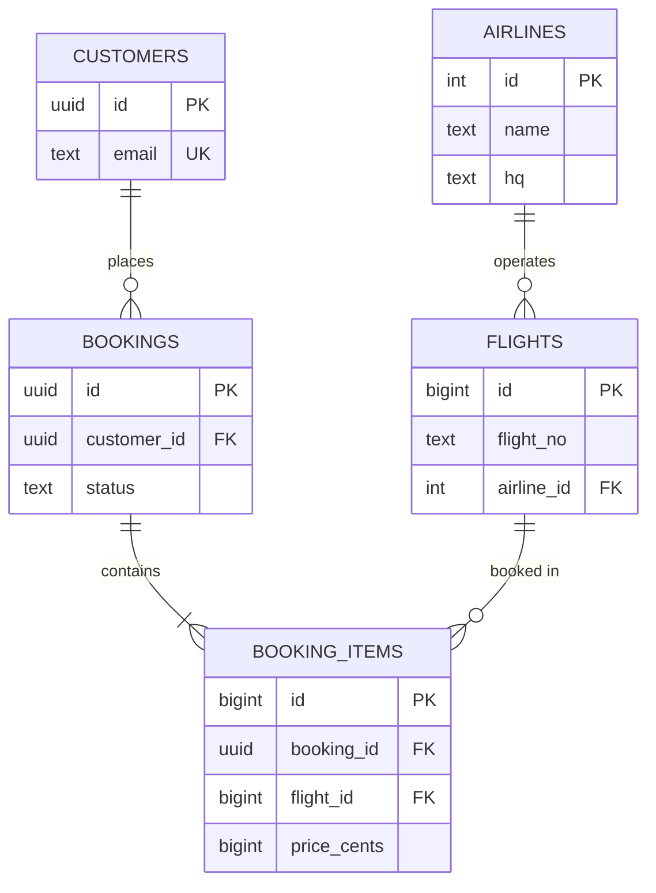

import { Callout } from 'fumadocs-ui/components/callout';
import { Tabs, Tab } from 'fumadocs-ui/components/tabs';
import { Steps, Step } from 'fumadocs-ui/components/steps';
import { Cards, Card } from 'fumadocs-ui/components/card';

## Anomalies in a Bad Schema

A schema is "bad" when it allows **redundancy that can drift**. Suppose TravelBuddy stores everything in one table:

| booking_id | customer_name | customer_email | flight_no | airline_name | airline_hq |
| :--- | :--- | :--- | :--- | :--- | :--- |
| 1 | Ada | ada@x.com | BA248 | British Airways | London |
| 2 | Ada | ada@x.com | IB3412 | Iberia | Madrid |
| 3 | Bob | bob@x.com | BA248 | British Airways | London |

Three problems hide here:

- **Update anomaly**: change British Airways' HQ and you must update many rows; miss one and the data contradicts itself.
- **Insertion anomaly**: you cannot record an airline with no bookings yet (`airline_name` would be `NULL`).
- **Deletion anomaly**: delete Bob's only booking and you lose the only record that British Airways exists.

Normalization removes these by ensuring **each fact is stored in exactly one place**.

---

## Functional Dependencies: The Underlying Idea

A **functional dependency** `X → Y` means: if two rows agree on `X`, they must agree on `Y`. E.g. `flight_no → airline_name`. Normalization is the process of eliminating *bad* dependencies — ones where a non-key attribute depends on something other than the whole key.

---

## The Normal Forms

<Steps>
<Step>
### 1NF — Atomic values, no repeating groups

Every column holds a single atomic value; no lists-in-a-cell.

❌ `flights = 'BA248,IB3412'` · ✅ one row per (booking, flight).

Fix: extract the repeating group into its own `booking_items` table. This is exactly the M:N junction table from Stage 1.
</Step>

<Step>
### 2NF — No partial dependency on part of a composite key

Every non-key attribute depends on the **whole** primary key, not a subset.

Suppose `booking_items (booking_id, flight_id, price, flight_no)` with key `(booking_id, flight_id)`. Here `flight_no` depends only on `flight_id` (part of the key) — a **partial dependency**. Fix: move `flight_no` to the `flights` table.
</Step>

<Step>
### 3NF — No transitive dependency

No non-key attribute depends on another non-key attribute.

In `bookings (id, customer_id, customer_email, ...)`, `customer_email` depends on `customer_id`, not on `id` — a **transitive dependency**. Fix: keep `customer_email` only in `customers`.
</Step>

<Step>
### BCNF — Every determinant is a candidate key

A stricter 3NF: for every functional dependency `X → Y`, `X` must be a superkey. It catches rare edge cases (e.g., a table with two overlapping candidate keys) that 3NF can miss.
</Step>
</Steps>

### The Normalized Schema



Every fact lives once. Change British Airways' HQ in `airlines`, and every query reflects it.

<Callout type="tip" title="The Mantra">
> **“Every non-key attribute depends on the key, the whole key, and nothing but the key.”**

(1NF atomicity → 2NF whole key → 3NF nothing but the key.)
</Callout>

---

## Deliberate Denormalization

Normalized schemas are write-safe but can require many joins for reads. Sometimes you trade redundancy for read speed — **on purpose, with a plan to keep it consistent.**

| Technique | What it does | Consistency mechanism |
| :--- | :--- | :--- |
| **Materialized view** | Precomputed join/aggregate | `REFRESH MATERIALIZED VIEW` (or `CONCURRENTLY`) |
| **Generated column** | Derived value stored/computed | Engine-maintained, always correct |
| **Trigger-maintained counter** | Store `bookings_count` on `customers` | Trigger on insert/delete |
| **CDC projection** | Denormalized read model in another store | Event stream (Stage 4) |
| **Cached aggregate** | Precomputed in Redis | TTL + invalidation (next lesson) |

```sql
-- Materialized view: a denormalized read model
CREATE MATERIALIZED VIEW customer_lifetime_value AS
SELECT c.id, c.full_name, COUNT(b.id) AS bookings, COALESCE(SUM(b.total_cents), 0) AS cents
FROM customers c
LEFT JOIN bookings b ON b.customer_id = c.id AND b.status = 'paid'
GROUP BY c.id, c.full_name;

CREATE UNIQUE INDEX ON customer_lifetime_value (id);   -- required for CONCURRENTLY
REFRESH MATERIALIZED VIEW CONCURRENTLY customer_lifetime_value;
```

<Callout type="warn" title="Denormalized Data Drifts Unless Something Maintains It">
Every denormalized copy is a liability you must actively keep in sync. Choose a single mechanism (trigger, generated column, CDC, scheduled refresh) and make it the **only** writer of that field. Drift happens when two code paths both try to update the redundant value.
</Callout>

### PostgreSQL 18: Generated Columns

PostgreSQL 18 makes **virtual generated columns** the default — computed on read, saving storage and write overhead. Use `STORED` when the value is read far more than written:

```sql
CREATE TABLE products (
    id    bigint PRIMARY KEY GENERATED ALWAYS AS IDENTITY,
    price numeric(10,2) NOT NULL,
    tax   numeric(3,2)  NOT NULL,
    total numeric(10,2) GENERATED ALWAYS AS (price * (1 + tax)) STORED
);
```

---

## Keys: Surrogate vs. Natural (Revisited in Production)

| | Surrogate (`id`) | Natural (`email`, `flight_no+departure_at`) |
| :--- | :--- | :--- |
| **Stability** | Never changes | Can change; breaks FKs |
| **Width** | Narrow (fast joins) | Often wide |
| **Meaning** | None | Self-documenting |
| **Use as** | Primary key | `UNIQUE` constraint |

Recommended pattern: **surrogate PK** + **`UNIQUE` on natural keys**.

<Callout type="tip" title="UUIDv7 Solves the Random-UUID Problem">
Random UUIDv4 primary keys scatter B+ tree inserts and bloat indexes (Stage 2). PostgreSQL 18 ships **`uuidv7()`** — time-ordered UUIDs that are globally unique *and* index-friendly. For public-facing ids that must not be enumerable, UUIDv7 is now the default recommendation.
</Callout>

---

## Zero-Downtime Migrations: Expand → Migrate → Contract

Naïve migrations break running code. The safe pattern is **expand → migrate → contract**, always in separate, individually-reversible steps.

<Steps>
<Step>
### Expand: add the new structure without breaking old code

```sql
-- Add the new column as NULLABLE (do not add NOT NULL yet!)
ALTER TABLE customers ADD COLUMN full_name text;

-- Add a new index CONCURRENTLY so writes are not blocked
CREATE INDEX CONCURRENTLY idx_customers_full_name ON customers (full_name);
```
Old code ignores the new column; new code can begin writing both.
</Step>

<Step>
### Migrate: backfill and dual-write

```sql
-- Backfill in small batches to avoid long locks and huge transactions
UPDATE customers SET full_name = first || ' ' || last
WHERE full_name IS NULL
  AND id IN (SELECT id FROM customers WHERE full_name IS NULL LIMIT 10000);
-- repeat until done; then add the constraint
ALTER TABLE customers ALTER COLUMN full_name SET NOT NULL;
```
</Step>

<Step>
### Contract: remove the old structure

```sql
-- Only once NO code references the old columns:
ALTER TABLE customers DROP COLUMN first;
ALTER TABLE customers DROP COLUMN last;
```
</Step>
</Steps>

<Callout type="error" title="Migrations That Take `ACCESS EXCLUSIVE` Locks">
These block *everything*, including `SELECT`:
- `ALTER TABLE ... ADD COLUMN ... NOT NULL DEFAULT ...` (with a non-constant default, and pre-PG11 semantics)
- `ALTER TABLE ... ALTER COLUMN TYPE ...` (rewrites the table)
- `CREATE INDEX` **without** `CONCURRENTLY`
- `VACUUM FULL`

Set `SET lock_timeout = '2s'` so a migration fails fast instead of queueing behind a long query and blocking the world. When adding a `NOT NULL` column with a default, add it nullable + constant default, backfill, then `SET NOT NULL`.
</Callout>

| Dangerous operation | Safe alternative |
| :--- | :--- |
| `CREATE INDEX` | `CREATE INDEX CONCURRENTLY` |
| `ADD COLUMN ... DEFAULT <volatile>` | Add nullable + constant default, backfill |
| `SET NOT NULL` on existing column | Add a `CHECK ... NOT VALID`, then `VALIDATE CONSTRAINT` |
| `VACUUM FULL` | `pg_repack` |

---

## The N+1 Query: The Silent Killer

The most common application-level performance bug. You fetch a list, then hit the database once **per row** for related data.

```js
// ❌ N+1: 1 query for bookings, then N more (one per booking)
const bookings = await db.query('SELECT id, customer_id FROM bookings LIMIT 100');
for (const b of bookings) {
  b.customer = await db.query('SELECT * FROM customers WHERE id = $1', [b.customer_id]);
}
// 101 round-trips for 100 bookings. At 1 ms each = 101 ms minimum, often far worse.
```

```sql
-- ✅ One query with a join
SELECT b.id, c.full_name
FROM bookings b
JOIN customers c ON c.id = b.customer_id
LIMIT 100;
```

<Callout type="tip" title="How to Catch N+1 in the Wild">
1. Enable query logging and watch for **many near-identical queries** in a burst.
2. In `pg_stat_statements`, sort by `calls` — an N+1 shows a humble query with an enormous call count.
3. ORMs provide eager-loading (`include`, `with`, `joinedload`, `selectinload`) — use it deliberately.
</Callout>

### Pagination: Avoid `OFFSET` on Large Tables

```sql
-- ❌ OFFSET makes the engine scan and discard everything before the offset
SELECT * FROM bookings ORDER BY created_at DESC LIMIT 20 OFFSET 1000000;

-- ✅ Keyset pagination: seek past the last row using an index
SELECT * FROM bookings
WHERE (created_at, id) < (:last_created_at, :last_id)   -- composite tiebreaker
ORDER BY created_at DESC, id DESC
LIMIT 20;
```

Keyset pagination is O(log N) regardless of depth, whereas `OFFSET` is O(offset). The tiebreaker (`id`) handles ties on `created_at`.

---

## Soft Deletes, Audit & Temporal Data

| Need | Pattern | Trap |
| :--- | :--- | :--- |
| Soft delete | Add `deleted_at timestamptz`; filter `WHERE deleted_at IS NULL` | Every query must filter; unique constraints still fire |
| Audit trail | Append-only `audit_log` table (or triggers) | Do not overwrite history |
| Point-in-time state | Temporal tables / range columns | Complexity; PostgreSQL 18 temporal constraints help |

<Callout type="info" title="PostgreSQL 18 Temporal Constraints">
PostgreSQL 18 added native non-overlapping constraints on range types (`PRIMARY KEY (room_id, period WITHOUT OVERLAPS)`), making time-based data (bookings, assignments, schedules) far easier to model correctly than the old `EXCLUDE USING gist` workaround.
</Callout>

---

## Chapter Summary & Quick Recall

<Cards>
  <Card title="Normalize to remove anomalies" href="#the-normal-forms">
    Each fact in one place: 1NF (atomic), 2NF (whole key), 3NF (nothing but the key), BCNF (every determinant a key).
  </Card>
  <Card title="Denormalize deliberately, with one owner" href="#deliberate-denormalization">
    Materialized views, generated columns, triggers, or CDC projections. Every redundant field needs exactly one mechanism maintaining it.
  </Card>
  <Card title="Migrate with expand → migrate → contract" href="#zero-downtime-migrations-expand--migrate--contract">
    Add nullable, backfill in batches, then enforce. Avoid `ACCESS EXCLUSIVE` locks and always set `lock_timeout`.
  </Card>
  <Card title="Kill N+1 and ditch deep OFFSET" href="#the-n1-query-the-silent-killer">
    Join or eager-load instead of per-row queries; paginate with keyset instead of `OFFSET`.
  </Card>
</Cards>

<Callout type="info" title="Next Up: Lesson 02">
A well-designed schema still needs speed at the edges. Next: caching, connection pooling, and read replicas. Continue to **[Caching, Connections & Performance](/docs/databases-sql/05-production-cookbook/02-caching-connections-and-performance)**.
</Callout>
