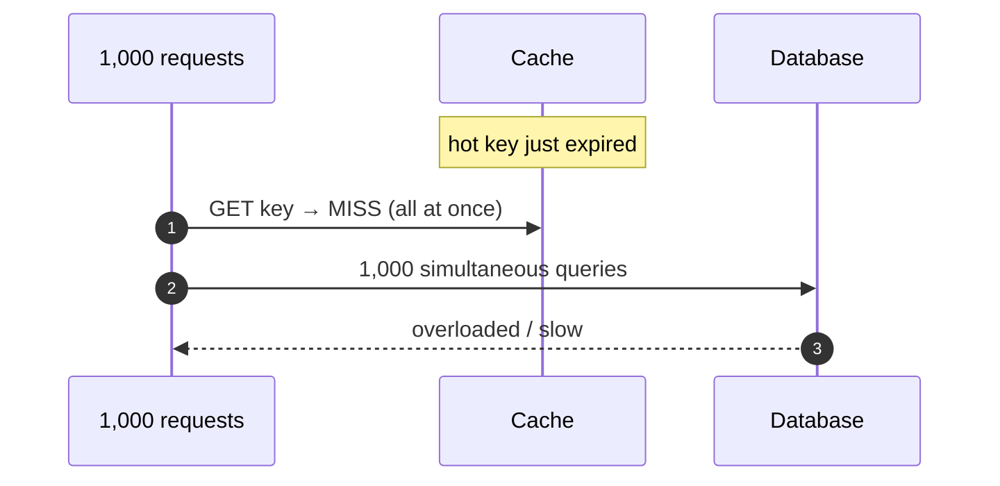

import { Callout } from 'fumadocs-ui/components/callout';
import { Tabs, Tab } from 'fumadocs-ui/components/tabs';
import { Cards, Card } from 'fumadocs-ui/components/card';

## Where Performance Actually Comes From

Before reaching for a cache, internalize the hierarchy. Every layer you move up is an order of magnitude of latency saved.

| Layer | Latency | Relative | Notes |
| :--- | :--- | :--- | :--- |
| CPU cache (L1) | ~1 ns | 1× | Registers/L1 |
| Main memory | ~100 ns | 100× | **Redis lives here** |
| Local NVMe SSD | ~100 µs | 100,000× | Random 4 KB read |
| Same-DC network round trip | ~500 µs | — | App → cache/DB |
| Spinning disk seek | ~10 ms | 10,000,000× | Sequential-friendly |
| Cross-continent RTT | ~100 ms | — | Physics (speed of light) |

Three levers follow directly:

1. **Serve from memory** (caching) — skip the disk entirely.
2. **Read fewer pages** (indexes, Stage 2) — do less I/O.
3. **Avoid the round trip** (connection pooling, batching) — collapse many trips into one.

---

## Cache Patterns

A cache is a fast, lossy copy of a slower, authoritative store. The question is *who writes what, when*.

<Tabs items={['Cache-Aside', 'Read-Through', 'Write-Through', 'Write-Behind']}>
<Tab value="Cache-Aside">
```text
READ:  check cache → hit? return. miss? read DB, populate cache, return.
WRITE: write DB, then INVALIDATE (or update) the cache.
```
- **Most common.** Application controls both stores.
- Resilient to cache failure (falls back to DB).
- Must handle "populate race" and stale entries on write.
</Tab>
<Tab value="Read-Through">
```text
The cache library itself loads from the DB on a miss.
```
- Application only talks to the cache.
- Simpler app code; requires a cache that understands your data source.
</Tab>
<Tab value="Write-Through">
```text
WRITE: write cache AND DB synchronously, then return.
```
- Cache is always consistent, but writes are slower (two synchronous writes).
- Good when reads dominate and freshness matters.
</Tab>
<Tab value="Write-Behind">
```text
WRITE: write cache immediately; flush to DB ASYNCHRONOUSLY in the background.
```
- Fastest writes; risk of data loss if the cache dies before flushing.
- Good for counters, metrics, high-volume telemetry.
</Tab>
</Tabs>

| Pattern | Read | Write | Consistency | Risk |
| :--- | :--- | :--- | :--- | :--- |
| Cache-aside | Lazy | Invalidate on write | Eventually consistent | Stale on missed invalidation |
| Read-through | Cache-managed | Cache-managed | Eventually consistent | Cache becomes critical path |
| Write-through | Fast | Slow (2 writes) | Strong | Write throughput cost |
| Write-behind | Fast | Fastest | Weak (async) | Data loss on cache crash |

<Callout type="error" title="Cache Invalidation Is the Hard Part">
> *"There are only two hard things in computer science: cache invalidation and naming things."*

The classic cache-aside race: **writer** updates the DB, then deletes the cache key; a concurrent **reader** that read the *old* DB value populates the cache *after* the delete — leaving stale data cached indefinitely. Mitigations: short TTLs as a safety net, delete-after-write (not update-then-delete), versioned keys, or CDC-driven invalidation.
</Callout>

---

## Redis: The Default Cache

Redis is an in-memory data-structure server — not just a string cache. Its rich types map to real problems:

| Structure | Use for |
| :--- | :--- |
| `STRING` | Simple cached values, counters (`INCR`) |
| `HASH` | Objects with fields (a user profile) |
| `LIST` | Queues, recent-items feeds |
| `SET` | Unique membership, tags, dedup |
| `ZSET` (sorted set) | Leaderboards, rate-limit windows, priority queues |
| `STREAM` | Append-only event log (mini-Kafka) |

```bash
# Cache a value with a TTL safety net
SET customer:42:profile '{...}' EX 300       # expires in 300 s

# Atomic counter (rate limiting, view counts)
INCR pageviews:homepage

# Sliding-window rate limit with a sorted set
ZADD ratelimit:ip:1.2.3.4 <now> <now>
ZREMRANGEBYSCORE ratelimit:ip:1.2.3.4 0 <now-60000>   # drop old entries
ZCARD ratelimit:ip:1.2.3.4                             # count in the window
```

### Eviction: What Happens When Memory Fills

| Policy | Evicts |
| :--- | :--- |
| `noeviction` | Nothing — writes error when full |
| `allkeys-lru` | Least-recently-used key, any key |
| `allkeys-lfu` | Least-frequently-used key |
| `volatile-lru` / `volatile-lfu` | LRU/LFU among keys **with a TTL** |
| `volatile-ttl` | Soonest-to-expire key |

<Callout type="tip" title="Set TTLs on Everything Cacheable">
A cache without TTLs grows until it evicts or dies. Always set an expiry so stale data self-heals, and prefer `allkeys-lfu` when popularity is skewed (some keys are requested far more often). Keep truly important keys in a separate instance with `noeviction` so they never get flushed.
</Callout>

---

## Cache Stampede (Thundering Herd)

A hot key expires; thousands of concurrent requests all miss simultaneously and hammer the database at once. This is the **cache stampede**, and it is a classic way to take down a healthy database.



**Defenses:**

| Technique | Idea |
| :--- | :--- |
| **Mutex / single-flight lock** | Only one request recomputes; others wait or serve stale |
| **XFetch (probabilistic early expiration)** | Refresh *before* expiry, with probability rising as TTL nears |
| **Jittered TTLs** | Add randomness so keys don't all expire together |
| **Stale-while-revalidate** | Serve the stale value while one worker refreshes in the background |

```js
// Single-flight / mutex pattern (pseudo-JS)
async function getWithLock(key, ttl) {
  const hit = await redis.get(key);
  if (hit) return JSON.parse(hit);

  const lock = await redis.set(`${key}:lock`, '1', 'NX', 'EX', 10);
  if (!lock) {
    // Someone else is recomputing; brief wait then read (or serve stale)
    await sleep(50);
    return JSON.parse(await redis.get(key));
  }
  try {
    const value = await db.query(/* ... */);
    await redis.set(key, JSON.stringify(value), 'EX', ttl);
    return value;
  } finally {
    await redis.del(`${key}:lock`);
  }
}
```

<Callout type="warn" title="Jitter Every TTL">
If 10,000 keys are written at the same second with a 300-second TTL, they will all expire at the same second — a self-inflicted stampede. Add jitter: `TTL = 300 + random(0, 60)`. Cheap insurance.
</Callout>

---

## Connection Pooling

Every PostgreSQL client connection is a **process** (~5–10 MB each). A Node app with 20 workers × 20 connections = 400 backends; PostgreSQL thrashes. The fix is a **pooler**.

```mermaid
flowchart LR
    subgraph App["Application (many workers)"]
        W1["worker ×20<br/>20 conns each"]
    end
    PB["PgBouncer<br/>(small pool, e.g. 20 server conns)"]
    DB["PostgreSQL<br/>(only 20 backends)"]

    W1 -->|400 client conns| PB
    PB -->|"20 server conns (reused)"| DB

    style PB fill:#0f172a,stroke:#38bdf8,stroke-width:2px
```



| PgBouncer mode | Behavior | Compatible with |
| :--- | :--- | :--- |
| **Session** | One server conn per client session | Everything (incl. `SET`, advisory locks, temp tables) |
| **Transaction** | Server conn held only for a transaction | Most apps; **no** session state |
| **Statement** | Server conn per statement | Rare; no multi-statement transactions |

<Callout type="info" title="Transaction Mode Is the Sweet Spot — With Caveats">
Transaction pooling multiplexes many client connections onto few server connections, giving enormous scalability. But **session state breaks**: `SET` commands, `LISTEN`/`NOTIFY`, advisory locks, prepared statements across transactions, and temp tables assume a persistent session. Modern drivers support `prepare_threshold` / named statements appropriately; verify your driver.
</Callout>

### Sizing the Pool

A common heuristic (from the PostgreSQL community, based on the "PostgreSQL is not that hard to make fast" work):

```text
connections ≈ (CPU cores × 2) + effective_spindle_count
```

For a 4-core SSD machine, that is roughly **8–10** — far fewer than most teams configure. The counterintuitive rule: **a smaller pool often yields higher throughput** because fewer backends means less context switching and lock contention.

<Callout type="error" title="Too Many Connections Is a Self-DDOS">
Beyond a small threshold (a few × cores), adding connections *reduces* throughput: more processes compete for CPU, locks, and I/O. Errors like "too many clients already" or timeouts almost always mean the pool is **too large**, not too small. Add a queue in front (the pooler) instead of more backends.
</Callout>

---

## Read Replicas & Materialized Views

When reads dominate, offload them:

| Technique | Freshness | Cost |
| :--- | :--- | :--- |
| **Read replica** | Replication lag (ms–s) | Must handle lag (read-your-writes) |
| **Materialized view** | Last refresh | Storage + refresh time |
| **CDC projection** | Eventual | Async pipeline |
| **Cache (Redis)** | TTL-bound | Invalidation complexity |

```sql
-- Route heavy analytics to a replica, keeping the primary for writes
-- (in practice via connection strings / a proxy)

-- Refresh an analytics rollup every 10 minutes
REFRESH MATERIALIZED VIEW CONCURRENTLY route_revenue_daily;
```

<Callout type="tip" title="The Full Read Path">
A mature read path looks like: **cache (Redis) → read replica → materialized view fallback → primary**. Each layer is checked in order of speed, and the primary is protected for writes. This is the "serve from the cheapest source that can answer correctly" principle.
</Callout>

---

## Chapter Summary & Quick Recall

<Cards>
  <Card title="Move up the latency hierarchy" href="#where-performance-actually-comes-from">
    Memory ns, SSD µs, disk ms, WAN tens of ms. Cache to skip disk; index to read fewer pages; pool to collapse round trips.
  </Card>
  <Card title="Cache-aside + TTL is the safe default" href="#cache-patterns">
    Application controls it, tolerates cache failure, and a TTL bounds staleness. Invalidation is the genuinely hard part.
  </Card>
  <Card title="Defend against stampedes" href="#cache-stampede-thundering-herd">
    Single-flight locks, XFetch, jittered TTLs, and stale-while-revalidate prevent a hot-key expiry from crushing the database.
  </Card>
  <Card title="Smaller pools are faster" href="#sizing-the-pool">
    `≈ cores × 2 + spindles` server connections. Too many connections is a self-inflicted DDoS; use PgBouncer transaction mode.
  </Card>
</Cards>

<Callout type="info" title="Next Up: Lesson 03">
Caching and pooling buy headroom — but eventually something goes wrong at 3 a.m. The final lesson is the diagnostic playbook. Continue to **[Monitoring & Troubleshooting](/docs/databases-sql/05-production-cookbook/03-monitoring-and-troubleshooting)**.
</Callout>
