import { Callout } from 'fumadocs-ui/components/callout';
import { Tabs, Tab } from 'fumadocs-ui/components/tabs';
import { Cards, Card } from 'fumadocs-ui/components/card';

## Joins: Combining Relations

A join pairs rows from two (or more) relations on a condition. The **join type** decides what happens to rows that find **no partner**.

```mermaid
flowchart LR
    subgraph J["Join types"]
        direction TB
        I["INNER — only matched pairs"]
        L["LEFT — all left rows, NULLs on the right"]
        R["RIGHT — all right rows, NULLs on the left"]
        F["FULL — all rows from both, NULLs both sides"]
        C["CROSS — every combination"]
    end

    style J fill:#0f172a,stroke:#38bdf8,stroke-width:2px
```



```sql
-- INNER: only bookings that have a customer
SELECT b.id, c.full_name
FROM bookings b
INNER JOIN customers c ON c.id = b.customer_id;

-- LEFT: every customer, with or without bookings
SELECT c.full_name, b.id
FROM customers c
LEFT JOIN bookings b ON b.customer_id = c.id;

-- FULL: reconciliation of two sets
SELECT a.id AS in_a, b.id AS in_b
FROM set_a a
FULL OUTER JOIN set_b b ON b.id = a.id;
```

### `ON` vs. `USING`

```sql
SELECT * FROM bookings b JOIN customers c ON c.id = b.customer_id;   -- explicit predicate
SELECT * FROM bookings    JOIN customers USING (customer_id);        -- shorthand: same-named column
```

| | `ON` | `USING` |
| :--- | :--- | :--- |
| Flexibility | Any predicate | Same-named columns only |
| Output columns | Both columns kept | Duplicate column merged (appears once) |
| Use when | Columns differ or need extra conditions | Column names match |

<Callout type="warn" title="Avoid `NATURAL JOIN`">
`NATURAL JOIN` silently joins on **every** same-named column. Add one harmless column with a shared name later, and the join condition changes without warning. Use `ON` or `USING` explicitly.
</Callout>

### The `LEFT JOIN` → `WHERE` Trap

Putting a condition on the right table in `WHERE` silently degrades an outer join to an inner join, because the `NULL`s produced for non-matches fail the predicate.

```sql
-- ❌ customers without paid bookings are dropped
SELECT c.full_name FROM customers c
LEFT JOIN bookings b ON b.customer_id = c.id
WHERE b.status = 'paid';

-- ✅ move the condition into ON
SELECT c.full_name FROM customers c
LEFT JOIN bookings b ON b.customer_id = c.id AND b.status = 'paid';
```

---

## Self-Joins and `LATERAL`

A **self-join** joins a table to itself (hierarchies, pairs, comparisons):

```sql
-- Pairs of flights departing from the same city on the same day
SELECT f1.flight_no AS flight_a, f2.flight_no AS flight_b
FROM flights f1
JOIN flights f2
  ON f2.origin = f1.origin
 AND f2.id <> f1.id
 AND f2.departure_at::date = f1.departure_at::date;
```

**`LATERAL`** lets a subquery in `FROM` reference columns from tables to its left — the clean "top-N per group" tool:

```sql
-- The 3 cheapest flights per origin airport
SELECT o.origin, f.flight_no, f.base_price_cents
FROM (SELECT DISTINCT origin FROM flights) o
CROSS JOIN LATERAL (
    SELECT flight_no, base_price_cents
    FROM flights f
    WHERE f.origin = o.origin
    ORDER BY f.base_price_cents
    LIMIT 3
) f;
```

<Callout type="info" title="`CROSS JOIN LATERAL` vs. `LEFT JOIN LATERAL ... ON TRUE`">
`CROSS JOIN LATERAL` drops left rows that produce no inner rows; `LEFT JOIN LATERAL (...) ON true` keeps them with `NULL`s. Choose based on whether a group with no matches should survive.
</Callout>

---

## Semi-Joins and Anti-Joins

These express "has at least one" and "has none" — often more efficient (and always clearer) than joins with `DISTINCT`.

```sql
-- SEMI-JOIN: customers who have at least one booking
SELECT * FROM customers c
WHERE EXISTS (SELECT 1 FROM bookings b WHERE b.customer_id = c.id);

-- ANTI-JOIN: customers with NO bookings
SELECT * FROM customers c
WHERE NOT EXISTS (SELECT 1 FROM bookings b WHERE b.customer_id = c.id);
```

<Callout type="error" title="Never Use `NOT IN` with a Nullable Subquery">
If the subquery returns even one `NULL`, `NOT IN` evaluates to `UNKNOWN` for every row and the query returns **zero rows**.

```sql
-- ❌ silent zero rows if any bookings.customer_id is NULL
SELECT * FROM customers WHERE id NOT IN (SELECT customer_id FROM bookings);
-- ✅ immune to NULLs and usually as fast or faster
SELECT * FROM customers c WHERE NOT EXISTS (SELECT 1 FROM bookings b WHERE b.customer_id = c.id);
```
</Callout>

---

## Subqueries

| Kind | Returns | Usable in |
| :--- | :--- | :--- |
| Scalar | One row, one column | `SELECT`, `WHERE`, comparison |
| Row | One row, multiple columns | `=`, `IN` (row constructor) |
| Column / Table | Many rows | `IN`, `EXISTS`, `FROM` |
| Correlated | Re-evaluated per outer row | `WHERE`, `SELECT` |
| `EXISTS` | Boolean | `WHERE` |

```sql
-- Scalar subquery in the SELECT list
SELECT c.full_name,
       (SELECT COUNT(*) FROM bookings b WHERE b.customer_id = c.id) AS bookings
FROM customers c;

-- Correlated subquery in WHERE
SELECT f.* FROM flights f
WHERE f.base_price_cents < (
    SELECT AVG(f2.base_price_cents) FROM flights f2 WHERE f2.origin = f.origin
);
```

### `ANY`, `ALL`, `SOME`

```sql
-- Flights priced under ALL flights from MAD (i.e. cheaper than the cheapest MAD flight)
SELECT * FROM flights
WHERE base_price_cents < ALL (SELECT base_price_cents FROM flights WHERE origin = 'MAD');

-- Flights priced equal to ANY (same as IN)
SELECT * FROM flights
WHERE base_price_cents = ANY (SELECT base_price_cents FROM flights WHERE origin = 'MAD');
```

| Operator | Meaning |
| :--- | :--- |
| `= ANY (...)` | True if equal to at least one (same as `IN`) |
| `< ALL (...)` | True if less than every value |
| `> ANY (...)` | True if greater than at least one |
| `SOME` | Synonym for `ANY` |

---

## Set Operations: Combining Results Vertically

`UNION`, `INTERSECT`, and `EXCEPT` combine the **rows** of two queries with the same shape (same number and compatible types of columns).

```sql
-- All airports that appear as an origin OR a destination (deduplicated)
SELECT origin AS airport FROM flights
UNION
SELECT destination FROM flights;

-- UNION ALL keeps duplicates (faster — no dedup sort)
SELECT origin FROM flights UNION ALL SELECT destination FROM flights;
```

| Operation | Meaning | Duplicates |
| :--- | :--- | :--- |
| `UNION` | In either result | Removed |
| `UNION ALL` | In either result | **Kept** (faster) |
| `INTERSECT` | In both | Removed |
| `INTERSECT ALL` | In both (multiset) | Kept |
| `EXCEPT` | In the first, not the second | Removed |

<Callout type="tip" title="`UNION ALL` Is the Fast Default">
Plain `UNION`/`INTERSECT`/`EXCEPT` must **sort and deduplicate** the result, which is expensive. Unless you specifically need deduplication, use `UNION ALL`. Column **names** come from the first query; only **types** must line up.
</Callout>

---

## Common Table Expressions (CTEs)

A `WITH` clause names a subquery so a complex query reads top-to-bottom:

```sql
WITH paid AS (
    SELECT * FROM bookings WHERE status = 'paid'
),
revenue AS (
    SELECT customer_id, SUM(total_cents) AS total FROM paid GROUP BY customer_id
)
SELECT c.full_name, r.total
FROM revenue r JOIN customers c ON c.id = r.customer_id
ORDER BY r.total DESC;
```

### Recursive CTEs: Hierarchies and Graphs

`WITH RECURSIVE` = a base case `UNION ALL` a recursive case that references itself:

```sql
-- Flight connections from MAD in up to 2 hops
WITH RECURSIVE reach(dest, hops, path) AS (
    SELECT destination, 0, ARRAY[destination]
    FROM flights WHERE origin = 'MAD'
    UNION ALL
    SELECT f.destination, r.hops + 1, r.path || f.destination
    FROM reach r
    JOIN flights f ON f.origin = r.dest
    WHERE r.hops < 2
      AND NOT f.destination = ANY(r.path)   -- cycle guard
)
SELECT DISTINCT dest FROM reach;
```

<Callout type="error" title="Always Guard Recursion">
A recursive CTE over a cyclic graph without a depth limit or visited-set guard runs until it exhausts memory. Include `WHERE depth < N` and/or `AND NOT next = ANY(path)`.
</Callout>

### Materialization Hints

PostgreSQL 12+ may inline a non-recursive CTE like a subquery, or materialize it if it is referenced multiple times. Force it when needed:

```sql
WITH expensive AS MATERIALIZED (   -- compute once, reuse
    SELECT customer_id, SUM(total_cents) t FROM bookings GROUP BY customer_id
)
SELECT * FROM expensive WHERE t > 100000;
```

<Callout type="info" title="CTEs Are a Readability Tool First">
Use CTEs to break a large query into named, testable steps — but remember that in modern planners a CTE is not automatically a performance optimization. If a CTE is a hot path, check `EXPLAIN` to see whether it was inlined or materialized, and hint accordingly.
</Callout>

---

## Practice Drills

```sql
-- 1. Every customer and their booking count, including zero (LEFT JOIN)
SELECT c.full_name, COUNT(b.id) AS bookings
FROM customers c
LEFT JOIN bookings b ON b.customer_id = c.id
GROUP BY c.id, c.full_name
ORDER BY bookings DESC;

-- 2. Airports served but never used as a destination (EXCEPT)
SELECT origin FROM flights
EXCEPT
SELECT destination FROM flights;

-- 3. Customers whose total spend exceeds the average customer's (ANY/ALL + CTE)
WITH spend AS (
    SELECT customer_id, SUM(total_cents) AS total FROM bookings WHERE status='paid' GROUP BY customer_id
)
SELECT * FROM spend WHERE total > (SELECT AVG(total) FROM spend);
```

---

## Chapter Summary & Quick Recall

<Cards>
  <Card title="Join type = what happens to non-matches" href="#joins-combining-relations">
    INNER drops them; LEFT/FULL keep them with NULLs. Put right-side conditions in `ON`, never `WHERE`, to preserve an outer join.
  </Card>
  <Card title="Prefer EXISTS/NOT EXISTS over IN/NOT IN" href="#semi-joins-and-anti-joins">
    `NOT IN` silently returns nothing when the subquery contains a `NULL`. `NOT EXISTS` is immune and usually as fast.
  </Card>
  <Card title="WITH RECURSIVE traverses graphs" href="#recursive-ctes-hierarchies-and-graphs">
    Base case UNION ALL recursive case, always with a depth or cycle guard.
  </Card>
</Cards>

<Callout type="info" title="Next Up: Lesson 04">
Joins assemble rows horizontally; aggregation collapses them vertically. Next: `GROUP BY`, `HAVING`, and the grouping superpowers. Continue to **[Grouping & Aggregation](/docs/databases-sql/sql-from-basics-to-advanced/04-grouping-and-aggregation)**.
</Callout>
