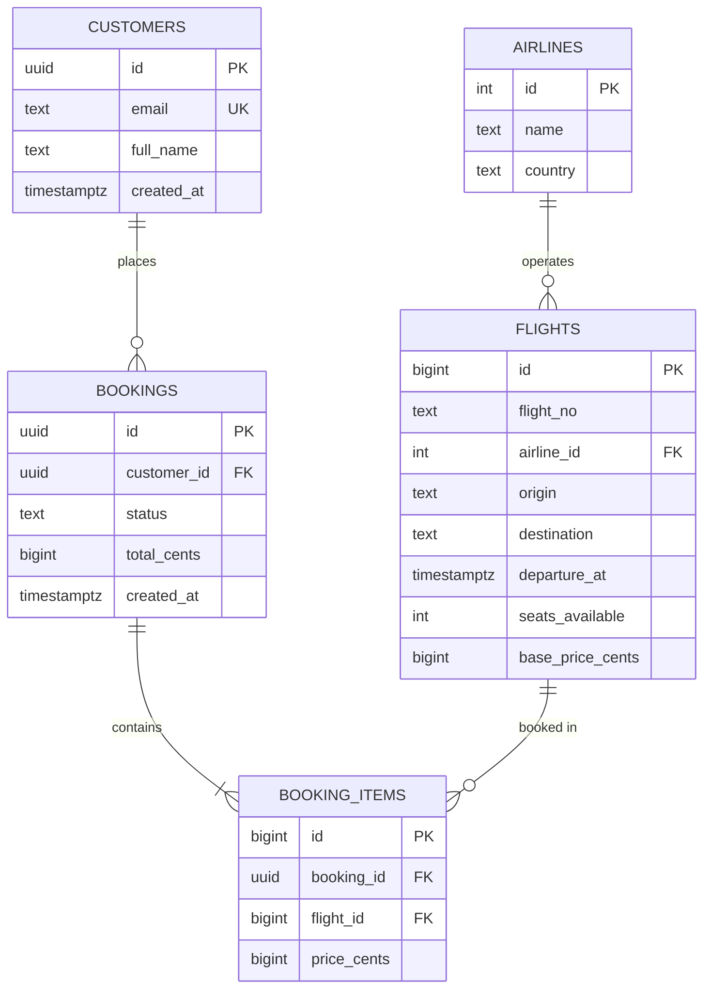

import { Callout } from 'fumadocs-ui/components/callout';
import { Steps, Step } from 'fumadocs-ui/components/steps';
import { Cards, Card } from 'fumadocs-ui/components/card';

This is the **language track** for SQL — a parallel deep-dive that sits alongside the five systems stages. Where **[Stage 1](/docs/databases-sql/01-foundations-and-relational-modeling)** teaches you to *model* data as relations, this track teaches you to *speak* SQL fluently, from a single `SELECT` to recursive CTEs, window frames, and gaps-and-islands analysis.

All examples run against the **TravelBuddy** schema introduced in the main curriculum, so the practice builds on familiar tables.

<Callout type="info" title="How to Use This Track">
Read the lessons in order: each one assumes the previous. Every lesson ends with **practice drills** you can run in `psql` against your local copy. If you want a fast reference instead, jump straight to the **[SQL Cheat Sheet](/docs/databases-sql/sql-from-basics-to-advanced/quick-reference)**.
</Callout>

---

## The TravelBuddy Schema

---

## Learning Path

<Steps>
<Step>
### 01. SQL Basics

**[Start this lesson →](/docs/databases-sql/sql-from-basics-to-advanced/01-sql-basics)**

The four language families (DDL/DML/DQL/TCL); the anatomy of `SELECT`; expressions, aliases, and literals; `DISTINCT`; `WHERE` and the full operator toolkit; `LIKE`, `IN`, `BETWEEN`, `IS NULL`; `ORDER BY` with `NULLS FIRST/LAST`; `LIMIT`/`OFFSET`; and `CAST`/`::`.
</Step>

<Step>
### 02. Writing and Modifying Data

**[Start this lesson →](/docs/databases-sql/sql-from-basics-to-advanced/02-writing-and-modifying-data)**

`INSERT` (single, multi-row, from a `SELECT`, `DEFAULT`, `RETURNING`), `UPDATE` (with `FROM` and subqueries), `DELETE` vs. `TRUNCATE`, `MERGE`, upsert with `ON CONFLICT ... EXCLUDED`, `COPY` for bulk loads, and data-modifying CTEs.
</Step>

<Step>
### 03. Joins, Set Operations & Subqueries

**[Start this lesson →](/docs/databases-sql/sql-from-basics-to-advanced/03-joins-set-operations-and-subqueries)**

Every join type with `USING` and `ON`; self-joins and `LATERAL`; semi-joins and anti-joins (`EXISTS`/`NOT EXISTS` vs. the `NOT IN` trap); scalar, row, and correlated subqueries; `ANY`/`ALL`; `UNION`/`INTERSECT`/`EXCEPT`; and CTEs including **recursion**.
</Step>

<Step>
### 04. Grouping & Aggregation

**[Start this lesson →](/docs/databases-sql/sql-from-basics-to-advanced/04-grouping-and-aggregation)**

Aggregate functions, `GROUP BY` semantics, `HAVING` vs. `WHERE`, the `FILTER` clause, `DISTINCT` aggregates, ordered aggregates (`string_agg`/`array_agg`), `GROUPING SETS`, `ROLLUP`, `CUBE`, the `GROUPING()` function, and statistical/percentile aggregates.
</Step>

<Step>
### 05. Window Functions & Analytics

**[Start this lesson →](/docs/databases-sql/sql-from-basics-to-advanced/05-window-functions-and-analytics)**

`OVER` and `PARTITION BY`; ranking (`ROW_NUMBER`, `RANK`, `DENSE_RANK`, `NTILE`); offsets (`LAG`/`LEAD`, `FIRST_VALUE`, `NTH_VALUE`); frames (`ROWS` vs. `RANGE` vs. `GROUPS`, `EXCLUDE`); named windows; top-N per group; running totals and moving averages; percent-of-total.
</Step>

<Step>
### 06. Advanced SQL Patterns

**[Start this lesson →](/docs/databases-sql/sql-from-basics-to-advanced/06-advanced-sql-patterns)**

The interview-grade patterns that appear in real analytics: **gaps and islands**, sessionization, deduplication, pivot/crosstab with conditional aggregation, cohort retention, funnel analysis, and period-over-period comparisons — plus **sargability** and the SQL-level habits that keep queries index-friendly.
</Step>

<Step>
### 07. JSON, Arrays, Full-Text, Regex & Date/Time

**[Start this lesson →](/docs/databases-sql/sql-from-basics-to-advanced/07-json-arrays-text-and-datetime)**

`json` vs. `jsonb` and the full operator set; SQL/JSON functions (`JSON_VALUE`, `JSON_QUERY`, `JSON_EXISTS`); arrays and `unnest`; full-text search with `tsvector`/`tsquery`; regular expressions and `pg_trgm` fuzzy matching; and date/time arithmetic with `interval`, `date_trunc`, `EXTRACT`, `date_bin`, and `generate_series`.
</Step>

<Step>
### 08. Views, Functions & Triggers

**[Start this lesson →](/docs/databases-sql/sql-from-basics-to-advanced/08-views-functions-and-triggers)**

Views and updatable views; materialized views; SQL vs. PL/pgSQL functions; volatility (`IMMUTABLE`/`STABLE`/`VOLATILE`); stored procedures; triggers for audits and derived columns; and when **not** to push logic into the database.
</Step>

<Step>
### 09. SQL vs PostgreSQL: Standards, Dialects & Portability

**[Start this lesson →](/docs/databases-sql/sql-from-basics-to-advanced/09-sql-vs-postgresql)**

The difference between the SQL **standard** and PostgreSQL the **dialect**: what PostgreSQL adds beyond SQL:2023, which "PostgreSQL features" are actually portable standard SQL, how MySQL, SQL Server and Oracle diverge, the porting traps, and when it is worth writing portable SQL.
</Step>

<Step>
### Practice: Seeded Dataset & Graded Drills

**[Open the practice page →](/docs/databases-sql/sql-from-basics-to-advanced/practice-and-exercises)**

A self-contained TravelBuddy seed script plus 50+ graded drills (⭐ warm-up through ⭐⭐⭐⭐ challenge) covering every lesson — each with a hidden solution so you attempt the query first.
</Step>

<Step>
### Quick Reference: SQL Cheat Sheet

**[Open the cheat sheet →](/docs/databases-sql/sql-from-basics-to-advanced/quick-reference)**

Every clause, operator, function category, and pattern from this track on a single dense page.
</Step>
</Steps>

---

## The One Rule That Makes SQL Click

<Callout type="tip" title="Declare the Result, Not the Steps">
SQL is declarative: you describe **what** you want as a set, and the optimizer decides **how** to compute it. Try to reason in **sets** — "the rows where…", "grouped by…", "ranked within…" — instead of loops. The moment you think in sets, joins, windows, and CTEs stop feeling like tricks and start feeling like grammar.
</Callout>

<Cards>
  <Card title="Want the systems side?" href="/docs/databases-sql/02-indexing-and-query-tuning" description="Why a query is fast or slow: indexes, the planner, and EXPLAIN." />
  <Card title="Want the modeling side?" href="/docs/databases-sql/01-foundations-and-relational-modeling" description="Relations, keys, constraints, and schema design." />
</Cards>
