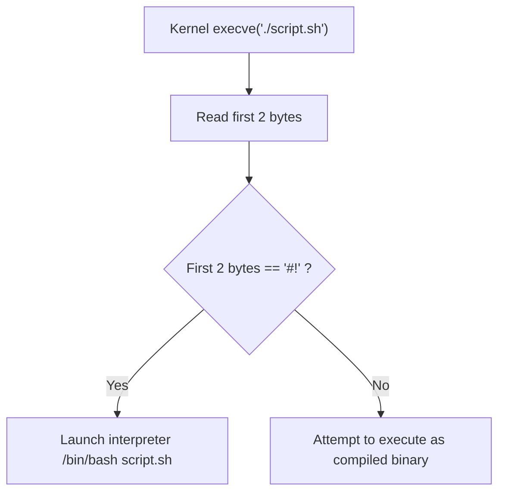

import { Callout } from 'fumadocs-ui/components/callout';

## What Is Bash?

**Bash** stands for the **Bourne Again Shell**. It was written by Brian Fox in 1989 for the GNU Project as an open-source replacement for Steve Bourne's original Unix shell (`sh`, created in 1977 at Bell Labs).

When you open a terminal in Linux or macOS, you are communicating with a shell program. The shell is a **command-language interpreter**: it wraps around the Linux kernel, shields you from raw machine code and system calls, and executes the commands you type.


### Why Bash Scripting Changes Everything

In interactive terminal usage, you type commands one at a time:
```bash
echo "Hello World"
mkdir my_project
cd my_project
```
A **Bash script** is simply a plain text file containing a sequence of commands that Bash executes automatically from top to bottom.

Why should you learn it?
1. **Automation**: If you perform a task more than twice (backups, deployments, health checks), automate it in a script.
2. **Cloud & Containers**: Every Dockerfile `RUN` command, every Kubernetes init container, and every cloud startup script (`cloud-init` / user-data) runs shell commands.
3. **Speed & Reliability**: A script executes 1,000 commands in milliseconds with zero typos.

<Callout type="info" title="Checking your current shell">
To verify that you are currently running Bash, run:
```bash
echo $SHELL
# Typically outputs: /bin/bash or /usr/bin/bash

which bash
# Shows the exact filesystem binary path: /usr/bin/bash
```
</Callout>

---

## The Shebang (`#!`): How the Kernel Identifies Scripts

Every properly constructed Bash script begins with a special line at the very top (line 1, character 1):

```bash
#!/bin/bash
```

This sequence is known as the **Shebang** (also called *hashbang*, *pound-bang*, or *sh-bang*):
- `#` = Hash
- `!` = Bang

### What Does the Shebang Actually Do?

When you tell the Linux kernel to run an executable file via `execve()` (for example, `./script.sh`), the kernel reads the first two bytes of the file. 

If the first two bytes are the hexadecimal magic number `0x23 0x21` (ASCII `#!`), the kernel knows this is **not an ELF binary executable**. Instead, it treats the remainder of the line as an absolute path to the interpreter program that must parse the script.



### Shebang Variations: `/bin/bash` vs. `/usr/bin/env bash`

You will encounter two common forms:

```bash
# Direct path (Standard on Linux distributions like Ubuntu, Debian, RHEL)
#!/bin/bash

# Portable path (Uses env utility to locate bash on PATH; preferred for macOS, FreeBSD)
#!/usr/bin/env bash
```

<Callout type="warn" title="Critical Shebang Rule">
The Shebang **MUST** be on line 1 with **no leading spaces or blank lines** before it. If you put a blank line or comment above it, the kernel treats `#!` as an ordinary comment and executes the script using whatever default fallback shell your OS configures (often minimal `/bin/sh`), which may break modern Bash features!
</Callout>

---

## Writing Your First Script: `himom.sh`

Let's build the legendary first script from NetworkChuck's Episode 1: automating a funny, kind greeting to your mom with timed pauses.

### Step 1: Open the Nano Text Editor
Nano is a simple, intuitive terminal text editor included with virtually all Linux systems:

```bash
nano himom.sh
```

### Step 2: Write the Code
Type the following into nano:

```bash title="himom.sh"
#!/bin/bash

echo "Hi Mom!"
sleep 1

echo "Uh, uh..."
sleep 1

echo "Oh wow, you look so good today!"
sleep 1

echo "I can't believe that's really you! Love you bye!"
```

### What are these commands?
- `echo`: The primary built-in utility for printing strings and variables to standard output (`stdout`).
- `sleep <seconds>`: Pauses execution for the specified number of seconds (e.g. `sleep 1`, `sleep 0.5`, `sleep 5`).

### Step 3: Save and Exit Nano
1. Press `Ctrl + X` (tells nano you want to exit).
2. Nano asks: `Save modified buffer?` Press `Y` for Yes.
3. Nano asks: `File Name to Write: himom.sh`. Press `Enter` to confirm.

You are now returned to your terminal prompt!

---

## Permissions & The Execute Bit (`chmod +x`)

Let's inspect the file we just created using `ls -l`:

```bash
ls -l himom.sh
# Output:
# -rw-r--r-- 1 student student 198 Oct 7 18:00 himom.sh
```

If you try to run the script directly right now:

```bash
./himom.sh
# bash: ./himom.sh: Permission denied
```

### Why Did Permission Denied Happen?

In Linux, files have security permission modes divided into three categories:

| Target | Code | Description |
| :--- | :--- | :--- |
| **Owner (User)** | `u` | The user account that created the file |
| **Group** | `g` | The user group assigned to the file |
| **Others (World)** | `o` | Any other user account on the machine |

Each category has three possible permission bits:
- **`r` (Read, 4)**: Allowed to view file contents.
- **`w` (Write, 2)**: Allowed to modify or delete file contents.
- **`x` (Execute, 1)**: Allowed to run the file as a program.

When nano saved `himom.sh`, its permissions were set to `-rw-r--r--` (`644` in octal). The read bit is set, but the **execute bit (`x`) is missing**!

### Adding Execute Permissions with `chmod`

Use the `chmod` (*change mode*) command with `+x` to grant execute permissions:

```bash
chmod +x himom.sh
```

Let's inspect the file again:

```bash
ls -l himom.sh
# Output:
# -rwxr-xr-x 1 student student 198 Oct 7 18:01 himom.sh
```

Notice the `x` bits! The file is now an executable program.

---

## Running the Script: Understanding `./`

Now execute your script:

```bash
./himom.sh
```

**Output:**
```text
Hi Mom!
Uh, uh...
Oh wow, you look so good today!
I can't believe that's really you! Love you bye!
```

### Why Do We Have to Type `./` Instead of Just `himom.sh`?

When you type a command like `ls` or `nano`, the shell searches a colon-separated list of directories stored in your environment variable called `$PATH`:

```bash
echo $PATH
# Output: /usr/local/sbin:/usr/local/bin:/usr/sbin:/usr/bin:/bin
```

For security reasons, **the current working directory (`.`) is intentionally NOT in your `$PATH`**. If it were, an attacker could place a malicious file named `ls` in a directory, and typing `ls` would run their malicious code instead of the real system `ls`!

By prepending `./`, you explicitly tell the shell: *"Do not search `$PATH`. Look in the current working directory (`.`) and run `himom.sh`."*

---

## Exit Status Codes (`exit 0` vs `exit 1`)

Every process in Linux returns an **integer exit code between 0 and 255** to the operating system when it terminates:

- **`0`**: Success (no errors occurred).
- **`1` to `255`**: Failure / Error condition.

You can inspect the exit code of the immediately preceding command using the special variable `$?`:

```bash
./himom.sh
echo $?
# Output: 0 (Successful run!)

# Try running a command that fails:
cat non_existent_file.txt
# cat: non_existent_file.txt: No such file or directory
echo $?
# Output: 1 (Error code reported!)
```

In your scripts, always terminate cleanly with an explicit exit code:
```bash
exit 0  # Success
exit 1  # General failure
```

---

## Hands-On Exercise & Challenge

<Callout type="info" title="Challenge 1.1: The Welcome Banner">
1. Create a new script named `welcome.sh`.
2. Add the proper shebang line.
3. Print:
   - A welcome banner.
   - Your current username (hint: `whoami`).
   - The current date and time.
4. Add a 2-second sleep delay before saying *"System checks complete."*
5. Grant execute permissions with `chmod +x welcome.sh`.
6. Run it via `./welcome.sh` and verify that `echo $?` outputs `0`.
</Callout>

In the next lesson, we will make our scripts truly interactive by introducing **variables, user input (`read`), and command-line arguments**.

👉 Proceed to [**Lesson 2: Variables & User Input**](/docs/developer-tools/bash-scripting/02-variables-and-input).
