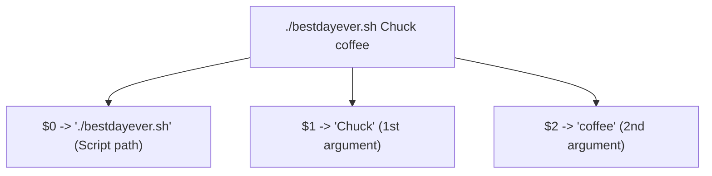

import { Callout } from 'fumadocs-ui/components/callout';

## What Is a Variable in Bash?

A variable is a named storage container in memory that holds a value. 

In Bash, **all variables are treated as strings by default**. You do not declare types like `int`, `string`, or `boolean`. Bash determines how to interpret a variable dynamically based on the operations you perform on it.


---

## Defining and Accessing Variables

### The #1 Golden Rule of Bash: No Spaces Around `=`

When defining a variable in Bash, you **must NOT include spaces** around the equals sign (`=`):

```bash
# Correct:
name="Patricia"
count=42
target_server="prod-web-01"

# INCORRECT (Will trigger syntax errors!):
name = "Patricia"
# bash: name: command not found!
name= "Patricia"
# bash: Patricia: command not found!
```

<Callout type="warn" title="Why do spaces break assignment?">
Bash interprets anything before a space as the **command name** and anything after it as an **argument**! When you write `name = "Patricia"`, Bash attempts to execute a command called `name` passing `=` and `"Patricia"` as arguments.
</Callout>

### Referencing Variables: `$var` vs. `${var}`

To read the value stored in a variable, prepend the variable name with a dollar sign (`$`):

```bash
echo "Hello $name!"
# Output: Hello Patricia!
```

### When Curly Braces `${var}` Are Mandatory

Use curly braces `${name}` whenever the variable is immediately adjacent to characters or underscores:

```bash
filename="report"

# Broken without braces:
echo "Saving $filename_backup.txt"
# Bash looks for a variable called $filename_backup (which is empty!)

# Fixed with braces:
echo "Saving ${filename}_backup.txt"
# Output: Saving report_backup.txt
```

---

## Interactive User Input with `read`

Hardcoding values directly inside scripts means you have to edit the code every time you want to run it for someone else. 

The `read` built-in pauses the script and captures user keyboard input from standard input (`stdin`), saving it into a variable:

```bash
echo "What is your name?"
read name
echo "Welcome to the system, $name!"
```

### Clean Prompts with `read -p`

Instead of printing an `echo` line followed by `read`, the `-p` (*prompt*) flag consolidates both into a single command:

```bash
read -p "Enter your username: " username
echo "Logging in as $username..."
```

### Essential `read` Flags

| Flag | Purpose | Example |
| :--- | :--- | :--- |
| **`-p "prompt"`** | Displays a prompt without newline before waiting | `read -p "Your age: " age` |
| **`-s`** | **Silent mode** (hides typed characters; essential for passwords) | `read -s -p "Enter password: " password` |
| **`-t <sec>`** | **Timeout** (waits at most $N$ seconds for input before continuing) | `read -t 5 -p "Confirm within 5s (y/n): " confirm` |
| **`-n <N>`** | Reads only $N$ characters without waiting for `Enter` | `read -n 1 -p "Continue? [y/n]: " choice` |

```bash title="Example: Secure Password Prompt"
read -p "Username: " user
read -s -p "Password: " pass
echo ""  # Print newline because -s suppresses the enter key newline
echo "Authenticating credentials for $user..."
```

---

## Positional Arguments & Command-Line Parameters

Instead of waiting for an interactive prompt, professional automation scripts receive values as **command-line arguments** when invoked:

```bash
./script.sh arg1 arg2 arg3
```

Bash automatically maps these command-line arguments to built-in numbered variables called **positional parameters**:



### Positional Parameter Reference Table

| Parameter | Meaning | Example for `./deploy.sh web 8080 production` |
| :--- | :--- | :--- |
| **`$0`** | The name/path of the script currently executing | `./deploy.sh` |
| **`$1`** | First argument | `web` |
| **`$2`** | Second argument | `8080` |
| **`$3`** | Third argument | `production` |
| **`${10}`** | Tenth argument and above (**braces required!**) | `${10}` |
| **`$#`** | Total number of arguments passed | `3` |
| **`$@`** | All arguments passed as a list of quoted words | `"web" "8080" "production"` |
| **`$*`** | All arguments concatenated into a single string | `"web 8080 production"` |

<Callout type="info" title="Why ${10} needs braces">
If you write `$10` without braces, Bash interprets it as `$1` followed by a literal character `0`! For any argument index of two or more digits, always write `${10}`, `${11}`, etc.
</Callout>

### Shifting Arguments with `shift`

The `shift` command slides positional arguments to the left. `$1` is discarded, `$2` becomes `$1`, `$3` becomes `$2`, and `$#` decrements by 1:

```bash
echo "Current first argument: $1"
shift
echo "New first argument: $1"
```

---

## Command Substitution: `$(command)`

**Command substitution** allows you to run a Linux command and capture its standard output directly into a Bash variable.

### Syntax: `$(command)`

```bash
# Capture current logged-in username
current_user=$(whoami)

# Capture current date in YYYY-MM-DD format
today=$(date +"%Y-%m-%d")

# Capture current working directory
current_dir=$(pwd)

# Capture number of files in current folder
file_count=$(ls -1 | wc -l)

echo "User $current_user has $file_count files in $current_dir on $today."
```

### Modern `$()` vs. Legacy Backticks `` `cmd` ``

In older shell scripts, you may encounter backticks:
```bash
# Legacy (Hard to read and cannot be easily nested):
today=`date +%Y-%m-%d`

# Modern (Clean, readable, supports infinite nesting):
today=$(date +%Y-%m-%d)
```
Always use `$()` in modern scripts. You can nest commands cleanly:
```bash
parent_dir=$(basename $(dirname $(pwd)))
```

---

## Featured Script: The Bash Butler (`bestdayever.sh`)

In Episode 2 of NetworkChuck's series, we build **The Bash Butler** (`bestdayever.sh`), a personalized script that greets the user, accepts either CLI arguments or interactive prompts, and queries system commands:

```bash title="bestdayever.sh"
#!/bin/bash
# ==============================================================================
# The Bash Butler (bestdayever.sh)
# Usage: ./bestdayever.sh [NAME] [COMPLIMENT]
# ==============================================================================

# Accept positional arguments, or fallback to prompt
name=$1
compliment=$2

if [ -z "$name" ]; then
  read -p "What is your name? " name
fi

if [ -z "$compliment" ]; then
  read -p "What makes you awesome today? " compliment
fi

# Command substitution for system context
user=$(whoami)
date_now=$(date +"%A, %B %d, %Y")
where_am_i=$(pwd)

echo ""
echo "Good morning $name!!"
sleep 1

echo "Looking good today, $name!"
sleep 1

echo "You have the best $compliment I've ever seen, $name!"
sleep 1

echo ""
echo "=========================================="
echo "         SYSTEM STATUS REPORT             "
echo "=========================================="
echo "Logged in as : $user"
echo "Today is     : $date_now"
echo "Directory    : $where_am_i"
echo "=========================================="

exit 0
```

### Testing the Script

1. Make it executable:
   ```bash
   chmod +x bestdayever.sh
   ```

2. Run with positional arguments:
   ```bash
   ./bestdayever.sh Chuck coffee
   ```

3. Run without arguments to trigger interactive prompts:
   ```bash
   ./bestdayever.sh
   # Prompts:
   # What is your name? Patricia
   # What makes you awesome today? beard
   ```

---

## Readonly Variables and Constants

If a variable should never be overwritten during script execution, mark it with `readonly` or `declare -r`:

```bash
readonly API_ENDPOINT="https://api.example.com/v1"
declare -r MAX_RETRIES=5

# Attempting to reassign triggers a fatal shell error:
MAX_RETRIES=10
# bash: MAX_RETRIES: readonly variable
```

---

## Hands-On Exercise & Challenge

<Callout type="info" title="Challenge 2.1: The Server Deployer Script">
Create a script called `server_info.sh` that:
1. Accepts a target hostname as `$1` and an environment name (`staging`/`prod`) as `$2`.
2. If `$1` is missing, prompt the user with `read -p`.
3. Stores the output of `hostname`, `uname -r` (kernel version), and `uptime -p` into variables using command substitution `$()`.
4. Prints a formatted status summary.
5. Verifies argument count `$#` before running.
</Callout>

In the next lesson, we will explore **arithmetic expansion, built-in system variables, and random number generation**.

👉 Proceed to [**Lesson 3: Arithmetic & Built-in Variables**](/docs/developer-tools/bash-scripting/03-arithmetic-and-builtins).
