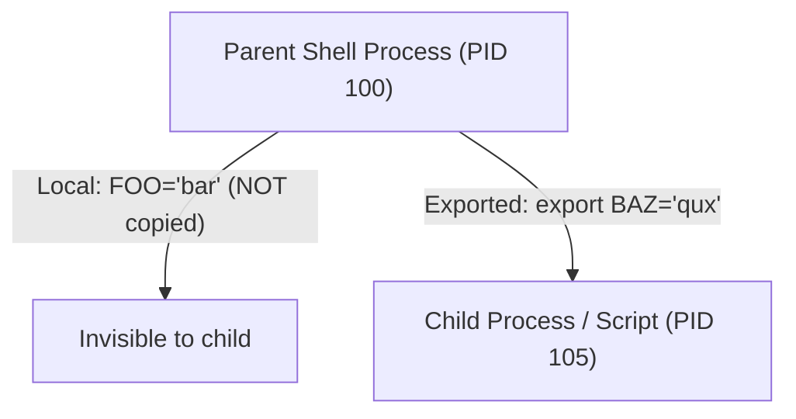

import { Callout } from 'fumadocs-ui/components/callout';

## Doing Math in Bash: Arithmetic Expansion `$(( ))`

Because Bash treats all variables as strings by default, writing:

```bash
x=5
y=10
result=$x+$y
echo $result
# Output: 5+10 (Literal text string concatenation!)
```

To tell Bash to evaluate a mathematical calculation, you must wrap the expression inside **arithmetic expansion syntax**:

```bash
result=$(( x + y ))
echo $result
# Output: 15
```

<Callout type="info" title="Inside $(( )), the dollar sign is optional!">
Inside arithmetic parentheses `$(( ... ))`, you do not need to prefix variable names with `$`! Both `$(( $x + $y ))` and `$(( x + y ))` work identically.
</Callout>

---

## Supported Arithmetic Operators

Bash supports standard integer mathematical operators:

| Operator | Description | Example | Result |
| :--- | :--- | :--- | :--- |
| **`+`** | Addition | `$(( 10 + 5 ))` | `15` |
| **`-`** | Subtraction | `$(( 10 - 4 ))` | `6` |
| **`*`** | Multiplication | `$(( 6 * 7 ))` | `42` |
| **`/`** | Integer Division (Truncates decimals) | `$(( 10 / 3 ))` | `3` |
| **`%`** | Modulo (Remainder of division) | `$(( 10 % 3 ))` | `1` |
| **`**`** | Exponentiation (Power) | `$(( 2 ** 8 ))` | `256` |
| **`++` / `--`** | Increment / Decrement | `(( count++ ))` | Adds 1 to count |
| **`+=` / `-=`** | Compound Assignment | `(( total += 10 ))` | Adds 10 to total |

### The Integer Truncation Gotcha

Bash **only supports integers** (whole numbers). It cannot natively represent floating-point decimals:

```bash
echo $(( 5 / 2 ))
# Output: 2 (The 0.5 is silently truncated, NOT rounded!)
```

### Floating-Point Math with `bc` or `awk`

When your scripts need precise floating-point decimals (such as calculating percentages, CPU loads, or currency), pipe the expression to `bc` (*Basic Calculator*) or `awk`:

```bash
# Using bc with precision scale=2
result=$(echo "scale=2; 5 / 2" | bc)
echo $result
# Output: 2.50

# Using awk
result=$(awk "BEGIN {print 5 / 2}")
echo $result
# Output: 2.5
```

---

## Built-In Environment Variables

Linux and Bash come pre-packaged with dozens of system environment variables that provide instant access to system state without running external programs:

| Variable | Description | Typical Value |
| :--- | :--- | :--- |
| **`$RANDOM`** | Generates a pseudo-random integer between 0 and 32,767 | `18429` |
| **`$SECONDS`** | Seconds elapsed since the script started running | `4` |
| **`$USER`** | Username of the active shell user | `student` |
| **`$HOME`** | Absolute path to the user's home directory | `/home/student` |
| **`$PWD`** | Present working directory | `/home/student/projects` |
| **`$HOSTNAME`** | Network hostname of the machine | `cloud-vps-node` |
| **`$UID`** | User ID number (`0` for `root`) | `1000` (or `0`) |
| **`$$`** | Process ID (PID) of the currently running script | `14092` |
| **`$LINENO`** | Current line number inside the script file | `42` |

### Benchmarking Runtimes with `$SECONDS`

`$SECONDS` is an automatic stopwatch built right into Bash:

```bash
#!/bin/bash
# Reset timer to 0
SECONDS=0

echo "Starting heavy database migration..."
sleep 3  # Simulate workload

echo "Migration finished in $SECONDS seconds!"
```

---

## Mastering `$RANDOM`: Ranges & Modulo Math

The built-in variable `$RANDOM` yields a number from `0` to `32,767`. 

To constrain `$RANDOM` to a specific range (for games, passwords, or port selection), use the **modulo operator (`%`)**:


### Common Modulo Formulas

```bash
# Random number from 0 to 9:
num=$(( RANDOM % 10 ))

# Random number from 1 to 100:
percent=$(( (RANDOM % 100) + 1 ))

# Random dice roll (1 to 6):
dice=$(( (RANDOM % 6) + 1 ))

# Random port in ephemeral range (10000 to 20000):
port=$(( (RANDOM % 10001) + 10000 ))
```

---

## Shell Variables vs. Environment Variables (`export`)

When you create a standard variable in Bash, it is a **local shell variable**. It exists **only in your current process**:

```bash
# In your terminal:
MY_API_KEY="secret_key_123"

# Spawn a child subshell:
bash

# Try accessing it inside the child subshell:
echo $MY_API_KEY
# (Empty! The child process cannot see it.)
exit
```

### Making Variables Inheritable with `export`

The `export` command marks a variable as an **environment variable**. Any child processes, scripts, or subshells spawned from that session inherit a copy of the variable:

```bash
export MY_API_KEY="secret_key_123"

bash
echo $MY_API_KEY
# Output: secret_key_123 (Successfully inherited!)
exit
```



---

## Featured Script: The Millionaire Predictor (`getrichquick.sh`)

In Episode 3 of NetworkChuck's series, we build **The Millionaire Predictor** (`getrichquick.sh`), using `$RANDOM`, arithmetic expansions, and system variables:

```bash title="getrichquick.sh"
#!/bin/bash
# ==============================================================================
# The Millionaire Predictor (getrichquick.sh)
# Episode 3: Bash Scripting Masterclass
# ==============================================================================

echo "==============================================="
echo "   WELCOME TO THE BASH MILLIONAIRE PREDICTOR   "
echo "==============================================="

# Ask for user details
read -p "What is your name? " name
read -p "How old are you right now? " age

echo ""
echo "Consulting the Bash Oracle on $HOSTNAME..."
echo "Gathering cosmic entropy for user: $USER (UID: $UID)..."
sleep 1

# Generate a random offset between 0 and 14 years
random_years=$(( RANDOM % 15 ))

# Calculate target age
millionaire_age=$(( age + random_years ))

echo ""
echo "-----------------------------------------------"
echo "Hello $name, you are currently $age years old."
echo "Calculating trajectory..."
sleep 1
echo "🎉 CONGRATULATIONS!"
echo "According to our deterministic calculations..."
echo "You will become a MILLIONAIRE at age: $millionaire_age!"
echo "-----------------------------------------------"
echo "Script executed in $SECONDS seconds."

exit 0
```

### Try Running It:

```bash
chmod +x getrichquick.sh
./getrichquick.sh
```

**Sample Output:**
```text
===============================================
   WELCOME TO THE BASH MILLIONAIRE PREDICTOR   
===============================================
What is your name? Chuck
How old are you right now? 32

Consulting the Bash Oracle on cloud-vps...
Gathering cosmic entropy for user: student (UID: 1000)...

-----------------------------------------------
Hello Chuck, you are currently 32 years old.
Calculating trajectory...
🎉 CONGRATULATIONS!
According to our deterministic calculations...
You will become a MILLIONAIRE at age: 39!
-----------------------------------------------
Script executed in 2 seconds.
```

---

## Hands-On Exercise & Challenge

<Callout type="info" title="Challenge 3.1: The Dice Duel Game">
Build a script named `dice_duel.sh`:
1. Generate two random numbers between 1 and 6 (one for Player, one for Computer).
2. Print both rolls.
3. Calculate the sum and difference of the two rolls using `$(( ))`.
4. Display the total score.
5. Benchmark how fast the script ran using `$SECONDS`.
</Callout>

In the next lesson, we will introduce **branching decision-making: conditionals, comparison operators, and the epic Elden Ring text RPG**.

👉 Proceed to [**Lesson 4: Conditionals & Logic**](/docs/developer-tools/bash-scripting/04-conditionals-and-logic).
