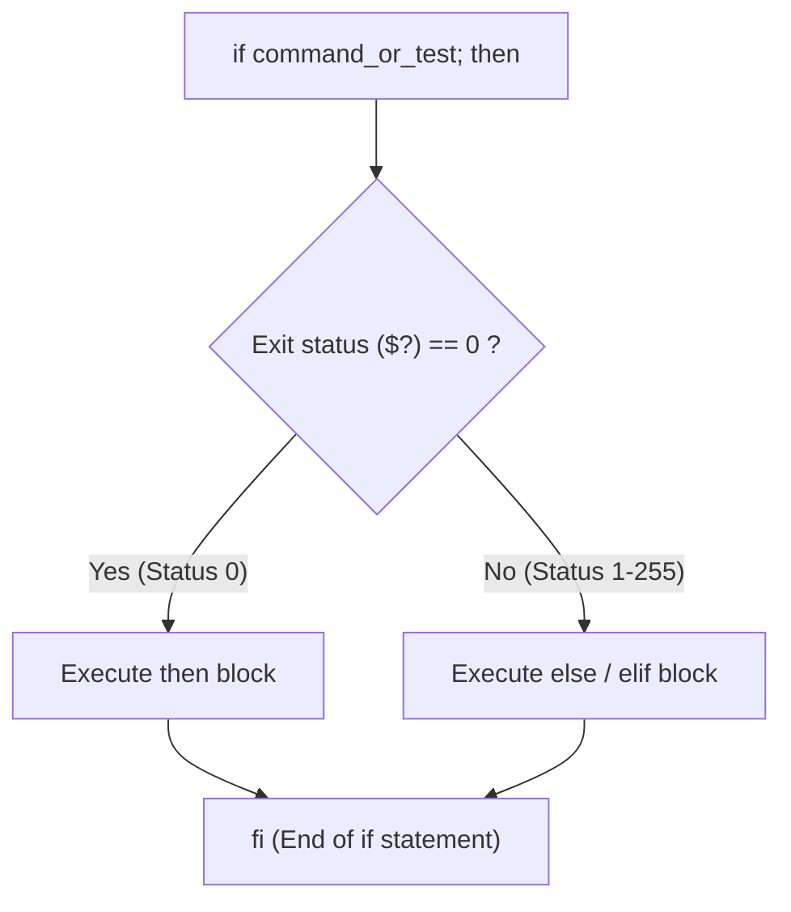

import { Callout } from 'fumadocs-ui/components/callout';

## How Conditionals Work in Bash

In languages like JavaScript or Python, an `if` statement evaluates a boolean expression (`true` or `false`).

In Bash, **an `if` statement tests the EXIT CODE of a command**:
- If the command returns **exit status `0`**, Bash considers it **TRUE** and executes the `then` block.
- If the command returns **any non-zero exit status (1–255)**, Bash considers it **FALSE** and skips to `elif` or `else`.



---

## The `if ... then ... elif ... else ... fi` Syntax

Notice that every `if` block in Bash terminates with `fi` (`if` spelled backward):

```bash
#!/bin/bash

read -p "Enter your score (0-100): " score

if [ "$score" -ge 90 ]; then
  echo "Grade: A (Outstanding!)"
elif [ "$score" -ge 80 ]; then
  echo "Grade: B (Great job!)"
elif [ "$score" -ge 70 ]; then
  echo "Grade: C (Passed)"
else
  echo "Grade: Needs improvement. YOU DIED."
fi
```

<Callout type="warn" title="Spaces around brackets are strictly mandatory!">
The bracket `[` is actually a command (the `test` program in Unix)! Therefore, you **must put spaces** after `[` and before `]`:
- `if [ "$a" == "$b" ]; then` — **CORRECT**
- `if ["$a"=="$b"]; then` — **SYNTAX ERROR!**
</Callout>

---

## Single Brackets `[ ]` vs. Double Brackets `[[ ]]`

In modern Bash scripting, always prefer double brackets `[[ ]]` over single brackets `[ ]`:

| Feature | Single Brackets `[ ]` | Double Brackets `[[ ]]` |
| :--- | :--- | :--- |
| **Origin** | POSIX `test` program (1979) | Bash extended keyword (Modern) |
| **Word Splitting** | Yes (fails if variable is empty or has spaces) | **No** (safe with unquoted variables) |
| **Pathname Expansion** | Expands wildcards like `*.txt` dangerously | Disables unintended globbing |
| **Operators** | Uses `-a` (AND) and `-o` (OR) | Uses modern `&&` and `||` |
| **Regex Matching** | Not supported | Supported via `=~` operator |
| **Recommendation** | Only use if strict POSIX `/bin/sh` required | **Default choice for all Bash scripts** |

```bash
# In single brackets, an unquoted empty variable crashes:
name=""
[ $name == "Chuck" ]
# bash: [: ==: unary operator expected

# In double brackets, it handles empty strings safely:
[[ $name == "Chuck" ]]
# Evaluates safely to false!
```

---

## Test Operators Cheat Sheet

### 1. Integer Comparisons

Remember that `<` and `>` are used for string comparisons or redirection. For numbers, use letter flags:

| Operator | Meaning | Example |
| :--- | :--- | :--- |
| **`-eq`** | Equal to | `[[ $age -eq 21 ]]` |
| **`-ne`** | Not equal to | `[[ $port -ne 80 ]]` |
| **`-lt`** | Less than | `[[ $count -lt 10 ]]` |
| **`-le`** | Less than or equal to | `[[ $reps -le 50 ]]` |
| **`-gt`** | Greater than | `[[ $cpu -gt 85 ]]` |
| **`-ge`** | Greater than or equal to | `[[ $ram -ge 90 ]]` |

### 2. String Comparisons

| Operator | Meaning | Example |
| :--- | :--- | :--- |
| **`==`** (or `=`) | Strings are identical | `[[ "$role" == "admin" ]]` |
| **`!=`** | Strings are not identical | `[[ "$env" != "prod" ]]` |
| **`-z`** | String is **Zero length (Empty)** | `[[ -z "$api_key" ]]` |
| **`-n`** | String is **Non-empty** | `[[ -n "$user_input" ]]` |
| **`=~`** | Matches Regular Expression | `[[ "$email" =~ ^[A-Za-z0-9._%+-]+@[A-Za-z0-9.-]+\.[A-Za-z]{2,}$ ]]` |

### 3. File & Filesystem Tests

These operators are the backbone of DevOps automation scripts:

| Operator | Meaning | Example |
| :--- | :--- | :--- |
| **`-e`** | File or directory exists | `[[ -e "/etc/hosts" ]]` |
| **`-f`** | Exists and is a **regular file** | `[[ -f "config.json" ]]` |
| **`-d`** | Exists and is a **directory** | `[[ -d "/var/log" ]]` |
| **`-s`** | File exists and has size **greater than 0** | `[[ -s "output.log" ]]` |
| **`-r`** | File is **readable** by current user | `[[ -r "secret.pem" ]]` |
| **`-w`** | File is **writable** by current user | `[[ -w "/var/run" ]]` |
| **`-x`** | File is **executable** | `[[ -x "deploy.sh" ]]` |

---

## Compound Boolean Logic: `&&`, `||`, and `!`

Combine multiple conditions:

```bash
# Logical AND (Both must be true):
if [[ $age -ge 18 && $has_license == "yes" ]]; then
  echo "Approved to drive."
fi

# Logical OR (Either can be true):
if [[ $user == "root" || $role == "admin" ]]; then
  echo "Granting administrative access."
fi

# Logical NOT (Inversion):
if [[ ! -f "/etc/nginx/nginx.conf" ]]; then
  echo "Nginx configuration file missing!"
fi
```

---

## The `case ... in ... esac` Statement

When comparing a single variable against many possible options (such as menu choices, CLI subcommands, or file extensions), an `if/elif/elif/else` chain becomes messy. 

The `case` statement provides clean pattern matching:

```bash title="menu.sh"
#!/bin/bash

echo "=== System Administration Console ==="
echo "1) Check Disk Usage"
echo "2) Check Memory Usage"
echo "3) Check Active Ports"
echo "4) Exit"
read -p "Select option [1-4]: " choice

case $choice in
  1)
    df -h
    ;;
  2)
    free -m
    ;;
  3)
    ss -tuln
    ;;
  4|q|Q)
    echo "Exiting console. Goodbye!"
    exit 0
    ;;
  *)
    echo "Invalid option: '$choice'. Please select between 1 and 4."
    exit 1
    ;;
esac
```

Notice:
- Each pattern branch ends with two semicolons `;;`.
- Multiple matching values are separated with pipe `|` (e.g. `4|q|Q`).
- `*)` serves as the wildcard default fallback (like `default:` in other languages).
- The statement ends with `esac` (`case` spelled backward).

---

## Featured Project: Elden Ring in Bash (`eldenring.sh`)

In Episode 4 of NetworkChuck's series, we build a full text adventure RPG battle game based on *Elden Ring*, featuring class selection, boss battles, random combat dice rolls, and secret coffee cheat codes!

```bash title="eldenring.sh"
#!/bin/bash
# ==============================================================================
# Elden Ring (Bash Edition)
# Episode 4: Conditionals, Test Operators & Combat Game
# ==============================================================================

echo "=========================================================="
echo "          WELCOME TO ELDEN RING: BASH EDITION             "
echo "=========================================================="
echo "You awake as a Tarnished in the Lands Between..."
echo "Choose your starting class:"
echo "1) Tarnished (Balanced Warrior)"
echo "2) Astrologer (Mage)"
echo "3) Coffee Bandit (Stealth Caffeine Fiend)"
echo "=========================================================="

read -p "Choose your class [1-3]: " hero_class

case $hero_class in
  1)
    hero="Tarnished"
    hp=20
    attack=10
    ;;
  2)
    hero="Astrologer"
    hp=12
    attack=18
    ;;
  3)
    hero="Coffee Bandit"
    hp=16
    attack=14
    ;;
  *)
    echo "Unrecognized traveler! Defaulting to Wretch."
    hero="Wretch"
    hp=10
    attack=8
    ;;
esac

echo ""
echo "You have chosen: $hero (HP: $hp, ATK: $attack)"
echo "You journey forward toward Stormveil Castle..."
sleep 2

# ------------------------------------------------------------------------------
# BOSS BATTLE 1: Margit the Fell Omen
# ------------------------------------------------------------------------------
echo ""
echo "⚔️ WARNING: A menacing fog descends upon the bridge..."
echo "Boss Appears: MARGIT, THE FELL OMEN!"
echo "'Foul Tarnished, in search of the Elden Ring...'"
sleep 2

# Boss generates a hidden roll: 0 or 1
beast_roll=$(( RANDOM % 2 ))

echo ""
echo "Margit swings his golden cane! Choose your combat action (0 or 1):"
read -p "Your roll / secret spell: " player_move

# Check conditions
if [ "$player_move" == "coffee" ]; then
  echo ""
  echo "☕ COFFEE CHEAT ACTIVATED!"
  echo "You summon a scalding espresso storm directly into Margit's face!"
  echo "Margit is stunned and defeated instantly!"
  echo "🏆 VICTORY ACHIEVED! You earned 12,000 Runes!"
  exit 0
elif [ "$player_move" == "$beast_roll" ]; then
  echo ""
  echo "⚔️ DIRECT HIT! Margit rolled $beast_roll and your roll matched!"
  echo "You parry his strike and pierce him through the heart!"
  echo "🏆 VICTORY ACHIEVED! Margit falls to his knees!"
  exit 0
else
  echo ""
  echo "💀 Margit rolled $beast_roll. Your dodge timed out!"
  echo "Margit hammers you into the stone bridge!"
  echo "=========================================================="
  echo "                      YOU DIED.                           "
  echo "=========================================================="
  exit 1
fi
```

### Playing the Game

1. Grant execute permission:
   ```bash
   chmod +x eldenring.sh
   ```
2. Test normal combat:
   ```bash
   ./eldenring.sh
   # Try rolling 0 or 1!
   ```
3. Test the secret cheat code:
   ```bash
   ./eldenring.sh
   # Enter 'coffee' at the combat prompt!
   ```

---

## Hands-On Exercise & Challenge

<Callout type="info" title="Challenge 4.1: The File Sentinel">
Write a script called `sentinel.sh` that:
1. Accepts a target filepath as `$1`.
2. Checks if `$1` was provided; if not, exit with code 1 and print usage.
3. Checks if the path exists:
   - If it's a directory (`-d`), print its contents using `ls -l`.
   - If it's a file (`-f`), check if it's readable (`-r`) and print its line count using `wc -l`.
   - If it does not exist, ask the user: *"Would you like to create it? [y/n]"*.
4. Return exit code `0` on success.
</Callout>

In the next lesson, we will master **loops: repeating tasks, automating ping sweeps, and counting push-ups**.

👉 Proceed to [**Lesson 5: Loops & Iteration**](/docs/developer-tools/bash-scripting/05-loops-and-iteration).
