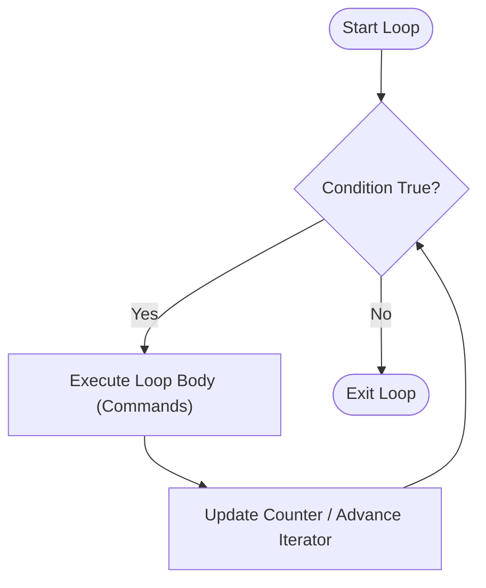

import { Callout } from 'fumadocs-ui/components/callout';

## Why Loops Matter in Shell Scripting

In DevOps and systems administration, you rarely perform an action once. You need to:
- Ping 254 IP addresses across a subnet to discover online servers.
- Compress 500 log files created over the past year.
- Poll a Docker container until its health check returns HTTP 200.
- Iterate over 50 AWS EC2 instances to apply security patches.

Loops allow you to write a script once and repeat it thousands of times without human intervention.



---

## 1. The `while` Loop

A `while` loop repeats its code block **as long as the test condition evaluates to TRUE (exit code 0)**:

```bash
#!/bin/bash

x=1
while [ $x -le 5 ]; do
  echo "Iteration number: $x"
  x=$(( x + 1 ))
done
```

### The Infinite Polling Loop (`while true`)

In production automation, scripts frequently need to poll an endpoint until a service finishes initializing:

```bash
echo "Waiting for PostgreSQL database to start on port 5432..."

while ! nc -z localhost 5432; do
  echo "Database still initializing... sleeping 2 seconds"
  sleep 2
done

echo "PostgreSQL is UP and accepting connections!"
```

---

## 2. The `until` Loop

An `until` loop is the exact mirror of a `while` loop: it repeats **until the condition becomes TRUE** (in other words, it keeps running as long as the condition evaluates to FALSE):

```bash
#!/bin/bash

coffee_cups=0

until [ $coffee_cups -ge 3 ]; do
  echo "Coffee count: $coffee_cups. Chuck is still sleepy... 🥱"
  coffee_cups=$(( coffee_cups + 1 ))
  sleep 1
done

echo "Coffee count: $coffee_cups. Energy fully restored! ⚡ Ready to code!"
```

---

## 3. The `for` Loop

Bash provides three powerful variations of the `for` loop:

### Variation A: Iterating Over a List of Words

```bash
for tool in git docker terraform ansible; do
  echo "Checking installation status for: $tool"
  which $tool || echo "⚠️ $tool is not installed!"
done
```

### Variation B: Brace Expansion Ranges `{start..end..step}`

Instead of manually listing numbers, Bash brace expansion generates sequences instantly:

```bash
# Numbers 1 through 5:
for i in {1..5}; do
  echo "Step $i"
done

# Numbers 0 to 20 with step interval of 5:
for count in {0..20..5}; do
  echo "Interval: $count"
done
# Outputs: 0, 5, 10, 15, 20
```

### Variation C: C-Style Three-Expression `for (( ; ; ))` Loop

If you come from C, Java, or JavaScript, Bash supports standard index-based loop syntax:

```bash
for (( i = 1; i <= 5; i++ )); do
  echo "C-Style Index: $i"
done
```

### Variation D: Iterating Over Files (Globbing)

```bash
# Process all markdown files in docs/
for file in docs/*.md; do
  # Always quote "$file" in case the path contains spaces!
  echo "Processing file: $file"
  head -n 1 "$file"
done
```

---

## The Golden Idiom: Reading Files Line-by-Line

Beginners often try to read a file using `cat` inside a `for` loop:

```bash
# BAD PRACTICE (Subject to word-splitting and whitespace corruption):
for line in $(cat servers.txt); do
  echo "$line"
done
```

If any line contains spaces or tabs, `for` splits on whitespace and mangles your lines!

### The Safe Production Idiom: `while IFS= read -r`

```bash
while IFS= read -r line || [ -n "$line" ]; do
  echo "Processing record: $line"
done < servers.txt
```

### What do these flags mean?
- `IFS=`: Clears the Internal Field Separator to prevent stripping leading or trailing whitespace.
- `-r`: Disables backslash escape interpretation (keeps `\t`, `\n`, paths intact).
- `|| [ -n "$line" ]`: Guarantees the final line is processed even if the file lacks a trailing newline.
- `< servers.txt`: Feeds the file into the loop via standard input redirection.

---

## Loop Control: `break` and `continue`

- **`break`**: Immediately aborts the loop entirely and transfers execution to the statement following `done`.
- **`continue`**: Skips the remainder of the current iteration and jumps directly to the next loop evaluation.

```bash
for num in {1..10}; do
  if [ $num -eq 3 ]; then
    echo "Skipping lucky number 3!"
    continue
  fi

  if [ $num -eq 7 ]; then
    echo "Hit jackpot 7! Breaking out of loop."
    break
  fi

  echo "Current number: $num"
done
```

---

## Featured Script 1: The Push-Up Counter (`pushups.sh`)

In Episode 5 of NetworkChuck's series, we build a workout coach that logs push-up repetitions interactively:

```bash title="pushups.sh"
#!/bin/bash
# ==============================================================================
# The Bash Push-Up Counter (pushups.sh)
# Episode 5: While Loops & Interactive Workout Logger
# ==============================================================================

# Accept target reps as $1 or default to 10
target_reps=${1:-10}
current_rep=1

echo "=========================================================="
echo "          BASH FITNESS COACH: PUSH-UP TRACKER             "
echo "=========================================================="
echo "Today's Target: $target_reps Push-Ups!"
echo "Get ready... starting in 3 seconds!"
sleep 1; echo "3..."; sleep 1; echo "2..."; sleep 1; echo "1... GO!"

while [ $current_rep -le $target_reps ]; do
  echo ""
  read -p "Push-up #$current_rep: Press [Enter] when completed... "
  echo "💪 Rep $current_rep done! Looking strong!"
  current_rep=$(( current_rep + 1 ))
done

echo ""
echo "=========================================================="
echo "🔥 WORKOUT CRUSHED! Total reps completed: $target_reps"
echo "Logging results to /var/log/workout.log..."
echo "$(date '+%Y-%m-%d %H:%M:%S') - Completed $target_reps pushups" >> /tmp/workout.log
echo "Gains secured! Time for coffee! ☕"
echo "=========================================================="

exit 0
```

---

## Featured Script 2: Subnet Ping Sweeper (`pingsweep.sh`)

NetworkChuck demonstrates how network engineers and security analysts automate subnet discovery using a fast `for` loop ping sweep:

```bash title="pingsweep.sh"
#!/bin/bash
# ==============================================================================
# Subnet Ping Sweeper (pingsweep.sh)
# Usage: ./pingsweep.sh 192.168.1
# ==============================================================================

subnet=$1

if [ -z "$subnet" ]; then
  echo "Usage: $0 <first-3-octets>"
  echo "Example: $0 192.168.1"
  exit 1
fi

echo "=========================================================="
echo "  SCANNING SUBNET: $subnet.0/24 FOR ACTIVE HOSTS         "
echo "=========================================================="

# Sweep through hosts 1 through 20 (or {1..254} for full subnet)
for host in {1..20}; do
  ip="$subnet.$host"

  # ping flags:
  # -c 1 : Send exactly 1 packet
  # -W 1 : Timeout after 1 second if no response
  # > /dev/null : Discard standard output so screen remains clean
  if ping -c 1 -W 1 "$ip" > /dev/null 2>&1; then
    echo "🟢 [ALIVE] Host responded: $ip"
  fi
done

echo "=========================================================="
echo "Scan complete."
exit 0
```

---

## Hands-On Exercise & Challenge

<Callout type="info" title="Challenge 5.1: The Batch Renamer">
Write a script called `batch_rename.sh` that:
1. Loops over all `.txt` files in a given directory path `$1`.
2. Renames each file by prefixing it with the current date: `YYYYMMDD_<original_name>.txt`.
3. Displays a live progress counter (e.g. `Renaming file 3 of 12...`).
4. Uses `continue` to skip files that already have the date prefix.
</Callout>

In the next lesson, we will organize our code using **functions, local variables, and modular script libraries**.

👉 Proceed to [**Lesson 6: Functions & Modularity**](/docs/developer-tools/bash-scripting/06-functions-and-modularity).
