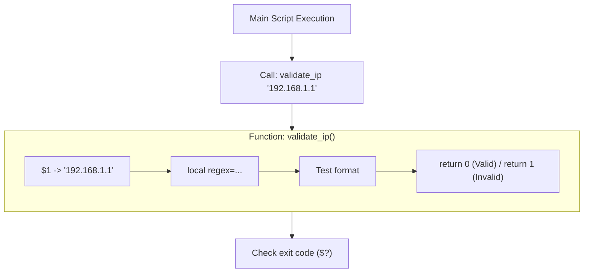
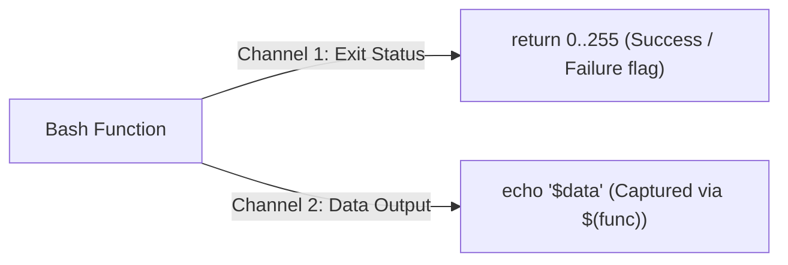

import { Callout } from 'fumadocs-ui/components/callout';

## Why Use Functions in Shell Scripts?

As your scripts grow beyond 50 lines, repeating code causes maintenance nightmares. 

Functions in Bash provide:
1. **Reusability (DRY)**: Write complex validation or formatting logic once and call it anywhere.
2. **Readability**: Replace blocks of cryptic pipe operations with descriptive function names like `backup_database` or `check_disk_health`.
3. **Modularity**: Package functions into shared `.sh` library files that can be imported across multiple projects.



---

## Defining Functions

In Bash, there are two common syntaxes. The POSIX standard syntax is widely preferred across the industry:

```bash
# Standard POSIX syntax (Recommended):
greet_user() {
  echo "Hello, $1!"
}

# Alternative Bash syntax:
function greet_user {
  echo "Hello, $1!"
}
```

To invoke a function, write its name followed by arguments (do **not** use parentheses when calling):

```bash
greet_user "Chuck"
# Output: Hello, Chuck!
```

---

## Function Arguments & Scoping

Inside a function body, the positional parameters (`$1`, `$2`, `$#`, `$@`) reflect **the arguments passed to that specific function**, NOT the arguments passed to the parent script:

```bash
#!/bin/bash

# Script called with: ./script.sh apple banana
echo "Script argument #1: $1"  # Prints: apple

inspect_args() {
  echo "Function argument #1: $1"  # Prints: red
  echo "Function argument #2: $2"  # Prints: green
  echo "Function argument count: $#" # Prints: 2
}

inspect_args "red" "green"
```

---

## The Danger of Global Scope: The `local` Keyword

<Callout type="warn" title="Critical Bash Quirks">
By default in Bash, **every variable declared inside a function is GLOBAL**! If a function creates `name="Bob"`, it overwrites any variable called `name` in your main script!
</Callout>

```bash
# HAZARDOUS: Overwriting outer variables
count=100

bad_function() {
  count=1  # Modifies global $count!
}

bad_function
echo $count
# Output: 1 (The original value was destroyed!)
```

### The Fix: Always Declare `local` Variables

Use the `local` keyword inside functions. The variable is then scoped strictly to that function and destroyed when the function returns:

```bash
count=100

safe_function() {
  local count=1
  local temp_file="/tmp/cache_$$.dat"
  echo "Inside function: $count"
}

safe_function
echo "Outside function: $count"
# Inside function: 1
# Outside function: 100 (Protected!)
```

---

## Returning Values in Bash: Two Different Channels

A common point of confusion for developers from other languages is how Bash functions "return" values. In Bash, there are **two distinct communication channels**:



### Channel 1: Exit Status (`return 0-255`)
Used for indicating success or failure to `if` statements:

```bash
is_root() {
  if [ "$EUID" -eq 0 ]; then
    return 0  # Success (User is root)
  else
    return 1  # Failure (User is not root)
  fi
}

if is_root; then
  echo "Running with administrative privileges."
else
  echo "Please rerun this script with sudo."
  exit 1
fi
```

### Channel 2: Data Output (Standard Output Capture)
Used for returning strings, numbers, or JSON payloads. The function prints to stdout, and the caller captures it via command substitution `$()`:

```bash
calculate_vat() {
  local amount=$1
  local tax_rate=20
  local total=$(( amount + (amount * tax_rate / 100) ))
  echo "$total"  # Send result to stdout
}

# Capture returned value:
final_price=$(calculate_vat 50)
echo "Final price including VAT: \$$final_price"
# Output: Final price including VAT: $60
```

---

## Sourcing Shared Libraries (`source` or `.`)

You can keep utility functions in a standalone file (e.g. `utils.sh`) and include them in multiple scripts using `source` (or its single-character alias `.`):

```bash title="lib/utils.sh"
# Utility library
generate_token() {
  head /dev/urandom | tr -dc A-Za-z0-9 | head -c 16
  echo ""
}
```

```bash title="deploy.sh"
#!/bin/bash
# Import helper functions
source ./lib/utils.sh

api_token=$(generate_token)
echo "Generated deployment token: $api_token"
```

---

## Production Project: Colored Terminal Logging Library

Let's build a production-grade logging utility module using ANSI color codes and timestamped output:

```bash title="lib/logger.sh"
#!/bin/bash
# ==============================================================================
# Enterprise CLI Logger Library (lib/logger.sh)
# ==============================================================================

# ANSI Color Codes
COLOR_RESET="\033[0m"
COLOR_RED="\033[1;31m"
COLOR_GREEN="\033[1;32m"
COLOR_YELLOW="\033[1;33m"
COLOR_BLUE="\033[1;34m"
COLOR_CYAN="\033[1;36m"

_timestamp() {
  date "+%Y-%m-%d %H:%M:%S"
}

log_info() {
  echo -e "${COLOR_BLUE}[$(_timestamp)] [INFO]${COLOR_RESET} $1"
}

log_success() {
  echo -e "${COLOR_GREEN}[$(_timestamp)] [SUCCESS]${COLOR_RESET} $1"
}

log_warn() {
  echo -e "${COLOR_YELLOW}[$(_timestamp)] [WARN]${COLOR_RESET} $1"
}

log_error() {
  echo -e "${COLOR_RED}[$(_timestamp)] [ERROR]${COLOR_RESET} $1" >&2
}

log_header() {
  echo -e "${COLOR_CYAN}======================================================"
  echo -e "  $1"
  echo -e "======================================================${COLOR_RESET}"
}
```

### Using the Logger in an Automation Script:

```bash title="migrate.sh"
#!/bin/bash
source ./lib/logger.sh

log_header "STARTING CLOUD DATABASE MIGRATION"

log_info "Verifying database connection..."
sleep 1

log_warn "Connection latency is elevated (142ms)"
sleep 1

log_success "Schema v2.4 applied cleanly to 38 tables."
log_info "Migration pipeline finished."
```

---

## Hands-On Exercise & Challenge

<Callout type="info" title="Challenge 6.1: Validating IPv4 Addresses">
Create a function named `validate_ipv4` that:
1. Takes an IP string as its first argument `$1`.
2. Validates that it contains exactly 4 octets separated by dots.
3. Checks that each octet is an integer between 0 and 255.
4. Returns `0` if valid, or `1` if invalid.
5. Demonstrate calling the function inside an `if validate_ipv4 "$ip"; then ...` block.
</Callout>

In the next lesson, we will master Unix streams: **standard input, output, errors, pipelines, and process substitution**.

👉 Proceed to [**Lesson 7: Streams, Redirection & Process Substitution**](/docs/developer-tools/bash-scripting/07-redirection-pipes-process).
