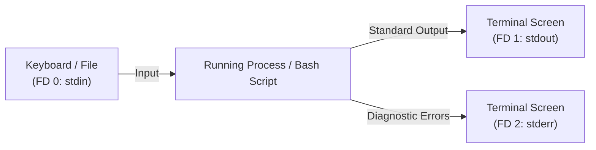

import { Callout } from 'fumadocs-ui/components/callout';

## The Three Standard Streams

Every process in Linux is started with three standard I/O communication channels, represented by integer **file descriptors (FD)**:



| Descriptor | Name | Default Source / Target | Typical Use |
| :--- | :--- | :--- | :--- |
| **`0`** | `stdin` | Keyboard | Reading input from user or pipe |
| **`1`** | `stdout` | Terminal Screen | Normal program output and data |
| **`2`** | `stderr` | Terminal Screen | Errors, warnings, and diagnostic logs |

Because both `stdout` (1) and `stderr` (2) print to the terminal screen by default, they appear intermixed to a user. Redirection lets you separate them cleanly.

---

## Output Redirection: `>` and `>>`

### Overwrite (`>`) vs. Append (`>>`)

```bash
# Overwrite file with new content (creates file if not present; erases old content!):
echo "Build started at $(date)" > build.log

# Append new content to the end of an existing file:
echo "Step 1 passed" >> build.log
echo "Step 2 passed" >> build.log
```

---

## Separating Errors from Output (`1>` and `2>`)

To capture normal output and error messages into distinct files:

```bash
# Redirect stdout (1) to out.log, and stderr (2) to error.log
find / -name "*.conf" 1> out.log 2> error.log
```

When you examine the results:
- `out.log` contains only the valid configuration files discovered.
- `error.log` contains only the `Permission denied` errors.

---

## Merging Streams (`2>&1` and `&>`)

Often in automation, you want to log **everything** (both output and errors) into a single audit log file in the exact order they occurred.

### The Classic Syntax: `2>&1`
Tells the shell: *"Redirect file descriptor 2 (stderr) to wherever file descriptor 1 (stdout) is currently pointing."*

```bash
./deploy.sh > deploy.log 2>&1
```

<Callout type="warn" title="Order of redirection matters!">
`./deploy.sh > deploy.log 2>&1` works because `stdout` is directed to `deploy.log` first, and then `stderr` is pointed to the same target. If you reverse the order: `./deploy.sh 2>&1 > deploy.log`, `stderr` points to your screen, and only `stdout` goes to the file!
</Callout>

### The Modern Bash Shorthand: `&>`
In Bash, `&>` redirects both `stdout` and `stderr` in one clean command:

```bash
./deploy.sh &> deploy.log
```

---

## The Unix Black Hole: `/dev/null`

`/dev/null` is a special virtual device file in Linux. Anything written to `/dev/null` is instantly discarded and erased by the kernel.

Use `/dev/null` whenever you want a command to run completely silently:

```bash
# Discard all output and all errors:
systemctl restart nginx > /dev/null 2>&1

# In modern Bash syntax:
systemctl restart nginx &> /dev/null
```

---

## Here Documents (`<<EOF`): Multi-Line Content

When your script needs to generate configuration files, HTML templates, or run SQL queries, writing individual `echo` commands is tedious.

A **Here Document** (*Heredoc*) streams a multi-line block of text directly into a command or file:

```bash title="generate_config.sh"
#!/bin/bash

server_port=8080
db_host="postgres.internal"

cat <<EOF > /etc/app/config.yaml
# Auto-generated application configuration
environment: production
server:
  port: $server_port
  host: 0.0.0.0
database:
  host: $db_host
  ssl: true
EOF

echo "Configuration generated cleanly!"
```

### Disabling Variable Expansion: `<<'EOF'`

If you enclose the delimiter tag in quotes (`'EOF'`), Bash preserves all literal dollar signs (`$`) without expanding them. This is essential when generating secondary Bash scripts or Nginx configs:

```bash
cat <<'EOF' > /tmp/child_script.sh
#!/bin/bash
# The $1 and $USER variables will NOT be expanded right now!
echo "Argument passed: $1"
echo "Executing user: $USER"
EOF
```

---

## Here Strings (`<<<`)

A **Here String** passes a single variable or string directly into the standard input of a command:

```bash
email="student@example.com"

# Traditional pipe:
echo "$email" | grep "@"

# Cleaner Here String:
grep "@" <<< "$email"
```

---

## The `tee` Utility: View and Save Simultaneously

Normally, redirecting with `>` suppresses terminal output so nothing appears on screen. 

The `tee` command acts as a T-junction pipe: it writes data to a file **and** prints it to the terminal screen at the same time:

```mermaid
flowchart LR
    Cmd[Build Command] --> Tee["tee build.log"]
    Tee --> Screen[Terminal Screen (stdout)]
    Tee --> File[Saved File (build.log)]
```

```bash
# Display compilation progress in real time AND save to disk:
npm run build | tee build.log

# Append instead of overwrite:
npm test | tee -a build.log
```

---

## Process Substitution: `<(command)`

**Process substitution** is one of the most powerful features of modern Bash. It runs a command and makes its output appear to the parent process as a **named FIFO pipe / temporary file descriptor**:

### Syntax: `<(command)`

Imagine comparing the installed packages on two different remote servers without having to manually download files first:

```bash
# Compare the output of two commands directly with diff:
diff <(ssh serverA "rpm -qa | sort") <(ssh serverB "rpm -qa | sort")
```

### Avoiding the Subshell Pipe Trap

When you pipe a command into a `while read` loop:
```bash
# WARNING: The pipe | forces the loop into a child subshell!
counter=0
cat numbers.txt | while read -r n; do
  counter=$(( counter + 1 ))
done

echo "Total: $counter"
# Prints: Total: 0 ! (The variable inside the subshell was destroyed!)
```

### The Fix Using Process Substitution:

```bash
counter=0
while read -r n; do
  counter=$(( counter + 1 ))
done < <(cat numbers.txt)

echo "Total: $counter"
# Prints the true count because the loop runs in the current shell!
```

---

## Hands-On Exercise & Challenge

<Callout type="info" title="Challenge 7.1: The Nginx Config Generator">
Build a script named `create_vhost.sh` that:
1. Accepts a domain name `$1` and port `$2`.
2. Uses a Here Document (`<<EOF`) to write a complete Nginx reverse proxy configuration to `/tmp/$1.conf`.
3. Verifies syntax with `nginx -t -c /tmp/$1.conf &> /tmp/nginx_test.log`.
4. If the test passes, print success; if it fails, display `/tmp/nginx_test.log`.
</Callout>

In the next lesson, we will make our scripts resilient with **defensive scripting, strict mode (`set -euo pipefail`), traps, and debugging tools**.

👉 Proceed to [**Lesson 8: Defensive Scripting & Debugging**](/docs/developer-tools/bash-scripting/08-defensive-scripting-and-debugging).
