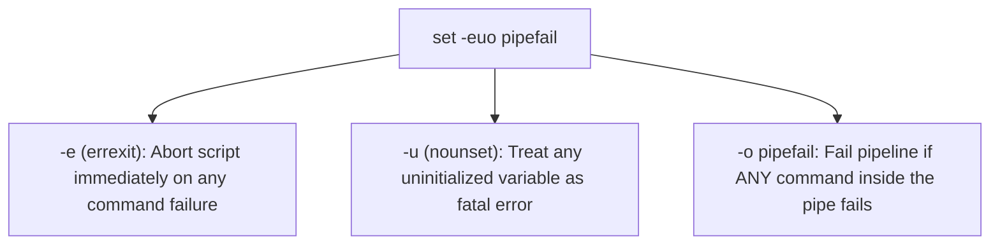
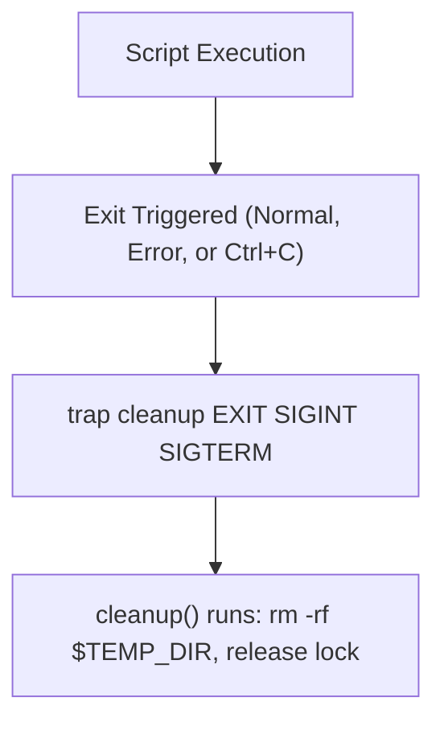

import { Callout } from 'fumadocs-ui/components/callout';

## Why Production Bash Scripts Fail

By default, Bash is extremely forgiving. It was designed in the 1980s as an interactive shell where you do not want your terminal window to crash just because a command made a typo.

However, in an unattended production script or CI/CD runner, this default behavior causes catastrophic silent failures:

```bash
# DISASTER SCENARIO:
# Imagine $APP_CACHE was mistyped or unset in your environment:
rm -rf "$AP_CACHE/*"

# Because $AP_CACHE is unset, Bash substitutes an EMPTY string!
# The command expands to: rm -rf "/*"
# The entire root filesystem is wiped!
```

To write robust, resilient automation, you must adopt **defensive scripting principles**.

---

## The Unofficial Bash Strict Mode: `set -euo pipefail`

Every production automation script should start with this header immediately following the Shebang:

```bash
#!/bin/bash
set -euo pipefail
```

Let's dissect each flag:



### 1. `set -e` (`errexit`)
Causes Bash to exit immediately if any command exits with a non-zero exit status.

```bash
# Without set -e:
cd /non/existent/dir  # Fails!
rm -rf *              # Runs in the wrong directory!

# With set -e:
cd /non/existent/dir  # Script aborts immediately; catastrophic deletion avoided.
```

### 2. `set -u` (`nounset`)
Treats unset variables as errors and exits immediately with an error message:

```bash
set -u
echo "Starting cleanup in $CAHCE_DIR"
# bash: CAHCE_DIR: unbound variable
# Script crashes safely before running any commands!
```

### 3. `set -o pipefail`
By default, the exit status of a pipeline (`cmd1 | cmd2 | cmd3`) is determined **only by the final command (`cmd3`)**:

```bash
# Without pipefail:
grep "CRITICAL" non_existent_file.log | wc -l
# grep fails with exit code 2, but wc -l succeeds with exit code 0!
# Overall pipeline exit code: 0 (Failure masked!)

# With set -o pipefail:
# Overall pipeline exit code: 2 (Failure properly detected!)
```

### Handling Expected Non-Zero Exits Cleanly

When using `set -e`, certain commands (like `grep` returning code 1 when no matches are found) will terminate your script unless handled gracefully:

```bash
# Append '|| true' to allow non-zero exit status:
user_found=$(grep "alice" /etc/passwd || true)

# Or test inside an if condition (if statements are immune to set -e):
if grep -q "alice" /etc/passwd; then
  echo "User exists."
fi
```

---

## Signal Handling & Automated Cleanup with `trap`

Production scripts frequently create temporary directories, lockfiles, or background worker processes. If the script crashes or a developer presses `Ctrl + C`, those temporary resources remain orphaned.

The `trap` command registers a cleanup function that is guaranteed to run whenever the script exits or receives a signal:



### The Gold-Standard Temporary Directory Pattern

```bash title="safe_worker.sh"
#!/bin/bash
set -euo pipefail

# Create a secure temporary directory
TEMP_DIR=$(mktemp -d -t myapp_work_XXXXXX)
echo "Working directory created: $TEMP_DIR"

cleanup() {
  local exit_code=$?
  echo "Cleaning up temporary files in $TEMP_DIR..."
  rm -rf "$TEMP_DIR"
  echo "Exiting with status $exit_code."
  exit "$exit_code"
}

# Register cleanup on normal exit, Ctrl+C (SIGINT), and kill (SIGTERM)
trap cleanup EXIT SIGINT SIGTERM

# Main script logic:
echo "Downloading assets into $TEMP_DIR..."
touch "$TEMP_DIR/data.csv"
sleep 2

echo "Work completed successfully!"
```

---

## Defensive Quoting Rules

Always wrap variable references in double quotes `"$var"` unless you have a specific, documented reason not to:

```bash
filename="My Important File.txt"

# Broken without quotes:
ls -l $filename
# Bash runs: ls -l My Important File.txt (Three separate arguments!)

# Safe with double quotes:
ls -l "$filename"
# Preserves filename as a single distinct argument.
```

### Quoting Special Parameters

| Parameter | Unquoted | Double-Quoted (Correct) |
| :--- | :--- | :--- |
| **All Arguments** | `$@` or `$*` (Breaks words) | `"$@"` (Preserves exact boundaries of every argument) |
| **Variables** | `$file` (Vulnerable to globbing) | `"$file"` (Safe literal string) |

---

## Debugging Techniques

### 1. The Execution Trace (`bash -x` / `set -x`)

The `xtrace` option prints each command to standard error prefixed with `+` after performing variable expansions, but before executing it:

```bash
# Run entire script in debug mode:
bash -x ./deploy.sh
```

### 2. Selective Inline Tracing

You don't need to debug the entire script. Wrap only the confusing block with `set -x` and `set +x`:

```bash
echo "Normal execution..."

set -x  # Turn on tracing
target_host="10.0.0.$(( RANDOM % 10 + 1 ))"
ping -c 1 "$target_host"
set +x  # Turn off tracing

echo "Back to normal execution."
```

---

## Static Code Analysis with `shellcheck`

**ShellCheck** is the industry standard static analysis linter for shell scripts. It catches syntax errors, subtle semantic bugs, and portability issues before your script ever runs:

```bash
# Install on Ubuntu/Debian:
sudo apt install shellcheck

# Lint your script:
shellcheck my_script.sh
```

### Common ShellCheck Warning Codes

- **SC2086**: *Double quote to prevent globbing and word splitting.*
- **SC2164**: *Use `cd ... || exit` in case cd fails.*
- **SC2002**: *Useless use of cat.* (e.g. `cat file | grep foo` instead of `grep foo file`).
- **SC2034**: *Variable appears unused.*

---

## Preventing Concurrent Execution with `flock`

If a script runs via cron every 5 minutes but a particular job takes 8 minutes, two instances will run simultaneously, corrupting data.

Use `flock` (*file lock*) to ensure only one instance executes at a time:

```bash title="sync_cron.sh"
#!/bin/bash
set -euo pipefail

LOCK_FILE="/var/run/myapp_sync.lock"

# Open file descriptor 200 on the lockfile
exec 200>"$LOCK_FILE"

# Try to acquire exclusive lock non-blockingly (-n)
if ! flock -n 200; then
  echo "⚠️ Another instance of sync_cron.sh is already running. Exiting."
  exit 0
fi

echo "Lock acquired! Running database sync..."
sleep 5
echo "Sync complete."
```

---

## Hands-On Exercise & Challenge

<Callout type="info" title="Challenge 8.1: Hardening a Legacy Script">
Take a legacy script that downloads an archive, extracts it, and moves files:
1. Add `set -euo pipefail`.
2. Implement a `trap cleanup EXIT` function that safely removes any downloaded `.tar.gz` and temporary extraction directories.
3. Replace all unquoted variables with `"$var"`.
4. Run `shellcheck` (or analyze manually) to ensure 0 lint warnings remain.
</Callout>

In the next lesson, we will build **four complete, end-to-end real-world projects** applying every concept learned so far.

👉 Proceed to [**Lesson 9: Real-World Automation Projects**](/docs/developer-tools/bash-scripting/09-real-world-projects).
