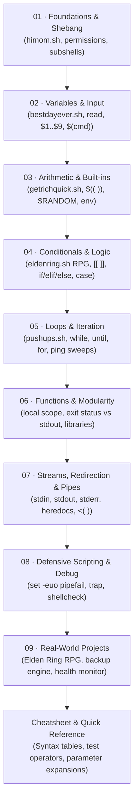
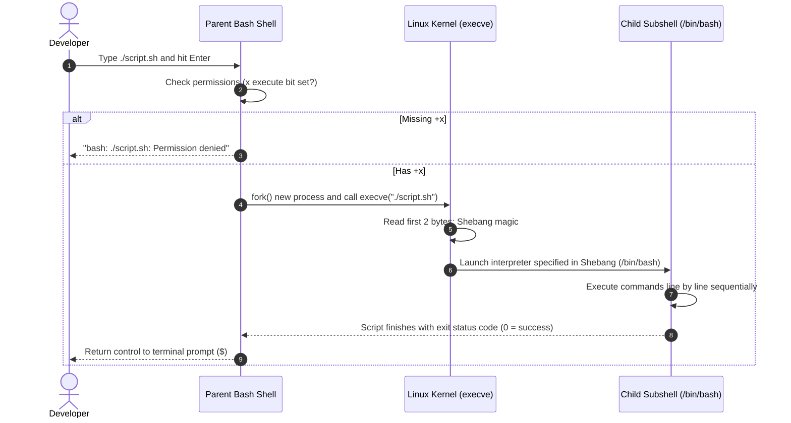

import { Callout } from 'fumadocs-ui/components/callout';

<BashSimulator />

# Bash Scripting: The Universal Automation Substrate

Whether you are provisioning Kubernetes clusters in the cloud, configuring Docker containers, building CI/CD deployment pipelines in GitHub Actions, or automating local development environments, **Bash is the universal glue of software engineering and DevOps**.

Graphical user interfaces change, web frameworks come and go, but the Unix Bourne Again Shell (`bash`) has remained the foundational command interface since 1989. Mastering shell scripting turns tedious, manual terminal commands into repeatable, automated infrastructure scripts.

This curriculum combines the energetic, hands-on teaching style of **NetworkChuck's classic series** (*"You need to learn BASH Scripting RIGHT NOW!!"*) with rigorous computer science fundamentals, defensive production practices, and interactive simulations.

---

## Complete Curriculum Knowledge Map

Follow the progression below from writing your first single-line automation script to engineering defensive production automation engines.



---

## The Lessons at a Glance

| Module | Core Concepts | Featured Script / Project |
| :--- | :--- | :--- |
| [**01. Foundations & Setup**](/docs/developer-tools/bash-scripting/01-fundamentals-and-setup) | Shebang `#!/bin/bash`, `echo`, `sleep`, chmod permissions, exit status `$?`, execution modes | `himom.sh` (Ep 1) |
| [**02. Variables & Input**](/docs/developer-tools/bash-scripting/02-variables-and-input) | Variable syntax, `read` prompts, positional args `$1`, `$#`, `$@`, command substitution `$(cmd)` | `bestdayever.sh` / Bash Butler (Ep 2) |
| [**03. Arithmetic & Built-ins**](/docs/developer-tools/bash-scripting/03-arithmetic-and-builtins) | Math expansions `$(( ))`, `$RANDOM` range math, system variables (`$USER`, `$PWD`, `$SECONDS`), `export` | `getrichquick.sh` / Millionaire Predictor (Ep 3) |
| [**04. Conditionals & Logic**](/docs/developer-tools/bash-scripting/04-conditionals-and-logic) | `if/elif/else/fi`, `[ ]` vs `[[ ]]`, string/number/file tests, compound booleans `&&` / `||`, `case` | `eldenring.sh` Interactive RPG (Ep 4) |
| [**05. Loops & Iteration**](/docs/developer-tools/bash-scripting/05-loops-and-iteration) | `while`, `until`, `for in`, C-style `for (( ))`, ranges `{1..10}`, reading files line-by-line, `break` | `pushups.sh` & Subnet Ping Sweeper (Ep 5) |
| [**06. Functions & Modularity**](/docs/developer-tools/bash-scripting/06-functions-and-modularity) | Function definitions, argument scoping, `local` keyword, stdout capture vs exit codes, sourcing files | Color Logging Library & Reusable Toolkit |
| [**07. Streams, Redirection & Pipes**](/docs/developer-tools/bash-scripting/07-redirection-pipes-process) | File descriptors 0, 1, 2, `2>&1`, `/dev/null`, Heredocs (`<<EOF`), `tee`, process substitution `<( )` | Stream Aggregator & Pipeline Filter |
| [**08. Defensive Scripting**](/docs/developer-tools/bash-scripting/08-defensive-scripting-and-debugging) | `set -euo pipefail`, signal trapping (`trap`), `bash -x` tracing, quoting pitfalls, lockfiles with `flock` | Hardened Deployment Runner |
| [**09. Real-World Projects**](/docs/developer-tools/bash-scripting/09-real-world-projects) | Complete full-length scripts ready for production, administration, and game development | Elden Ring Boss Gauntlet, Push-Up Coach, Automated Backup, Server Monitor |
| [**Bash Cheatsheet**](/docs/developer-tools/bash-scripting/cheatsheet) | Comprehensive syntax tables, special parameter reference, expansion cheat sheet, one-liners | Production Quick Reference |

---

## How Scripts Run: The Mental Model

When you run a command like `ls` or execute a script `./myscript.sh`, the Linux kernel and Bash interpreter follow a strict process lifecycle:



### The 4 Ways to Run a Script in Linux

Understanding the difference between these execution modes prevents subtle environment variable bugs:

1. **`./myscript.sh` (Direct Execution)**:
   - Requires execute permission (`chmod +x myscript.sh`).
   - Uses the interpreter path defined in the **Shebang line** (`#!/bin/bash`).
   - Runs in a separate **child subshell process**. Variables defined inside will not alter your current parent terminal.

2. **`bash myscript.sh` (Explicit Interpreter Call)**:
   - Does **not** require execute permission (only read permission `r` is needed).
   - Ignores the Shebang and forces the script to run via `/bin/bash`.
   - Runs in a separate **child subshell process**.

3. **`source myscript.sh` or `. myscript.sh` (Sourcing)**:
   - Does **not** create a subshell process!
   - Runs every command directly inside your **current shell environment**.
   - Any variables, functions, or directory changes (`cd`) created in the script persist in your active terminal after it finishes.

4. **`bash -x myscript.sh` (Debug Execution)**:
   - Runs the script in xtrace mode, echoing every command and evaluated expression to `stderr` with a `+` prefix before executing it.

---

## Setting Up Your Lab Environment

To follow along with all exercises, choose one of these environments:

### Option A: Cloud Linux VM (Recommended for Zero-Risk Practice)
Cloud VPS providers (such as Akamai Linode, DigitalOcean, or AWS EC2) let you spin up a pristine Ubuntu virtual machine in seconds for fractions of a cent per hour:
```bash
# Connect via SSH from your local terminal
ssh root@<YOUR_VM_IP_ADDRESS>
```
*When finished practicing, simply delete the instance.*

### Option B: Windows Subsystem for Linux (WSL 2)
On Windows 10/11:
```powershell
wsl --install -d Ubuntu
```
Open the installed Ubuntu terminal. Your Windows filesystem is mounted under `/mnt/c/`.

### Option C: macOS Terminal
macOS ships with Zsh as default. You can open Terminal and run `bash` to enter a Bash session, or install the latest modern GNU Bash via Homebrew:
```bash
brew install bash
```

### Option D: Docker Container
If you already have Docker installed:
```bash
docker run -it --rm ubuntu:24.04 bash
```
You get an instant, disposable sandbox environment.

---

## Interactive Simulator Instructions

Use the interactive simulator at the top of this page to test script mechanics before jumping into the lessons:
- **Script Runner**: Select any of the featured scripts, adjust arguments and interactive stdin values, and click **Run Script**. Notice how permission flags, terminal delay intervals, and exit codes work in real time.
- **Terminal Shell**: Type commands just like a real Linux machine (`ls -l`, `cat himom.sh`, `chmod +x himom.sh`, `./himom.sh`, `echo $USER`, `help`).
- **Syntax Tester**: Experiment with boolean tests (`[ 42 -gt 10 ]`), arithmetic expansions (`$(( ($RANDOM % 15) + 32 ))`), and parameter fallback syntax (`${PORT:-8080}`).

Ready to build your first automation script? Proceed to [**Lesson 1: Foundations & Setup**](/docs/developer-tools/bash-scripting/01-fundamentals-and-setup).
