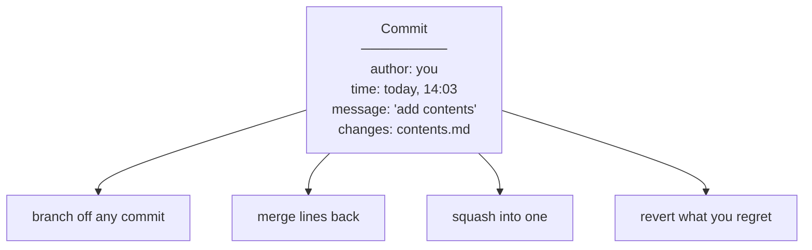
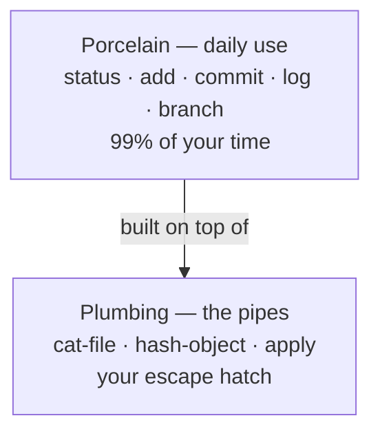
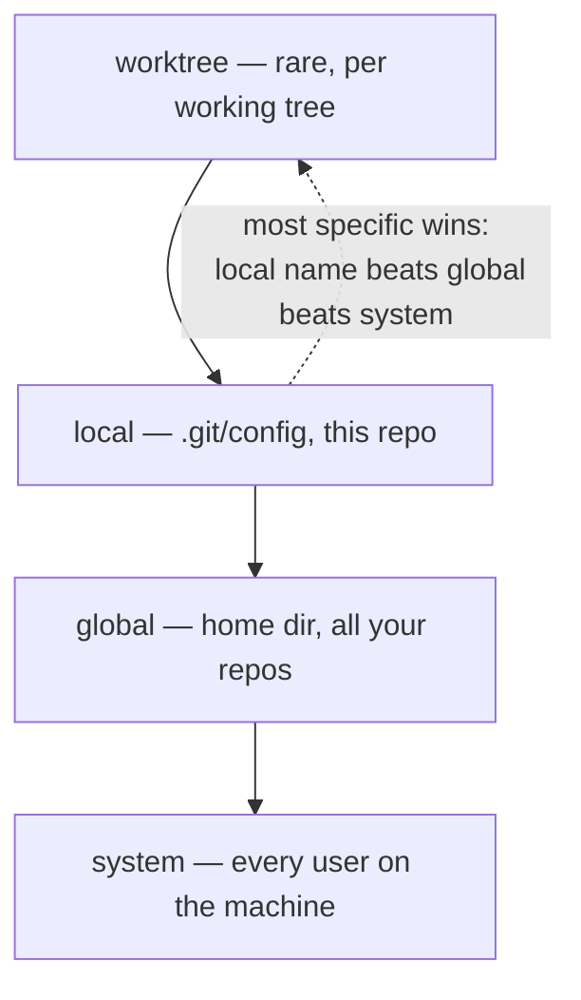
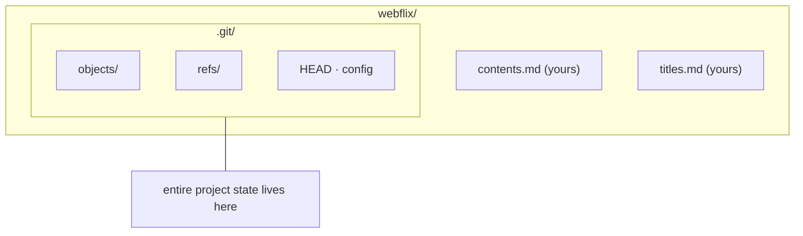
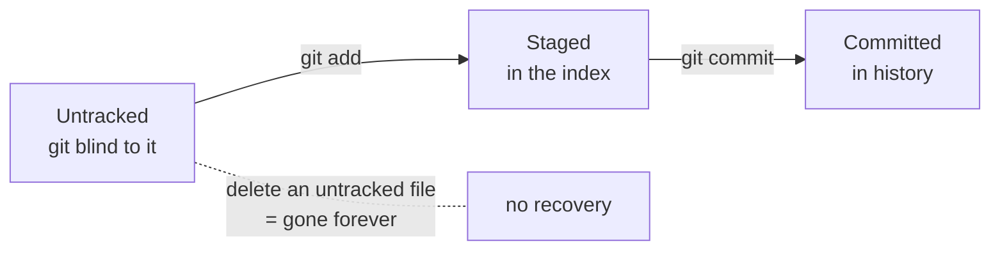
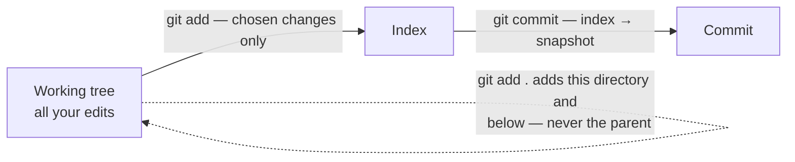
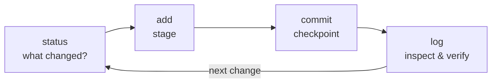
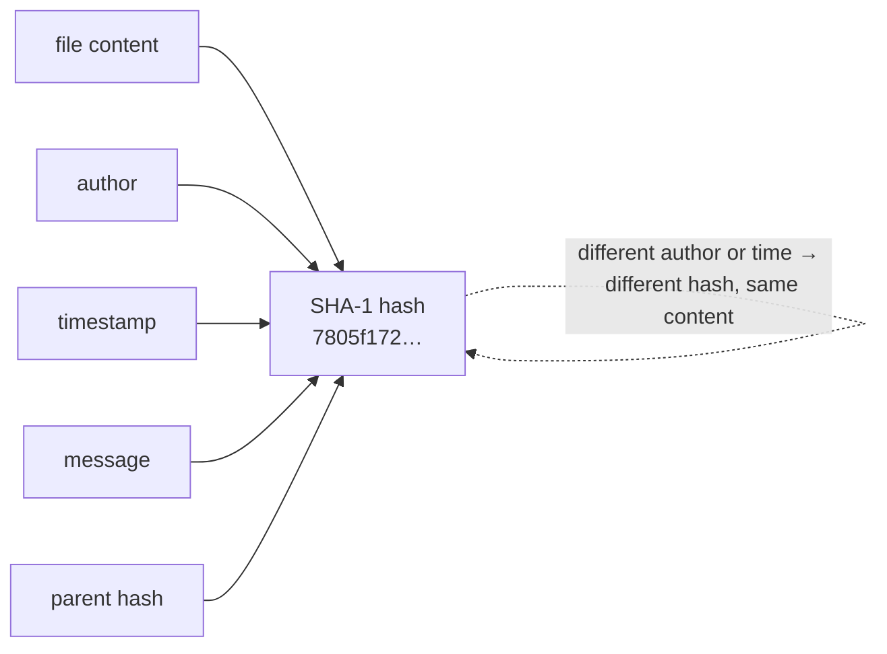
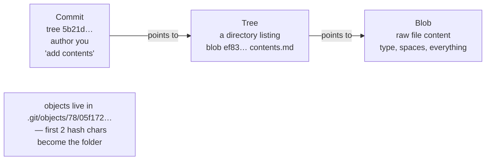
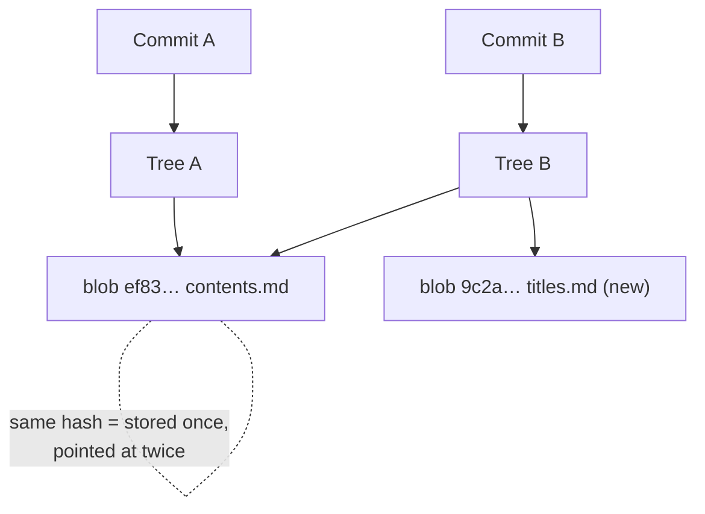

## Module 01 · Foundations — Git is a history of commits.

In 2005, after a licensing dispute with BitKeeper, Linus Torvalds wrote git in five days. Today it is the de facto standard — not GitHub, not GitLab. Those are just companies that use git.

### Core idea

A **commit** is a set of changes tied to an author, a time of day, and a message. That single idea powers everything: you can add as many commits as you want, branch off any commit to start a new line of work, merge lines back together, squash commits into one, edit messages, and revert commits you regret. Git is complicated software with a simple interface — and understanding the commit is the first win.

### Steps

1. Make changes to files in your project.
2. `git commit` ties those changes to you and a moment in time.
3. Repeat — each commit is a checkpoint you can return to.

| Example | Takeaway |
| --- | --- |
| You finish a feature and commit it. | The exact state of your project is saved with your name on it. |
| Two people commit the same file contents. | Their commits still differ — time and author are baked in. |
| You commit "fix bug" twice with identical changes. | Still two distinct commits — each has its own moment in time. |

- **Analogy:** A commit is a dated, signed receipt for your project's state.
- **Misconception:** Git is GitHub. No — GitHub hosts git repositories; git is the tool itself.
- **Why it matters:** Every later command — merge, revert, bisect — operates on commits.

> **Quick recall — who wrote git, and how fast?** Linus Torvalds wrote git in five days in 2005, after a BitKeeper licensing dispute.

**Quiz — which fact about a commit is baked into it permanently?** Author and time *(author, time, message, and the changes themselves are all part of the commit record)* — not your text editor, not your folder path.

🔗 Next: [Module 02 — porcelain vs plumbing](#module-02--foundations-porcelain-for-work-plumbing-for-understanding)

## Module 02 · Foundations — Porcelain for work, plumbing for understanding.

Git splits its commands into two worlds — the friendly front-of-house and the raw pipes underneath. You will live in one and occasionally peak into the other.

### Core idea

**Porcelain** commands are the high-level ones you use 99% of the time: `commit`, `status`, `log`, `branch`. **Plumbing** commands are low-level tools like `cat-file` and `hash-object` that talk to git's raw internals. Most developers never touch plumbing professionally — but understanding it is what makes porcelain stop feeling like magic. When something goes truly wrong, dropping down to the plumbing is your escape hatch.

### Steps

1. Learn porcelain first: status, add, commit, log.
2. Use `man git-<command>` — read the friendly manual.
3. When curious or stuck, inspect with plumbing like `cat-file`.

| Example | Takeaway |
| --- | --- |
| You run `git log` daily. | That's porcelain — a readable view of raw commit data. |
| Even git's author can't read the `git-tag` man page. | Docs being dense doesn't mean the command is hard. |
| Your branch is mysteriously broken. | Plumbing like `cat-file` lets you inspect objects directly. |

- **Analogy:** Porcelain is the car dashboard; plumbing is the engine bay.
- **Misconception:** Plumbing is "advanced git you must master first". You don't — but it demystifies everything.
- **Why it matters:** Module 09 uses plumbing to open real commits — that's the big "aha".

> **Quick recall — name the two command layers.** Porcelain = high-level daily commands; plumbing = low-level object tools.

**Quiz — where does `git cat-file` belong?** Plumbing *(cat-file reads raw objects — a classic plumbing command used to inspect internals)*.

🔗 Next: [Module 03 — configure your identity](#module-03--foundations-config-is-just-a-file-of-keyvalue-pairs)

## Module 03 · Foundations — Config is just a file of key–value pairs.

Before your first commit, git needs to know who you are. The config system looks intimidating and turns out to be a plain text file.

### Core idea

`git config` stores settings as keys and values in text files. It's the one command that keeps the old dashed style: `git config --global user.name "…"`. **Global** config lives in your home directory (settings for you everywhere); **local** config lives inside the repo's `.git/config` (settings for this project only). When git reads config it combines them, most specific wins: worktree, then local, then global, then system. You can `--get`, `--unset` a key, `--unset-all` duplicates, or `--remove-section` to wipe a whole `[section]`. Git even tolerates duplicate keys — the last value simply wins.

### Steps

1. Set identity once: `git config --global user.name` and `user.email`.
2. Inspect with `git config --list --local` (or `--global`).
3. Remove with `--unset section.key`; whole sections with `--remove-section`.

| Example | Takeaway |
| --- | --- |
| You set your name and email once, globally. | Every repo you touch gets correct attribution. |
| "Global" sounds machine-wide. | It's only your user's home directory — local-global, not global-global. |
| A key is set three times at different levels. | Only the most specific one takes effect. |

- **Analogy:** Config is a set of sticky notes: one on your desk (global), one on the project folder (local).
- **Misconception:** Config is scary. It's one of the simplest things in git — people avoid it, so it stays mysterious.
- **Why it matters:** Default branch name, pull behavior, identity — all live here (m15, m18).

> **Quick recall — order the four config locations from most to least specific.** worktree → local → global → system.

**Quiz — system says "prime", global says "lane", local says "tj". Which username is used?** tj *(local beats global beats system — the repo's own value always wins)*.

🔗 Next: [Module 04 — repositories and .git](#module-04--foundations-a-repo-is-a-folder-plus-git)

## Module 04 · Foundations — A repo is a folder plus .git.

The first command of any project: `git init`. What it actually creates is smaller and less magical than you think.

### Core idea

A **repository** ("repo") is just a directory holding your project files — plus one hidden `.git` folder. `git init` creates that folder and nothing else. The eye-opener: `.git` is *the entire state of your project's history*. Branches, commits, settings — everything lives in there as ordinary files (sample hooks, an empty `objects/` dir, a `HEAD` file). Delete `.git` and you have plain files with no history; copy it elsewhere and you've moved the whole repo.

### Steps

1. `mkdir webflix && cd webflix` — an ordinary empty folder.
2. `git init` — creates the hidden `.git` directory.
3. `ls -la` to see it; `cat .git/HEAD` to peek inside.

| Example | Takeaway |
| --- | --- |
| You init a repo per project. | One repo ≈ one project is the normal rule. |
| Git feels like one program with a database. | It's literally just files in a hidden folder. |
| You delete `.git` "to clean up". | All history is gone — the folder was the history. |

- **Analogy:** `.git` is the folder's memory — files are the body, .git is the brain.
- **Misconception:** git init "converts" your files somehow. It only adds a folder; your files are untouched.
- **Why it matters:** Modules 9–10 open .git up — that's where git stops being magic.

> **Quick recall — what does git init actually create?** A hidden .git directory — the entire state of the repo. Nothing else changes.

**Quiz — what happens to your files if you delete .git?** Files stay, history gone *(files remain on disk — but all history, branches, and config vanish)*.

🔗 Next: [Module 05 — the three file states](#module-05--foundations-untracked-staged-committed)

## Module 05 · Foundations — Untracked, staged, committed.

The status command is your dashboard — and the difference between these states is the difference between safe and sorry.

### Core idea

Every file sits in one of three states. **Untracked**: git has never seen it — it isn't in the index, and git won't protect it. **Staged**: marked for the next commit in the **index** (the staging area). **Committed**: safely stored as a snapshot. `git status` shows you which is which. The dangerous one is untracked: deleting an untracked file loses it forever — there is no history to recover it from. The presenter calls accidentally removing untracked files "a right of passage" and "emotionally bruising." Check status before you clean.

### Steps

1. Create a file → run `git status` → see "untracked".
2. Stage it → status shows it under "changes to be committed".
3. Commit → status shows a clean working tree.

| Example | Takeaway |
| --- | --- |
| New file shows as untracked. | Add it before committing or it's left out. |
| A staged file is "saved", right? | Not yet a commit — still only in the index, not history. |
| You `rm -rf` an untracked draft. | Nothing anywhere can bring it back. |

- **Analogy:** Untracked = on the desk; staged = in the outbox; committed = filed in the cabinet.
- **Misconception:** "I saved the file, git has it." Only the index and commits count — saving isn't tracking.
- **Why it matters:** Status/add/commit is "half of git" — the loop you'll run thousands of times.

> **Quick recall — which state is unrecoverable if deleted?** Untracked — git has no record of the file at all.

**Quiz — what does an untracked file mean?** Never added to the index *(untracked = never added to the index and never committed — git knows nothing about it)*.

🔗 Next: [Module 06 — staging and the index](#module-06--foundations-git-add-chooses-what-to-commit)

## Module 06 · Foundations — git add chooses what to commit.

Without staging, every commit would include every file in the repo. The index is what lets you commit in careful slices.

### Core idea

The **index** (staging area) is the list of exactly what your next commit will contain. `git add <file>` puts a file in it; `git add .` adds everything in the current directory *and below* — it does *not* reach files in parent directories, which surprises people. Beyond whole files, `git add -p` stages in **hunks** — blocks of nearby changed lines — letting you stage one hunk and skip another. The presenter personally prefers doing that split in a GUI editor, but the plumbing is worth knowing.

### Steps

1. `git add contents.md` — stage one file.
2. `git status` — confirm what's staged before committing.
3. `git add -p` to choose hunks when a file has mixed changes.

| Example | Takeaway |
| --- | --- |
| Edit three files, add one, commit. | The commit contains exactly one file's changes. |
| Run `git add .` from a subfolder. | Files in the parent stay unstaged. |
| One file holds a fix plus debug junk. | `add -p` stages the fix hunk only. |

- **Analogy:** The index is a shopping basket — add puts items in; commit checks out.
- **Misconception:** `git add .` means "everything in the repo". It means "everything at or below here".
- **Why it matters:** Clean, focused commits (m27's squash workflow) start with deliberate staging.

> **Quick recall — what does the index hold before a commit?** Exactly the changes chosen for the next commit.

**Quiz — from `foo/`, does `git add .` stage files in `foo/../bar/`?** No, siblings stay unstaged *(add . covers the current directory and below — siblings and parents are untouched)*.

🔗 Next: [Module 07 — commit and read the log](#module-07--foundations-commit-it-then-read-it-with-log)

## Module 07 · Foundations — Commit it, then read it with log.

"status, add, commit — that's half of git." The other half of the daily loop is reading history well.

### Core idea

`git commit -m "message"` turns the index into a snapshot in history. Then `git log` is your window into that history — who committed, when, and what. The flags matter: `--oneline` for a compact list, `--graph` to draw branch lines, `--parents` to show a commit's parents (a merge has two), and decorations to see where `HEAD` and branches point. Normally log opens in a pager (like `less`); piping output or using `git --no-pager log` prints straight to the terminal.

### Steps

1. `git commit -m "add contents"` — message first word matters for the course CLI.
2. `git status` — working tree should be clean.
3. `git log --oneline --graph` — read history at a glance.

| Example | Takeaway |
| --- | --- |
| Commit, then log to check. | You see your message, author, and time as recorded. |
| Log "hangs" the terminal. | That's a pager; `--no-pager` or piping prints directly. |
| First commit in a repo. | It has no parent — log --graph shows a single orphan line. |

- **Analogy:** Log is the project's diary; every commit adds a dated entry.
- **Misconception:** "Half of git" is a joke — but status/add/commit really is the loop you'll run forever.
- **Why it matters:** Log's --graph view becomes essential for reading merges (m13) and rebases (m14).

> **Quick recall — the three-command daily loop?** status → add → commit (with log to inspect).

**Quiz — which log flag draws the branch structure?** --graph *(`--graph` renders ASCII branch lines showing where commits diverged and merged)*.

🔗 Next: [Module 08 — why hashes differ](#module-08--foundations-every-commit-has-a-unique-hash)

## Module 08 · Foundations — Every commit has a unique hash.

Two people can commit identical content and get different hashes. Understanding why unlocks everything about how git works.

### Core idea

Each commit gets a **hash** — a SHA-1 fingerprint computed from its content *plus* author, timestamp, message, and parent hash. Same inputs → same hash, always: hashes are deterministic, recreated the same way every time. But since timestamps and authors differ between people, "identical" repos still get different hashes. A true collision would require the same content, author, time, and parent — practically impossible. The presenter's line: git is "the original blockchain."

### Steps

1. Commit something → `git log` shows its hash.
2. Realize the hash encodes more than file content.
3. Only ~4 characters are needed to reference it — git disambiguates.

| Example | Takeaway |
| --- | --- |
| Commit the same file twice. | Different times → different hashes. |
| Your repo and a friend's match perfectly. | Hashes still differ — author and clock differ. |
| Try to engineer a hash collision. | You'd need identical content, author, timestamp, message, and parent. |

- **Analogy:** A hash is a fingerprint of the whole moment — not just the file, but who, when, and from what.
- **Misconception:** "Careful! Two commits could get the same hash." Only with impossible-to-arrange identical inputs.
- **Why it matters:** Objects (m9) are stored *by* hash — the whole .git store is keyed on this.

> **Quick recall — list three inputs to a commit hash.** Content, author, timestamp (plus message and parent hash).

**Quiz — which does NOT affect a commit's hash?** Preferred text editor *(your editor has zero effect — but author, timestamp, content, and parent all do)*.

🔗 Next: [Module 09 — objects: commit, tree, blob](#module-09--foundations-commit--tree--blob-all-just-files)

## Module 09 · Foundations — Commit → tree → blob, all just files.

The presenter's big eye-opener: a commit is a file you can open, pointing at a directory listing, pointing at file contents. Three object types, one chain.

### Core idea

Everything git stores lives in `.git/objects` as compressed files, named by their hash. A **commit object** holds the message, author, timestamp, and a **tree** hash. A **tree object** represents a directory: a list of names, each pointing to another tree or a **blob**. A **blob object** holds raw file content. The chain is walkable by hand: `git cat-file -p <commit>`, grab the tree, `cat-file` the tree, grab a blob, `cat-file` the blob — and you're reading your file through plumbing alone. Hashes are sharded into two-character subfolders to keep directories small (the transcript's "inode busting" aside).

### Steps

1. Find your commit's file in `.git/objects` — same hash as in log.
2. `git cat-file -p <hash>` — read the commit: tree, author, message.
3. Cat the tree → find the blob → cat the blob → see your file's content.

| Example | Takeaway |
| --- | --- |
| You commit contents.md. | Three objects appear: commit, tree, blob. |
| You try to open a commit file in an editor. | Compressed bytes — you need `cat-file` to decompress. |
| A repo with thousands of objects. | Two-char subfolders keep any single directory small. |

- **Analogy:** A commit is a labeled box; the tree is its packing list; each blob is an item inside.
- **Misconception:** Git is a database you can't touch. It's a folder of readable (if compressed) objects.
- **Why it matters:** Once objects make sense, merge, rebase, and revert stop being scary (m13–m14, m29).

> **Quick recall — name the three object types and what each stores.** Commit = snapshot + metadata; tree = directory listing; blob = file content.

**Quiz — which object stores actual file content?** Blob *(blobs hold raw file bytes — trees only list names pointing to them)*.

🔗 Next: [Module 10 — snapshots, not diffs](#module-10--foundations-git-stores-snapshots-not-diffs)

## Module 10 · Foundations — Git stores snapshots, not diffs.

Almost everyone assumes git saves "what changed" per commit. It doesn't — and the proof is sitting in .git.

### Core idea

Each commit stores a **full snapshot** — every file — not a delta from the previous one. Each commit has a unique tree, and each tree points to blobs. The trick that keeps git small: content is addressed by hash, so an unchanged file produces the *same blob hash* and is simply pointed at again. Add titles.md in commit B, and B's tree lists two entries — but the contents.md blob hash is identical to commit A's. A commit "stores the whole history" in the sense that it references everything; deduplication keeps it cheap. Compression and packing shrink it further.

### Steps

1. Commit contents.md (A), then titles.md (B).
2. Cat B's tree: two blobs — contents.md's hash matches A's exactly.
3. That's the proof: same hash = same stored content, not a re-copy.

| Example | Takeaway |
| --- | --- |
| You commit a new file. | A fresh blob is stored; other files are re-pointed. |
| "Git must store diffs — otherwise it'd be huge." | It stores snapshots; hashing dedupes the cost. |
| You change one byte of a huge file. | A brand-new blob is stored — unchanged files stay shared. |

- **Analogy:** Each commit is a full photo of the room; the photo album shares prints of unchanged walls.
- **Misconception:** "A commit stores the changes made in it." It stores references to a full tree; dedup does the rest.
- **Why it matters:** Snapshot thinking explains why checkout is fast and why rebases rewrite hashes (m14).

> **Quick recall — snapshot or delta, and how does git stay small?** Snapshots; unchanged content gets the same hash, so blobs are stored once and pointed at many times.

**Quiz — you commit titles.md. What happens to contents.md's blob?** Reused via same hash *(identical content means identical hash — the new tree simply points at the existing blob)*.

🔗 Next: [Branches — Module 11](/docs/developer-tools/git/02-branches-and-history)
