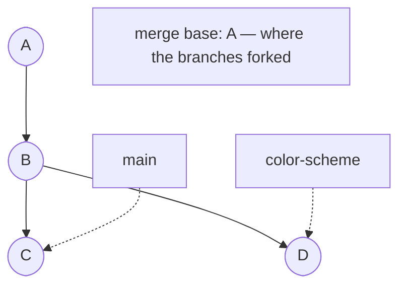
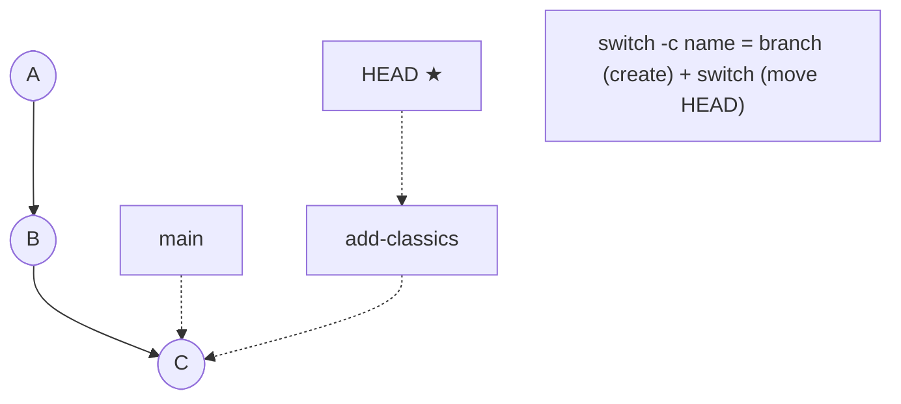
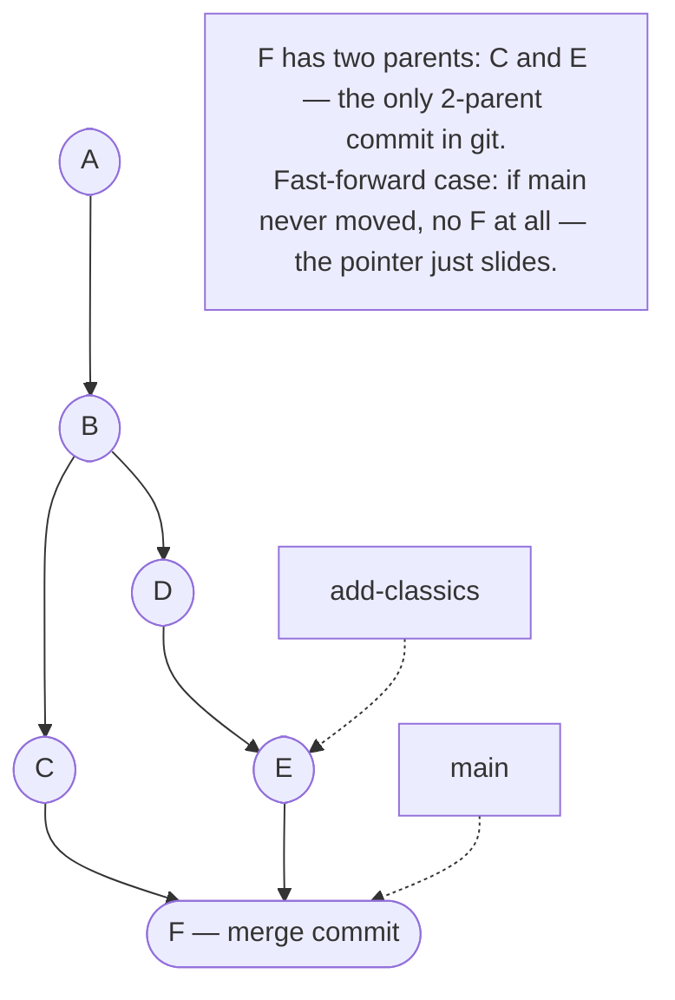
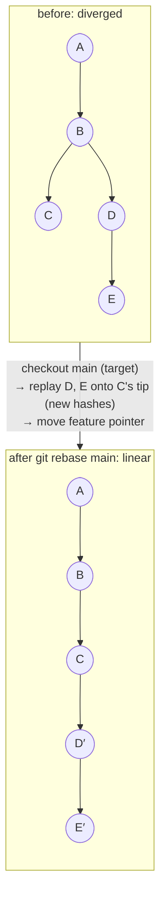
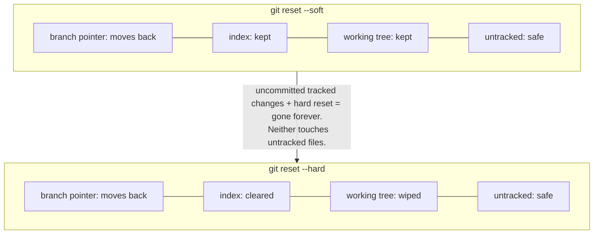

## Module 11 · Branches — A branch is a pointer. That's it.

People imagine branches as heavy copies of a project. They are one small file containing a commit hash.

### Core idea

A **branch** is a mutable pointer to a commit — literally a file in `.git/refs/heads` containing a hash. The **tip** is the latest commit on a branch. Branches exist so you can track different lines of work separately: experiment on `color-scheme`, keep `main` stable, merge back when happy or delete the branch if not. Because a branch is just a pointer, branching is lightweight and cheap. `git branch` lists branches and shows where you are; `git branch -m old new` renames. When two branches split from a common commit, that commit is the **merge base** — a term you'll need for every merge and rebase.

### Steps

1. `git branch` — see branches and your current one.
2. Branch names live in `.git/refs/heads/<name>` — cat one.
3. Track tips and merge bases when reading any branch diagram.

| Example | Takeaway |
| --- | --- |
| You branch to try a new color scheme. | main stays untouched while you experiment. |
| Branching "copies the project". | It writes one 41-byte file — a hash. |
| Two branches point at the same commit. | Totally legal — pointers, not territories. |

- **Analogy:** A branch is a bookmark stuck in the book of commits — move it, add more, lose nothing.
- **Misconception:** Branches are expensive. They're pointers; the commits cost the same either way.
- **Why it matters:** Tips and merge bases are the vocabulary of merging (m13) and rebasing (m14).

> **Quick recall — what is a branch, physically?** A file containing the hash of its tip commit — a mutable pointer.

**Quiz — why do developers say branches are "cheap"?** They are just pointers *(creating one writes a single pointer file — no files are copied)*.

🔗 Next: [Module 12 — create and switch branches](#module-12--branches-create-switch-rename)

## Module 12 · Branches — Create, switch, rename.

One new branch does nothing until you're standing on it. Here's the modern way — and the classic way you'll still see everywhere.

### Core idea

`git branch name` creates a branch pointing at your current commit (HEAD) — but doesn't move you onto it. `git switch name` moves you; `git switch -c name` creates *and* switches in one step. The older twin is `git checkout -b name` — same effect, but checkout is a "grab bag" command that also does conflict-side checkouts, so git introduced `switch` for clarity. Rename with `git branch -m old new`. Your initial branch name comes from `init.defaultBranch` (the course sets `master`, GitHub prefers `main`); you can rename and reconfigure per-repo with local config.

### Steps

1. `git switch -c add-classics` — create and move in one step.
2. `git branch` — confirm the star moved to your new branch.
3. Commit there; `git log --oneline` shows it only on this branch.

| Example | Takeaway |
| --- | --- |
| `switch -c feature`, commit, done. | main never saw the change. |
| `git branch x` then commit. | The commit lands on the branch you're still on — x didn't move. |
| New repo says "master" but your team uses "main". | `branch -m` then set `init.defaultBranch`. |

- **Analogy:** branch = plant a flag; switch = walk to the flag; switch -c = plant it and stand on it.
- **Misconception:** checkout and switch are rivals. switch is just the clearer, newer tool for changing branches.
- **Why it matters:** Every workflow in the team half (m16+) assumes fluent branch hopping.

> **Quick recall — difference between git branch x and git switch -c x?** branch creates only; switch -c creates and moves HEAD onto it.

**Quiz — which command creates a branch AND moves you onto it?** git switch -c *(switch -c is the modern create-and-switch in one step)*.

🔗 Next: [Module 13 — merging branches](#module-13--branches-merging-and-the-merge-commit)

## Module 13 · Branches — Merging — and the merge commit.

Work on a branch is only useful once it's back on the main line. Two things can happen: a real merge commit, or a fast-forward.

### Core idea

When main and a feature branch have **diverging** commits, merging creates a special **merge commit** — the only commit with **two parents**. Git finds the **merge base** (common ancestor), combines both sides, and records a commit pointing at both tips. But if main hasn't moved since you branched — main's tip *is* the merge base — git just slides main's pointer forward: a **fast-forward merge**. No new commit, no branch mark in the graph. Knowing which happened tells you how to read history: two parents = true merge; a straight line = fast-forward.

### Steps

1. `git switch main` — be on the branch receiving changes.
2. `git merge add-classics` — watch for "fast-forward" in the output.
3. `git log --oneline --graph --parents` — see the two-parent diamond.

| Example | Takeaway |
| --- | --- |
| Feature done, merge to main. | A merge commit ties both histories together. |
| Merge output says "fast-forward". | No commit was created — the pointer just moved. |
| Both branches edited the same line. | The merge stops — that's a conflict (m23). |

- **Analogy:** A merge commit is a knot tying two threads; a fast-forward is just sliding a bead along one thread.
- **Misconception:** Fast-forward "sounds like rebasing". It isn't — no commits are replayed or rewritten.
- **Why it matters:** Two-parent commits are why rebase (m14) exists: some teams want the diamond gone.

> **Quick recall — what makes a merge commit unique in git?** It's the only commit with two parents — one per merged branch tip.

**Quiz — when does git fast-forward instead of creating a merge commit?** Main hasn't moved *(if main's tip IS the merge base, git can simply slide the pointer — no new commit)*.

🔗 Next: [Module 14 — rebase, replayed](#module-14--branches-rebase-moves-your-commits)

## Module 14 · Branches — Rebase moves your commits.

The internet's most feared command is three mechanical steps. Watch them happen and the fear evaporates.

### Core idea

On a feature branch, `git rebase main` does exactly this: (1) check out main — the **target**; (2) replay the feature branch's commits one at a time onto main's tip; (3) move the feature pointer to the new tip. D and E become D′ and E′ with **new hashes** — a changed parent means a changed SHA — and history is now linear, ready for a fast-forward merge with zero merge commits. The danger: rebasing **rewrites history**. Never rebase a public branch others rely on — when they pull, histories clash. Rebase your own feature onto public branches; the reverse ruins everyone's week.

### Steps

1. `git switch feature` — rebase always runs from the moved branch.
2. `git rebase main` — target is checked out, commits replayed.
3. Confirm with `git log --oneline --graph`: linear, new SHAs.

| Example | Takeaway |
| --- | --- |
| main moved while you worked; you rebase. | Your commits now sit on the latest code. |
| Same changes, same messages — different hashes after rebase. | Parent changed, so the SHA must change. |
| You rebase a branch someone else pulled. | Their history no longer matches — chaos (m25 shows the ours/theirs flip). |

- **Analogy:** Rebase uproots your three fence posts and replants them at the new property line.
- **Misconception:** "Rebase is evil." Skill saws aren't evil — untrained use is. Know what it rewrites.
- **Why it matters:** Rebase-then-squash (m27) is the presenter's core team workflow.

> **Quick recall — the three mechanical steps of git rebase main?** Checkout main (target) → replay feature's commits onto its tip → move feature pointer.

**Quiz — why do rebased commits get new hashes?** Their parent changed *(parent is part of the hash — a new parent forces a new SHA)*.

🔗 Next: [Module 15 — reset, soft and hard](#module-15--branches-reset-soft-vs-hard)

## Module 15 · Branches — Reset: soft vs hard.

Committed something you regret? Reset moves your branch back — the flag decides how much of your work survives.

### Core idea

`git reset` moves the current branch back to a committish (a hash, or `HEAD~1` = one step back). **Soft** reset (`git reset --soft HEAD~1`) rewinds the branch but leaves your changes staged in the index and working tree — perfect for "that commit was wrong, let me redo it." **Hard** reset (`git reset --hard`) also wipes the index and working tree. Danger zones: hard reset deletes *uncommitted* changes forever — but untracked files are untouched, since git doesn't know them. And don't confuse reset with `git commit --amend`, which edits the last commit's message/content (also rewriting its hash).

### Steps

1. `git reset --soft HEAD~1` — undo last commit, keep changes staged.
2. `git status` + `git diff --staged` — see what survived.
3. `git reset --hard` — full rewind; only when you mean it.

| Example | Takeaway |
| --- | --- |
| Wrong commit message; soft reset and recommit. | Changes survive, history is clean. |
| Hard reset "deletes everything". | Untracked files are invisible to it — they survive. |
| Day of uncommitted work, then `reset --hard`. | Lost for good — hard reset is a sledgehammer. |

- **Analogy:** Soft reset rewinds the film but leaves the reel; hard reset burns the reel.
- **Misconception:** "Hard reset deletes commits forever." Technically recoverable via reflog (m22) — but treat it as gone.
- **Why it matters:** Soft reset is the escape hatch when you commit during a rebase by mistake (m25).

> **Quick recall — soft vs hard, what does each keep?** Soft keeps index + working tree; hard clears both. Neither touches untracked files.

**Quiz — you have unstaged edits and run `git reset --hard`. Outcome?** Edits are lost forever *(hard reset wipes tracked, uncommitted changes — they cannot be recovered from the working tree)*.

🔗 Next: [Team — Module 16](/docs/developer-tools/git/03-team-and-remotes)
