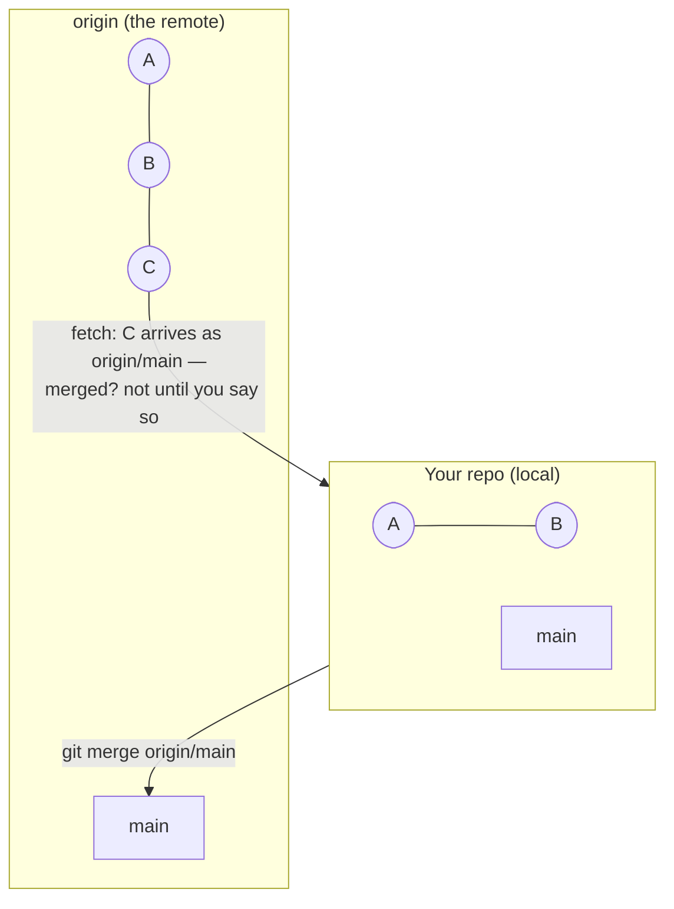
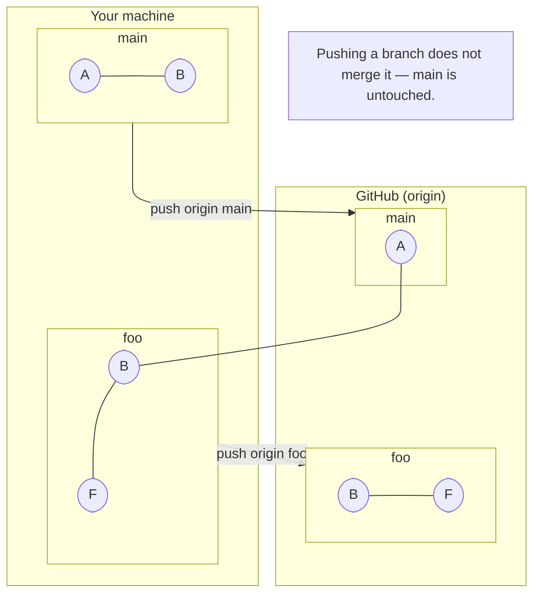
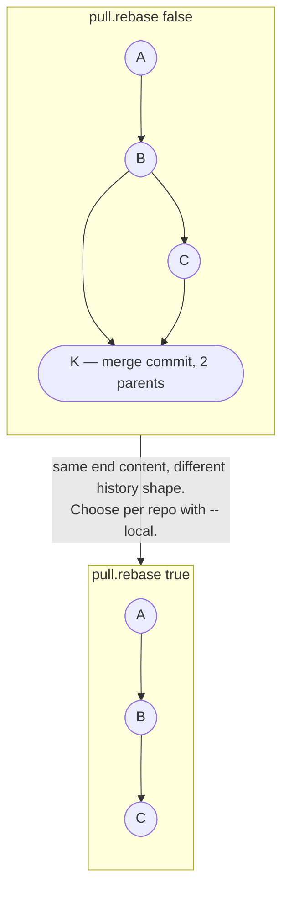
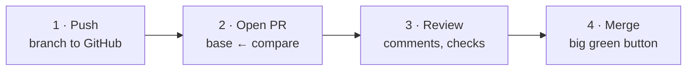
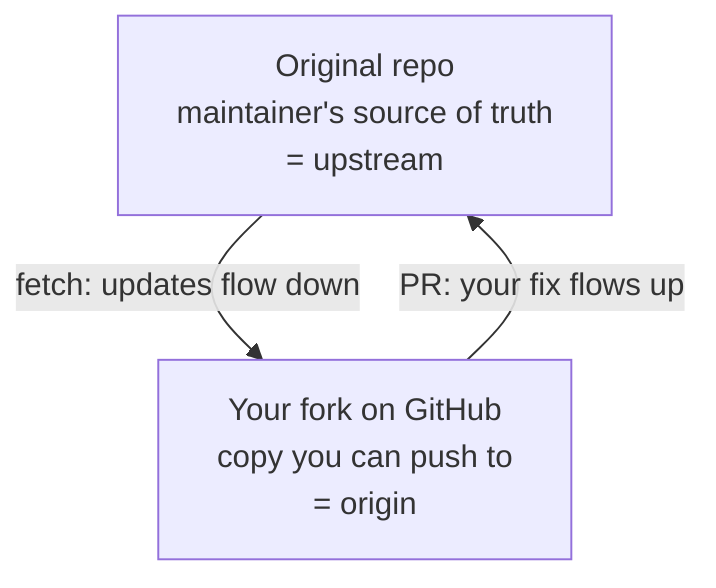

## Module 16 · Team — Remotes are just other repos.

Coworkers make changes you must begrudgingly accept. Remotes are how repos talk — and GitHub is just someone else's repo.

### Core idea

A **remote** is another repository — most often on a server, but it can be a sibling folder on your own machine. Nothing about git is centralized: it's a **distributed** version control system, and GitHub is "the source of truth" only by convention. Name the remote you treat as authoritative `origin`; fork-based teams add `upstream` pointing at the original project. Adding a remote (`git remote add origin <url>`) doesn't download anything — `git fetch` brings in the objects, stored as `origin/main`, a remote-tracking branch you can inspect and merge separately.

### Steps

1. `git remote add origin ../backup-repo` — any path or URL works.
2. `git fetch origin` — download objects; your branches don't move yet.
3. `git log origin/main` — inspect before merging anything.

| Example | Takeaway |
| --- | --- |
| Add origin as your GitHub URL. | Push and pull now have a destination. |
| A remote on your own disk (`../backup`). | Perfectly valid — remotes are repos, not servers. |
| Fetch completes, `git log` looks unchanged. | Correct — fetch never moves your branches, only origin/*. |

- **Analogy:** Adding a remote is exchanging addresses; fetch is receiving letters; merge is actually reading them.
- **Misconception:** GitHub is git's center. There is no center — every repo is a full peer.
- **Why it matters:** Push, pull, and PRs (m17–m19) are all built on remotes and fetch.

> **Quick recall — what does fetch do, and what doesn't it do?** Downloads remote objects into origin/*; it never changes your local branches.

**Quiz — after `git fetch origin`, where are the new commits?** On origin/main *(fetched commits land on remote-tracking branches like origin/main, not on yours)*.

🔗 Next: [Module 17 — push and GitHub](#module-17--team-push-your-branches-to-github)

## Module 17 · Team — Push your branches to GitHub.

Git is not GitHub — one is a tool, the other a product that hosts git repos. Push is how your local history reaches it.

### Core idea

`git push origin main` sends your branch's commits to the remote named origin and moves its `main` to match. Any branch pushes the same way: `git push origin feature` creates or updates `feature` on the remote. Authentication ties your local git to your GitHub account (the course suggests the GitHub CLI: `gh auth login`); `git ls-remote` quickly verifies a remote is reachable. Pushing isn't merging — a pushed feature branch just exists on GitHub until a pull request (m19) connects it to main. And if the remote has commits you don't, git will refuse the push until you reconcile.

### Steps

1. Create the repo on GitHub, copy its URL.
2. `git remote add origin <url>`, then `git ls-remote` to verify.
3. `git push origin main` — your history is now backed up off-machine.

| Example | Takeaway |
| --- | --- |
| Push main after committing. | GitHub now mirrors your history. |
| You push a feature branch and nothing "ships". | Push only uploads; merging happens via PR. |
| Push rejected — remote has new commits. | Fetch/pull first; never force-push shared branches (m27). |

- **Analogy:** Push is mailing your diary pages to the library shelf named after the branch.
- **Misconception:** "Push = deploy = merge." Push only copies a branch to the remote.
- **Why it matters:** Remote branches are what pull requests compare (m19).

> **Quick recall — what does git push origin foo actually update?** The remote's foo branch — and nothing else.

**Quiz — you pushed feature branch "foo" to GitHub. Is main changed?** No, foo just exists there *(push never merges — main moves only through a merge or PR)*.

🔗 Next: [Module 18 — pull and its config](#module-18--team-pull--fetch--merge)

## Module 18 · Team — Pull = fetch + merge.

One command grabs the remote's latest and integrates it. Which integration — merge or rebase — is a config choice.

### Core idea

`git pull origin main` is shorthand: fetch the remote's main, then integrate it. The integration step is configurable with `pull.rebase`: `true` replays your local commits on top (linear history — the presenter's preference, set globally), `false` merges and creates a merge commit when histories diverge. Modern git nags you to choose when branches diverge. Pick per-repo with `--local` when you want different behavior in one project — the presenter toggles it local, not global, to avoid forgetting it's on.

### Steps

1. `git pull origin main` — fetch + integrate in one step.
2. Diverged? Set `git config pull.rebase false` (merge) or `true` (rebase).
3. `git log --oneline` — see which integration happened.

| Example | Takeaway |
| --- | --- |
| Morning ritual: pull main. | You start from everyone's latest work. |
| Pull "sometimes makes a weird commit". | That's the configured merge — not a malfunction. |
| Local commits + remote commits diverge, no pull.rebase set. | Git stops and asks you to choose. |

- **Analogy:** Pull is fetch plus a decision: staple the new pages in (merge) or rewrite your chapter on top (rebase).
- **Misconception:** Pull is fundamentally different from fetch+merge. It literally is fetch plus an integration step.
- **Why it matters:** pull.rebase true is the presenter's default — linear history powers his whole workflow.

> **Quick recall — what two operations does pull combine?** Fetch (download) + integrate (merge or rebase, per pull.rebase).

**Quiz — setting `pull.rebase true` makes pull do what on divergence?** Replays your commits on top *(rebase pull replays your local commits onto the fetched tip — linear, no merge commit)*.

🔗 Next: [Module 19 — pull requests](#module-19--team-pull-requests-propose-review-merge)

## Module 19 · Team — Pull requests: propose, review, merge.

A PR is GitHub's UI around one idea: "please merge my branch into yours." Git itself doesn't know PRs exist.

### Core idea

A **pull request** proposes merging one branch into another and gives teammates a place to review. It's a GitHub feature — git has no `git pull-request`. The flow: push your branch (`git push origin add-classics`), open the PR on GitHub, set the **base** branch (main) and **compare** branch (yours), then wait for approval before merging. The presenter's tips: review your own diff on GitHub first — "editor blindness" means you'll catch mistakes you miss in your IDE; and check the maintainers actually want the change before writing it. Small teams may skip PRs entirely; the presenter does, solo.

### Steps

1. Commit on a branch; `git push origin <branch>`.
2. GitHub → New pull request → choose base and compare branches.
3. Review, discuss, then merge — or rebase/squash first (m27).

| Example | Takeaway |
| --- | --- |
| Feature pushed, PR opened, teammate approves, merge. | The standard team loop. |
| You re-read your diff on GitHub and spot a typo your IDE never showed. | New context catches old mistakes. |
| PR opened against the wrong base repo. | GitHub won't let you change base — close and reopen (the transcript's own blunder). |

- **Analogy:** A PR is a form submission: "here's my branch, please consider it for main."
- **Misconception:** PRs are a git feature. They're a hosting-platform feature — git is unaware.
- **Why it matters:** Forks (m21) exist so outsiders can open PRs on projects they can't push to.

> **Quick recall — why can't you open a PR from the git CLI alone?** PRs belong to GitHub/GitLab, not git — git only pushes branches.

**Quiz — before merging your PR, what does the presenter always do?** Reviews the diff on GitHub *(reviewing the diff on GitHub catches mistakes invisible in your own editor)*.

🔗 Next: [Module 20 — .gitignore](#module-20--team-gitignore-what-git-refuses-to-see)

## Module 20 · Team — .gitignore: what git refuses to see.

node_modules, passwords.txt, build output — the files that should never enter history. One text file draws the line.

### Core idea

A **.gitignore** file lists patterns git should not track. Basic rules: a bare name like `node_modules` matches anywhere; a leading slash (`/main.py`) anchors to the ignore file's directory; `*` wildcards match characters; a trailing slash marks directories; `!` negates — ignore a folder but keep one file inside. You can nest .gitignore files in subdirectories (nice for monorepos), and `.git/info/exclude` holds *personal* ignores that never reach teammates — perfect for your own out.txt scratch files. Gotcha: files already staged or committed stay tracked; unstage them (`git restore --staged`) before the ignore takes effect.

### Steps

1. Create `.gitignore`; add `node_modules/` and `secrets/`.
2. `git status` — ignored files no longer appear as untracked.
3. Personal ignores go in `.git/info/exclude`, not the shared file.

| Pattern | Meaning |
| --- | --- |
| `node_modules` | matches anywhere |
| `/main.py` | root of this dir only |
| `*.log` | wildcard |
| `build/` | directory |
| `!keep.txt` | negate — keep this one |

Already-tracked files ignore the ignore — unstage them first.

| Example | Takeaway |
| --- | --- |
| Ignore node_modules before the first commit. | Thousands of files never enter history. |
| Add `bar` to .gitignore, but bar.md stays listed. | It was already tracked — ignores only affect unseen files. |
| Ignore a whole dir but whitelist one file with `!`. | The negation must come after the ignore rule. |

- **Analogy:** .gitignore is a do-not-enter list at the repo door; .git/info/exclude is the note on your own desk.
- **Misconception:** gitignore deletes or hides tracked files. It only prevents untracked ones from being seen.
- **Why it matters:** Leaked passwords.txt in history is forever — git never forgets what it committed.

> **Quick recall — where do personal, share-nothing ignores go?** In .git/info/exclude — local to your repo copy, never pushed.

**Quiz — which pattern ignores main.py only at the ignore file's level?** /main.py *(a leading slash anchors the pattern to the .gitignore's directory)*.

🔗 Next: [Module 21 — forks and upstream](#module-21--team-forks-clones-and-upstream)

## Module 21 · Team — Forks, clones, and upstream.

You can't push to a stranger's repo. The fork is GitHub's bridge for outside contributions.

### Core idea

A **fork** is a copy of someone's repo created inside your own GitHub account — note there is no `git fork` command; forking is a hosting-platform feature, not git. Clone the fork, branch, commit, push to your fork, open a PR against the original. Then add a second remote named **upstream** pointing at the original repo: fetch from it to stay current so you fix things on the latest code and avoid PR conflicts. Decide fork vs clone by intent: just reading or running? Clone is fine. Contributing back? You'll need the fork.

### Steps

1. Fork the repo on GitHub (copy into your account).
2. `git clone <your-fork-url>` and work on a branch.
3. `git remote add upstream <original-url>`; fetch it regularly.

| Example | Takeaway |
| --- | --- |
| Fork, clone, branch, fix, PR. | The standard open-source contribution. |
| You already cloned the original — why fork? | Without a fork you have nowhere to push your branch. |
| You skip upstream and PR from a stale base. | Conflicts and fixes for already-fixed bugs — always fetch upstream first. |

- **Analogy:** Fork = your own photocopy of the book; upstream = the library's original you re-check for new editions.
- **Misconception:** Forking is a git command. It's a GitHub button — git only sees clone and remotes.
- **Why it matters:** Every open-source contribution and the course's Mega Corp workflow run on this shape.

> **Quick recall — clone vs fork, when is the fork required?** When you want to contribute changes back; a clone alone has no push rights.

**Quiz — what is the upstream remote for?** Fetching the original's updates *(upstream points at the original so you can fetch its latest changes into your fork's line of work)*.

🔗 Next: [Recovery — Module 22](/docs/developer-tools/git/04-conflicts-and-recovery)
