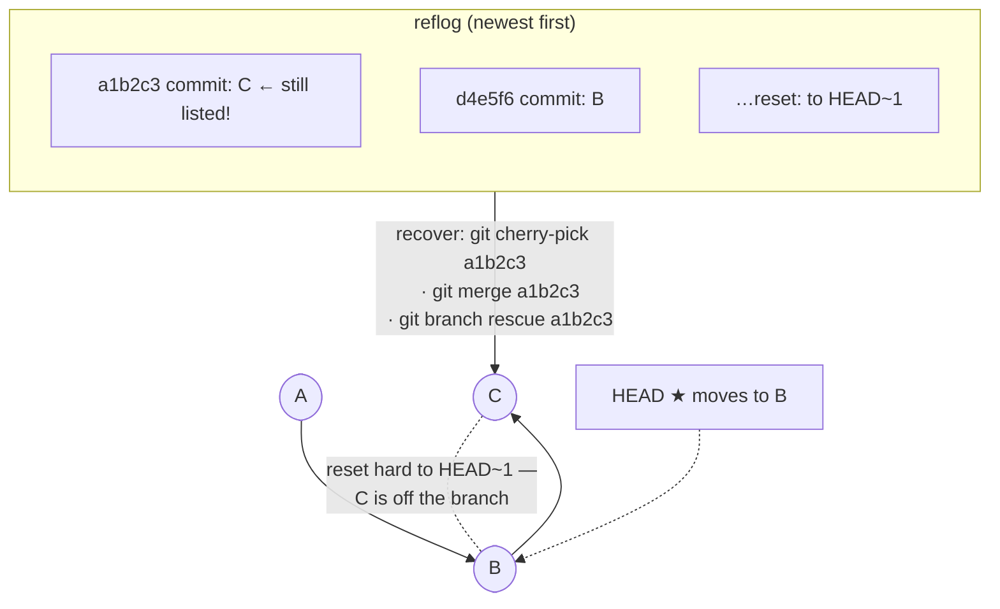
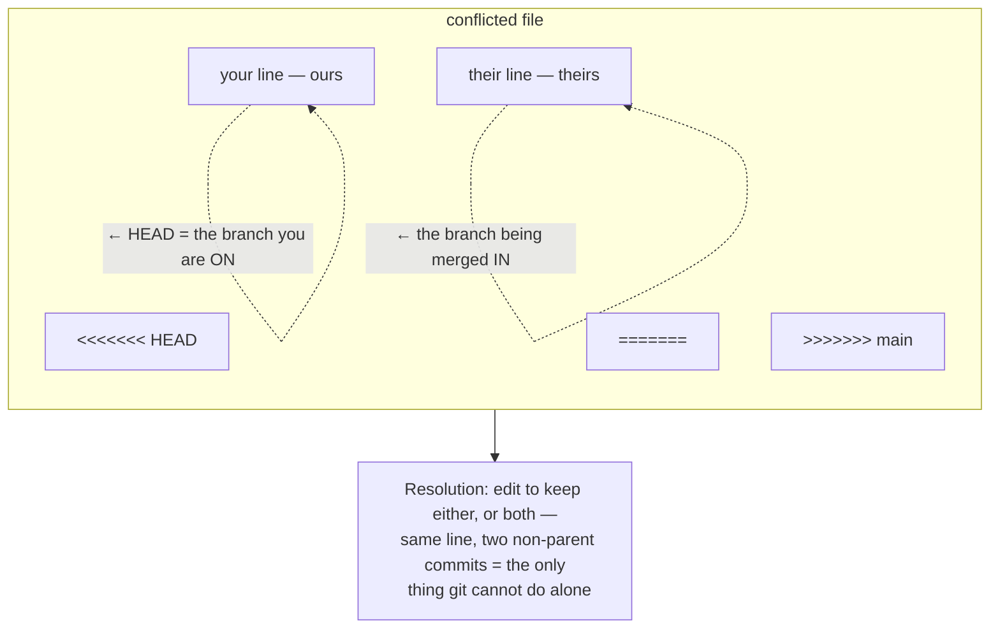
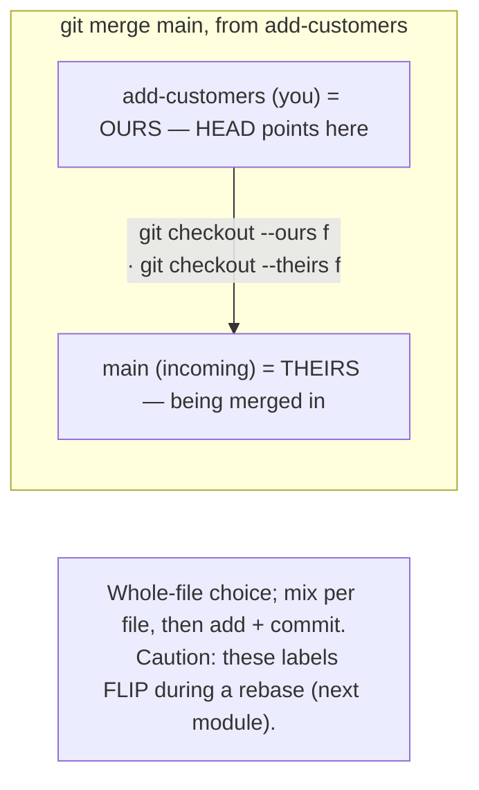
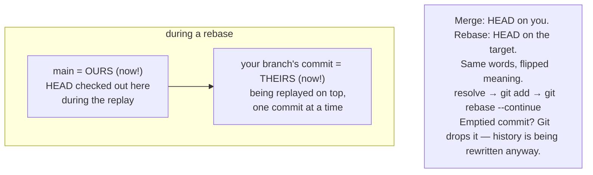
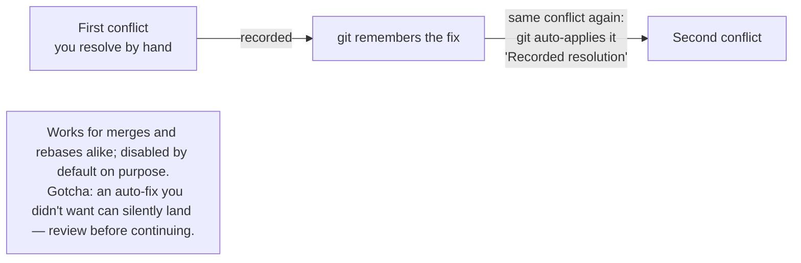

## Module 22 · Recovery — Reflog remembers every move.

Deleted a branch with unique work? Reset too hard? Reflog — pronounced "ref-log" — tracks where HEAD has been, step by step.

### Core idea

`git log` shows commit history; `git reflog` shows **HEAD movement history** — every checkout, reset, commit, and clone, newest first. Where log shrinks when you reset, reflog keeps the entry ("reset: moving to HEAD~1") with the abandoned commit's hash. Walk back to any hash and recover: cherry-pick it, merge it, or `cat-file` its contents out — even from a branch you deleted. The transcript demonstrates rescuing a lost "slander.md" commit exactly this way. Reflog is local to your machine and has saved the presenter "so many times." It's the reason hard resets are scary-but-recoverable.

### Steps

1. `git reflog` — read the HEAD trail, newest first.
2. Find the entry before the mistake; note its hash.
3. Recover: `git cherry-pick <hash>`, merge, or branch from it.

| Example | Takeaway |
| --- | --- |
| Reset one commit too far; reflog shows where you were. | Move back — nothing is lost. |
| git log "loses" reset commits. | Log follows the branch; reflog follows HEAD — two different trails. |
| Branch deleted with unique commits. | Reflog still has the hashes — cherry-pick them back. |

- **Analogy:** Log is the book's table of contents; reflog is your GPS history — everywhere you've been, even off-path.
- **Misconception:** Reflog is "verbose log". It's a different journal entirely — HEAD movements, not commit ancestry.
- **Why it matters:** It's the safety net under reset --hard (m15) and squashes (m27).

> **Quick recall — what does reflog record that log doesn't?** Every HEAD movement — checkouts, resets, clones — with the hashes involved.

**Quiz — after `git reset --hard HEAD~1`, how do you get commit C back?** Find its hash in reflog *(reflog still lists C's hash — reference it directly to recover the work)*.

🔗 Next: [Module 23 — merge conflicts](#module-23--conflicts-why-conflicts-happen)

## Module 23 · Conflicts — Why conflicts happen.

Git merges almost everything silently. It fails at exactly one job — and knowing that job is the whole skill.

### Core idea

Git works line-by-line with three operations: add, delete, modify. A **conflict** happens only when two commits that aren't parent-and-child **modify the same line** — git can't know your intent, so it stops and asks. Edits to different lines, or even the same line changed once then changed again downstream, merge cleanly. When a conflict hits, `git status` shows "unmerged paths", and the file contains markers: `<<<<<<< HEAD` (yours), `=======`, `>>>>>>> theirs`. You edit to the resolution you want — keep yours, theirs, or both — then `git add` and commit. `git merge --abort` backs out entirely.

### Steps

1. Merge → conflict reported; `git status` lists unmerged files.
2. Edit each file: remove markers, keep the lines you want.
3. `git add .` → `git commit` — conflict resolved.

| Example | Takeaway |
| --- | --- |
| Two devs edit line 10 of the same file; merge. | Conflict — you choose. |
| One commit edits line 10, a later commit edits it again. | No conflict — git knows the order; parent-child edits never clash. |
| Two branches both delete the same line. | Both-deletion agrees — clean merge. |

- **Analogy:** Two people edited the same sentence; git photocopies both versions and asks you to write the final.
- **Misconception:** Conflicts mean git is broken. They mean git is honest — it refuses to guess your intent.
- **Why it matters:** Rebasing long-lived branches (m25) surfaces the same conflicts repeatedly — rerere (m26) fixes that.

> **Quick recall — the exact trigger for a merge conflict?** Two commits without a parent-child relationship modify the same line.

**Quiz — branch A edits line 5; branch B edits line 9. Merge result?** Merges cleanly *(different lines never conflict — git combines both edits silently)*.

🔗 Next: [Module 24 — ours vs theirs tools](#module-24--conflicts-checkout---ours---theirs)

## Module 24 · Conflicts — checkout --ours / --theirs.

Editing marker blocks by hand works, but git ships shortcuts for the two most common resolutions — and for whole files at a time.

### Core idea

During a merge, **ours** is the branch you're on; **theirs** is the branch being merged in. `git checkout --ours <file>` takes your version of the whole file; `--theirs` takes theirs. It works per-file, so a two-conflict merge can mix: keep theirs for customers.csv, ours for partners.txt, then `git add` and commit. Note the subtlety the transcript highlights: if accepting "ours" means your side made no change to a file, the resolution commit shows no change for it — the difference went to zero. Rebase flips these labels entirely (m25), so anchor the words to "my branch" vs "incoming", not to feelings.

### Steps

1. Hit a conflict; run `git status` to see unmerged files.
2. Choose per file: `git checkout --theirs customers.csv`.
3. `git add .` → commit with your own resolution message.

| Example | Takeaway |
| --- | --- |
| Their version of the file is simply correct. | One `checkout --theirs` command beats hand-editing. |
| Resolve everything as "ours" — commit looks empty for that file. | No change on your side = zero diff; that's expected. |
| Two files conflict; each side is right for one. | Mix: theirs for one, ours for the other, one commit. |

- **Analogy:** ours/theirs is "my draft vs your draft" — during a merge, mine is whatever branch I'm standing on.
- **Misconception:** ours always means "my feature". On a rebase it means the target branch — labels swap (m25).
- **Why it matters:** It's the fastest legitimate resolution — and the exact tool rebased conflicts demand you relearn.

> **Quick recall — during a merge, what do ours and theirs point to?** Ours = your current branch (HEAD); theirs = the branch being merged in.

**Quiz — on add-customers, you run `git merge main`. What is "theirs"?** main *(theirs is main — the branch being merged into yours)*.

🔗 Next: [Module 25 — rebase conflicts, flipped](#module-25--conflicts-rebase-conflicts-ours-is-main)

## Module 25 · Conflicts — Rebase conflicts: ours is main.

The most confusing moment in team git: during a rebase, ours and theirs trade places. There's a mechanical reason.

### Core idea

Remember rebase's three steps (m14): git checks out the **target** (main) first, then replays your commits. So during a rebase conflict, HEAD is effectively on **main** — meaning **ours = main** and **theirs = your feature branch's commit being replayed**. Yes, it feels backwards. It's not arbitrary: you're standing on the target while your commits land one by one (you're even in a detached, "no branch" state). Also: a resolution that empties a commit makes git **drop** it entirely — rebase is rewriting history anyway, and an empty commit adds nothing. And a conflict during rebase would have been a conflict during merge — same line, same clash.

### Steps

1. `git rebase main` → conflict. Read carefully: ours ≠ your branch.
2. Pick the right side (e.g., `checkout --ours` for main's version).
3. `git add .` → `git rebase --continue` (never commit!).

| Example | Takeaway |
| --- | --- |
| Rebase onto main, main's line wins. | That's `checkout --ours` during the rebase. |
| "--ours" grabs main's code, not yours. | You're standing on main while your commits replay. |
| Resolution cancels a whole commit's changes. | The commit vanishes from history — git skips empty replays. |

- **Analogy:** Merge invites you into their house; rebase moves you into main's house and ships your furniture in.
- **Misconception:** "It's unintuitive." It's perfectly mechanical — once you know whose ground you stand on.
- **Why it matters:** Mixing this up overwrites a teammate's work with yours — or yours with theirs.

> **Quick recall — during a rebase, ours = ? and theirs = ?** Ours = main (the target, where HEAD sits); theirs = your replayed feature commit.

**Quiz — on band, you run `git rebase main` and get a conflict. "--ours" returns…** main's version *(HEAD moved to main for the replay, so ours = main's version)*.

🔗 Next: [Module 26 — rerere, the memory](#module-26--conflicts-rerere-resolve-twice-never-again)

## Module 26 · Conflicts — rerere: resolve twice, never again.

Reuse Recorded Resolution — a hidden gem that remembers how you resolved a conflict and replays it next time.

### Core idea

**rerere** ("reuse recorded resolution", off by default) watches your conflict resolutions. The first time you resolve a given conflict hunk, git records the "pre-image" and your fix. If the *same* conflict appears again — long-running branches rebased repeatedly are the classic case — git auto-applies your recorded resolution and says "Recorded resolution". Enable with `git config --global rerere.enabled true`. Why off by default? Silent auto-resolution can surprise you when you actually wanted a different fix this time. The transcript demos it: same conflict on two branches — the second rebase resolves itself.

### Steps

1. `git config --global rerere.enabled true` — opt in once.
2. Resolve a conflict normally; git records the resolution.
3. Next identical conflict: auto-resolved, just `--continue`.

| Example | Takeaway |
| --- | --- |
| Resolve the faves.md conflict; the identical faves2 rebase auto-resolves. | The transcript's exact demo. |
| A "hidden feature" this useful is off by default. | Silent auto-resolution can mislead — it's opt-in for safety. |
| Same conflict, but today you want the other side. | rerere may pre-apply the old fix — resolve manually and verify. |

- **Analogy:** rerere is muscle memory for conflicts: do it once, hands repeat it automatically.
- **Misconception:** rerere changes merge results. It only replays resolutions *you* already made.
- **Why it matters:** Long-running branches rebasing onto busy main hit the same conflicts weekly — this ends that.

> **Quick recall — what does rerere stand for and do?** Reuse Recorded Resolution — replays your earlier fix for identical conflict hunks.

**Quiz — why is rerere disabled by default?** Auto-fixes can surprise you *(silent auto-application could apply a stale fix you didn't want this time)*.

🔗 Next: [Advanced — Module 27](/docs/developer-tools/git/05-advanced-ops)
