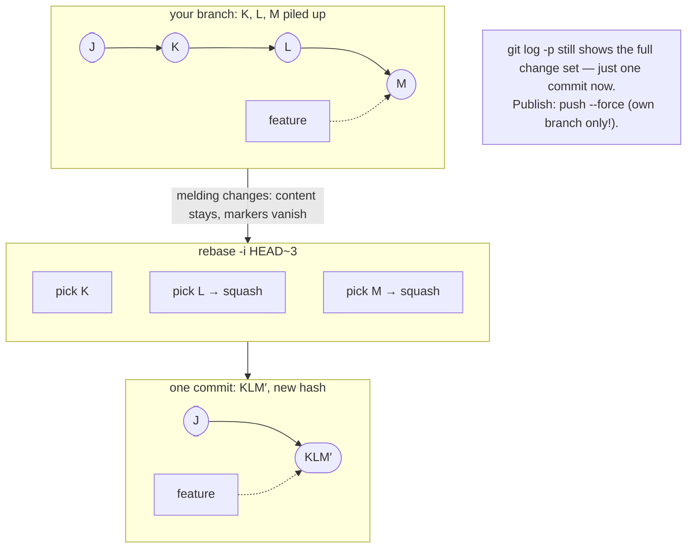
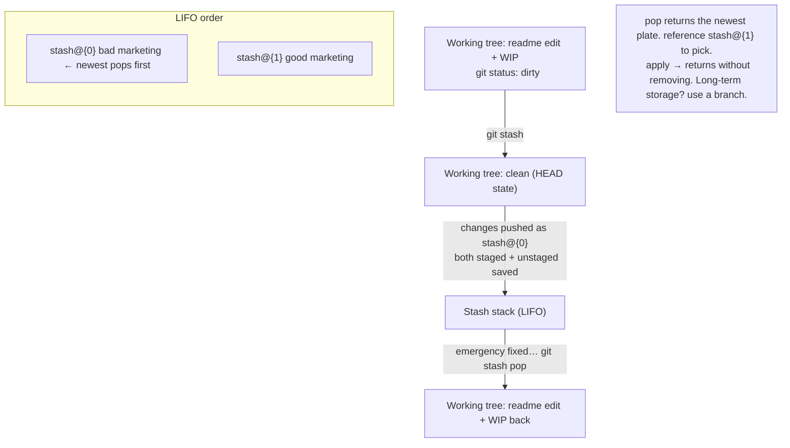
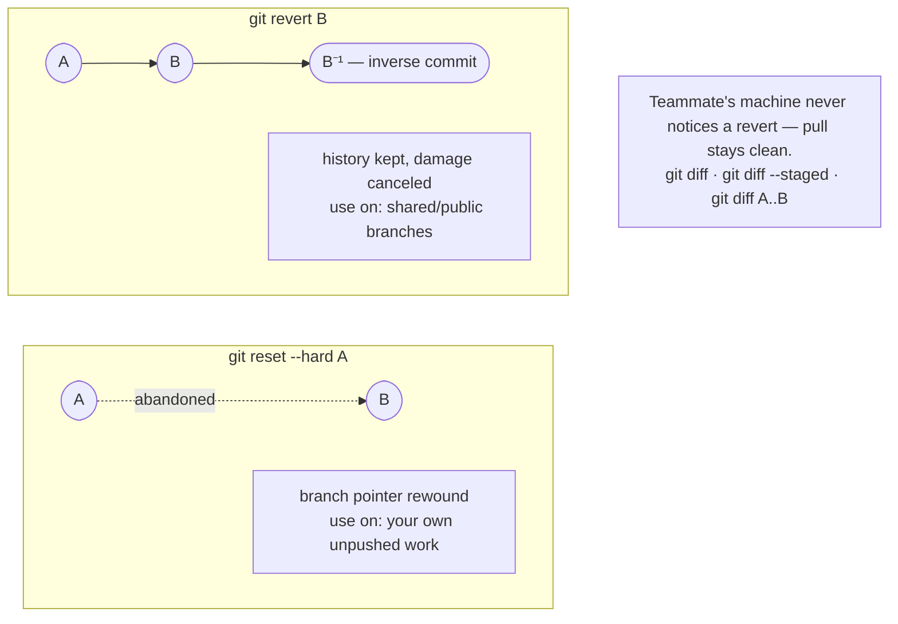
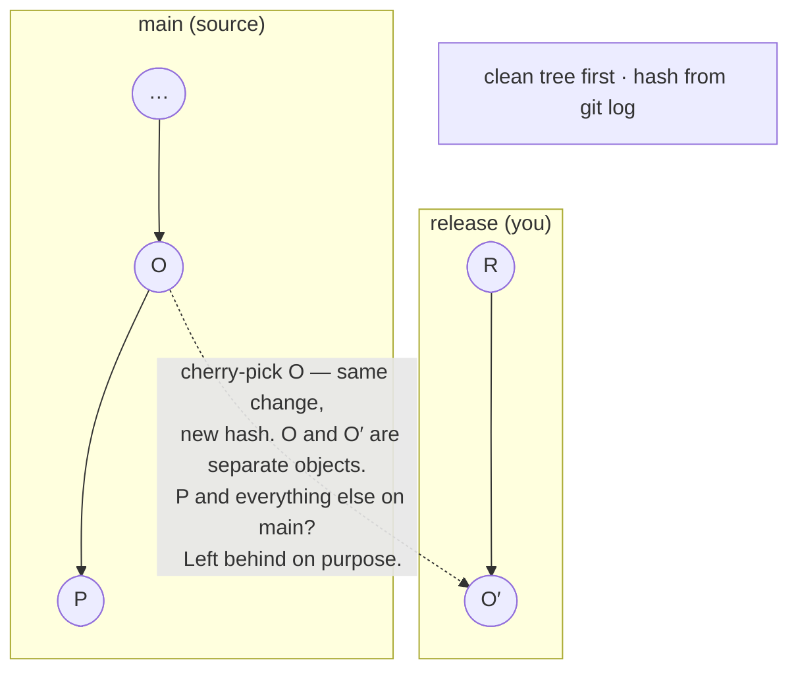
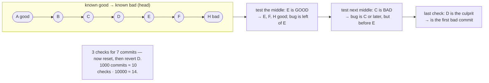
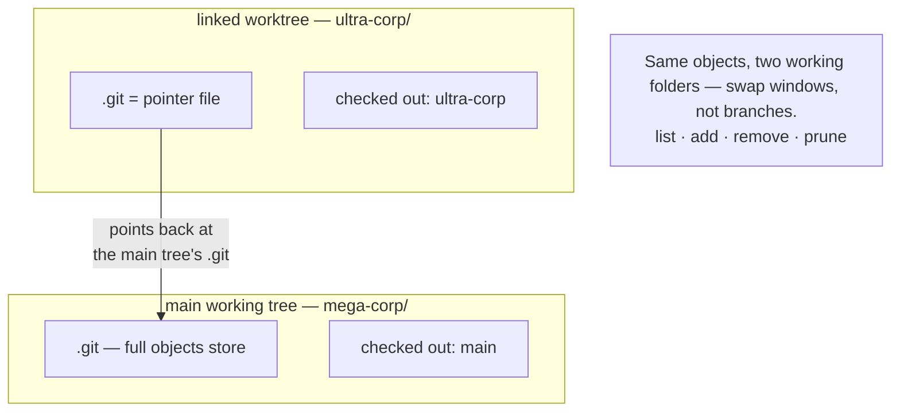
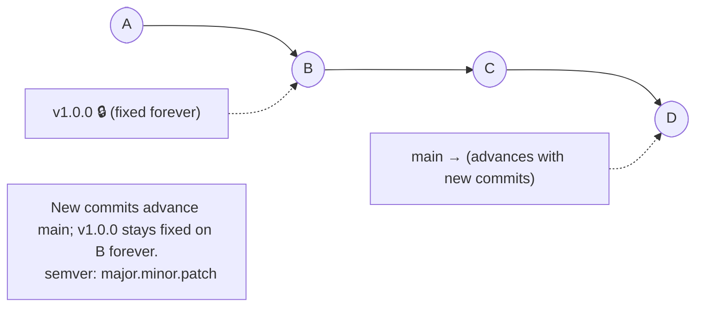

## Module 27 · Advanced — Squash with rebase -i, then force-push.

Some teams want one commit per PR. Squashing melts a series into one — using the same rebase machinery you already know.

### Core idea

**Squashing** combines several commits into one. The tool is interactive rebase: `git rebase -i HEAD~3` opens your editor with the last 3 commits listed; change `pick` to `squash` (or `s`) on the ones to melt into the previous one, save, and git replays them as a single commit with a combined message. Why rebase? Rebase already re-applies history — the interactive flag just lets you edit the plan first. Consequences: individual commit markers are gone (reflog can still find them), and because history was rewritten, publishing requires `git push --force` — fine on your own branch, catastrophic on shared ones. Workflow: branch → commit often → squash → PR.

### Steps

1. `git rebase -i HEAD~3` — editor lists K, L, M.
2. Mark L and M as `squash`; save; edit the combined message.
3. Verify with `git log -p`; publish with `push --force` (own branch only).

| Example | Takeaway |
| --- | --- |
| Twelve WIP commits before the PR; squash to one. | Reviewers see one coherent change. |
| Squash uses rebase. | Rebase already replays history — interactive just lets you edit the script. |
| You squashed a pushed branch. | Remote refuses the normal push — that's when --force enters, carefully. |

- **Analogy:** Squash is shrink-wrap: twelve loose parts enter, one sealed package leaves.
- **Misconception:** "Squashing loses your changes." Content is identical — only the commit markers merge.
- **Why it matters:** One-commit features are trivial to revert — the presenter's whole team workflow depends on it.

> **Quick recall — which command starts a squash of the last 3 commits?** git rebase -i HEAD~3 — then mark commits squash.

**Quiz — after squashing K, L, M, what does `git log -p` show?** One commit, full changeset *(one commit containing the combined diff — content unchanged)*.

🔗 Next: [Module 28 — stash](#module-28--advanced-stash-a-clipboard-for-changes)

## Module 28 · Advanced — Stash: a clipboard for changes.

CEO wants a bug fixed now, your work isn't commit-ready. Stash tucks it away safely and hands you a clean tree.

### Core idea

`git stash` records your working directory and index — both staged and unstaged changes — into a special stack, then reverts your tree to the last commit. `git stash pop` applies the most recent entry and removes it from the stack; `git stash apply` applies without removing; `git stash list` shows what's parked; `git stash drop` discards an entry; `git stash push -m "message"` labels one. The stack is **LIFO** — like a stack of plates, last stashed is first popped. The presenter's rule: stash is *temporary*. If you're labeling stashes to find them next week, that work wants to be a branch, not a stash.

### Steps

1. `git stash` — park everything; tree becomes clean.
2. Handle the emergency; `git stash list` to confirm it's safe.
3. `git stash pop` — your changes return, newest first.

| Example | Takeaway |
| --- | --- |
| Urgent bug mid-feature; stash, fix, pop. | Clean tree for the fix, no WIP commits. |
| Stash saves "changes". | It also captures staged changes, and both revert the tree. |
| Pop with conflicts against new code. | Resolve like any conflict; the stash entry stays until resolved. |

- **Analogy:** Stash is your desk's "pause" tray — sweep everything in, sweep it back out when ready.
- **Misconception:** Stash is long-term storage. Labeling stashes for next week means you wanted a branch.
- **Why it matters:** Or skip stash entirely with worktrees (m32) — one folder per task.

> **Quick recall — stash order, which entry pops first?** The newest — it's a LIFO stack, like plates.

**Quiz — you stash A, then B, then C. What does the first pop return?** C *(LIFO: C was stashed last, so it comes off first)*.

🔗 Next: [Module 29 — revert and diff](#module-29--advanced-revert-the-anti-commit)

## Module 29 · Advanced — Revert: the anti-commit.

Reset is a sledgehammer; revert is a scalpel. It undoes a commit by adding its opposite — history stays intact.

### Core idea

`git revert <hash>` creates a **new commit** that applies the exact inverse of the target commit — an "anti-matter commit." The original stays in history, the damage is neutralized, and nothing is rewritten, which makes revert the safe undo for **shared branches**: nobody's pull breaks. Contrast with reset (m15), which moves the branch — fine for your own unpushed work, dangerous on public history. Pair it with `git diff`, the inspector: `git diff` (working tree vs last commit), `git diff --staged`, `git diff A..B` between commits or branches. The presenter reverts "maybe ten times in a career" — usually in big companies when a broken commit must leave production *now*, and fix-forward isn't fast enough.

### Steps

1. `git log --oneline` — find the bad commit's hash.
2. `git revert <hash>` — write the revert commit message.
3. `git diff --staged` anytime to sanity-check what's queued.

| Example | Takeaway |
| --- | --- |
| Bad marketing commit hits main; revert it. | History shows the mistake and its undo — nothing hidden. |
| Revert of a revert brings the change back. | Inverse of inverse = original — handy for re-landing fixed work. |
| Broken commit discovered in production. | Revert buys time; fix-forward properly afterward. |

- **Analogy:** Revert writes a correction note under the mistake; reset tears the page out.
- **Misconception:** Revert deletes the commit. It adds a new opposite one — the original remains visible.
- **Why it matters:** One squashed commit per feature (m27) makes reverts trivial — "easy to put in, easy to pull out."

> **Quick recall — what does revert create, and what does it never do?** A new inverse commit; it never rewrites or removes existing history.

**Quiz — which undo is safe on a branch teammates already pulled?** git revert *(revert appends a new commit — shared history stays intact for everyone)*.

🔗 Next: [Module 30 — cherry-pick](#module-30--advanced-cherry-pick-steal-a-single-commit)

## Module 30 · Advanced — Cherry-pick: steal a single commit.

You want one change from a branch — not its whole history. Cherry-pick copies exactly one commit onto where you stand.

### Core idea

`git cherry-pick <hash>` takes one commit from anywhere and applies it as a new commit on your current branch — same change, new parent, new hash. The classic use: a `release` branch cut from main. A bug fix lands on main, but release can't absorb main's half-baked features — so cherry-pick just the fix commit onto release and re-deploy. Requirements: a clean working tree (commit or stash first), and the hash from `git log`. It also doubles as a recovery tool: reflog (m22) shows a lost commit's hash, cherry-pick brings it back. Expect it to stay infrequent — but when you need it, nothing else does the job.

### Steps

1. Get clean: commit or stash whatever's in progress.
2. `git log --oneline` on the source — note the commit's hash.
3. `git switch release` → `git cherry-pick <hash>`.

| Example | Takeaway |
| --- | --- |
| Fix lands on main; release needs it now. | Cherry-pick the fix commit onto release. |
| Cherry-picked commit has a different hash than the original. | New parent → new SHA; the change is identical. |
| Cherry-pick onto the branch the commit came from. | Nothing useful — git applies it where you stand; switch first (the transcript's own slip). |

- **Analogy:** Cherry-pick takes one cherry from the bunch; merge takes the whole branch.
- **Misconception:** Cherry-pick moves the commit. It copies it — the original stays where it was.
- **Why it matters:** It's also the cleanest way to resurrect a single reflog-found commit (m22).

> **Quick recall — cherry-pick vs merge, the one-line difference?** Cherry-pick copies one commit; merge brings a branch's whole divergent history.

**Quiz — cherry-picked commit O′ compared to source commit O?** Same change, new hash *(same change but a new parent on your branch, so a new SHA)*.

🔗 Next: [Module 31 — bisect](#module-31--advanced-bisect-binary-search-your-history)

## Module 31 · Advanced — Bisect: binary search your history.

A bug exists now but not 1,000 commits ago. Testing each commit one-by-one takes days — bisect halves the space every check.

### Core idea

Commits are time-ordered, so history is a sorted array — and sorted arrays support **binary search**. `git bisect start`, mark the current broken commit (`git bisect bad`) and a known-good one (`git bisect good <hash>`). Git checks out the middle commit; you test it and answer `good` or `bad`; each answer discards half the remaining range. 1,000 commits ≈ 10 checks; 10,000 ≈ 14. Git names the guilty commit, then `git bisect reset` returns you to the present (then revert or fix-forward — m29). Not just bugs: any testable quality — performance regressions, a file's appearance — and `git bisect run <script>` automates it using the script's exit code as the answer.

### Steps

1. `git bisect start` → `git bisect bad` (now) → `git bisect good <old>`.
2. Test the middle commit; answer `git bisect good` or `bad`.
3. Guilty commit named → `git bisect reset` → revert it.

| Example | Takeaway |
| --- | --- |
| A script works two weeks ago, fails now. | Bisect finds the breaking commit in minutes. |
| 10,000 commits sounds like 10,000 tests. | Binary search needs about 14. |
| Each test takes 30 minutes to compile. | `bisect run` automates it — walk away, come back to the answer. |

- **Analogy:** Guess-the-number between 1–1000: "higher/lower" wins in 10 guesses. Bisect plays it with commits.
- **Misconception:** Bisect "splits the repo in two". It splits the commit *range* you're searching.
- **Why it matters:** Finding the culprit is step one; revert (m29) is step two.

> **Quick recall — the seven-ish steps of a manual bisect?** start → mark bad → mark good → test middle → good/bad → repeat → reset.

**Quiz — testing the middle commit shows the bug present. What does git learn?** Bug is in the earlier half *(a bad middle means the bug was introduced at or before it — the later half is eliminated)*.

🔗 Next: [Module 32 — worktrees](#module-32--advanced-worktrees-two-folders-one-repo)

## Module 32 · Advanced — Worktrees: two folders, one repo.

Branch-hopping mid-task, or stashing to fix a bug? A second folder checked out to another branch does it without any of that.

### Core idea

Your main checkout is the **main working tree**. `git worktree add ../ultra-corp` creates a **linked worktree**: a second folder with its own checked-out branch that shares the same underlying repo — its `.git` is a tiny file pointing back at the main tree. Rules: each branch can be checked out in only one worktree at a time (git enforces it), and `git worktree list` shows them all (a `+` in `git branch` marks worktree checkouts). Cleanup: delete the folder, then `git worktree prune` clears the dead reference. The payoff — the presenter's words: "you may never need the stash again." Swap folders instead of swapping branches.

### Steps

1. `git worktree add ../ultra-corp` — branch named from the folder.
2. Work in each folder independently; same objects, no re-clone.
3. Done? Delete the folder + `git worktree prune`.

| Example | Takeaway |
| --- | --- |
| Bugfix branch in folder B while feature builds in folder A. | Alt-tab instead of stash-and-switch. |
| The second folder looks like a full clone. | Its .git is a one-line pointer — nearly as light as a branch. |
| `git switch main` inside the linked tree. | Refused — main is checked out in the main tree already. |

- **Analogy:** Worktrees are two desks sharing one filing cabinet — separate surfaces, one set of files.
- **Misconception:** It's a clone. Cloning copies everything; a worktree shares the single object store.
- **Why it matters:** Replaces the stash dance entirely — the presenter keeps two or three trees and just switches.

> **Quick recall — what does a linked worktree's .git contain?** A path pointing back to the main working tree's .git — a pointer file, not a store.

**Quiz — can two worktrees check out the same branch?** No, git enforces one *(git refuses — a branch can be checked out in only one worktree at a time)*.

🔗 Next: [Module 33 — tags](#module-33--advanced-tags-immutable-pointers-for-releases)

## Module 33 · Advanced — Tags: immutable pointers for releases.

Branches move; tags don't. The final module — and the easiest pointer in git.

### Core idea

A **tag** is an immutable pointer to a commit — the mutable-pointer sibling of a branch. `git tag -a v1.0.0 -m "release"` creates an annotated tag (name + message); `git tag` lists them; `git push --tags` shares them. Checkout a tag and you land in **detached HEAD** — you can look, but the pointer itself can't move. Their real-world job: marking releases, named with **semver** — `major.minor.patch`: major = breaking API change, minor = additive features, patch = fixes; sorting compares major first. Check React's tag list: every release is a tag. Anywhere a hash works, a tag name works too.

### Steps

1. `git tag -a v1.0.0 -m "first release"` on the commit to mark.
2. `git tag` to list; `git push --tags` to publish.
3. `git checkout v1.0.0` → detached HEAD: browse freely, commit elsewhere.

| Example | Takeaway |
| --- | --- |
| Ship version 2.4.0; tag the commit. | Anyone can check out exactly what shipped. |
| Checkout a tag to "work on it". | Detached HEAD — tags don't advance; commit on a branch instead. |
| Dependency bumps a "minor" version and behavior changes. | Default-parameter changes are semver-legal minors — the transcript's warning. |

- **Analogy:** A branch is a moving bookmark; a tag is a stamp pressed into the page.
- **Misconception:** Tags are only for tools. They're how humans say "this commit is v2.0, ship it."
- **Why it matters:** Releases, rollbacks, and dependency pinning all read from tags.

> **Quick recall — branch vs tag in one sentence?** Branch = mutable pointer; tag = immutable pointer to one commit.

**Quiz — upgrading 1.12.4 → 2.2.4, expect a smooth ride?** No, major = breaking *(the major bump signals breaking API changes — code changes required)*.

🔗 Next: [Summary & Cheat Sheet](/docs/developer-tools/git/cheatsheet)
