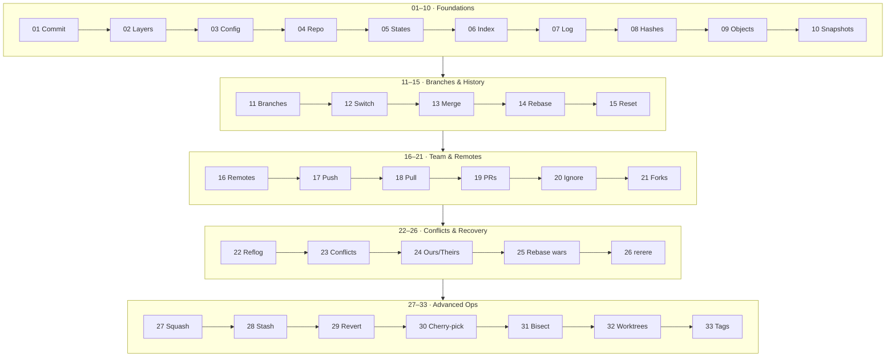

<GitGraphSimulator />

# Learning Git, from first commit to team workflows.

Both of boot.dev's Learn Git courses in one place: how git really stores your work, how to branch and merge without fear, and every rescue tool — reflog, revert, bisect — you'll one day be grateful for. Every idea comes straight from the source video.

## What you'll learn

One tangible win: use git without losing work.

- Commit, stage, and inspect history with confidence — [Foundations, m1–m8](/docs/developer-tools/git/01-foundations)
- Understand what git actually stores — trees, blobs, snapshots — [Foundations, m9–m10](/docs/developer-tools/git/01-foundations)
- Branch, merge, rebase, and reset on your own machine — [Branches & History, m11–m15](/docs/developer-tools/git/02-branches-and-history)
- Collaborate through remotes, GitHub, pull requests, and forks — [Team & Remotes, m16–m21](/docs/developer-tools/git/03-team-and-remotes)
- Resolve merge and rebase conflicts — ours vs theirs, and rerere — [Conflicts & Recovery, m22–m26](/docs/developer-tools/git/04-conflicts-and-recovery)
- Squash, stash, revert, and cherry-pick like a teammate — [Advanced Ops, m27–m30](/docs/developer-tools/git/05-advanced-ops)
- Hunt bugs with bisect, run parallel work in worktrees, and tag releases — [Advanced Ops, m31–m33](/docs/developer-tools/git/05-advanced-ops)

## Course knowledge map

Five lab benches, thirty-three modules — every module, grouped by lab bench, in learning order.

## The benches

| Lab bench | Modules | Read it |
| --- | --- | --- |
| Foundations | 01–10 | [01-foundations](/docs/developer-tools/git/01-foundations) |
| Branches & History | 11–15 | [02-branches-and-history](/docs/developer-tools/git/02-branches-and-history) |
| Team & Remotes | 16–21 | [03-team-and-remotes](/docs/developer-tools/git/03-team-and-remotes) |
| Conflicts & Recovery | 22–26 | [04-conflicts-and-recovery](/docs/developer-tools/git/04-conflicts-and-recovery) |
| Advanced Ops | 27–33 | [05-advanced-ops](/docs/developer-tools/git/05-advanced-ops) |
| Review | cheat sheet + FAQ | [cheatsheet](/docs/developer-tools/git/cheatsheet) |

Ready? Start with [Module 01 — Git is a history of commits](/docs/developer-tools/git/01-foundations#module-01--foundations-git-is-a-history-of-commits).
