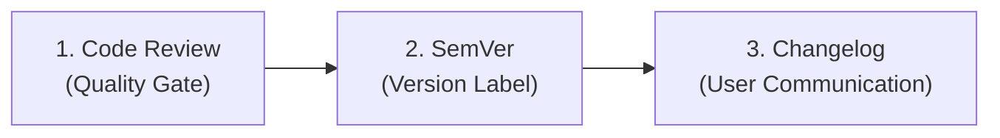

import { Callout } from 'fumadocs-ui/components/callout';

These are three team-workflow practices that keep code quality and releases predictable.

<Callout type="info">
**Workflow, not architecture:**
Review gates what enters the codebase, SemVer labels the release that results, and the changelog explains it. All three are daily developer workflows that ensure predictable software delivery.
</Callout>

## 1. Code Review

Another developer examines your changes (usually a pull request) before they merge into the main branch.

- **What reviewers check:** Correctness, readability, security, test coverage, and fit with existing system architecture.
- **Why it matters:** It catches defects early, spreads knowledge across the team, and prevents siloing while keeping quality standards consistent.
- **For solo developers:** Reviewing your own git diff before committing or merging catches a surprising share of subtle typos and logic errors.

---

## 2. Semantic Versioning (SemVer)

A universal version-numbering convention in the format **`MAJOR.MINOR.PATCH`** (for example, `2.4.1`):

| Part | Meaning | Example Transition | When to Use |
| :--- | :--- | :--- | :--- |
| **MAJOR** | Breaking changes | `2.4.1` → `3.0.0` | Incompatible API changes; consumers must update code. |
| **MINOR** | New features | `2.4.1` → `2.5.0` | Additive functionality that remains backward compatible. |
| **PATCH** | Bug fixes | `2.4.1` → `2.4.2` | Backward-compatible bug fixes and small patches. |

The version number communicates whether an upgrade is safe to apply without requiring consumers to inspect source code diffs.

---

## 3. Changelogs

A human-readable file (conventionally `CHANGELOG.md`) listing what changed in each released version, grouped as Added, Changed, Fixed, Removed, and Security.

Following the standard format ([Keep a Changelog](https://keepachangelog.com/)), entries are grouped into:
- **`Added`** for new features.
- **`Changed`** for changes in existing functionality.
- **`Deprecated`** for once-stable features removed in upcoming releases.
- **`Removed`** for deprecated features now removed.
- **`Fixed`** for bug fixes.
- **`Security`** in case of vulnerability patches.

It lets users, teammates, and operators quickly see what a release contains and whether it affects their workflow.

---

## How They Connect in Practice

| Practice | Role in Release Lifecycle | Question It Answers |
| :--- | :--- | :--- |
| **Code Review** | **Gatekeeper** | *"Is this change safe, clean, and tested enough to enter the codebase?"* |
| **SemVer** | **Label** | *"Does this release introduce breaking changes, new features, or just fixes?"* |
| **Changelog** | **Explanation** | *"What exact features or fixes were shipped in this release?"* |
