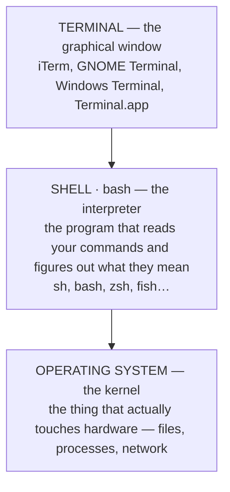

import { Callout } from 'fumadocs-ui/components/callout';

import { ShellCliGuiComparison } from '@/components/developer-tools/shell-simulators';
import { ShellPermissionsCalculator } from '@/components/developer-tools/shell-simulators';

# From shell-shocked beginner to automation wizard

Those cryptic lines of code that somehow magically automate tasks? That's shell scripting. This is the crash course that takes you from "what is a terminal" all the way to writing a real log-analysis script — no computer science degree required. Eighteen chapters, one DevOps scenario, and a single script that evolves from ugly to elegant.

**18 chapters · 1 running example · everything builds on the last chapter.**

## Chapter 01 — What is a shell?

On your computer, you interact with the system in one of two ways:

| Way | What it is |
| --- | --- |
| **GUI** (Graphical User Interface) | A visual layer where you execute tasks by clicking around — creating folders, copying files, moving things, opening apps. This is the desktop experience most people know. |
| **CLI** (Command Line Interface) | Instead of clicking, you type commands. Create a folder, copy a file, open an app — all done with text. Much faster and far more powerful, once you know what you're doing. |

<Callout type="info">
**The shell is the program that runs and interprets your CLI commands.** On Linux, the most common implementation is **bash** — the Bourne Again Shell. Bash isn't just for running commands, though: it's a full programming language, which means you can write automated programs with it. Those programs are called shell scripts, or bash scripts.
</Callout>

<Callout type="info">
**Quick check: Is "shell" the same thing as "terminal"?**
No. The **terminal** is the graphical window you type into. The **shell** is the program running *inside* that window — the thing that actually reads your commands and executes them. Bash is one shell; zsh, fish, and sh are others. The terminal is just the frame around them.
</Callout>

## Chapter 02 — CLI vs GUI: why bother?

If you want to create 100 folders, CLI can do it in one command. In a GUI, you'd create them one by one, by hand. That's the core reason CLI exists: **repetition scales**. Anything you might have to do more than once is a candidate for a command — or a script.

<ShellCliGuiComparison />

<Callout type="warn">
**This is the whole point.** Every task you do more than once — checking logs, rotating files, setting up environments, deploying code — is a candidate for automation. The CLI is where that automation lives.
</Callout>

<Callout type="info">
**Quick check: When would a GUI actually be better than a CLI?**
For one-off, exploratory work: browsing a folder you don't know the name of, visually comparing two images, dragging files between windows. The GUI is better for anything where you're still figuring out what you want. The CLI is better for anything you already know how to do — and especially anything you have to do repeatedly.
</Callout>

## Chapter 03 — Shell, bash, and terminal: what's the difference?

Three terms that get thrown around interchangeably. They mean different things, and knowing the difference will save you confusion.



*Fig 3.1 — You type in the terminal. The shell interprets. The OS executes.*

| Term | Role |
| --- | --- |
| **Terminal** | The window. A graphical program that gives you a place to type. It handles fonts, colors, and scrolling. Different terminals look different but all do the same job. |
| **Shell** | The interpreter. A program that reads commands and executes them. Bash is the most common on Linux. Zsh is the default on modern macOS. Fish is popular for its friendly defaults. |
| **Bash** | One specific shell. "Bourne Again SHell" — a specific implementation with more features than the older `sh`. It's what most shell scripts are written in. |

<Callout type="info">
**Like browsers.** "Browser" is the category; Chrome, Firefox, and Safari are implementations. In the same way, "shell" is the category; bash, zsh, and sh are implementations. And bash isn't Linux-only — it runs on macOS, Windows via WSL, and anywhere else a POSIX-like environment exists.
</Callout>

<Callout type="info">
**Quick check: You open a terminal on macOS. Which shell are you in?**
Modern macOS defaults to **zsh**, not bash. But bash is still installed — you can type `bash` to switch to it. That's exactly the technique Mac users should use to follow along.
</Callout>

## Chapter 04 — Setting up your environment

You can't write bash if you don't have bash. Here's how to get it on every major platform:

| Platform | Situation | What to do |
| --- | --- | --- |
| **Linux** | Already installed | Bash is the default shell on most distributions. Just open a terminal and you're ready. |
| **macOS** | Installed, not default | Bash is there, but the terminal opens in `zsh`. Type `bash` and press Enter to switch. You'll see the prompt change. |
| **Windows** | Not installed | Install Windows Subsystem for Linux (WSL). It's a complete Linux environment, officially supported by Microsoft, and far better than the alternatives. |

Check what you have on any platform:

```bash
echo $SHELL
# macOS (default): /bin/zsh
# Linux (typical): /bin/bash

bash                 # switch to bash on macOS
echo $BASH_VERSION   # confirm bash is running
```

```text
$ echo $SHELL
/bin/zsh
$ bash
bash-5.2$
$ echo $BASH_VERSION
5.2.21(1)-release
```

<Callout type="warn">
**Windows users:** WSL is the best option — a full Linux environment officially supported by Microsoft. Alternatives like Git Bash work for simple scripts, but they're not a complete environment and things will break in subtle ways.
</Callout>

<Callout type="info">
**Quick check: You're on macOS with zsh. Your script works for you but fails for a Linux colleague. Why?**
Zsh and bash share a lot of syntax but aren't identical. Some things that work in zsh (like certain array operations) have different syntax in bash. If you're writing a script meant to be portable, always add a shebang (Chapter 10) so the system knows which interpreter to use.
</Callout>

## Chapter 05 — The DevOps scenario

You're a DevOps engineer. Your job: analyze logs from various programs, spot problems, and take action. Every day.

Imagine you have a `logs/` folder with two files: `application.log` and `system.log`. Your job is to scan them for issues — errors, fatals, criticals — and figure out what's going wrong:

1. Find what changed in the last 24h
2. Filter for errors, fatals, criticals
3. Count them
4. Decide what needs action

<Callout type="info">
**The scale problem.** Now imagine there are *tens* of log files — dozens of programs all outputting to the same folder. You have to check them every day. Manually, that takes 30–45 minutes. And you'll do it again tomorrow. And the day after.
</Callout>

<Callout type="info">
**Quick check: Why is "every day" the key detail in this scenario?**
Because a one-time task isn't worth automating — you'd spend more time writing the script than just doing it by hand. But a daily task compounds. Thirty minutes a day is over two hours a week, or more than a hundred hours a year. That's when automation pays for itself.
</Callout>

## Chapter 06 — Manual log analysis, command by command

Before we automate, let's do it by hand. This is the workflow we're going to encode into a script.

### Step 1 — see the whole file

Print the entire log so you know what you're dealing with:

```bash
cat application.log
# 2025-03-01 08:14:22 INFO    Server started on port 8080
# 2025-03-01 08:14:23 INFO    Connected to database
# 2025-03-01 08:15:11 ERROR   Payment gateway timeout
# 2025-03-01 08:15:45 INFO    User 4821 logged in
# 2025-03-01 08:16:02 WARN    Retry attempt 1/3
# 2025-03-01 08:16:33 ERROR   Database connection lost
# 2025-03-01 08:17:01 FATAL   Out of disk space
# … many more lines …
```

### Step 2 — filter for errors

Use `grep` to show only the lines that match a pattern:

```bash
grep "ERROR" application.log
# 2025-03-01 08:15:11 ERROR   Payment gateway timeout
# 2025-03-01 08:16:33 ERROR   Database connection lost
# 2025-03-01 08:18:14 ERROR   Insufficient disk space
```

### Step 3 — count them

The `-c` flag tells `grep` to give you a count instead of the lines:

```bash
grep -c "ERROR" application.log     # 13
grep -c "FATAL" application.log     # 2
grep -c "CRITICAL" application.log  # 1
```

### Step 4 — find files that changed recently

If there are dozens of log files, you only care about the ones updated in the last 24 hours. That's what `find` with `-mtime` does:

```bash
find . -name "*.log" -mtime -1
# ./system.log
# ./application.log
```

<Callout type="info">
**Reading the `-mtime -1` flag:** `-mtime` filters by modification time. The number after it is measured in days. `-1` means "less than 1 day old." `-2` would be "less than 2 days old." Files that haven't changed won't show up — so you skip them entirely.
</Callout>

<Callout type="warn">
**Quote your globs.** If you write `-name *.log` without quotes, the shell will try to expand `*.log` itself before passing it to `find` — and it'll only work if there happens to be a matching file in the current directory. Always quote it: `-name "*.log"`.
</Callout>

<Callout type="info">
**Quick check: What does `grep -c "ERROR" app.log` return if there are no matches?**
It prints `0` — and it exits with a non-zero exit code (specifically 1), which is how bash scripts know that "no match" happened. That distinction matters when you start using `if` statements, because `grep`'s exit code becomes the condition.
</Callout>

## Chapter 07 — Why automate this?

Now that we've done it by hand, the pain is obvious. Exactly what's wrong with the manual approach:

| Problem | Why it hurts |
| --- | --- |
| **Repetitive command entry** | Every day, you type the same commands, in the same order. For every file. For every error pattern. It's mechanical work that adds no value. |
| **No aggregate summary** | You go through each file separately and mentally track the overall state. Nothing tells you "here's the total picture." |
| **Easy to lose track** | Get interrupted halfway through and you might forget which files you already checked. Start over, or risk missing something. |
| **Inconsistent** | Depending on how tired you are, you might skip a check or use a slightly different pattern. The manual process is only as consistent as you are. |
| **No documentation** | The steps live in your head. A new team member can't see the process, can't review it, can't improve it. |
| **Doesn't scale** | Two log files? Manageable. Twenty? Not manageable. But the number of services keeps growing. |

<Callout type="info">
**A shell script fixes all six.** It captures the logic once, runs the same way every time, produces a consistent summary, and serves as documentation. Anyone on the team can read it, run it, extend it, and improve it.
</Callout>

<Callout type="tip">
*"Imagine instead if I could save these steps and commands and simply say: run all these commands in one go, in this order."* That's a shell script.
</Callout>

<Callout type="info">
**Quick check: What's the strongest argument for scripting over doing it by hand, even when you could do it manually?**
**Consistency.** A script runs the exact same commands, in the exact same order, every single time. A human gets tired, gets interrupted, gets distracted, and quietly skips a step. Scripts don't. For anything that has to happen every day, consistency beats speed.
</Callout>

## Chapter 08 — Your first shell script

A shell script is just a text file with Linux commands in it. That's really the whole concept.

Create the file with `touch`, then edit it:

```bash
touch analyze-logs.sh
vim analyze-logs.sh
```

<Callout type="info">
**Why `.sh`?** The extension isn't required on Unix-like systems — the file will run perfectly fine without it, as long as it has execute permission. We add it as a convention: it makes shell scripts easy to spot in a directory listing, and code editors will use it to pick the right syntax highlighting. But `analyze-logs.sh` could actually be bash, zsh, or any other shell — the extension doesn't say which. For that, you need a shebang.
</Callout>

Write the first version — Vim opens in normal mode. Press `i` to enter insert mode. Then type the commands we ran manually:

```bash
# analyze-logs.sh — v1
find . -name "*.log" -mtime -1
grep "ERROR" application.log
grep -c "ERROR" application.log
grep "FATAL" application.log
grep -c "FATAL" application.log
grep "CRITICAL" application.log
grep -c "CRITICAL" application.log

grep "ERROR" system.log
grep -c "ERROR" system.log
grep "FATAL" system.log
grep -c "FATAL" system.log
grep "CRITICAL" system.log
grep -c "CRITICAL" system.log
```

Save and quit with `Esc`, then type `:wq` and press Enter.

<Callout type="warn">
**Yes, it's clunky.** This script hardcodes file names, repeats itself, and would break if you added a new log file. That's fine — it's version one. We'll refactor it step by step until it's elegant. The point right now is just to get *something* running.
</Callout>

<Callout type="info">
**Quick check: Why does v1 repeat the same logic for application.log and system.log?**
Because we're transcribing what we did manually, line by line. Version one is deliberately naive — it's just the manual commands pasted into a file. The whole point of the rest of the lesson is to refactor this into something that scales without repeating itself.
</Callout>

## Chapter 09 — Permissions and `chmod +x`

You wrote the script. Now try running it:

```text
$ ./analyze-logs.sh
bash: ./analyze-logs.sh: Permission denied

# check the permissions
$ ls -l analyze-logs.sh
-rw-r--r--  1 nana  staff  412 Mar  1 10:14 analyze-logs.sh
#  ↑ no "x" anywhere — the file isn't executable

# add the execute bit
$ chmod +x analyze-logs.sh
$ ls -l analyze-logs.sh
-rwxr-xr-x  1 nana  staff  412 Mar  1 10:14 analyze-logs.sh
#  ↑ now there's an "x"

$ ./analyze-logs.sh
./system.log
./application.log
… (commands run in order) …
```

Flip the permission bits yourself and watch what happens when you try to run the script:

<ShellPermissionsCalculator />

### Reading permission strings

That `-rwxr-xr-x` is actually three groups of three characters, plus a leading file-type character:

| Position | Means | Who |
| --- | --- | --- |
| `1` | File type (`-` for file, `d` for directory) | — |
| `2–4` | `rwx` — read / write / execute | Owner |
| `5–7` | `r-x` — read / execute | Group |
| `8–10` | `r-x` — read / execute | Everyone else |

<Callout type="info">
**Why programs need the execute bit.** Things like `python`, `vim`, and `ls` are all just files on disk. They have the execute bit set, so the OS knows they're programs meant to be run. Your script is the same — mark it executable and the OS will treat it like any other command.
</Callout>

<Callout type="info">
**Quick check: Why does `./analyze-logs.sh` have a `./` in front?**
Because the current directory isn't on your `PATH` by default — the list of directories the shell searches for commands. So if you just type `analyze-logs.sh`, the shell looks for it in all the standard places and doesn't find it. The `./` says "look right here, in this directory, first."
</Callout>

## Chapter 10 — The shebang

Your file is called `analyze-logs.sh`. But how does the OS know whether it's bash, zsh, sh, or something else? The extension doesn't say. The answer is the **shebang**: a special first line that starts with `#!` followed by the path to the interpreter.

```bash
#!/bin/bash

# … the rest of your script …
```

*Fig 10.1 — The shebang is a contract: "run me with this interpreter." The OS reads the first line, finds `/bin/bash`, and the bash interpreter reads each line, parses it as bash syntax, and executes it. Change the shebang → change the interpreter → change the syntax the script runs in.*

### Common shebangs

| Shebang | What it means | When to use |
| --- | --- | --- |
| `#!/bin/bash` | Run with bash | Bash scripts — the most common choice |
| `#!/bin/sh` | Run with POSIX sh | Scripts that must be maximally portable |
| `#!/usr/bin/env bash` | Find bash on PATH, then run | Most portable form — works when bash isn't at `/bin/bash` |
| `#!/usr/bin/env python3` | Run with Python 3 | Python scripts |
| `#!/usr/bin/env node` | Run with Node.js | Node scripts |

<Callout type="info">
**`env` is usually the safer choice.** Hardcoding `/bin/bash` assumes bash lives there — which is true on most Linux systems, but not all. Using `#!/usr/bin/env bash` says "find bash on the PATH," which is much more portable.
</Callout>

<Callout type="warn">
**The shebang must be the very first line.** Not even a comment or a blank line before it. The `#!` has to be the first two bytes of the file, or the OS won't recognize it and will fall back to running the script with `/bin/sh` — which might not understand your bash syntax.
</Callout>

<Callout type="info">
**Quick check: What happens if you run a script *without* a shebang?**
The OS has a fallback: it tries to run the script with `/bin/sh`. On many systems, `sh` is a lean, POSIX-compliant shell — it doesn't have bash extensions like `[[ ]]`, arrays, or `${var//pattern/replacement}`. So a script that relies on bash features may work when you run it interactively, but break when the OS runs it via the shebang-less fallback.
</Callout>

## Chapter 11 — Making the output readable: `echo` and `-e`

Our script runs now, but the output is a wall of file names and numbers with no context. Technically correct but practically useless — you'd have to open the script to know what each number means:

```text
$ ./analyze-logs.sh
./system.log
./application.log
13
2
1
ERROR   Payment gateway timeout
ERROR   Database connection lost
…  # what do these numbers mean? which file are we looking at?
```

Let's add `echo` statements to label everything:

```bash
echo "Analyzing log files"
echo "===================="

find . -name "*.log" -mtime -1

echo "List of log files updated in last 24 hours:"
echo "Searching error logs in application.log"
grep "ERROR" application.log

echo "Number of error logs found:"
grep -c "ERROR" application.log
```

### Adding line breaks with `-e` and `\n`

The output is clearer now, but everything still runs together. We can add blank lines using `\n` — but only if we tell `echo` to interpret it:

```bash
# without -e, the \n is printed literally
echo "Line one\nLine two"
# Line one\nLine two

# with -e, backslash escapes are interpreted
echo -e "Line one\nLine two"
# Line one
# Line two
```

<Callout type="info">
**Why the `-e` flag matters.** By default, `echo` treats its argument as a literal string. The characters `\` and `n` get printed as-is. The `-e` flag tells `echo` to interpret escape sequences — `\n` becomes a newline, `\t` becomes a tab, and so on.
</Callout>

| Escape | Meaning |
| --- | --- |
| `\n` | newline |
| `\t` | tab |
| `\\` | literal backslash |
| `\a` | alert / bell |
| `\e` | escape character (for ANSI colors) |

<Callout type="warn">
**Watch out for the trailing space.** If you write `echo -e "text\n "` with a space after the `n`, you get a newline followed by a space — which can look like extra indentation. It's a surprisingly common source of "why does my output look weird."
</Callout>

<Callout type="info">
**Quick check: What does `echo "hello\nworld"` print without `-e`?**
It prints the literal characters `hello\nworld` — backslash and all, on one line. Without `-e`, `echo` has no idea that `\n` is supposed to mean something special. It's just two characters: backslash, and the letter n.
</Callout>

## Chapter 12 — Absolute paths: making the script portable

Our script uses relative paths like `application.log`. That works only if you run it from the directory where those files happen to be:

```text
# script works fine from inside logs/
$ cd logs && ./analyze-logs.sh
… works …

# move the script to the home directory
$ mv logs/analyze-logs.sh ~/analyze-logs.sh
$ cd ~ && ./analyze-logs.sh
grep: application.log: No such file or directory
grep: system.log: No such file or directory
# the script is looking for the logs in the wrong place
```

The fix: use **absolute paths**. Instead of `application.log`, use the full path from the root of the filesystem:

```bash
# before — relative, breaks when you move the script
find . -name "*.log" -mtime -1
grep "ERROR" application.log

# after — absolute, works from anywhere
find /Users/nana/logs -name "*.log" -mtime -1
grep "ERROR" /Users/nana/logs/application.log
```

<Callout type="info">
**Why this matters.** A script that only works from one specific directory is fragile. A script that works from anywhere on the filesystem is robust — and can be called from a cron job, from another script, or from anywhere on the system, without the caller having to know or care where it lives.
</Callout>

<Callout type="tip">
**How to find the absolute path.** Run `pwd` inside the directory. Or on macOS/Linux, `realpath` gives you the canonical absolute path for any file or directory.
</Callout>

<Callout type="info">
**Quick check: You hardcode `/Users/nana/logs` into your script. A teammate clones the repo. Will it work for them?**
No. Their username isn't `nana`. This is exactly the problem variables solve — the next chapter. Hardcoding absolute paths makes the script work from anywhere on *your* machine, but not on anyone else's. We'll refactor to parameterise the directory so it works everywhere.
</Callout>

## Chapter 13 — Variables: write it once, use it everywhere

Look at our script. The directory `/Users/nana/logs` appears four times. The file name `application.log` appears six times. If anything changes, we have to find and update every single occurrence. This is the classic problem variables solve: define the value once at the top of the script, then reference the variable everywhere else.

```bash
# define variables at the top — no spaces around the =
LOG_DIR="/Users/nana/logs"
APP_LOG="application.log"
SYS_LOG="system.log"

# reference them with $ — this is called variable expansion
find "$LOG_DIR" -name "*.log" -mtime -1
grep "ERROR" "$LOG_DIR/$APP_LOG"
grep -c "ERROR" "$LOG_DIR/$APP_LOG"
```

**The syntax rules for bash variables:**

- **No spaces around `=`.** `NAME="value"` works. `NAME = "value"` does not — bash will treat `NAME` as a command.
- **No `$` when defining.** `NAME="value"`, not `$NAME="value"`.
- **Yes `$` when referencing.** `echo "$NAME"`.
- **Quote your references.** `"$NAME"` handles spaces and special characters safely.

<Callout type="warn">
**Why quote references?** If a variable contains spaces or is empty, unquoted expansion can break the command entirely — `$LOG_DIR` with a space would be seen as two arguments. `"$LOG_DIR"` is always one argument. Get in the habit now.
</Callout>

<Callout type="info">
**Quick check: Your teammate's log directory is `/home/alex/logs`, not `/Users/nana/logs`. What has to change in the script?**
One line. The `LOG_DIR` definition at the top. Every other reference picks up the new value automatically. That's the whole point of variables — one source of truth, propagated everywhere.
</Callout>

## Chapter 14 — Array variables: one name, many values

We're checking for `ERROR`, `FATAL`, and `CRITICAL`. What if we want to add `EXCEPTION`? Right now we'd have to add three new lines. An array lets us hold all the patterns in one variable:

```bash
# array of error patterns — space separated, no commas
ERROR_PATTERNS=("error" "fatal" "critical")

# access individual elements by index (0-based)
echo "${ERROR_PATTERNS[0]}"   # error
echo "${ERROR_PATTERNS[1]}"   # fatal
echo "${ERROR_PATTERNS[2]}"   # critical

# get the whole array as separate items
echo "${ERROR_PATTERNS[@]}"

# get the number of elements
echo "${#ERROR_PATTERNS[@]}"  # 3
```

For `ERROR_PATTERNS = ("error" "fatal" "critical")`:

| Index | Element | Syntax | Evaluates to |
| --- | --- | --- | --- |
| 0 | `"error"` | `${ERROR_PATTERNS[0]}` | `error` |
| 1 | `"fatal"` | `${ERROR_PATTERNS[1]}` | `fatal` |
| 2 | `"critical"` | `${ERROR_PATTERNS[2]}` | `critical` |

**Two syntaxes to distinguish:**

- `${arr[0]}` — one element at a specific index
- `${arr[@]}` — all elements, each as a separate item (best for loops)
- `${arr[*]}` — all elements, joined into one string
- `${#arr[@]}` — the number of elements

<Callout type="info">
**Quick check: What's the difference between `${arr[@]}` and `${arr[*]}`?**
`${arr[@]}` expands to each element as its own separate word — this is what you want in a `for` loop. `${arr[*]}` joins all elements into a single string separated by the first character of `IFS` (usually a space). When elements contain spaces themselves, the difference matters a lot. Rule of thumb: use `[@]` unless you have a specific reason not to.
</Callout>

## Chapter 15 — Command substitution: save the output of a command

So far our variables hold fixed strings. But what if we want to save the result of a command — like the list of log files that `find` returns? That's called **command substitution**: run a command, capture its output as a value.

```bash
# modern syntax — $() is preferred
LOG_FILES=$(find "$LOG_DIR" -name "*.log" -mtime -1)

# old syntax — backticks, works but harder to read and nest
LOG_FILES=`find "$LOG_DIR" -name "*.log" -mtime -1`

# now $LOG_FILES holds the output of find
echo "Files found: "
echo "$LOG_FILES"
```

*Fig 15.1 — Command substitution: `find` runs as a command, its output is captured (`"./a.log ./b.log"`), and that output becomes the value of the variable `LOG_FILES`.*

<Callout type="info">
**Why `$()` over backticks?** It nests cleanly — you can put a `$()` inside another `$()` without escaping. Backticks have to be escaped, which makes nested commands a nightmare to read. Use `$()`.
</Callout>

<Callout type="info">
**Quick check: You run `FILES=$(ls)` and then `echo "$FILES"`. What's the difference from just running `ls`?**
The output is the same on the terminal — but now the value lives in a variable. You can loop over it, test it, pass it to another command, or save it for later. Without the capture, the output is just printed and gone. With the capture, it becomes data you can work with.
</Callout>

## Chapter 16 — Loops: do the same thing for every item

Our script still checks `application.log` and `system.log` by name. What if there are 20 log files? We don't want to write 20 blocks of logic. This is what loops are for: we iterate over a list — in this case, the output of `find` — and run the same logic for each item.

```bash
# basic for loop syntax in bash
for ITEM in $LIST; do
    # … do something with $ITEM …
done

# applied to our log files
LOG_FILES=$(find "$LOG_DIR" -name "*.log" -mtime -1)

for LOG_FILE in $LOG_FILES; do
    echo "Analyzing: $LOG_FILE"
    grep "ERROR" "$LOG_FILE"
    grep -c "ERROR" "$LOG_FILE"
done
```

Step through what the loop does with `LOG_FILES = ( system.log application.log auth.log worker.log )`:

| Iteration | `LOG_FILE` is | What runs |
| --- | --- | --- |
| 1 | `system.log` | `echo`, `grep "ERROR"`, `grep -c "ERROR"` against system.log |
| 2 | `application.log` | same three commands against application.log |
| 3 | `auth.log` | same three commands against auth.log |
| 4 | `worker.log` | same three commands against worker.log |

<Callout type="info">
**The `do` and `done` bookends.** Bash needs to know where the loop body begins and ends. `do` opens it. `done` closes it. Everything in between runs once per item in the list.
</Callout>

<Callout type="info">
**Quick check: What does `for f in $FILES; do …; done` do when `$FILES` is empty?**
The loop body never runs. If the list is empty, there's nothing to iterate over, so the entire loop is skipped. This is a common source of "why didn't my script do anything?" bugs — usually because a previous command produced no output.
</Callout>

## Chapter 17 — Nested loops & redirection

We're still repeating the same block of logic for each error pattern. That's another loop waiting to happen — a loop *inside* the file loop.

### Nested loops

For each log file, iterate over each error pattern. Two loops, one inside the other:

```bash
for LOG_FILE in $LOG_FILES; do
    echo "=== Analyzing: $LOG_FILE ==="

    for PATTERN in "${ERROR_PATTERNS[@]}"; do
        COUNT=$(grep -c "$PATTERN" "$LOG_FILE")
        echo "  $PATTERN: $COUNT"
    done

done
```

<Callout type="warn">
**The `[@]` syntax matters here.** If you wrote `${ERROR_PATTERNS}` without the `[@]`, the loop would only see the *first* element. Bash's default array expansion behaves like `${arr[0]}`. To iterate over all elements, you have to explicitly ask for them: `${arr[@]}`.
</Callout>

### Redirection — writing output to a file

Right now everything prints to the terminal. But we want a report we can save, share, and review later. Bash has two operators for this, and the difference is overwrite vs append. Run the same command three times and compare:

```bash
# overwrite mode — the file only ever holds the LAST run
echo "line N" > report.txt

# append mode — the file accumulates every run
echo "line N" >> report.txt
```

| Run | `> report.txt` contains | `>> report.txt` contains |
| --- | --- | --- |
| 1st | `line 1` | `line 1` |
| 2nd | `line 2` (line 1 is gone) | `line 1`, then `line 2` |
| 3rd | `line 3` (line 2 is gone) | `line 1`, `line 2`, `line 3` |

<Callout type="info">
**In our script, we want `>>` for everything after the first write.** The very first line clears the file (or creates it), then every subsequent line appends. That way the report builds up line by line, instead of being overwritten each time.
</Callout>

<Callout type="info">
**Quick check: What happens if you use `>>` on a file that doesn't exist yet?**
It creates the file. Both `>` and `>>` create the file if it's missing. The only difference is what happens when the file *already* exists: `>` truncates it (empties it), while `>>` adds to the end.
</Callout>

## Chapter 18 — Conditionals & the finished script

One last piece: our script produces a report, but it doesn't tell us whether anything urgent is happening. Let's add logic that alerts us if a pattern appears too often:

```bash
if [ "$COUNT" -gt 10 ]; then
    echo -e "⚠️  ACTION REQUIRED: too many $PATTERN issues in $LOG_FILE\n"
fi
```

### Comparison operators

| Operator | Meaning | Example |
| --- | --- | --- |
| `-eq` | equals | `[ "$a" -eq "$b" ]` |
| `-ne` | not equals | `[ "$a" -ne "$b" ]` |
| `-gt` | greater than | `[ "$a" -gt 10 ]` |
| `-lt` | less than | `[ "$a" -lt 10 ]` |
| `-ge` | greater or equal | `[ "$a" -ge 10 ]` |
| `-le` | less or equal | `[ "$a" -le 10 ]` |
| `=` | string equals | `[ "$a" = "yes" ]` |
| `!=` | string not equals | `[ "$a" != "no" ]` |

Adjust the error count mentally: with `[ "$ERROR_COUNT" -gt 10 ]` as the condition, a count of 13 fires `⚠️  ACTION REQUIRED: 13 error issues in system.log`, while a count of 7 stays silent — `✓ Error count within threshold (7 ≤ 10) — no alert`.

### The complete script

Here's where we ended up — every concept from this lesson, working together:

```bash
#!/bin/bash
# analyze-logs.sh — final version

# ---- configuration ----
LOG_DIR="/Users/nana/logs"
REPORT_FILE="$LOG_DIR/log_analysis_report.txt"
ERROR_PATTERNS=("error" "fatal" "critical")
THRESHOLD=10

# ---- find recent log files ----
LOG_FILES=$(find "$LOG_DIR" -name "*.log" -mtime -1)

# ---- start the report ----
echo -e "\n=== Log Analysis Report ===" > "$REPORT_FILE"
echo -e "Files updated in last 24h:\n$LOG_FILES\n" >> "$REPORT_FILE"

# ---- analyze each file ----
for LOG_FILE in $LOG_FILES; do
    echo -e "\n=== Analyzing: $LOG_FILE ===" >> "$REPORT_FILE"

    for PATTERN in "${ERROR_PATTERNS[@]}"; do
        COUNT=$(grep -c "$PATTERN" "$LOG_FILE")

        echo -e "--- $PATTERN logs ---" >> "$REPORT_FILE"
        grep "$PATTERN" "$LOG_FILE" >> "$REPORT_FILE"
        echo -e "Count: $COUNT\n" >> "$REPORT_FILE"

        if [ "$COUNT" -gt "$THRESHOLD" ]; then
            echo -e "⚠️  ACTION REQUIRED: $COUNT $PATTERN issues in $LOG_FILE"
        fi
    done
done

echo -e "\n✓ Analysis complete. Report saved in: $REPORT_FILE"
```

When it runs: `find` locates `/Users/nana/logs/system.log` and `/Users/nana/logs/application.log`, the header is written to the report file with `>`, the file list is appended with `>>`, and the outer loop enters each file while the inner loop counts `error`, `fatal`, and `critical` in each. When a count crosses the threshold (13 errors > 10), the alert prints to the terminal — and at the end: `✓ Analysis complete. Report saved in: /Users/nana/logs/log_analysis_report.txt`.

### Where you could take this next

This is one script. The pattern — find, filter, count, alert — is a template you can apply to dozens of problems:

| Use case | What the script does |
| --- | --- |
| **Local dev environment setup** | When a new developer joins the team, run a script that installs required software versions, configures environment variables, clones the right repos, and creates test databases. Saves hours or days of manual setup, and ensures everyone's environment is consistent. |
| **Log rotation and cleanup** | A script that runs daily: compresses older logs, deletes the oldest ones based on disk usage, keeps important error logs longer than routine ones, and emails an admin when disk space runs low. Prevents servers from crashing because of full disks. |
| **Backup automation** | Dump databases, tar them up, upload to cold storage, verify the upload, and prune old backups. All in a single scheduled script. Sleep better knowing it runs whether you remember it or not. |
| **Health checks and alerts** | Curl a service endpoint, check the response code, check response time, and fire off a Slack webhook if something looks wrong. A tiny script that catches outages before your users do. |

### Recap — everything we covered

| # | Concept | The one-liner |
| --- | --- | --- |
| 01 | **Shell, bash, terminal** | The terminal is the window. The shell is the interpreter running inside it. Bash is one specific shell — the most common on Linux — and also a full programming language. |
| 02 | **CLI beats GUI for repetitive work** | GUIs are for exploratory work. CLIs are for things you already know how to do, and especially things you do repeatedly. |
| 03 | **A script is just a text file of commands** | Write the commands you'd type by hand into a file. Add the execute permission. Run it. Everything else is refinement. |
| 04 | **The shebang says which interpreter to use** | `#!/bin/bash` at the very top, first line. Without it, the OS falls back to `/bin/sh`, which may not understand bash syntax. |
| 05 | **Variables avoid repetition** | Define values once at the top, reference them everywhere. No `$` when defining, yes `$` when using. Always quote: `"$VAR"`. |
| 06 | **Arrays hold multiple values** | `arr=(a b c)` defines. `${arr[0]}` gets one. `${arr[@]}` gets them all — what you want in a loop. `${#arr[@]}` gives the count. |
| 07 | **Command substitution captures output** | `VAR=$(command)` runs the command and assigns its output. Use `$()`, not backticks — it nests cleanly. |
| 08 | **Loops scale your logic** | `for item in $list; do …; done`. Iterate over files, patterns, anything. Nest loops for combinations. |
| 09 | **Redirection writes to files** | `>` overwrites. `>>` appends. Use `>` once to start the report, then `>>` for everything else. |
| 10 | **Conditionals add intelligence** | `if [ condition ]; then …; fi`. Numbers: `-gt`, `-lt`, `-eq`. Strings: `=` and `!=`. Alert when something crosses a threshold. |

### Quick reference — bash syntax cheatsheet

| Syntax | What it does |
| --- | --- |
| `#!/bin/bash` | Shebang — declares bash as the interpreter |
| `VAR="value"` | Define a variable (no spaces around `=`) |
| `"$VAR"` | Reference a variable (always quote) |
| `arr=(a b c)` | Define an array (space separated, no commas) |
| `${arr[0]}` | Access one array element by index |
| `${arr[@]}` | All array elements, as separate items |
| `${#arr[@]}` | Number of elements in the array |
| `$(command)` | Command substitution — capture output |
| `echo "text"` | Print text |
| `echo -e "text\n"` | Print with escape sequences interpreted |
| `> file` | Write to file (overwrite) |
| `>> file` | Write to file (append) |
| `for x in $list; do …; done` | Loop over a list |
| `if [ cond ]; then …; fi` | Conditional |
| `-gt / -lt / -eq` | Numeric comparison in `[ ]` |
| `= / !=` | String comparison in `[ ]` |
| `chmod +x script.sh` | Make a script executable |
| `./script.sh` | Run a script from the current directory |

<Callout type="tip">
**Pay it forward.** If this clicked, share it with a colleague who's still doing the same daily tasks by hand. And remember: the first script is always ugly. The refactoring — variables, arrays, loops, conditionals — is where the craft lives.
</Callout>
